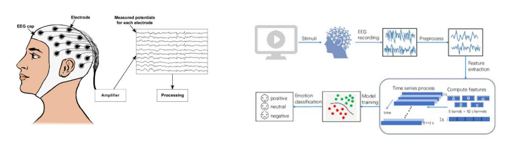
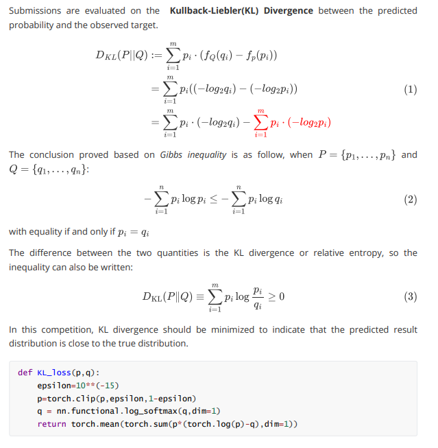
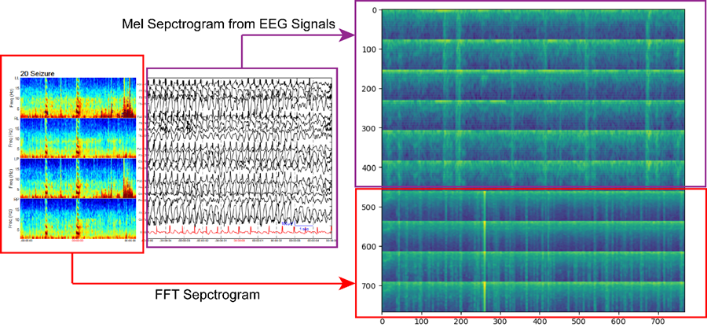
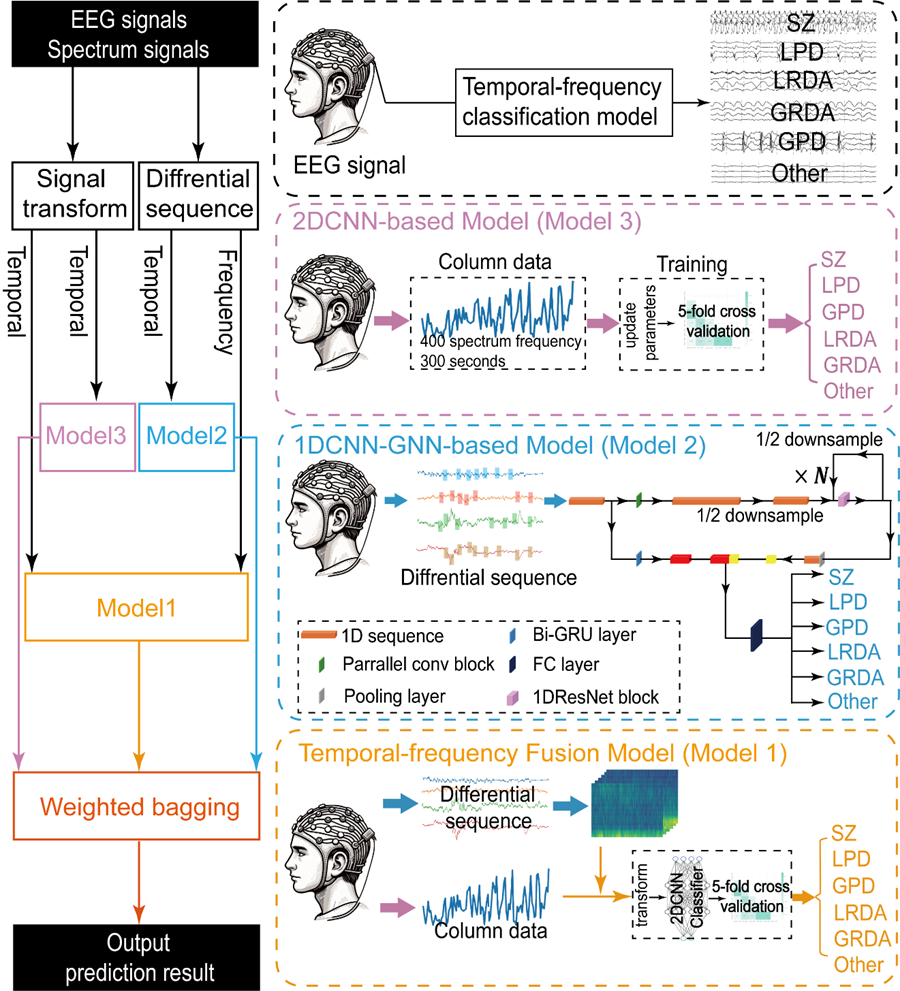

> 图文简介

本比赛旨在通过自动化脑电图（EEG）分析来检测和分类癫痫发作和其他有害大脑活动的竞赛（共计六类）。这个项目对于提高重症监护医院患者的脑电图监测效率和准确性具有重要意义。该问题属于典型的分类预测问题。

> 评价指标： Kullback-Leibler，KL散度

KL散度越接近0，说明预测的概率分布和真实标签分布越接近。

> 算法概览

我们首先基于比赛数据，提取出17089条训练样本，这里使用唯一的EEG ID作为提取标准。基于这17089条样本，我们考虑如下特征建立模型：

a)比赛官方的提供的频谱图spectrograms

b)使用librosa软件包从原始的EEG数据中提取mel频谱特征

我们把两类特征组合拼接在一起，我们就能获得频谱图像数据。

基于图像处理的经验，我们考虑三种常见的计算机视觉模型架构，ResNet34，EfficientNetB0和EfficientNetB1。该类模型都已经在多种任务中显示出了卓越的性能，也很契合本次比赛的数据特点。为了提升模型的稳健性，我们参考每条样本的patient_id使用groupkfold划分成五段测试集充分测试，避免过拟合。

最终图像拼接效果如下图所示：

>  核心流程

