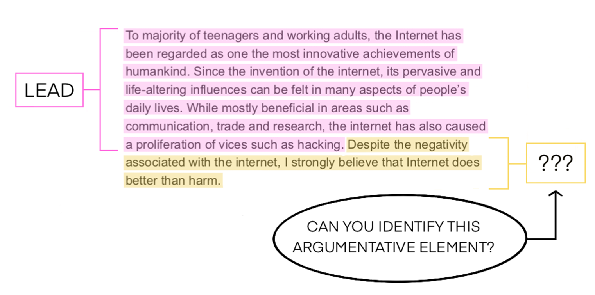
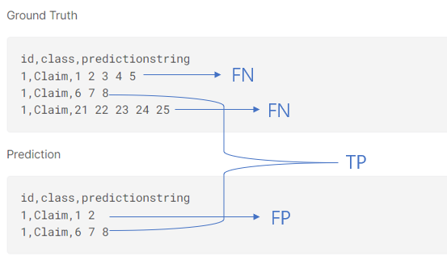

> 图文简介

> 评价指标： macro F1 score

- 对每个样本的真实值(ground truth)和预测值(predictions)的类别(class)比较。
- 若GT与预测值重叠部分>=0.5，且预测值与GT重叠部分>=0.5，属于True Positive(TP)。若存在多个匹配，采用匹配部分最多的一个。
- 任何未匹配成果的真实值视为False Negative(FN)，任何未匹配的预测值视为False Positive(FP)。
- 按照每个类别分别计算F1值，取平均值为最后分数(macro F1 score)。

$$F1 = \frac{2}{recall^{-1} + {precision}^{-1}} = 2 \cdot \frac{precision \cdot recall}{precision + recall} = \frac{TP}{TP+\frac{1}{2}(FP+FN)}$$
$$macro \ F1 = \frac{1}{N} \sum_{i=0}^{N} F1_i$$

> 算法概览

- 此竞赛的任务要求使用机器学习算法对Feedback提供的美国6-12年级学生的议论文划分段落主旨概要，属于自然语言处理（NLP）中的长文本命名实体识别（NER）任务。此处我们采用预训练模型finetune下游任务的模式处理该竞赛问题。
- 数据预处理：首先将比赛的长文本数据处理为标记序列（token sequence），每个标记（token）为一类（class）,目的是将命名实体识别问题转为标记多分类问题（token classification），同时将每一文本的句子相对位置索引信息作为文本分割（segment）ID输入。
- 模型结构设计与训练：预训练模型采用Hugging Face transformer库的DeBERTa-large，设计下游任务结构（head）为三层Conv1D+一层线性层输出；采用多个递进学习率训练。
- 后处理：推断阶段首先生成最大化标记（token）分类概率，根据段落主旨划分的特点，整体划分同一语句的类别（大多数情况下，同一句文本的所有token属于同一类别），计算整个语句的概率均值，根据验证集调整概率阈值得出最后的类别标签。

>  竞赛核心

- 将长文本实体命名问题转为标记（token）多分类问题；
- 利用句子的相对位置信息编码；
- 利用预训练模型的得到语境表征（contextualized embedding），设计卷积层作为下游任务结构；
- 整体模型结构分为三层，上中下三层采取从小到大递进的学习率，以保证优化目标顺利下降；
- 后处理根据比赛文本固有的段落划分特点，调整阈值最大化得分。