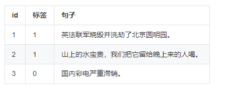

> 图文简介

> 评价指标： F1 score

- True Positive(TP): 标签为1，预测为1
- False Positive(FP): 标签为0，预测为1
- False Negative(FN): 标签为1，预测为0
- True Negative(TN): 标签为0，预测为0

$$Precision = \frac{TP}{TP+FP}$$

$$Recall = \frac{TP}{TP+FN}$$

$$F_1 = \frac{2}{recall^{-1} + {precision}^{-1}} = 2 \cdot \frac{precision \cdot recall}{precision + recall} = \frac{TP}{TP+\frac{1}{2}(FP+FN)}$$

> 算法概览

- 判断中文语句是否是病句，属于NLP中文本分类任务。
- 数据重写+规范化处理：把重写后的数据利用正则规范化处理，并把处理后的结果保存在main主逻辑文件目录中。规范包括去除非法字符以及test.csv增加人工label列满足后续模型dataloader要求。
- 模型设计与训练：选择华为开源的Nezha中文预训练模型，根据自己运行环境和GPU能力，改写main/config.py文件参数，包括base_dir数据保存路径, train_epoch训练轮次, batch_size批训练大小，embed_learning_rate和learning_rate上下游学习率，核对huggingface下载的tokenizer文件模型.bin文件和bert_file, bert_config_file, vocab_file是否一致。
- 预测阶段：在main/Savemodel中找到最优性能的模型，改写config文件checkpoint_path路径。

> 竞赛核心

- 项目的难点主要在于大型英文预训练模型对中文文本处理效果不佳，需要选择一个效果较好的中文预训练模型以及解决过拟合问题；
- 训练集和预测集数据长度分布不一致；
- 使用递进学习率和早停策略；
- 在EDA部分，采用两种方案bagging，一是设置固定sequence length，对长文本直接截取；二是下采样，对短文本数据多次采样。

> 开源地址

[Click to Github](https://github.com/hardhash/xunfei_chinese_sentences_classify)