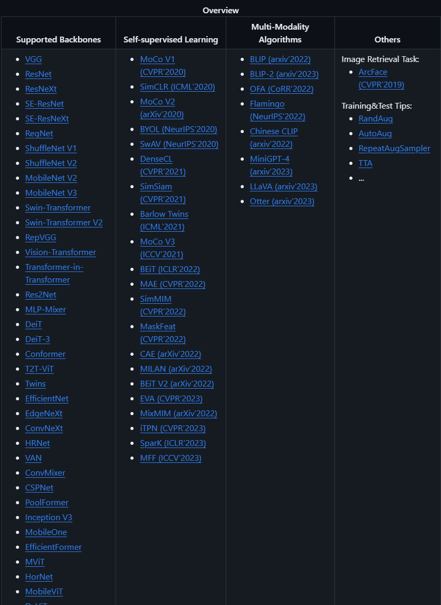
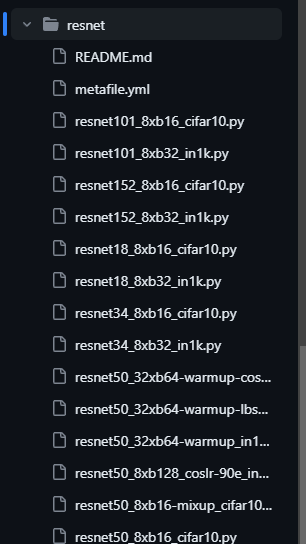
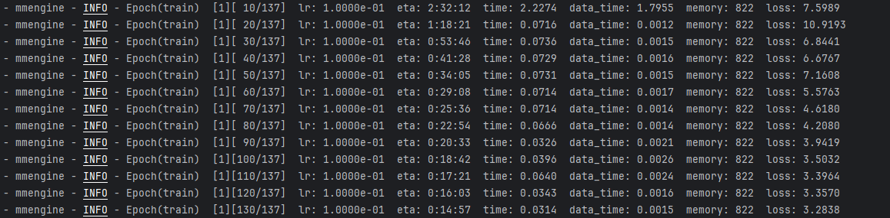
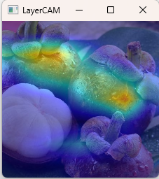
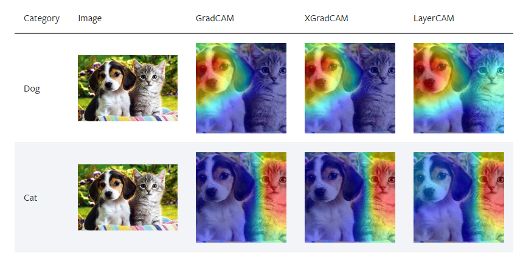

## 环境配置

创建conda虚拟环境后，需要安装torch环境，不要安装最新的torch2.1，因为mmcv-full对2.1的支持并不友好。

这里推荐使用上海交大的镜像网站：[torch](https://download.pytorch.org/whl/torch/)，[torchvision](https://download.pytorch.org/whl/torchvision/)。我的cuda版本是12.2，这里安装的是`torch-2.0.1+cu118-cp310-cp310-win_amd64.whl`和`torchvision-0.15.2+cu118-cp310-cp310-win_amd64.whl`。

直接作为python的工具包安装执行安装命令即可

```python
pip install -U openmim && mim install "mmpretrain>=1.0.0rc8"
```

在MMPretrain里，MMPretrain会自动调用你的GPU进行测试。如果你有GPU但仍想使用CPU进行测试，请设置环境变量`CUDA_VISIBLE_DEVICES=None或-1`禁用GPU。

## 使用MMPretrain框架完成推理

### 预训练模型下载

在[MMPretrain github](https://github.com/open-mmlab/mmpretrain)网站里，可以看到现在支持的backbone网络



这里选择最基础的resnet



这些都是可以直接下载调用的预训练模型。复制一个名字。在terminal或notebook中使用mim指令下载。下载包含模型训练配置参数脚本.py文件和对应权重.pth文件。

```python
mim download mmpretrain --config resnet18_8xb32_in1k --dest .
```

    processing resnet18_8xb32_in1k...
    resnet18_8xb32_in1k_20210831-fbbb1da6.pth exists in C:\Users\DaleAmmmmmy\Downloads\mmcls
    Successfully dumped resnet18_8xb32_in1k.py to C:\Users\DaleAmmmmmy\Downloads\mmcls

这里的resnet18_8xb32_in1k表示resnet网络18层，8个GPU，batch size32，在imgnet1000这个数据集上训练的

也可以使用`list_model`直接看可以下载的模型名字

```python
print(list_models())
```

这里稍微展示几个，实际的可以自己去运行看看

    ['barlowtwins_resnet50_8xb256-coslr-300e_in1k',
     'beit-base-p16_beit-in21k-pre_3rdparty_in1k',
     'convnext-base_3rdparty_in1k',
     'convnext-base_3rdparty_in1k-384px',
     'convnext-base_3rdparty_in21k',
     'convnext-base_in21k-pre-3rdparty_in1k-384px',
     'convnext-base_in21k-pre_3rdparty_in1k',
     'convnext-large_3rdparty_in1k',
     'convnext-large_3rdparty_in1k-384px',
     'convnext-large_3rdparty_in21k',
     'convnext-large_in21k-pre-3rdparty_in1k-384px',
     'convnext-large_in21k-pre_3rdparty_in1k',
     'convnext-small_32xb128-noema_in1k',
     'convnext-small_32xb128_in1k',
     'convnext-small_in21k-pre_3rdparty_in1k',
     'convnext-small_in21k-pre_3rdparty_in1k-384px',
     'convnext-tiny_32xb128-noema_in1k',
     'convnext-tiny_32xb128_in1k',
     'convnext-tiny_in21k-pre_3rdparty_in1k',
     'convnext-tiny_in21k-pre_3rdparty_in1k-384px',
     'convnext-v2-large_fcmae-in21k-pre_3rdparty_in1k',
     'convnext-v2-large_fcmae-in21k-pre_3rdparty_in1k-384px',
     'convnext-v2-large_fcmae-pre_3rdparty_in1k',
     'convnext-v2-nano_3rdparty-fcmae_in1k',
    ...
    ]

### 预训练模型加载

用`get_model`方法可以加载模型

```python
model = get_model('resnet18_8xb32_in1k', device='cuda:0')
```

### 预训练模型推理

用`inference_model(model, img_path)['pred_class']`输出推理的结果

```python
print(inference_model(model, 'dog.jpg')['pred_class'])
```

    quill, quill pen

这里由于没有加载预训练权重，因此不用过于关注分类的结果。

实际上，有训练权重的话更推荐使用`ImageClassificationInferencer`完成推理

```python
from mmpretrain import ImageClassificationInferencer
inferencer = ImageClassificationInferencer('模型文件.py', pretrained='权重文件路径')
```

## 使用MMPretrain框架完成训练

### 修改模型训练配置脚本脚本

这里我们用一个水果30分类数据集做微调。

现在对刚刚下载的模型训练配置参数脚本.py文件进行修改，这里可以用python代码完成修改，但实际上直接打开源码更加高效一点。

首先第一行auto_scale_lr是自动调整学习率，默认的256对应模型的8GPU32bs，如果是自己单卡训练，那就是32bs。data_preprocessor就是数据标准化，最后转化为RGB格式，这些都是基本流程，参数也是基本固定，不需要做修改。

```源码
auto_scale_lr = dict(base_batch_size=256)
data_preprocessor = dict(
    mean=[
        123.675,
        116.28,
        103.53,
    ],
    num_classes=1000,
    std=[
        58.395,
        57.12,
        57.375,
    ],
    to_rgb=True)
```

接下来`dataset_type`是训练数据集类型，这里需要修改成`CustomDataset`

checkpoint表示每多少个记录一次权重，这里可以添加一个`save_best='auto'`，表示第一次自动记录后，在下次自动记录前，自动记录最好的模型。

logger是打印日志的频率。

load_from表示是否加载权重，由于我们要做预训练微调，因此这里需要加入刚刚下载的模型权重文件路径。

其它参数不需要修改

```python
dataset_type = 'CustomDataset'
default_hooks = dict(
    checkpoint=dict(interval=5, save_best='auto', type='CheckpointHook'),
    logger=dict(interval=10, type='LoggerHook'),
    param_scheduler=dict(type='ParamSchedulerHook'),
    sampler_seed=dict(type='DistSamplerSeedHook'),
    timer=dict(type='IterTimerHook'),
    visualization=dict(enable=False, type='VisualizationHook'))
default_scope = 'mmpretrain'
env_cfg = dict(
    cudnn_benchmark=False,
    dist_cfg=dict(backend='nccl'),
    mp_cfg=dict(mp_start_method='fork', opencv_num_threads=0))
load_from = './resnet18_8xb32_in1k_20210831-fbbb1da6.pth'
log_level = 'INFO'
```

接下来是模型部分，在head部分需要把分类数`num_classes`改为我们这里的30分类。

在优化器部分，选择的是随机梯度下降，初始值为0.1，动能0.9，他会在30,60,90个epoch的时候下降为之前的0.1。randomness的`deterministic`表示梯度下降时可以让GPU选择一个比较好的稳定的梯度下降算法，True和False都可以，同时可以设置随机种子seed值保证实验可复现，做实验的话可以设置一个这个参数。其他的参数就不做介绍和修改了。

```python
model = dict(
    backbone=dict(
        depth=18,
        num_stages=4,
        out_indices=(3, ),
        style='pytorch',
        type='ResNet'),
    head=dict(
        in_channels=512,
        loss=dict(loss_weight=1.0, type='CrossEntropyLoss'),
        num_classes=30,
        topk=(
            1,
            5,
        ),
        type='LinearClsHead'),
    neck=dict(type='GlobalAveragePooling'),
    type='ImageClassifier')
optim_wrapper = dict(
    optimizer=dict(lr=0.1, momentum=0.9, type='SGD', weight_decay=0.0001))
param_scheduler = dict(
    by_epoch=True, gamma=0.1, milestones=[
        30,
        60,
        90,
    ], type='MultiStepLR')
randomness = dict(deterministic=False, seed=2023)
resume = False
```

下面是数据部分，需要把type改成CustomDataset，data_root改成我们自己的水果分类数据集地址，注意要区分train val和test，我们这里的数据只有train和val，因此偷懒把test就设置成和val一样的。

在test_evaluator和val_evaluator部分的topk表示输出概率最大和概率前5的结果，在论文中也会经常看到Top-1 accuracy（最大概率预测正确）和Top-5 accuracy（前5大概率有预测正确的）两个模型结果评价指标。

pipeline表示数据流，先加载图片然后resize，再裁剪，再打包。实际上dataloader的pipeline和下面的test_pipeline,train_pipeline都是一样的，把参数直接换进去也是可行的。

train_cfg的max_epochs设置为30轮。

其他的参数不需要过多介绍，也不用修改。

```python
test_cfg = dict()
test_dataloader = dict(
    batch_size=32,
    dataset=dict(
        data_root='./fruit30/val',
        pipeline=[
            dict(type='LoadImageFromFile'),
            dict(edge='short', scale=256, type='ResizeEdge'),
            dict(crop_size=224, type='CenterCrop'),
            dict(type='PackInputs'),
        ],
        type='CustomDataset'),
    num_workers=5,
    sampler=dict(shuffle=False, type='DefaultSampler'))
test_evaluator = dict(
    topk=(
        1,
        5,
    ), type='Accuracy')
test_pipeline = [
    dict(type='LoadImageFromFile'),
    dict(edge='short', scale=256, type='ResizeEdge'),
    dict(crop_size=224, type='CenterCrop'),
    dict(type='PackInputs'),
]
train_cfg = dict(by_epoch=True, max_epochs=5, val_interval=1)
train_dataloader = dict(
    batch_size=32,
    dataset=dict(
        data_root='./fruit30/train',
        pipeline=[
            dict(type='LoadImageFromFile'),
            dict(scale=224, type='RandomResizedCrop'),
            dict(direction='horizontal', prob=0.5, type='RandomFlip'),
            dict(type='PackInputs'),
        ],
        type='CustomDataset'),
    num_workers=5,
    sampler=dict(shuffle=True, type='DefaultSampler'))
train_pipeline = [
    dict(type='LoadImageFromFile'),
    dict(scale=224, type='RandomResizedCrop'),
    dict(direction='horizontal', prob=0.5, type='RandomFlip'),
    dict(type='PackInputs'),
]
val_cfg = dict()
val_dataloader = dict(
    batch_size=32,
    dataset=dict(
        data_root='./fruit30/val',
        pipeline=[
            dict(type='LoadImageFromFile'),
            dict(edge='short', scale=256, type='ResizeEdge'),
            dict(crop_size=224, type='CenterCrop'),
            dict(type='PackInputs'),
        ],
        type='CustomDataset'),
    num_workers=5,
    sampler=dict(shuffle=False, type='DefaultSampler'))
val_evaluator = dict(
    topk=(
        1,
        5,
    ), type='Accuracy')
vis_backends = [
    dict(type='LocalVisBackend'),
]
visualizer = dict(
    type='UniversalVisualizer', vis_backends=[
        dict(type='LocalVisBackend'),
    ])
```

在最后加一个`work_dir='work_dirs/resnet18_fruit30/'`表示最终模型训练结果的日志和权重文件储存路径即可。

### 开始训练

在终端或notebook输入`mim train mmpretrain resnet18_8xb32_in1k.py`即可开始训练。这里的.py文件就是刚刚修改好的训练脚本文件。



loss收敛，说明训练大概率没有问题。

    最终结果：Epoch(val) [30][34/34]    accuracy/top1: 40.8163  accuracy/top5: 81.3544  data_time: 0.0105  time: 0.0213

## CAM可视化

首先安装依赖`pip install "grad-cam>=1.3.6"`，然后运行脚本代码：

这里的vis_cam.py文件在mmpretrain源码文件夹tools-visualization目录下。

```python
python vis_cam.py 山竹.jpg resnet18_8xb32_in1k.py work_dirs/resnet18_fruit30/epoch_30.pth --method LayerCAM --eigen-smooth --aug-smooth
```



和原图对比一下


这样就可以发现模型feature map抽取注意的位置。 这里有GradCAM++, XGradCAM, EigenCAM, EigenGradCAM, LayerCAM，可以使用不同方法可视化卷积网络。多分类时还可以指定类别获取不同的注意力图，参考官方示例：

```python
python tools/visualization/vis_cam.py demo/cat-dog.png configs/resnet/resnet50_8xb32_in1k.py \
    https://download.openmmlab.com/mmclassification/v0/resnet/resnet50_batch256_imagenet_20200708-cfb998bf.pth \
    --target-layers 'backbone.layer4.2' \
    --method GradCAM \
    --target-category 238
```




## 微调后的模型进行推理

现在，我们已经拿到微调训练30轮的权重参数，在推理时，我们使用`ImageClassificationInferencer`完成

```python
from mmpretrain import ImageClassificationInferencer
inferencer = ImageClassificationInferencer('resnet18_8xb32_in1k.py', pretrained='epoch_30.pth')
inferencer('dog.jpg')[0]['pred_class']
```
   
     '椰子'

由于训练轮次不够，模型也比较简单，因此预测结果不正确，但是整体的流程就是这样啦。