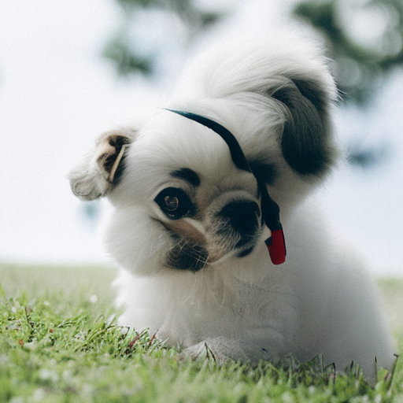

反转的目标是颠倒采样过程，最终得到带噪的隐式表达。如果将其作正常采样过程的起点，那么生成的将是原始图像。

```python
import torch
import requests
import torch.nn as nn
import torch.nn.functional as F
from PIL import Image
from io import BytesIO
from tqdm.auto import tqdm
from matplotlib import pyplot as plt
from torchvision import transforms as tfms
from diffusers import StableDiffusionPipeline, DDIMScheduler
def load_image(url, size=None):
    response = requests.get(url,timeout=1)
    img = Image.open(BytesIO(response.content)).convert('RGB')
    if size is not None:
        img = img.resize(size)
    return img

device = torch.device("cuda" if torch.cuda.is_available() else "cpu")
# 载入一个管线
model_id = "stabilityai/stable-diffusion-2-1-base"
pipe = StableDiffusionPipeline.from_pretrained(model_id).to(device)
# 配置DDIM调度器
pipe.scheduler = DDIMScheduler.from_config(pipe.scheduler.config)
```

首先载入一个原始图像

```python
input_image = load_image('https://images.pexels.com/photos/8306128/pexels-photo-8306128.jpeg', size=(512, 512))
input_image
```


我们可以使用一个包含无分类器引导的文本提示语来进行反转操作。首先输入描述：

```python
input_image_prompt = "Photograph of a puppy on the grass"
```

然后，把这副PIL图像转化为一系列隐式表示，这些隐式表示将被用作反转操作的起点：

```python
# 使用VAE进行编码
with torch.no_grad(): 
    latent = pipe.vae.encode(tfms.functional.to_tensor(input_image).unsqueeze(0).to(device)*2-1)
l = 0.18215 * latent.latent_dist.sample()
```

接下来使用一个invert函数，这个函数和采样sample函数十分相似，但时间步是反着运动的，从t=0开始，向着噪声更多的方向移动，而不是噪声越来越少。我们可以利用预测的噪声来撤回这一步更新操作并从t移动到t+1

```python
@torch.no_grad()
def invert(start_latents, prompt, guidance_scale=3.5, num_inference_steps=80,
           num_images_per_prompt=1, do_classifier_free_guidance=True,
           negative_prompt='', device=device):
  
    # 对提示文本进行编码
    text_embeddings = pipe._encode_prompt(
            prompt, device, num_images_per_prompt, do_classifier_free_guidance, negative_prompt
    )
    
    # 指定起点
    latents = start_latents.clone()
    
    # 保存反转的隐层
    intermediate_latents = []
    
    # 设置推理步数
    pipe.scheduler.set_timesteps(num_inference_steps, device=device)
    
    # 反转时间步
    timesteps = reversed(pipe.scheduler.timesteps)
    
    
    for i in tqdm(range(1, num_inference_steps), total=num_inference_steps-1):
        # 跳过最后一次迭代
        if i >= num_inference_steps - 1: continue

        t = timesteps[i]
        
        # 如果正在进行CFG，则对隐层进行扩展
        latent_model_input = torch.cat([latents] * 2) if do_classifier_free_guidance else latents
        latent_model_input = pipe.scheduler.scale_model_input(latent_model_input, t)
        
        # 预测残留的噪声
        noise_pred = pipe.unet(latent_model_input, t, encoder_hidden_states=text_embeddings).sample
        
        # 引导
        if do_classifier_free_guidance:
            noise_pred_uncond, noise_pred_text = noise_pred.chunk(2)
            noise_pred = noise_pred_uncond + guidance_scale * (noise_pred_text - noise_pred_uncond)

        current_t = max(0, t.item() - (1000//num_inference_steps)) # t
        next_t = t # min(999, t.item() + (1000//num_inference_steps)) # t+1
        alpha_t = pipe.scheduler.alphas_cumprod[current_t]
        alpha_t_next = pipe.scheduler.alphas_cumprod[next_t]
        
        # 反转的更新步（重新排列更新步，利用当前隐层得到新的隐层）
        latents = (latents - (1-alpha_t).sqrt() * noise_pred) * (alpha_t_next.sqrt() / alpha_t.sqrt()) + (1-alpha_t_next).sqrt() * noise_pred

        # 保存隐层
        intermediate_latents.append(latents)
            
    return torch.cat(intermediate_latents)
```

> 查看小狗的隐式表达

```python
inverted_latents = invert(l, input_image_prompt,num_inference_steps=50)
inverted_latents.shape
```
```text
torch.Size([48, 4, 64, 64])
```

> 解码反转后的最后一个隐层
```python
with torch.no_grad():
    im = pipe.decode_latents(inverted_latents[-1].unsqueeze(0))
pipe.numpy_to_pil(im)[0]
```


当然，还可以通过call方法，将反转隐式地传递给管线：

```python
pipe(input_image_prompt, latents=inverted_latents[-1][None], num_inference_steps=50, guidance_scale=3.5).images[0]
```


这并不是我们最开始使用的那张图片。这是因为DDIM反转需要一个重要假设，在t时刻预测的噪声和t+1时刻预测的噪声相同。但这个假设在50步显然不成立。

我们既可以使用更多的时间步来得到更精准的反转，也可以直接从相应反转过程50步中的第20步隐式表达开始：

```python
@torch.no_grad()
def sample(prompt, start_step=0, start_latents=None,
           guidance_scale=3.5, num_inference_steps=30,
           num_images_per_prompt=1, do_classifier_free_guidance=True,
           negative_prompt='', device=device):
    # 对文本提示语进行编码  
    text_embeddings = pipe._encode_prompt(
            prompt, device, num_images_per_prompt, do_classifier_free_guidance, negative_prompt
    )
    # 设置推理步数
    pipe.scheduler.set_timesteps(num_inference_steps, device=device)
    # 创建随机起点
    if start_latents is None:
        start_latents = torch.randn(1, 4, 64, 64, device=device)
        start_latents *= pipe.scheduler.init_noise_sigma
    
    latents = start_latents.clone()

    for i in tqdm(range(start_step, num_inference_steps)):
    
        t = pipe.scheduler.timesteps[i]
        
        # 如果正在进行CFG，则对隐层进行扩展
        latent_model_input = torch.cat([latents] * 2) if do_classifier_free_guidance else latents
        latent_model_input = pipe.scheduler.scale_model_input(latent_model_input, t)
        
        # 预测噪声
        noise_pred = pipe.unet(latent_model_input, t, encoder_hidden_states=text_embeddings).sample
        
        # 进行引导
        if do_classifier_free_guidance:
            noise_pred_uncond, noise_pred_text = noise_pred.chunk(2)
            noise_pred = noise_pred_uncond + guidance_scale * (noise_pred_text - noise_pred_uncond)


        # Normally we'd rely on the scheduler to handle the update step:
        # latents = pipe.scheduler.step(noise_pred, t, latents).prev_sample
        
        # 自行实现调度器
        prev_t = max(1, t.item() - (1000//num_inference_steps)) # t-1
        alpha_t = pipe.scheduler.alphas_cumprod[t.item()]
        alpha_t_prev = pipe.scheduler.alphas_cumprod[prev_t]
        predicted_x0 = (latents - (1-alpha_t).sqrt()*noise_pred) / alpha_t.sqrt()
        direction_pointing_to_xt = (1-alpha_t_prev).sqrt()*noise_pred
        latents = alpha_t_prev.sqrt()*predicted_x0 + direction_pointing_to_xt
    
    # 进行后处理
    images = pipe.decode_latents(latents)
    images = pipe.numpy_to_pil(images)

    return images

# 从第20步的隐式表示开始，得到的结果距离最初的图片很近了！
start_step=20
sample(input_image_prompt, start_latents=inverted_latents[-(start_step+1)][None], 
       start_step=start_step, num_inference_steps=50)[0]
```

这个已经很接近最初的那张图片了，但是为什么要这么做呢？因为我们想用一个新的文本提示语来生成图片。我们想要得到一张除了与提示词相关以外，其他内容和原始图片大致一样的图片。我知道你肯定想问，为什么不用Img2Img Pipeline或者直接对输入图像添加噪声然后用提示词去噪。可以，但这会导致图片的变化在添加大量噪声后很大（小强度又可能没有太大变化）。

```python
# 把小狗换成小猫，从第10步的隐式表示开始
start_step=10
new_prompt = input_image_prompt.replace('puppy', 'cat')
sample(new_prompt, start_latents=inverted_latents[-(start_step+1)][None], 
       start_step=start_step, num_inference_steps=50)[0]
```


> 封装代码

把所写的代码封装到一个简单的函数里，并输入一张图片和两个文本提示语，由此便可得到一张通过反转得到的修改后的图片
```python
def edit(input_image, input_image_prompt, edit_prompt, num_steps=100, start_step=30, guidance_scale=3.5):
    with torch.no_grad(): latent = pipe.vae.encode(tfms.functional.to_tensor(input_image).unsqueeze(0).to(device)*2-1)
    l = 0.18215 * latent.latent_dist.sample()
    inverted_latents = invert(l, input_image_prompt,num_inference_steps=num_steps)
    final_im = sample(edit_prompt, start_latents=inverted_latents[-(start_step+1)][None], 
                      start_step=start_step, num_inference_steps=num_steps, guidance_scale=guidance_scale)[0]
    return final_im
```

```python
face = load_image('https://images.pexels.com/photos/1493111/pexels-photo-1493111.jpeg', size=(512, 512))
face
```


```python
edit(face, 'A photograph of a face', 'A photograph of a face with sunglasses', num_steps=250, start_step=30, guidance_scale=3.5)
```
