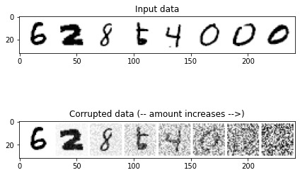

在这部分，我们将用MNIST数据，从零开始搭建一个最简单的扩散模型，这里的最简单主要包括
- 数据集现成，不需要重构dataloader函数
- 数据集很小，CPU也可以训练
- UNet网络很简单

实际上会有很多高度集成的工具包帮助我们用极低的代码量写出一个扩散模型，但是为了更清晰理解扩散模型的工作流程，还是应该从头实现一次。

根据DDPM原理部分，扩散模型应该包括一个退化过程（加噪前向过程），训练（去噪反向过程）以及采样理论。采样在原理部分在最开始就早早使用，但并没有单独对理论做出解释，这里可以先做一个预备补充。

> 参数重整化理论

由于我们的目的是要训练参数为$\theta$的网络，目的是让这个$\theta$尽可能逼近真实分布。实际上网络的优化就是链式求导并且梯度最优化过程，这个$\theta$参数应该是高斯分布$\mu \sigma$和样本$x_t$的复合函数，因此需要把这三个参数都变成可偏导的形式。

若要从高斯分布$\mathcal N(\mu, \sigma^2)$中采样，可以先从标准分布$\mathcal N(0,1)$中采样出z，再得到$\sigma^2*z+\mu$，即我们的采样值。这样做的目的是将随机性转移到$z$上，让采样值对$\mu \sigma$可导。这也就是最开始的公式：

$$x_t=\sqrt{1-\beta_t}x_{t-1} + \sqrt{\beta_t}z_t，z_t\sim\mathcal N(0,I)$$

> 导入工具包

```python
import torch
import torchvision
from torch import nn
from torch.nn import functional as F
from torch.utils.data import DataLoader
from diffusers import DDPMScheduler, UNet2DModel
from matplotlib import pyplot as plt
import tqdm
import warnings
warnings.filterwarnings('ignore')
```

> cuda加速

```python
device = torch.device("cuda" if torch.cuda.is_available() else "cpu")
```

> 数据展示

```python
dataset = torchvision.datasets.MNIST(root="./data/mnist/", train=True, download=True, 
                                     transform=torchvision.transforms.ToTensor())
train_dataloader = DataLoader(dataset, batch_size=8, shuffle=True)
x, y = next(iter(train_dataloader))
plt.imshow(torchvision.utils.make_grid(x)[0], cmap='Greys');
```


## 用torch.rand演示退化（加噪）过程

```python
def corrupt(x, amount):
    # 首先生成一个和x shape一样的高斯噪声张量
    noise = torch.rand_like(x)
    amount = amount.view(-1, 1, 1, 1)
    # 对这个张量图增加amount次噪声
    return x*(1-amount) + noise*amount 
```

```python
# 绘制输入数据
fig, axs = plt.subplots(2, 1, figsize=(7, 5))
axs[0].set_title('Input data')
axs[0].imshow(torchvision.utils.make_grid(x)[0], cmap='Greys')

# 加入噪声
amount = torch.linspace(0, 1, x.shape[0]) # Left to right -> more corruption
noised_x = corrupt(x, amount)

# 绘制加噪版本的图像
axs[1].set_title('Corrupted data (-- amount increases -->)')
axs[1].imshow(torchvision.utils.make_grid(noised_x)[0], cmap='Greys');
```


## DDPM退化过程可视化
```python
noise_scheduler = DDPMScheduler(num_train_timesteps=1000)

# 对一批图片加噪
fig, axs = plt.subplots(3, 1, figsize=(10, 6))
xb, yb = next(iter(train_dataloader))
xb = xb.to(device)[:8]
xb = xb * 2. - 1.

# 展示干净的原始输入图片
axs[0].imshow(torchvision.utils.make_grid(xb[:8])[0].detach().cpu(), cmap='Greys')
axs[0].set_title('Clean X')

# 使用调度器加噪
timesteps = torch.linspace(0, 999, 8).long().to(device)
noise = torch.randn_like(xb)
noisy_xb = noise_scheduler.add_noise(xb, noise, timesteps)

# 展示“带噪”版本
axs[1].imshow(torchvision.utils.make_grid(noisy_xb[:8])[0].detach().cpu().clip(-1, 1),  cmap='Greys')
axs[1].set_title('Noisy X (clipped to (-1, 1)')
axs[2].imshow(torchvision.utils.make_grid(noisy_xb[:8])[0].detach().cpu(),  cmap='Greys')
axs[2].set_title('Noisy X');
```


> 理解加噪过程 $x_t = \sqrt{1-\beta_t}x_{t-1} + \sqrt\beta_t z_t$

在加噪的过程中，可以认为把前一步的结果乘以一个$\sqrt{1-\beta_t}$系数，然后与一个带有$\beta_t$的系数的噪声相加。

用调度器看看输入噪声是如何在不同迭代周期中量化和叠加的。

```python
noise_scheduler = DDPMScheduler(num_train_timesteps=1000)
plt.plot(noise_scheduler.alphas_cumprod.cpu() ** 0.5, label=r'${\sqrt{\bar{\alpha}_t}}$')
plt.plot((1-noise_scheduler.alphas_cumprod.cpu()) ** 0.5,  label = r'$\sqrt{(1-\bar{\alpha}_t)}$')
plt.legend(fontsize='x-large')
```


可以看到，一开始，输入$X$中绝大部分是输入$X$本身的值($sqrt_alpha_prod \approx 1$)，但是随着时间推移，输入$X$的成分逐渐降低，噪声成分逐渐增加。

> 构建一个简单的UNet网络

```python
class BasicUNet(nn.Module):
    def __init__(self, in_channels=1, out_channels=1):
        super().__init__()
        self.down_layers = torch.nn.ModuleList([ 
            nn.Conv2d(in_channels, 32, kernel_size=5, padding=2),
            nn.Conv2d(32, 64, kernel_size=5, padding=2),
            nn.Conv2d(64, 64, kernel_size=5, padding=2),
        ])
        self.up_layers = torch.nn.ModuleList([
            nn.Conv2d(64, 64, kernel_size=5, padding=2),
            nn.Conv2d(64, 32, kernel_size=5, padding=2),
            nn.Conv2d(32, out_channels, kernel_size=5, padding=2), 
        ])
        # 激活函数
        self.act = nn.SiLU()
        self.downscale = nn.MaxPool2d(2)
        self.upscale = nn.Upsample(scale_factor=2)

    def forward(self, x):
        h = []
        for i, l in enumerate(self.down_layers):
            # 通过运算层与激活函数
            x = self.act(l(x))
            if i < 2:
                # 排列供残差连接使用的数据
                h.append(x) 
                # 连接下采样
                x = self.downscale(x) 
              
        for i, l in enumerate(self.up_layers):
            if i > 0: 
                # 连接上采样
                x = self.upscale(x) 
                # 得到之前排列好的供残差连接使用的数据
                x += h.pop()
            x = self.act(l(x)) 
            
        return x
```

```python
net = BasicUNet(1, 1)
x = torch.rand(8, 1, 28, 28)
```

这样还原的x.shape依然是torch.Size([8, 1, 28, 28])。

**注意，这里为了简化网络，并不是使用原论文的UNet架构，主要原因有两个，其一是为了方便CPU训练，减少参数量；其二是原论文4次下采样，如果对28*28的图片也要进行4次下采样，那么需要对原论文padding参数进行修改，这里并不是UNet网络搭建教学，所以就使用了这种最简化的模式**

> 加载数据构建网络

```python
# 训练数据加载器
batch_size = 1024
train_dataloader = DataLoader(dataset, batch_size=batch_size, shuffle=True)
n_epochs = 20
net = BasicUNet()
net.to(device)
loss_fn = nn.MSELoss()
opt = torch.optim.Adam(net.parameters(), lr=1e-3)
```

## 训练BasicUNet

```python
losses = []

# 开始训练
for epoch in range(n_epochs):

    for x, y in tqdm.tqdm(train_dataloader):
        # 得到数据并准备退化
        x = x.to(device)
        # 随机噪声
        noise_amount = torch.rand(x.shape[0]).to(device) 
        # 加噪过程
        noisy_x = corrupt(x, noise_amount) 
        
        # 得到预测结果
        pred = net(noisy_x)
        
        # 计算损失值
        loss = loss_fn(pred, x) 
        
        # 反向传播并更新参数
        opt.zero_grad()
        loss.backward()
        opt.step()

        losses.append(loss.item())
    
    # 输出损失的均值
    avg_loss = sum(losses[-len(train_dataloader):]) / len(train_dataloader)
    print(f'Finished epoch {epoch}. Average loss for this epoch: {avg_loss:05f}')
```

> 绘制损失曲线

```python
plt.plot(losses)
plt.ylim(0, 0.1);
```


> 查看降噪还原效果

```python
x, y = next(iter(train_dataloader))
# 只取前8个数
x = x[:8]

amount = torch.linspace(0, 1, x.shape[0])
noised_x = corrupt(x, amount)

with torch.no_grad():
    preds = net(noised_x.to(device)).detach().cpu()

# 绘制对比图    
fig, axs = plt.subplots(3, 1, figsize=(12, 8))
axs[0].set_title('Input data')
axs[0].imshow(torchvision.utils.make_grid(x)[0].clip(0, 1), cmap='Greys')
axs[1].set_title('Corrupted data')
axs[1].imshow(torchvision.utils.make_grid(noised_x)[0].clip(0, 1), cmap='Greys')
axs[2].set_title('Network Predictions')
axs[2].imshow(torchvision.utils.make_grid(preds)[0].clip(0, 1), cmap='Greys');
```


## 采样过程
采样过程的方案：从完全随机的噪声开始，先检查一下模型的预测结果，然后只朝着预测方向移动一小部分。
```python
def sample_with_step(x, n_steps):
    step_history = [x.detach().cpu()]
    pred_output_history = []

    for i in range(n_steps):
        with torch.no_grad(): 
            pred = net(x) 
        # 将模型输出保存下来    
        pred_output_history.append(pred.detach().cpu())
        # 朝着预测方向移动的因子
        mix_factor = 1/(n_steps - i) 
        # 移动一步
        x = x*(1-mix_factor) + pred*mix_factor 
        # 记录移动
        step_history.append(x.detach().cpu()) 
    
    return x, step_history, pred_output_history
```

```python
# 拆解成5步，每次前进1步
n_steps = 5
# 完全随机的值开始
x = torch.rand(8, 1, 28, 28).to(device)
x, step_history, pred_output_history = sample_with_step(x, n_steps)
```

```python
fig, axs = plt.subplots(n_steps, 2, figsize=(9, 4), sharex=True)
axs[0,0].set_title('x (model input)')
axs[0,1].set_title('model prediction')
for i in range(n_steps):
    axs[i, 0].imshow(torchvision.utils.make_grid(step_history[i])[0].clip(0, 1), cmap='Greys')
    axs[i, 1].imshow(torchvision.utils.make_grid(pred_output_history[i])[0].clip(0, 1), cmap='Greys')
```


当然如果是40步，就可以获得质量更高的图像。
```python
n_steps = 40
x = torch.rand(64, 1, 28, 28).to(device)
x, _, _ = sample_with_step(x, n_steps)
fig, ax = plt.subplots(1, 1, figsize=(12, 12))
ax.imshow(torchvision.utils.make_grid(x.detach().cpu(), nrow=8)[0].clip(0, 1), cmap='Greys')
```


## 用UNet2D改进BasicUNet
用diffusers库中的UNet2D优化。具体而言，UNet2DModel与DDPM对比：

- UNet2DModel比BasicUNet更先进。
- 退化过程的处理方式不同。
- 训练目标不同，包括预测噪声而不是去噪图像。
- UNet2DModel模型通过调节时间步来调节噪声量, 其中t作为一个额外参数传入前向过程中。

Diffusers库中的UNet2DModel模型比BasicUNet模型有如下改进：

- GroupNorm层对每个模块的输入进行了组标准化（group normalization）。
- Dropout层能使训练更平滑。
- 每个块有多个ResNet层（如果layers_per_block未设置为1）。
- 引入了注意力机制（通常仅用于输入分辨率较低的blocks）。
- 可以对时间步进行调节。
- 具有可学习参数的上采样模块和下采样模块。


```python
net = UNet2DModel(
    sample_size=28,           # 目标图像的分辨率
    in_channels=1,            
    out_channels=1,           
    layers_per_block=2,       # 每一个UNet块中的ResNet层数
    block_out_channels=(32, 64, 64), 
    down_block_types=( 
        "DownBlock2D",        # 下采样模块
        "AttnDownBlock2D",    # 带有空域维度的self-att的ResNet下采样模块
        "AttnDownBlock2D",
    ), 
    up_block_types=(
        "AttnUpBlock2D", 
        "AttnUpBlock2D",      # 带有空域维度的self-att的ResNet上采样模块
        "UpBlock2D",          # 上采样模块
      ),
)
```
> 和BasicUNet的参数对比：BasicUNet:309057，UNet2D：1707009

```python
sum([p.numel() for p in net.parameters()])
```

```python
# 训练数据加载器
batch_size = 1024
train_dataloader = DataLoader(dataset, batch_size=batch_size, shuffle=True)

n_epochs = 10

net.to(device)

loss_fn = nn.MSELoss()

opt = torch.optim.Adam(net.parameters(), lr=1e-3) 

losses = []

# 开始训练
for epoch in range(n_epochs):

    for x, y in tqdm.tqdm(train_dataloader):
        # 得到数据并准备退化
        x = x.to(device)
        # 随机噪声
        noise_amount = torch.rand(x.shape[0]).to(device) 
        # 退化过程
        noisy_x = corrupt(x, noise_amount) 
        
        # 得到预测结果
        pred = net(noisy_x, 0).sample
        
        # 计算损失值
        loss = loss_fn(pred, x) 
        
        # 反向传播并更新参数
        opt.zero_grad()
        loss.backward()
        opt.step()

        losses.append(loss.item())
    
    # 输出损失的均值
    avg_loss = sum(losses[-len(train_dataloader):]) / len(train_dataloader)
    print(f'Finished epoch {epoch}. Average loss for this epoch: {avg_loss:05f}')
```

```python
fig, axs = plt.subplots(1, 2, figsize=(12, 5))

axs[0].plot(losses)
axs[0].set_ylim(0, 0.1)
axs[0].set_title('Loss over time')

n_steps = 40
x = torch.rand(64, 1, 28, 28).to(device)
for i in range(n_steps):
    noise_amount = torch.ones((x.shape[0], )).to(device) * (1-(i/n_steps))
    with torch.no_grad():
        pred = net(x, 0).sample
    mix_factor = 1/(n_steps - i)
    x = x*(1-mix_factor) + pred*mix_factor

axs[1].imshow(torchvision.utils.make_grid(x.detach().cpu(), nrow=8)[0].clip(0, 1), cmap='Greys')
axs[1].set_title('Generated Samples');
```


非常直观的结果，10轮训练的UNet2D模型还原效果比20轮训练的BasicUNet好很多，几乎所有的数字都清晰可见。但是从参数量看，10轮和20轮的对比并不公平（UNet2D参数量几近是BasicUNet的6倍）。
