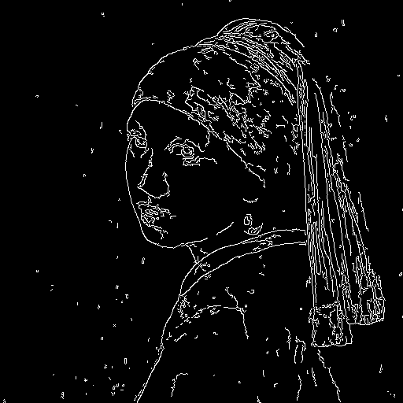

## 生成人物的肖像

```python
import torch
import requests
import torch.nn as nn
import torch.nn.functional as F
from PIL import Image
from io import BytesIO
from tqdm.auto import tqdm
from matplotlib import pyplot as plt
from torchvision import transforms as tfms
from diffusers import StableDiffusionPipeline, DDIMScheduler
from diffusers import StableDiffusionControlNetPipeline
from diffusers.utils import load_image

device = torch.device("cuda" if torch.cuda.is_available() else "cpu")

image = load_image("https://huggingface.co/datasets/huggingface/documentation-images/resolve/main/diffusers/input_image_vermeer.png")
image
```


```python
import cv2
from PIL import Image
import numpy as np

image = np.array(image)

low_threshold = 100
high_threshold = 200

# 提取图片边缘线条
image = cv2.Canny(image, low_threshold, high_threshold)
image = image[:, :, None]
image = np.concatenate([image, image, image], axis=2)
canny_image = Image.fromarray(image)
canny_image
```


```python
# 使用半精度节约计算资源，加快推理速度
from diffusers import StableDiffusionControlNetPipeline, ControlNetModel
import torch

controlnet = ControlNetModel.from_pretrained("lllyasviel/sd-controlnet-canny", torch_dtype=torch.float16).to(device)
model_id = "stabilityai/stable-diffusion-2-1-base"
pipe = StableDiffusionPipeline.from_pretrained(model_id, controlnet=controlnet).to(device)
```

```python
# 使用速度最快的扩散模型调度器UniPCMultistepScheduler
from diffusers import UniPCMultistepScheduler

pipe.scheduler = UniPCMultistepScheduler.from_config(pipe.scheduler.config)
```
```python
def image_grid(imgs, rows, cols):
    assert len(imgs) == rows * cols
    
    w, h = imgs[0].size
    grid = Image.new("RGB", size=(cols * w, rows * h))
    grid_w, grid_h = grid.size
    
    for i, img in enumerate(imgs):
        grid.paste(img, box=(i % cols * w, i // cols * h))
    
    return grid
```

```python
prompt = ", best quality, extremely detailed"
prompt = [t + prompt for t in ["Sandra Oh", "Kim Kardashian", "rihanna", "taylor swift"]]
generator = [torch.Generator(device=device).manual_seed(2) for i in range(len(prompt))]

output = pipe(
    prompt,
    canny_image,
    negative_prompt=["monochrome, lowres, bad anatomy, worst quality, low quality"] * len(prompt),
    generator=generator,
    num_inference_steps=30
)

image_grid(output.images, 2, 2)
```


## 提取身体姿态
```python
urls = ["yoga1.jpeg", "yoga2.jpeg", "yoga3.jpeg", "yoga4.jpeg"]
imgs = [
    load_image("https://huggingface.co/datasets/YiYiXu/controlnet-testing/resolve/main/" + url) for url in urls
]
image_grid(imgs, 2, 2)
```

```python
from controlnet_aux import OpenposeDetector

model = OpenposeDetector.from_pretrained("lllyasviel/ControlNet")

poses = [model(img) for img in imgs]
image_grid(poses, 2, 2)
```

```python
from diffusers import ControlNetModel, UniPCMultistepScheduler, StableDiffusionControlNetPipeline

controlnet = ControlNetModel.from_pretrained("fusing/stable-diffusion-v1-5-controlnet-openpose", 
                                             torch_dtype=torch.float16).to(device)
model_id = "runwayml/stable-diffusion-v1-5"
pipe = StableDiffusionControlNetPipeline.from_pretrained(
    model_id,
    controlnet = controlnet,
    torch_dtype=torch.float16
).to(device)
pipe.scheduler = UniPCMultistepScheduler.from_config(pipe.scheduler.config)
pipe.enable_model_cpu_offload()
pipe.enable_xformers_memory_efficient_attention()
generator = [torch.Generator(device=device).manual_seed(10) for i in range(4)]
prompt = "super-hero character, best quality, extremely detailed"

output = pipe(
    [prompt] * 4,
    poses,
    negative_prompt=["monochrome, lowres, bad anatomy, worst quality, low quality"] * 4,
    generator=generator,
    num_inference_steps=20
)
```

