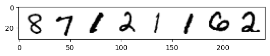
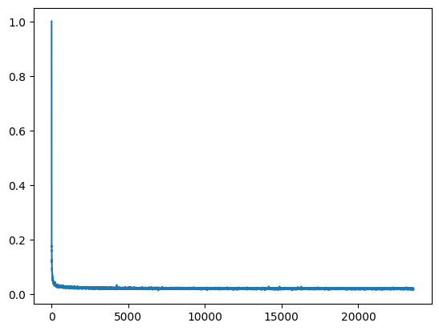
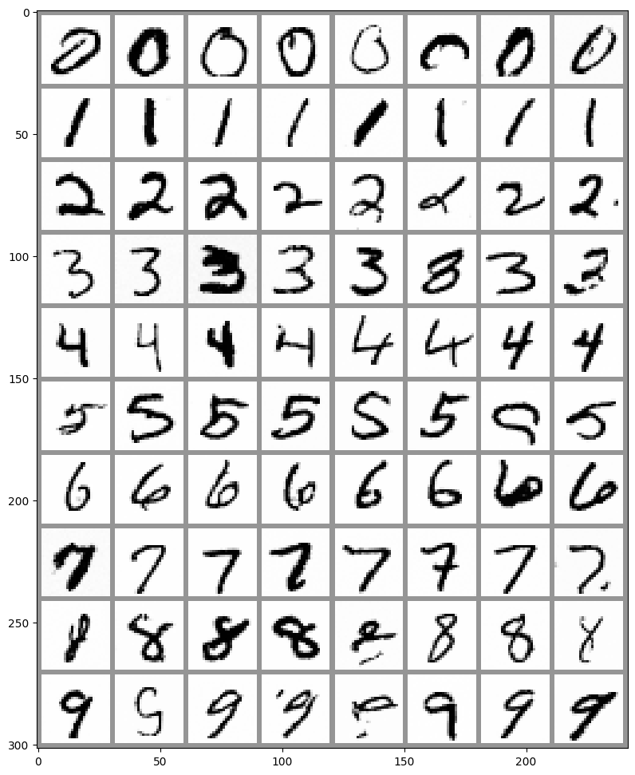

在这部分，会在MNIST数据集上训练以一个类别为条件的扩散模型，可以再推理阶段指定想要生成的是哪个数字。

**使用DDIM，50步，训练200epochs在windows环境下3090单卡耗时约2小时，请根据自身情况合理调整参数**

> 导入工具包

```python
import torch
import torchvision
from torch import nn
from torch.nn import functional as F
from torch.utils.data import DataLoader
from diffusers import DDIMScheduler, UNet2DModel
from matplotlib import pyplot as plt
from tqdm.auto import tqdm

device = 'cuda' if torch.cuda.is_available() else 'cpu'
```

> 加载MNIST数据集

```python
# 加载MNIST数据集
dataset = torchvision.datasets.MNIST(root="./data/mnist/", train=True, 
                                     download=True, 
                                     transform=torchvision.transforms.ToTensor())

train_dataloader = DataLoader(dataset, batch_size=8, shuffle=True)

x, y = next(iter(train_dataloader))
plt.imshow(torchvision.utils.make_grid(x)[0], cmap='Greys');
```


> 创建一个类别条件扩散UNet模型

输入类别的流程：

- 创建一个标准的UNet2DModel，加入一些额外的输入通道。
- 通过一个嵌入层，把类别标签映射到一个长度为class_emb_size的特征向量上。
- 把这个信息作为额外通道和原有的输入向量拼接起来。
```python
net_input = torch.cat((x, class_cond), 1)
```
- 将net_input（其中包含class_emb_size + 1个通道）输入UNet模型，得到最终的预测结果。

```python
class ClassConditionedUnet(nn.Module):
    # 这里class_emb_size=4可以任意修改
    def __init__(self, num_classes=10, class_emb_size=4):
        super().__init__()
        
        self.class_emb = nn.Embedding(num_classes, class_emb_size)

        self.model = UNet2DModel(
            sample_size=28,           
            in_channels=1 + class_emb_size, # 加入额外的输入通道
            out_channels=1,           # 输出结果的通道数
            layers_per_block=2,       # 残差层个数
            block_out_channels=(32, 64, 64), 
            down_block_types=( 
                "DownBlock2D",        # 下采样模块
                "AttnDownBlock2D",    # 含有spatil self-attention的ResNet下采样模块
                "AttnDownBlock2D",
            ), 
            up_block_types=(
                "AttnUpBlock2D", 
                "AttnUpBlock2D",      # 含有spatil self-attention的ResNet上采样模块
                "UpBlock2D",          # 上采样模块
              ),
        )

    def forward(self, x, t, class_labels):
        bs, ch, w, h = x.shape
        # 类别条件将会以额外通道的形式输入
        class_cond = self.class_emb(class_labels) 
        class_cond = class_cond.view(bs, class_cond.shape[1], 1, 1).expand(bs, class_cond.shape[1], w, h)

        net_input = torch.cat((x, class_cond), 1) # (bs, 5, 28, 28)

        return self.model(net_input, t).sample # (bs, 1, 28, 28)
```

> 训练和采样

```python
noise_scheduler = DDIMScheduler()
noise_scheduler.set_timesteps(num_inference_steps=40)

train_dataloader = DataLoader(dataset, batch_size=512, shuffle=True)

n_epochs = 10

net = ClassConditionedUnet().to(device)

loss_fn = nn.MSELoss()

opt = torch.optim.Adam(net.parameters(), lr=1e-3) 

losses = []

for epoch in range(n_epochs):
    for x, y in tqdm(train_dataloader):
        
        x = x.to(device) * 2 - 1 
        y = y.to(device)
        noise = torch.randn_like(x)
        timesteps = torch.randint(0, 999, (x.shape[0],)).long().to(device)
        noisy_x = noise_scheduler.add_noise(x, noise, timesteps)

        pred = net(noisy_x, timesteps, y) 

        loss = loss_fn(pred, noise) 

        opt.zero_grad()
        loss.backward()
        opt.step()

        losses.append(loss.item())

    avg_loss = sum(losses[-100:])/100
    print(f'Finished epoch {epoch}. Average of the last 100 loss values: {avg_loss:05f}')

plt.plot(losses)
```


> 生成每个类别风格的图片

准备0-9数字一共10个类别，每个类别8个，生成
```python
# 准备一个随机噪声作为起点，并准备想要的图片标签
x = torch.randn(80, 1, 28, 28).to(device)
y = torch.tensor([[i]*8 for i in range(10)]).flatten().to(device)

# 循环采样
for i, t in tqdm(enumerate(noise_scheduler.timesteps)):

    with torch.no_grad():
        residual = net(x, t, y)

    x = noise_scheduler.step(residual, t, x).prev_sample

fig, ax = plt.subplots(1, 1, figsize=(12, 12))
ax.imshow(torchvision.utils.make_grid(x.detach().cpu().clip(-1, 1), nrow=8)[0], cmap='Greys')
```
