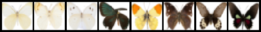
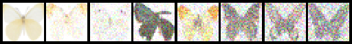
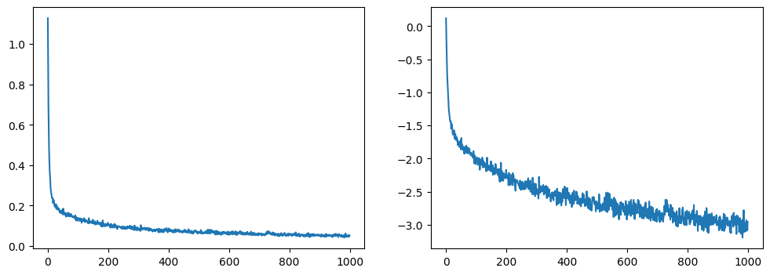

在这里，我们将加载一个来自hugging face hub的包含1000副蝴蝶图像的数据集。这是一个较小的数据级，在代码部分会修改针对大规模数据级训练的代码，但是会在下面指出具体的修改。

> 导入工具包

```python
import torch
import torch.nn.functional as F
import torchvision
from datasets import load_dataset
from torchvision import transforms

from diffusers import DDPMScheduler

from diffusers import UNet2DModel

from tqdm import tqdm
from matplotlib import pyplot as plt

device = torch.device("cuda" if torch.cuda.is_available() else "cpu")
```

> 图像预览函数

```python
def show_images(x):
    """给定一批图像，创建一个网格并将其转换为PIL"""
    x = x * 0.5 + 0.5
    grid = torchvision.utils.make_grid(x)
    grid_im = grid.detach().cpu().permute(1, 2, 0).clip(0, 1) * 255
    grid_im = Image.fromarray(np.array(grid_im).astype(np.uint8))
    return grid_im

def make_grid(images, size=64):
    """给定一个PIL图像列表，将它们叠加成一行以便查看"""
    output_im = Image.new("RGB", (size * len(images), size))
    for i, im in enumerate(images):
        output_im.paste(im.resize((size, size)), (i * size, 0))
    return output_im
```

```python
dataset = load_dataset("huggan/smithsonian_butterflies_subset", split="train")

image_size = 32
batch_size = 512

# 定义数据增强过程
preprocess = transforms.Compose(
[
    transforms.Resize((image_size, image_size)),  # 调整大小
    transforms.RandomHorizontalFlip(),            # 随机翻转
    transforms.ToTensor(),                        # 转化为张量
    transforms.Normalize([0.5], [0.5])            # 映射到(-1,1)区间标准化
])

def transform(examples):
    images = [preprocess(image.convert("RGB")) for image in examples["image"]]
    return {"images": images}

dataset.set_transform(transform)
train_dataloader = torch.utils.data.DataLoader(dataset, batch_size=batch_size, shuffle=True)
```

> 预览一下图像
```python
xb = next(iter(train_dataloader))["images"].to(device)[:8]
print("X shape:", xb.shape)
show_images(xb).resize((8 * 64, 64), resample=Image.NEAREST)
```


> DDPM调度器

```python
noise_scheduler = DDPMScheduler(num_train_timesteps=1000, beta_start=0.001, beta_end=0.004)
# 添加不同程度的噪声
timesteps = torch.linspace(0, 999, 8).long().to(device)
noise = torch.rand_like(xb)
noisy_xb = noise_scheduler.add_noise(xb, noise, timesteps)
print("Nosiy X Shape", noisy_xb.shape)
show_images(noisy_xb).resize((8 * 64, 64), resample=Image.NEAREST)
```


这里通过beta_start、beta_end和beta_schedule3个参数来控制噪声调度器的超参数beta(即论文中的$\beta_t$)，其中beta_start为控制推理阶段开始时的beta值，beta_end为控制beta的最终只，beta_schedule可以通过一个函数映射来为模型推理的每一步生成一个beta值。但这个其实是可以优化的。具体而言：

>> 最初形态
```python
noise_scheduler = DDPMscheduler(num_train_timesteps=1000, beta_start=0.001, beta_end=0.004)
```

>> 针对小尺寸优化形态

用cosine调度方式，更加适用于小尺寸图像。 
```python
noise_scheduler = DDPMscheduler(num_train_timesteps=1000, beta_start=0.001, beta_end=0.004, beta_scheduler = 'squaredcos_cap_v2')
```

> 搭建UNet2D模型

```python
model = UNet2DModel(
    sample_size=image_size,   # 目标图像的分辨率
    in_channels=3,            
    out_channels=3,           
    layers_per_block=2,       # 每一个UNet块中的ResNet层数
    block_out_channels=(64, 128, 128, 256), 
    down_block_types=( 
        "DownBlock2D",        
        "DownBlock2D",
        "AttnDownBlock2D",    # 带有空域维度的self-att的ResNet下采样模块
        "AttnDownBlock2D",
    ), 
    up_block_types=(
        "AttnUpBlock2D", 
        "AttnUpBlock2D",      # 带有空域维度的self-att的ResNet上采样模块
        "UpBlock2D",  
        "UpBlock2D"
      ),
)

model.to(device)
```

这里可以检验一下模型生成的图像尺寸是否还原：
```python
with torch.no_grad():
    model_prediction = model(noisy_xb, timesteps).sample

model_prediction.shape
> torch.Size([8, 3, 32, 32])
```
这里返回的一个batch8张图片，每张图片RGB3通道，尺寸是32*32。说明还原尺寸正确。

> 用针对小尺寸图像更好的调度方式

```python
# 设定噪声调度器
noise_scheduler = DDPMScheduler(num_train_timesteps=1000, beta_schedule="squaredcos_cap_v2")

# 训练循环
optimizer = torch.optim.AdamW(model.parameters(), lr=4e-4)

losses = []

# 为了后面生成图像更好看，因此训练了500epochs，在3090单卡GPU上训练耗时大概45分钟，根据自己情况适当修改参数
for epoch in range(500):
    for step, batch in enumerate(tqdm(train_dataloader)):
        clean_images = batch["images"].to(device)
        # 为图片添加采样噪声
        noise = torch.randn(clean_images.shape).to(clean_images.device)
        bs = clean_images.shape[0]
        
        # 为每张图片随机采样一个时间步
        timesteps = torch.randint(0, noise_scheduler.config.num_train_timesteps, (bs, ), 
                                  device=clean_images.device).long()
        
        # 根据每个时间步的噪声幅度，向清晰的图片中添加噪声
        noisy_images = noise_scheduler.add_noise(clean_images, noise, timesteps)
        
        # 获得模型的预测结果
        noise_pred = model(noisy_images, timesteps, return_dict=False)[0]
        
        # 计算损失
        loss = F.mse_loss(noise_pred, noise)
        loss.backward(loss)
        losses.append(loss.item())
        
        # 迭代模型参数
        optimizer.step()
        optimizer.zero_grad()
        
    if (epoch + 1) % 5 == 0:
        loss_last_epoch = sum(losses[-len(train_dataloader):]) / len(train_dataloader)
        print(f"Epoch:{epoch + 1}, loss: {loss_last_epoch}")
```

> 查看损失下降曲线

```python
fig, axs = plt.subplots(1, 2, figsize=(12, 4))
axs[0].plot(losses)
axs[1].plot(np.log(losses))
```


> 生成图像

现在的问题是，我们如何通过这个模型生成图像。方法有两种。

- 方法1：建立一个管线。

```python
from diffusers import DDPMPipeline

image_pipe = DDPMPipeline(unet=model, scheduler=noise_scheduler)
pipeline_output = image_pipe()

pipeline_output.images[0].resize((64, 64), resample=Image.NEAREST)
```


- 方法2：采样循环

这里我们创建8个随机分布的张量矩阵用来表示8张随机的图片，从完全随机的带噪图像开始，从最大噪声往最小噪声方向运行调度器并根据模型每一步的预测去除少量噪声，最终还原成”蝴蝶“图像。具体代码如下：
```python
sample = torch.randn(8, 3, 32, 32).to(device)

for i, t in enumerate(noise_scheduler.timesteps):
    with torch.no_grad():
        residual = model(sample, t).sample
        
    sample = noise_scheduler.step(residual, t, sample).prev_sample

show_images(sample).resize((8 * 64, 64), resample=Image.NEAREST)
```


从生成图片的角度，可以进一步理解，所谓的扩散生成，其实就是对图片不停地向算法（人们）所设想的方向降噪，去其糟粕，取其精华，最后实重构出了一副符合期望的”假“图片。但从蝴蝶的这个结果上看，这个图片足以以假乱真。