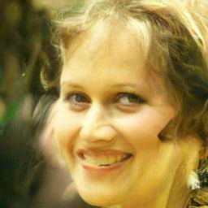
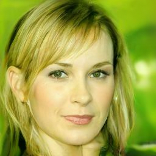

> 准备工作

先介绍一下DDIM优化在哪里。

### DDIM通俗理解

在生成图像的每一步中，模型的输入都是一个带噪数据，并且需要预测这个噪声在哪，然后去除掉，通过N步（前面的实例一直是1000步）去噪就可以生成（估计）出没有噪声的完整图像是什么。

在DDPM时期，人们对去噪的认识还在初级阶段，既然DDPM可以去噪，并且效果还不错，甚至只需要一个MSEloss就能做，已经如此简单好用，那就先用着。然而随着使用的深入，研究人员发现，DDPM本质上是把这个预测噪声的过程分解成了多个步骤，并且需要多次采样这种大力出奇迹的方式才能比较好的实现降噪效果。实际上，如果优化采样方法，这个1000步是不是就可以省一点。

用直线拟合一条曲线，一步到位等于是线性函数拟合，肯定不如多段效果好，因此DDPM就是用$x_t$预测$x_{t-1}$，一步一步慢慢来，但是这个时候有一个非常强大的网络——GAN——他要做的就是直接一步到位。DDIM也想跳一些步骤。

接下来，将从公式的角度从底层原理上去理解这一个优化过程。

### DDPM能不能减小采样次数$T$
$T$必须很大，这是DDPM速度很慢的主要原因。直观的想法就是能不能把$T$设置的小一点。显然答案是不行。在DDPM中，$x_t$是由$x_{t-1}$得到的：
$$x_t = \sqrt \alpha_t x_{t-1} + \sqrt{1-\alpha_t} \epsilon \sim \mathcal N(0,I)$$
进一步的，基于马尔可夫性值，可以通过$x_0$一步到位：
$$x_t = \sqrt {\bar \alpha_t} x_{t-1} + \sqrt{1-\bar \alpha_t} \epsilon，\bar \alpha = \alpha_1 \dots \alpha_{t-1}\alpha_t$$
关于这个公式，需要说明如下几点：
1. $\alpha_t \to I$且$\alpha_t < I$
这是因为，$\alpha_t$本质上是$x_{t-1}$即上一步的权值，我们不希望在某一步加噪过程中直接大面积破坏输入图像的像素分布，相反，我们更希望可以保留上一步图像更多的信息。从数学的角度看，只有在图像上增加极小的一个方差$\sqrt{1-\alpha_t} \epsilon$才能保证依然是属于正态分布$\mathcal N(0,I)$。
2. $\bar\alpha_T \to 0, x_T =  \sqrt {\bar \alpha_T} x_{T-1} + \sqrt{1-\bar \alpha_T} \epsilon$，在这种情况下，$x_t \to \epsilon \sim \mathcal N(0,I)$,因为只有在这种情况下，即$x_t$是符合标准正态分布的，才能抽样出$x_{t-1},x_{t-2},\dots,x_0$

因此，DDPM需要同时满足两个条件：$\alpha_t \to I$且$\alpha_t < I$和$\bar\alpha_t \to 0$，又因为$\bar \alpha_t = \alpha_1 \dots \alpha_{t-1}\alpha_t = \prod \limits_{t=1}^T \alpha_t$，因此这个$T$必须足够大，即非常多个接近1的小数连乘。

### DDPM能不能跳步降噪
所谓的跳步，即在DDPM中，是逐步推理的：
$$x_t \to x_{t-1}\to x_{t-2} \to \dots x_1 \to x_0$$
那么能不能直接跳过一些呢，即：$x_t \to x_{t-3} \to x_{t-7} \dots$这个也是不行的。

在DDPM中，目标是拟合（优化）概率分布$P(x_{t-1}|x_0,x_t)$，方法是用马尔可夫的贝叶斯公式展开：
$$min \mathcal J = argmax P(x_{t-1}|x_0,x_t) = argmax \frac{P(x_t|x_{t-1}）P(x_{t-1}|x_0)}{P(x_t|x_0)}$$
拟合的这个分布全部都是基于马尔可夫性质推导来的，因此必须遵循马尔可夫性质一步一步的做采样。

> DDPM：成也马尔可夫，败也马尔可夫
### DDIM如何去马尔可夫
既然不能跳步的原因是由于马尔可夫性质的约束，那假设我不再让这个过程是马尔可夫的（Non-Markovian）了，现在我可不可以跳步了？答案是可以，并且这就是DDIM所做的事。
$$DDPM: P(x_{t-1}|x_t,x_0) \sim Markov$$
$$DDIM: P(x_s|x_k,x_0) \sim Non-Markov, s<k-1$$
此时，
$$P(x_s|x_k,x_0) = \frac{P(x_k|x_s,x_0)P(x_x|x_0)}{P(x_k,x_0)}$$
对于这个式子，理论上解的丰富性（多样性）是远高于DDPM的，因为DDPM右边的三个概率分布都是已知的，而如果都不知道，这将大幅增加解的自由度。可惜的是，在DDIM里这个并不能随便取值。

这是因为，DDIM本质上只是优化了DDPM的采样方法，训练方式和DDPM仍然一样。而DDPM的训练过程中用到了$P(x_t|x_0)$，这个是固定的，因此DDIM的$P(x_s|x_0),P(x_k|x_0)$也是固定的：
$$P(x_s|x_0)=\sqrt {\bar \alpha_s} x_{s-1} + \sqrt{1-\bar \alpha_s} \epsilon$$
$$P(x_k|x_0)=\sqrt {\bar \alpha_k} x_{k-1} + \sqrt{1-\bar \alpha_k} \epsilon$$

至于$P(x_k|x_s,x_0)$，对应DDPM里的$P(x_t|x_{t-1})$，其实并没有参与训练过程，在DDPM里训练是直接求$P(x_t|x_0)$：
$$q(x_{1:T}|x_0)=\prod \limits_{t=1}^T q(x_t|x_{t-1})$$
所以$P(x_k|x_s,x_0)$也先不用管。此时，会有问题，如果我都不知道$P(x_t|x_{t-1},x_0)$，又如何求得$P(x_{t-1}|x_{t},x_0)$呢？其实很简单，根本不需要求，我们只需要设一个符合$x_T =  \sqrt {\bar \alpha_T} x_{T-1} + \sqrt{1-\bar \alpha_T} \epsilon$就可以。

用待定系数法可以求解，参考DDPM，我们假设$x_s$是$x_k$和$x_0$的加权和，即$P(x_s|x_k,x_0) \sim \mathcal N(kx_0+mx_k,\sigma^2I)$，就有:
$$x_{t-1}=kx_0+mx_t+\sigma\epsilon$$
又由$x_T =  \sqrt {\bar \alpha_T} x_{T-1} + \sqrt{1-\bar \alpha_T} \epsilon$可以得到：
$$x_T = \sqrt{\bar \alpha_T}x_0 + \sqrt{1-\bar \alpha_T}\epsilon^{\prime}$$
其中，$\epsilon$和$\epsilon^{\prime}$都服从标准正态分布。合并二式：
$$x_s=(k+m\sqrt{\bar \alpha_t})x_0 + (m\sqrt{1- \bar \alpha_t})\epsilon^{\prime}+\sigma\epsilon$$
根据正态分布叠加原理，可以把$\epsilon$和$\epsilon^{\prime}$合并成同一个正态分布$\mathcal N(0,m^2(1-\bar\alpha_k)+\sigma^2)$，进一步的，上式可以简化：
$$x_s=(k+m\sqrt{\bar \alpha_t})x_0+\sqrt{m^2(1-\bar\alpha_t)+\sigma^2}\epsilon$$
接下来求解$k，m$，因为必须满足$x_T =  \sqrt {\bar \alpha_T} x_{T-1} + \sqrt{1-\bar \alpha_T} \epsilon$，因此：
$$k+m\sqrt{\bar\alpha_k}=\sqrt{\bar\alpha_{s}}$$
$$m^2(1-\bar\alpha_k)+\sigma^2=1-\bar\alpha_{s}$$
经过简单计算得到：
$$m=\frac{\sqrt{1-\bar\alpha_s-\sigma^2}}{\sqrt{1-\bar\alpha_k}}$$
$$k=\sqrt{\bar \alpha_{s}}-\sqrt{1-\bar\alpha_{s}-\sigma^2}\frac{\sqrt{\bar\alpha_k}}{\sqrt{1-\bar\alpha_k}}$$
此时就得到了DDIM的反向生成分布，也就是新的拟合目标：
$$P(x_{s}|x_k,x_0)=\mathcal N(\sqrt{1-\bar\alpha_{s}}x_0+\sqrt{1-\bar\alpha_{s}-\sigma^2}\frac{x_k-\sqrt{\bar\alpha_k}}{\sqrt{1-\bar\alpha_k}}, \sigma^2I)$$

### DDIM的采样过程
既然已经求得概率分布，那就和DDPM一样抽样即可，首先把$x_s$的表达式写出来看看还需要求什么：
$$x_s = \sqrt{1-\bar\alpha_{s}}x_0+\sqrt{1-\bar\alpha_{s}-\sigma^2}\frac{x_k-\sqrt{\bar\alpha_k}}{\sqrt{1-\bar\alpha_k}}+\sigma\epsilon$$
发现这里还有一个$\sigma$是未知的。作者在论文里提到了两个值：

**$case1: \ \sigma=0$**

此时生成过程是一个固定过程，因为唯一的随机变量$\epsilon$已经不存在了，这样就完全牺牲了多样性，只有在最开始设定$T$值时不确定，后面所有的步骤都是确定的。但此时生成的速度是最好的。

**$case2: \ \sigma=\sqrt{\frac{1-\bar\alpha_{t-1}}{1-\bar\alpha_t}\beta_t}$**

此时的采样方式就是DDPM中$P(x_{t-1}|x_t,x_0)$的方差。证明就省略了，感兴趣的可以自行证明一下。

> 思考：如果DDPM也让$\sigma=0$，效果如何？

效果会差。因为DDPM基于马尔可夫贝叶斯计算，而不是像DDIM一样假设分布。换言之，在DDIM里无论$\sigma$取什么值也不会影响分布，但是DDPM里只要改了$\sigma$参数，就不遵循设计的逐步前向过程。具体参考**DDPM能不能减小采样次数**部分两个必须满足的条件。

## 用DDIM替换DDPM调度器
> 导入工具包
```python
import numpy as np
import torch
import torch.nn.functional as F
import torchvision
from datasets import load_dataset
from diffusers import DDIMScheduler, DDPMPipeline
from matplotlib import pyplot as plt
from PIL import Image
from torchvision import transforms
from tqdm.auto import tqdm

device = "cuda" if torch.cuda.is_available() else "cpu"
```

> 载入一个预训练模型

```python
image_pipe = DDPMPipeline.from_pretrained("google/ddpm-celebahq-256")
image_pipe.to(device)
images = image_pipe().images
images[0]
```



> 创建DDIM调度器
```python
# 创建一个新的调度器，并设置推理迭代次数
scheduler = DDIMScheduler.from_pretrained("google/ddpm-celebahq-256")
scheduler.set_timesteps(num_inference_steps=40)

# 随机噪声，batch_size=4，3通道，长宽均为256像素的一组图像
x = torch.randn(4, 3, 256, 256).to(device)

# 循环时间步
for i, t in tqdm(enumerate(scheduler.timesteps)):
    # 给带噪图像加上时间步信息
    model_input = scheduler.scale_model_input(x, t)
    
    # 预测噪声
    with torch.no_grad():
        noise_pred = image_pipe.unet(model_input, t)["sample"]
    
    # 使用调度器计算更新的样本
    scheduler_output = scheduler.step(noise_pred, t, x)

    # 更新输入图像
    x = scheduler_output.prev_sample
    
    # 绘制输入图像和预测的去噪图像
    if i % 10 == 0 or i == len(scheduler.timesteps) - 1:
        fig, axs = plt.subplots(1, 2, figsize=(12, 5))

        grid = torchvision.utils.make_grid(x, nrow=4).permute(1, 2, 0)
        axs[0].imshow(grid.cpu().clip(-1, 1) * 0.5 + 0.5)
        axs[0].set_title(f"Current x (step {i})")

        pred_x0 = scheduler_output.pred_original_sample  
        grid = torchvision.utils.make_grid(pred_x0, nrow=4).permute(1, 2, 0)
        axs[1].imshow(grid.cpu().clip(-1, 1) * 0.5 + 0.5)
        axs[1].set_title(f"Predicted denoised images (step {i})")
        plt.show()
```


可以看出，一开始的预测效果并不是很好，但随着过程的推进，预测的输出逐渐得到改善。

> 用心的调度器替换掉原有管线的调度器进行采样

```python
image_pipe.scheduler = scheduler
images = image_pipe(num_inference_steps=40).images
images[0]
```
