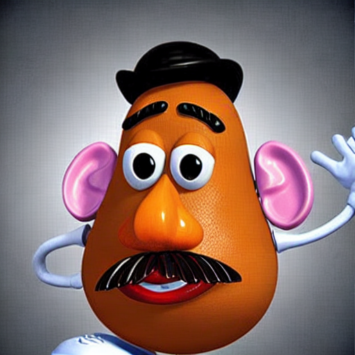

在这一部分，会训练一个属于自己的扩散模型，生成蝴蝶图像。至于微调和更多图像风格，会在后面介绍。这一部分重点介绍Diffusers库的相关知识，为后面内容打基础。

> 导入工具包

```python
import numpy as np
import torch
import torch.nn.functional as F
import torchvision
from matplotlib import pyplot as plt
from PIL import Image
from tqdm import tqdm

# 加载管线
from diffusers import StableDiffusionPipeline
from diffusers import DDPMPipeline
from diffusers import DDPMScheduler

device = torch.device("cuda" if torch.cuda.is_available() else "cpu")
```

> 准备一些展示图片的函数

```python
def show_images(x):
    """给定一批图像，创建一个网格并将其转换为PIL"""
    x = x * 0.5 + 0.5
    grid = torchvision.utils.make_grid(x)
    grid_im = grid.detach().cpu().permute(1, 2, 0).clip(0, 1) * 255
    grid_im = Image.fromarray(np.array(grid_im).astype(np.uint8))
    return grid_im

def make_grid(images, size=64):
    """给定一个PIL图像列表，将它们叠加成一行以便查看"""
    output_im = Image.new("RGB", (size * len(images), size))
    for i, im in enumerate(images):
        output_im.paste(im.resize((size, size)), (i * size, 0))
    return output_im
```

## 初体验Stable Diffusion管线（需要GPU）

这里使用大名鼎鼎的稳定扩散模型(Stable Diffusion, SD)，后面我们会详细介绍，这里只是使用diffuers库里面的一个管线工具，直接调用现成的SD模型做一个文生图的尝试。

这个模型虽然强大，但是也有局限性，除非我们足够知名，导致互联网上到处都可以搜到我们的图片，否则它也无法识别你我长什么样子。然而DreamBooth可以让我们对SD微调，并在整个过程中引入特定的面不、物体或风格的额外信息。

在这里你可以通过调整promt提示词来获取不同的结果，还可以调整参数num_inference_steps（采样步骤数量）和guidance_scale（提示词和输出图像的匹配度）进一步探索模型行为。
```python
model_id = "sd-dreambooth-library/mr-potato-head"
pipe = StableDiffusionPipeline.from_pretrained(model_id, torch_dtype=torch.float16).to(device)
prompt = "an abstract oil painting of sks mr potato head by picasso"
image = pipe(prompt, num_inference_steps=50, guidance_scale=5.5).images[0]
image
```



## diffusers核心API
- 管线（pipline）：从高层次设计的多种类函数，便于部署的方式实现，能够快速利用预训练的主流扩散模型来生成样本。
- 模型（model）：在训练新的扩散模型时需要用到的网络结构。
- 调度器（scheduler）：在推理过程中使用多种不同的技巧来从噪声中生成图像，同时可以生成训练过程中所需的“带噪”图像。

```python
model = "johnowhitaker/ddpm-butterflies-32px"
butterfly_pipeline = DDPMPipeline.from_pretrained(model).to(device)

# 生成8张图片
images = butterfly_pipeline(batch_size=8).images
make_grid(images)
```


