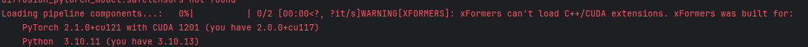
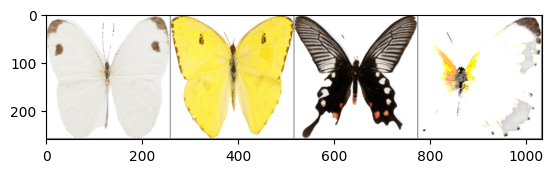
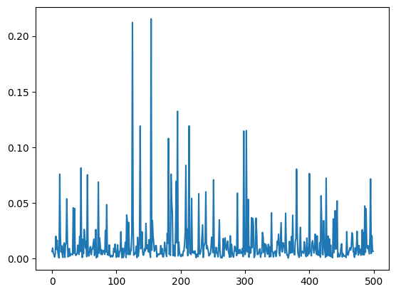
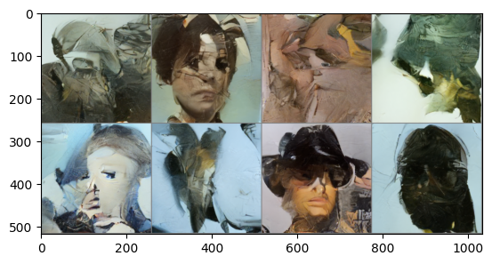

现在我们已经知道如何构建和训练一个扩散模型，但是从头训练一个模型往往需要很长的时间（注意，在此之前我们只使用了最基础的DDPM模型和UNet2D，并没有使用更多更复杂的结构，并且数据集都是非常小的数据集），特别是使用高分辨率图像时，从头训练并不是一个非常明智的选择。

因此在这部分，我们会使用微调(fine tuning)的方法，也就是在NLP和CV已经广泛使用的迁移学习，从一个已经在特定数据集上训练好，已经学会如何降噪的模型的基础啥训练，相较于完全初始化的参数，迁移学习更贴近真实使用需求。

> 微调

对于微调学习，一般来说，如果你的数据集跟她的数据集很类似，即预训练模型是一个动物生成模型，你要生成的是动物的动漫插画，那么效果会很好。反之，如果预训练模型是一个动物生成模型，你要做的是人脸生成，效果会相应打折扣，但，**仍然比从头训练效果更好。**

> 引导和条件生成

基于微调，我们将引出引导这个概念。如果我们对生成模型不加以控制，那么他生成的图片是天马行空的，但是如果我们训练一个条件模型，使其接受额外的信息约束，控制生成过程，就可以更加精准的生成我们想要的图像。例如我们希望通过微调一个人脸生成模型，来生成我们给定人物照片的Q版头像，这种风格固定化，就需要**引导**来实现。

>> **引导函数可以是任何函数**

> 条件信息输入模型的方法

- 将条件信息作为额外的通道输入UNet模型。

这个是最简单粗暴的方式，直接把约束信息用通道的方式输入到模型中。

- 将条件信息转换成embedding，然后将embedding通过投影层映射来改变其通道数，从而可以对齐模型中间层的输出通道，最后将embedding加到中间层的输出上。

当条件信息是文本信息的时候，我们需要把文本做一个词向量映射，然后reshape到图片feature map的尺度，然后融合信息。

- 添加带有交叉注意力（cross-attention）机制的网络层。

这个就是传统注意力机制的升级。在Transformer中的其实就存在自注意力（encoder端和decoder端）和交叉注意力机制（decoder端），二者几乎一样，细微区别在于，交叉注意力机制是一个序列关注另一个序列，而不是自己关注自己。从代码实现的维度上说，自注意力机制查询、键和值都来自同一个输入序列。这使得模型能够关注输入序列中的其他部分以产生一个位置的输出。主要目的是捕捉输入序列内部的依赖关系。在Transformer的编码器（Encoder）和解码器（Decoder）的每一层都有自注意力。它允许输入序列的每个部分关注序列中的其他部分。
交叉注意力机制查询来自一个输入序列，而键和值来自另一个输入序列。这在诸如序列到序列模型（如机器翻译）中很常见，其中一个序列需要“关注”另一个序列。目的是使一个序列能够关注另一个不同的序列。主要出现在Transformer的解码器。它允许解码器关注编码器的输出，这在文生图里非常重要。

> 导入工具包

**3090单卡在windows系统上用该代码参数训练一个epoch耗时30分钟左右，请根据自身算力酌情更改参数，包括resize的image_size，batch_size和轮次**

```python
import torch
import torch.nn.functional as F
import torchvision
from datasets import load_dataset
from diffusers import DDIMScheduler, DDPMPipeline
from matplotlib import pyplot as plt
from PIL import Image
from torchvision import transforms
from tqdm.auto import tqdm

device = "cuda:0" if torch.cuda.is_available() else "cpu"
```
****
**注意，这里最好把torch更新到最新的版本，以免后面报错**

****

> 微调

简单来说，这部分代码和自己训练模型的代码几乎完全一致，如果不考虑使用DDIM这个采样器来加速，和前面的代码唯一的区别就在于使用了管线里面训练好的unet模型参数：
```python
optimizer = torch.optim.AdamW(image_pipe.unet.parameters(), lr=lr)
```
>> 加载预训练模型

下面是完整代码，同样的，我们使用一个生成蝴蝶的管线。
```python
dataset_name = "huggan/smithsonian_butterflies_subset"
dataset = load_dataset(dataset_name, split="train")

image_size = 256
batch_size = 4
preprocess = transforms.Compose(
    [
        transforms.Resize((image_size, image_size)),
        transforms.RandomHorizontalFlip(),
        transforms.ToTensor(),
        transforms.Normalize([0.5], [0.5]),
    ]
)

def transform(examples):
    images = [preprocess(image.convert("RGB")) for image in examples["image"]]
    return {"images": images}

dataset.set_transform(transform)

train_dataloader = torch.utils.data.DataLoader(dataset, batch_size=batch_size, shuffle=True)

print("Previewing batch:")
batch = next(iter(train_dataloader))
grid = torchvision.utils.make_grid(batch["images"], nrow=4)
plt.imshow(grid.permute(1, 2, 0).cpu().clip(-1, 1) * 0.5 + 0.5);
```


>> 训练

再次重复一下训练耗时的问题。
- **额外因素1：** 权衡好batch size和图像尺寸，适应自己的GPU显存。这里的图像是256 * 256，并且模型也很大，因此batch size仅取4。当然你也可以通过缩小图像尺寸来换取更大的batch size加速训练，但是这个模型是基于256 * 256设计的。

```python
num_epochs = 2
lr = 1e-5
grad_accumulation_steps = 2  

optimizer = torch.optim.AdamW(image_pipe.unet.parameters(), lr=lr)

losses = []

for epoch in range(num_epochs):
    for step, batch in tqdm(enumerate(train_dataloader), total=len(train_dataloader)):
        clean_images = batch["images"].to(device)
        # 随机生成一个噪声
        noise = torch.randn(clean_images.shape).to(clean_images.device)
        bs = clean_images.shape[0]
        # 随机选取一个时间步
        timesteps = torch.randint(0,image_pipe.scheduler.config.num_train_timesteps,(bs,),
                                  device=clean_images.device).long()
        
        # 添加噪声，前向扩散过程
        noisy_images = image_pipe.scheduler.add_noise(clean_images, noise, timesteps)
        # 使用“带噪”图像进行网络预测
        noise_pred = image_pipe.unet(noisy_images, timesteps, return_dict=False)[0]
        
        loss = F.mse_loss(noise_pred, noise)
        loss.backward(loss)
        losses.append(loss.item())

        # 由于batch size较小，选择累积梯度计算。这里实际上如果就用每一步更新也是可以的
        if (step + 1) % grad_accumulation_steps == 0:
            optimizer.step()
            optimizer.zero_grad()

    print(f"Epoch {epoch} average loss: {sum(losses[-len(train_dataloader):])/len(train_dataloader)}")

# 绘制损失曲线
plt.plot(losses)
```


- **额外因素2：** 损失曲线非常混乱，这是因为每次迭代都只使用了4个训练样本，并且添加的噪声也是随机的，对训练并不理想。一种补救措施是使用一个非常小的学习率限制每次更新的幅度，但我们还有一个更好的办法就是这里代码使用的梯度累积（gradient accumulation），这个方法既能得到与使用更大batch size一样的收益，又不会造成内存溢出。

具体而言，多运行几次loss.backward()，再调用optimizer.step()和optimizer.zero_grad()，这样torch就会多积累（求和）梯度并将多批次数据产生的梯度融合在一起，从而生成一个单一的（更好的）梯度估计值用于参数更新。

- **额外因素3：** 训练时每遍历一次数据，才输出一行更新信息，为了更好的了解训练情况，我们可以：

（1）训练过程中，是不是生成一些图像样本，供我们检查模型性能。

（2）训练过程中，将损失值、生成的图像样本等信息记录到log中，使用TensorBoard可视化。

> 生成图像

一样的，我们创造8个完全随机的3*256*256张量用来模拟8个完全加噪的图片
```python
x = torch.randn(8, 3, 256, 256).to(device)
for i, t in tqdm(enumerate(scheduler.timesteps)):
    model_input = scheduler.scale_model_input(x, t)
    with torch.no_grad():
        noise_pred = image_pipe.unet(model_input, t)["sample"]
    x = scheduler.step(noise_pred, t, x).prev_sample
grid = torchvision.utils.make_grid(x, nrow=4)
plt.imshow(grid.permute(1, 2, 0).cpu().clip(-1, 1) * 0.5 + 0.5);
```


- **额外因素4：** 微调过程是难以预测的，如果训练时间特别长，则我们有可能看到一些完美的蝴蝶图像，但模型的中间过程也非常有趣，特别是对于研究不同艺术风格融合的人。

> 把微调后的模型保存到本地

```python
image_pipe.save_pretrained('my-finetuned-model')
```