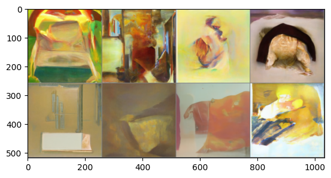

在这里使用LSUM bedrooms数据集上训练并在WikiArt数据集上进行一轮微调的模型进行演示。首先加载这个模型看看效果。

> 导入工具包

```python
import numpy as np
import torch
import torch.nn.functional as F
import torchvision
from datasets import load_dataset
from diffusers import DDIMScheduler, DDPMPipeline
from matplotlib import pyplot as plt
from PIL import Image
from torchvision import transforms
from tqdm.auto import tqdm

device = "cuda" if torch.cuda.is_available() else "cpu"
```

> 查看预训练模型效果

```python
# 加载一个预训练的管线
pipeline_name = "johnowhitaker/sd-class-wikiart-from-bedrooms"
image_pipe = DDPMPipeline.from_pretrained(pipeline_name).to(device)

# 使用DDIM调度器，用40步生成图片
scheduler = DDIMScheduler.from_pretrained(pipeline_name)
scheduler.set_timesteps(num_inference_steps=40)

# 从随机噪声开始
x = torch.randn(8, 3, 256, 256).to(device)

# 使用一个最简单的采样循环
for i, t in tqdm(enumerate(scheduler.timesteps)):
    model_input = scheduler.scale_model_input(x, t)
    with torch.no_grad():
        noise_pred = image_pipe.unet(model_input, t)["sample"]
    x = scheduler.step(noise_pred, t, x).prev_sample

# 生成图片
grid = torchvision.utils.make_grid(x, nrow=4)
plt.imshow(grid.permute(1, 2, 0).cpu().clip(-1, 1) * 0.5 + 0.5);
```


我们先不论这个图片画的是什么。通常情况下，想要判断微调的效果并不容易，而且用户对模型的要求“好用就行”其实在不同的场景下代表的水平也会有所不同。

如果在一个很小的数据集上微调文本条件模型（Stable Diffusion），那么你可能希望模型尽可能宝留其原始训练所学习的内容，以便它能够理解数据集中未涵盖的各种文本提示语，同时我们又希望它可以尽可能适应我们的数据集以便生成的内容和数据风格一致。这可能意味着我们需要使用很小的学习率并对模型执行指数平均操作。

又或者，如果需要重新训练一个模型以适应新的数据集，需要使用较大的学习率并进行长时间的训练。

通过引导，就可以更好，更准确的控制模型输出。

## 引导控制生成图片颜色

如果想要对生成的样本颜色施加控制，可以在采样过程中施加额外的控制。

首先，需要创建一个函数，用于定义我们希望优化的指标（损失）。我们希望让生成的图片趋近某种颜色的示例，color_loss()函数能够对图片的像素值和目标颜色（这里的目标颜色是一种蓝绿色）进行比较并返回均方误差：
```python
def color_loss(images, target_color=(0.3, 0.7, 0.9)):
    """给定一个RGB值，返回一个损失值，用于衡量图片的像素值与目标颜色之差，浅蓝绿色对应RGB值(0.3,0.7,0.9)"""
    # 归一化，使得取值区间为(-1,1)
    target = torch.tensor(target_color).to(images.device) * 2 - 1  
    # 将目标张量的形状改未(batch size, rbg, h, w)
    target = target[None, :, None, None]  
    # 计算图片的像素值以及目标颜色的均方误差
    error = torch.abs(images - target).mean()  
    return error
```

接下来，需要修改采样循环并执行以下操作：

- 创建新的输入图像$x$将它的requires_grad属性设为True。
- 计算“去噪”后的图像$x_0$。
- 将“去噪”后的图像$x_0$传递给损失函数。
- 计算损失函数对输入图像$x$的梯度。
- 在使用调度器之前，先用计算出来的梯度修改输入图像$x$，使输入图像$x$朝着减少损失值的方向改进。

为了实现以上操作，有两种比较好的办法。

- 方法1：从UNet中获取噪声预测，将其设置为输入图像$x$的requires_grad属性，可以更高效地使用内存，因为不需要通过扩散模型追踪梯度。缺点是导致梯度的精度降低。

```python
# 用于决定引导的强度有多大，可设置5~100之间的数
guidance_loss_scale = 40  

x = torch.randn(8, 3, 256, 256).to(device)

for i, t in tqdm(enumerate(scheduler.timesteps)):

    model_input = scheduler.scale_model_input(x, t)

    with torch.no_grad():
        noise_pred = image_pipe.unet(model_input, t)["sample"]

    x = x.detach().requires_grad_()
    
    # 得到去噪后的图像
    x0 = scheduler.step(noise_pred, t, x).pred_original_sample

    loss = color_loss(x0) * guidance_loss_scale
    if i % 10 == 0:
        print(i, "loss:", loss.item())
    
    # 获取梯度
    cond_grad = -torch.autograd.grad(loss, x)[0]
    # 梯度更新x
    x = x.detach() + cond_grad
    # 使用调度器更新x
    x = scheduler.step(noise_pred, t, x).prev_sample

grid = torchvision.utils.make_grid(x, nrow=4)
im = grid.permute(1, 2, 0).cpu().clip(-1, 1) * 0.5 + 0.5
Image.fromarray(np.array(im * 255).astype(np.uint8))
```


- 方法2：先将输入图像$x$的requires_grad属性设置为True，然后传递给UNet并计算“去噪”后的图像$x_0$。

```python
guidance_loss_scale = 40
x = torch.randn(4, 3, 256, 256).to(device)

for i, t in tqdm(enumerate(scheduler.timesteps)):
    # 设置requires_grad
    x = x.detach().requires_grad_()
    model_input = scheduler.scale_model_input(x, t)
    # 预测
    noise_pred = image_pipe.unet(model_input, t)["sample"]
    # 得到“去噪”后的图像
    x0 = scheduler.step(noise_pred, t, x).pred_original_sample

    loss = color_loss(x0) * guidance_loss_scale
    if i % 10 == 0:
        print(i, "loss:", loss.item())
    # 获取梯度
    cond_grad = -torch.autograd.grad(loss, x)[0]
    # 更新x
    x = x.detach() + cond_grad
    # 使用调度器更新x
    x = scheduler.step(noise_pred, t, x).prev_sample

grid = torchvision.utils.make_grid(x, nrow=4)
im = grid.permute(1, 2, 0).cpu().clip(-1, 1) * 0.5 + 0.5
Image.fromarray(np.array(im * 255).astype(np.uint8))
```


从最终呈现效果看，方法2会好一点，但是颜色迁移效果减弱了，事实上，方法2的输出更接近训练模型使用的数据。可以通过增大guidance_loss_scale来增强颜色迁移效果。

## CLIP引导

基本流程：

1. 对文本提示语进行embedding，为 CLIP 获取一个512维的embedding。
2. 在扩散模型的生成过程中的每一步进行如下操作：
- 制作多个不同版本的预测出来的“去噪”图片。
- 对预测出来的每一张“去噪”图片，用CLIP给图片做embedding，并对图片和文字的embedding做对比。
- 计算损失对于当前“带噪”的输入$x$的梯度，在使用调度器更新$x$之前先用这个梯度修改它。

```python
import open_clip

clip_model, _, preprocess = open_clip.create_model_and_transforms("ViT-B-32", pretrained="openai")
clip_model.to(device)

tfms = torchvision.transforms.Compose(
    [
        torchvision.transforms.RandomResizedCrop(224), 
        torchvision.transforms.RandomAffine(5),  
        torchvision.transforms.RandomHorizontalFlip(),  
        torchvision.transforms.Normalize(
            mean=(0.48145466, 0.4578275, 0.40821073),
            std=(0.26862954, 0.26130258, 0.27577711),
        ),
    ]
)

# 定义一个损失函数，用于获取图片的特征，然后与提示文字的特征进行对比
def clip_loss(image, text_features):
    image_features = clip_model.encode_image(
        tfms(image)
    )  # Note: applies the above transforms
    input_normed = torch.nn.functional.normalize(image_features.unsqueeze(1), dim=2)
    embed_normed = torch.nn.functional.normalize(text_features.unsqueeze(0), dim=2)
    dists = (
        input_normed.sub(embed_normed).norm(dim=2).div(2).arcsin().pow(2).mul(2)
    )  # Squared Great Circle Distance
    return dists.mean()
```

```python
prompt = "A man in a street"
scheduler = DDIMScheduler.from_pretrained(pipeline_name)
scheduler.set_timesteps(num_inference_steps=60)

guidance_scale = 20
n_cuts = 4  

scheduler.set_timesteps(50)

# 使用CLIP从提示文字中提取特征
text = open_clip.tokenize([prompt]).to(device)
with torch.no_grad(), torch.cuda.amp.autocast():
    text_features = clip_model.encode_text(text)


x = torch.randn(4, 3, 256, 256).to(device)

for i, t in tqdm(enumerate(scheduler.timesteps)):

    model_input = scheduler.scale_model_input(x, t)

    with torch.no_grad():
        noise_pred = image_pipe.unet(model_input, t)["sample"]

    cond_grad = 0

    for cut in range(n_cuts):

        x = x.detach().requires_grad_()
        # 获取“去噪”后的图像
        x0 = scheduler.step(noise_pred, t, x).pred_original_sample

        loss = clip_loss(x0, text_features) * guidance_scale
        # 获取梯度并使用n_cuts平均
        cond_grad -= torch.autograd.grad(loss, x)[0] / n_cuts

    if i % 25 == 0:
        print("Step:", i, ", Guidance loss:", loss.item())

    alpha_bar = scheduler.alphas_cumprod[i]
    x = x.detach() + cond_grad * alpha_bar.sqrt()

    x = scheduler.step(noise_pred, t, x).prev_sample


grid = torchvision.utils.make_grid(x.detach(), nrow=4)
im = grid.permute(1, 2, 0).cpu().clip(-1, 1) * 0.5 + 0.5
Image.fromarray(np.array(im * 255).astype(np.uint8))
```


## 用Gradio做一个WebUI

通过Gradio可以为自己的机器学习模型自定义接口，然后通过一个唯一的URL共享给他人。Gradio还集成了Spaces，这使得创建Demo并共享给别人更加容易。

在这里，我们把需要的核心逻辑放在一个函数中，这个函数能够接受一些输入，然后输出一张图片作为输出。这个函数被封装在一个简单的接口中，可以自定义一些参数（提供给generate函数）。关于Gradio可视化，可以查看[Gradio](visualization/gradio/)部分。

```python
def generate(color, guidance_loss_scales):
    target_color = ImageColor.getcolor(color, 'RGB')
    target_color = [a / 255 for a in target_color]
    x = torch.randn(1, 3, 256, 256).to(device)
    for i, t in tqdm(enumerate(scheduler.timesteps)):
        model_input = scheduler.scale_model_input(x, t)
        with torch.no_grad():
            noise_pred = image_pipe.unet(model_input, t)["sample"]
        x = x.detach().requires_grad_()
        x0 = scheduler.step(noise_pred, t, x).pred_original_sample
        loss = clip_loss(x0, text_features) * guidance_scale
        cond_grad = -torch.autograd.grad(loss, x)[0]
        x = x.detach() + cond_grad
        x = scheduler.step(noise_pred, t, x).prev_sample
    grid = torchvision.utils.make_grid(x, nrow=4)
    im = grid.permute(1, 2, 0).cpu().clip(-1, 1) * 0.5 + 0.5
    im = Image.fromarray(np.array(im * 255).astype(np.uint8))
    im.save('test.jpeg')
    return im

inputs = [
    gr.ColorPicker(label='color', value='#55FFAA'),
    gr.Slider(label='guidance_scale', minimum=0, maximum=30, value=3)
]

outputs = gr.Image(label='result')
gr.close_all()
demo = gr.Interface(fn=generate, inputs=inputs, outputs=outputs, examples=[['#BB2266',3],['$44CCAA',5]])
demo.launch()
```

