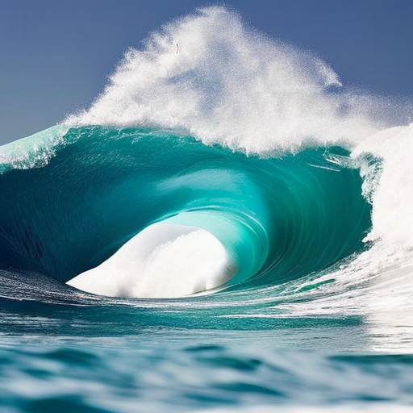

## 基本概念

### 隐式扩散和VAE

> 生成模型的核心思路

生成式模型有两个著名的家族GAN和VAE，图片可以看做高维数据的分布$P(X)$，我们手上的数据集$x_1,x_2,\dots,x_n$可以看做从$P(X)$中采样得到的若干样本。可惜$P(X)$很难直接求得，常用的思路是通过引入隐藏变量(latent variable)$z$，寻找$Z$空间到$X$空间的映射，这样我们通过$Z$空间采样映射到$X$空间就可以生成新的图片。

我们希望通过映射$Z \sim X^{\prime}$得到的分布$X^{\prime}$与真实的分布$X$可能接近，但是由于不知道它们具体的形式，无法计算KL散度来衡量。GAN的思路很直接-用一个神经网络（Discriminator)去衡量$X$和$X^{\prime}$的相似度，而VAE使用的是一个更间接巧妙的思路。

GAN中对于隐变量$z$有着很强的先验假设（Gaussian distribution），实际上只有decode的过程而没有encode。通过VAE（variational auto-encoder）的全称就能看出来VAE的主要贡献就在于在encode上的改进。如今被人熟知的VAE模型中的$z$，其prior distribution与posterior distribution均为正态分布。至于为什么，在这里就不展开推导，因为VAE之后就是之前花了大篇笔墨写的DDPM，正态分布的连续采样在那里已经描述的非常详细。

> 隐式扩散

当图片尺寸变大时，生成图片所需的计算能力也会增加，在self-attention机制下会尤其明显，以平方系数增加。例如128*128像素的图片拥有的像素量是64*64的4倍，在自注意力层就需要16倍的内存和计算量，这就是高分辨率图像生成所面临的挑战。

为了解决这个问题，隐式扩散(Latent Diffusion)使用了一个独立的VAE模型来压缩图片到一个更小的空间维度。


图片通常包含大量冗余信息，因此训练一个VAE模型使其可以将图片映射到一个较小的隐式表征，并将这个隐式表征映射到原始图片。在Stable Diffusion中的VAE能够接受一张三通道图片作为输入，从而生成一个4通道的隐式表征，同时每一个空间维度都将减小为原来的八分之一。例如一张512*512的图片被压缩到一个4*64*64的隐式表征上。通过在隐式表征上进行扩散，可以使用更少的内存，减少UNet层数并加速图片的生成。还可以将结果输入VAE解码器中，得到高分辨率图像。

### CLIP文本生成

在推理阶段，输入期望图像的文本描述，将纯噪声数据作为起点，然后模型对噪声输入进行“去噪”，生成能匹配文本描述的图像。

- CLIP的文本编码器将文本描述转换为特征向量，该特征向量用于与图像特征向量进行相似度比较。
- 输入的文本提示语进行分词，然后被输入CLIP的文本编码器。
- 使用交叉注意力机制，交叉注意力贯穿整个UNet结构，UNet中的每个空间位置都可以“注意”到文字条件中不同的token，从文本提示语中获取不同位置的相互关联信息。

Stable Diffusion中，CLIP的文本编码器会将文本描述转换为特征向量，该特征向量可用于与图像特征向量进行相似度比较。输入的文本提示会被分词，然后embedding到768维（SD 1.x版本）或者1024维（SD 2.x版本）向量。文本提示词总会被截断或者补全到77个token，因此每个文本提示语最终都会表示成一个77*1024张量。关于token embedding部分可以看NLP部分，在bert一文中有详细的讲解。

现在，文本信息已经倍转化成张量信息了，接下来如何才能实际地把这些条件限制输入UNet进行预测呢？就使用的Transformer中交叉注意力机制。


这个结构图可以看到，UNet的每一层都有机会用到这些条件信息。

### Classifier-Free Guidance

为了解决可能得到与文字描述根本不相关的图片，在训练过程中，时不时把文字条件置空，强制模型去学习如何在无文字信息情况下对图片去噪。推理阶段，进行有文字条件预测、无文字条件预测，利用两者差异建立最终结合版的预测。

### Img2Img

Img2Img是图片到图片的转换，包括多种类型，入风格转换，图片超分辨率等。

### Inpainting

图片修复，它是图片的部分掩码到图片的转换，模型会根据掩码区域信息和全局信息重构图片信息并且生成连续的图片使得整个图片表达的语义信息一致。

### Depth2Img

采用图片的深度图作为条件，模型会生成与深度图本身相似的具有全局结构的图片。

### DreamBooth微调

DreamBooth是一种个性化训练一个文本到图像模型的方法，只需要提供一个主题的3~5张图像，就能教会模型有关这个主题的各种概念，从而在不同的场景和视图中生成这个主题的相关图像。

## 使用Stable Diffusion

> 导入工具包

```python
import torch
import requests
from PIL import Image
from io import BytesIO
from matplotlib import pyplot as plt

from diffusers import (
    StableDiffusionPipeline, 
    StableDiffusionImg2ImgPipeline,
    StableDiffusionInpaintPipeline, 
    StableDiffusionDepth2ImgPipeline
    )       

# 下载图片
def download_image(url):
    response = requests.get(url)
    return Image.open(BytesIO(response.content)).convert("RGB")

# Inpaiting的图片
img_url = "https://raw.githubusercontent.com/CompVis/latent-diffusion/main/data/inpainting_examples/overture-creations-5sI6fQgYIuo.png"
mask_url = "https://raw.githubusercontent.com/CompVis/latent-diffusion/main/data/inpainting_examples/overture-creations-5sI6fQgYIuo_mask.png"

init_image = download_image(img_url).resize((512, 512))
mask_image = download_image(mask_url).resize((512, 512))

device =  "cuda" if torch.cuda.is_available() else "cpu"
```

> 查看下载的图片

```python
init_image
```


```python
mask_image
```


### 从文本生成图像

> 载入SD的管线

```python
# 加载管线
model_id = "stabilityai/stable-diffusion-2-1-base"
pipe = StableDiffusionPipeline.from_pretrained(model_id).to(device)
```

>> 一些减少GPU显存使用的API

```python
# 载入FP16精读版本
pipe = StableDiffsuionPipeline.from_pretrained(model_id, revision='fp16', torch_dtype=torch.float16).to(device)

# 开启注意力切分功能
pipe.enable_attention_slicing()

# 减少生成图片尺寸，修改前面resize参数和自己图片resize参数
```

> 输入prompt生成图像

```python
# 给生成器设置一个随机种子
generator = torch.Generator(device=device).manual_seed(42)

pipe_output = pipe(
    prompt="Palette knife painting of an autumn cityscape", 
    negative_prompt="Oversaturated, blurry, low quality", 
    height=480, width=640,     # 图片大小
    guidance_scale=8,          # 提示文字的影响程度
    num_inference_steps=35,    # 推理步数
    generator=generator        # 设置随机种子生成器
)

pipe_output.images[0]
```


> 不同的guidance_scale效果(该参数决定了无分类器引导的影响强度)

```python
cfg_scales = [1.1, 8, 12] 
prompt = "A collie with a pink hat" 
fig, axs = plt.subplots(1, len(cfg_scales), figsize=(16, 5))
for i, ax in enumerate(axs):
    im = pipe(prompt, height=480, width=480,
        guidance_scale=cfg_scales[i], num_inference_steps=35,
        generator=torch.Generator(device=device).manual_seed(42)).images[0]
    ax.imshow(im); ax.set_title(f'CFG Scale {cfg_scales[i]}');
```


### Stable Diffusion Pipeline
接下来，会对SD pipeline的各个部分做理解分析。首先看看pipeline包含那些组件。
```python
list(pipe.components.keys())
```
```result
 ['vae',
 'text_encoder',
 'tokenizer',
 'unet',
 'scheduler',
 'safety_checker',
 'feature_extractor']
```

#### VAE

> VAE数据流

输入图像3*512*512 -> VAE encoder -> 4*64*64隐向量 -> VAE decoder -> 解码后图像3*512*512

首先使用VAE将输入图像编码成隐式表达，然后执行解码操作：
```python
# 创建区间为(-1, 1)的伪数据
images = torch.rand(1, 3, 512, 512).to(device) * 2 - 1 
print("Input images shape:", images.shape)

# 编码到隐空间
with torch.no_grad():
    # 这里的0.18215只是为了适配SD训练处理流程
    latents = 0.18215 * pipe.vae.encode(images).latent_dist.mean
print("Encoded latents shape:", latents.shape)

# 解码
with torch.no_grad():
    decoded_images = pipe.vae.decode(latents / 0.18215).sample
print("Decoded images shape:", decoded_images.shape)
```
```text
Input images shape: torch.Size([1, 3, 512, 512])
Encoded latents shape: torch.Size([1, 4, 64, 64])
Decoded images shape: torch.Size([1, 3, 512, 512])
```

4 * 64 * 64的隐编码比3 * 512 * 512高效很多，虽然解码过程并不完美，图像质量有所损失，总的来说足够好用了。

#### tokenizer & text_encoder

这部分NLP的内容就不过多展开，直接看代码。
> 分词

```python
# 手动对提示文字进行分词和编码
input_ids = pipe.tokenizer(["A painting of a flooble"])['input_ids']
print("Input ID -> decoded token")
for input_id in input_ids[0]:
    print(f"{input_id} -> {pipe.tokenizer.decode(input_id)}")

# 将分词结果输入CLIP
input_ids = torch.tensor(input_ids).to(device)
with torch.no_grad():
    text_embeddings = pipe.text_encoder(input_ids)['last_hidden_state']
print("Text embeddings shape:", text_embeddings.shape)
```
```text
Input ID -> decoded token
49406 -> <|startoftext|>
320 -> a
3086 -> painting
539 -> of
320 -> a
4062 -> floo
1059 -> ble
49407 -> <|endoftext|>
Text embeddings shape: torch.Size([1, 8, 1024])
```

> 编码

```python
# 进行编码
text_embeddings = pipe.encode_prompt(
    prompt="A painting of a flooble", 
    device=device, 
    num_images_per_prompt=1, 
    do_classifier_free_guidance=False, 
    negative_prompt='')
print("Text embeddings shape:", text_embeddings[0].shape)
```
```text
Text embeddings shape: torch.Size([1, 77, 1024])
```

#### unet

关于模型处理的细节这里不展开再说了，简单看一下数据流：

此时，UNet模型有三个输入：

- 文本embedding vectors（1, 77, 1024）
- 加噪VAE latent vectors(4, 64, 64)
- 时间步timesteps

然后UNet需要输出噪声预测（4, 64, 64）

```python
# 创建伪输入
timestep = pipe.scheduler.timesteps[0]
latents = torch.randn(1, 4, 64, 64).to(device)
text_embeddings = torch.randn(1, 77, 1024).to(device)

# 模型预测
with torch.no_grad():
    unet_output = pipe.unet(latents, timestep, text_embeddings).sample
print('UNet output shape:', unet_output.shape)
```
```text
UNet output shape: torch.Size([1, 4, 64, 64])
```

#### scheduler
保存关于添加噪声的信息，并管理如何基于模型的预测更新“带噪”样本。默认调度器是PNDMScheduler。也可以选择其他的如LMSDiscreteScheduler，只需要使用相同的配置进行初始化即可。

绘制图片来观察再添加噪声的过程中噪声水平随着时间步骤增加的变化趋势，实际上在理论推导部分，我们已经说明，噪声水平应该是越来越低。
```python
plt.plot(pipe.scheduler.alphas_cumprod, label=r'$\bar{\alpha}$')
plt.xlabel('Timestep (high noise to low noise ->)')
plt.title('Noise schedule')
plt.legend()
```


用LMSDiscreteScheduler试试。
```python
from diffusers import LMSDiscreteScheduler

# 替换调度器
pipe.scheduler = LMSDiscreteScheduler.from_config(pipe.scheduler.config)

print('Scheduler config:', pipe.scheduler)

# 使用新的调度器生成图像
pipe(prompt="Palette knife painting of an winter cityscape", height=480, width=480,
     generator=torch.Generator(device=device).manual_seed(42)).images[0]
```
```text
Scheduler config: LMSDiscreteScheduler {
  "_class_name": "LMSDiscreteScheduler",
  "_diffusers_version": "0.21.4",
  "beta_end": 0.012,
  "beta_schedule": "scaled_linear",
  "beta_start": 0.00085,
  "clip_sample": false,
  "num_train_timesteps": 1000,
  "prediction_type": "epsilon",
  "set_alpha_to_one": false,
  "skip_prk_steps": true,
  "steps_offset": 1,
  "timestep_spacing": "linspace",
  "trained_betas": null,
  "use_karras_sigmas": false
}
```


#### 自定义采样循环
现在，我们已经逐个学习了pipeline的不同组成部分和代码，接下来把他们拼到一起复现整个pipeline功能：
```python
guidance_scale = 8 
num_inference_steps=30 
prompt = "Beautiful picture of a wave breaking" 
negative_prompt = "zoomed in, blurry, oversaturated, warped" 

# 对提示文字进行编码
text_embeddings = pipe._encode_prompt(prompt, device, 1, True, negative_prompt)

# 创建随机噪声作为起点
latents = torch.randn((1, 4, 64, 64), device=device, generator=generator)
latents *= pipe.scheduler.init_noise_sigma

# 设置调度器
pipe.scheduler.set_timesteps(num_inference_steps, device=device)

# 循环采样
for i, t in enumerate(pipe.scheduler.timesteps):
    
    latent_model_input = torch.cat([latents] * 2)

    latent_model_input = pipe.scheduler.scale_model_input(latent_model_input, t)

    with torch.no_grad():
        noise_pred = pipe.unet(latent_model_input, t, text_embeddings).sample

    noise_pred_uncond, noise_pred_text = noise_pred.chunk(2)
    noise_pred = noise_pred_uncond + guidance_scale * (noise_pred_text - noise_pred_uncond)

    # compute the previous noisy sample x_t -> x_t-1
    latents = pipe.scheduler.step(noise_pred, t, latents).prev_sample

# 将隐变量映射到图片
with torch.no_grad():
    image = pipe.decode_latents(latents.detach())

pipe.numpy_to_pil(image)[0]
```


### 其他Pipeline

#### Img2Img

到目前为止我们生成图片的起点都是一个完全随机的噪声开始，并且用到了完整的扩散模型循环。但是如果使用Img2Img pipeline就不必从头开始。Img2Img首先会对一张已有的图片进行编码，在得到一系列隐变量后，就在这些隐变量上随机添加噪声，并以此作为起点。噪声的数量和去噪所需的步数决定了Img2Img过程的强度。

添加少量噪声（低强度）只会带来微小变化，而添加大量噪声并执行完整去噪过程则会生成几乎完全不像出示图片的图像，生成的图像之和原始图像在整体结构上有相似之处。

```python
model_id = "stabilityai/stable-diffusion-2-1-base"
img2img_pipe = StableDiffusionImg2ImgPipeline.from_pretrained(model_id).to(device)

result_image = img2img_pipe(
    prompt="An oil painting of a man on a bench",
    image = init_image,
    strength = 0.6, # 强度：0表示完全不起作用，1表示作用强度最大
).images[0]


fig, axs = plt.subplots(1, 2, figsize=(12, 5))
axs[0].imshow(init_image);axs[0].set_title('Input Image')
axs[1].imshow(result_image);axs[1].set_title('Result')
```


#### Inpainting

对于一张图片，如果想保留其中一部分不变同时在其他部分生成新的内容，应该怎么办呢？Inpainting UNet可以做到。

和SD的UNet不同，图片修复的UNet训练网络要多一个mask：

- 文本embedding vectors（1, 77, 1024）
- 加噪VAE latent vectors(4, 64, 64)
- 时间步timesteps
- 待修复区域的掩码

然后UNet需要输出噪声预测（4, 64, 64）

虽然可以使用StableDiffusionInpaintPipelineLegacy管线来解决，但实际上有更简单的选择。这里的SD模型可以接受一张掩码图片作为额外条件输入，这张掩码图片需要和输入图片在尺寸上保持一致，白色区域表示要替换的部分，黑色区域表示要保留的部分。

```python
pipe = StableDiffusionDepth2ImgPipeline.from_pretrained("stabilityai/stable-diffusion-2-depth")
pipe = pipe.to(device)
prompt = "An oil painting of a man on a bench"
image = pipe(prompt=prompt, image=init_image).images[0]

fig, axs = plt.subplots(1, 2, figsize=(16, 5))
axs[0].imshow(init_image);axs[0].set_title('Input Image')
axs[1].imshow(image);axs[1].set_title('Result')
```


#### Depth2Image
在Img2Img的基础上，我们可能还想保留原始图片的整体结构，但是对于使用不同颜色或者纹理生成新图片时，保留结构而不保留颜色通过Img2Img似乎很难实现。这时候就需要用Depth2Img实现。它采用深度预测模型来预测一个深度图，这个深度图被输入微调过的UNet生成图片。

```python
pipe = StableDiffusionDepth2ImgPipeline.from_pretrained("stabilityai/stable-diffusion-2-depth")
pipe = pipe.to(device)
prompt = "An oil painting of a man on a bench"
image = pipe(prompt=prompt, image=init_image).images[0]

fig, axs = plt.subplots(1, 2, figsize=(16, 5))
axs[0].imshow(init_image);axs[0].set_title('Input Image')
axs[1].imshow(image);axs[1].set_title('Result')
```


