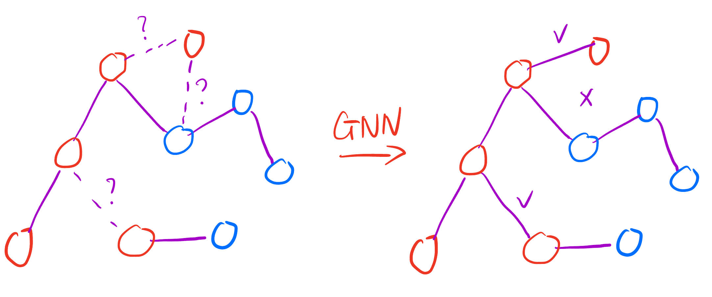

图机器学习还停留在特征挖掘，随着深度学习的迅速发展，端到端的网络需求愈发强烈。图深度学习（GNN）更是传承自而又独立于CV和NLP的存在。如果把GNN看作NLP的一个下游分支，但GNN又能处理图片的信息，如果把GNN归类到CV名下，GNN又很擅长对序列数据进行特征抽取。不过啊，现在这个大模型多模态时代，也都是一家人啦。

在CV中，一般通过多层卷积网络得到feature map作为一个特征；在NLP中，通过transformer模型得到embedding vector作为特征。而GNN，都可以。

## GNN任务

> 任务1. Node Classification

在训练过程中，我们希望通过已有分类的节点，利用他们和未知节点的边的关系，来判断未分类节点的类比。

这个在推荐系统应用非常广泛。用淘宝举例，用户群体A都和产品X建立了收藏加购付款好评的关系，那么如何定位到更多的潜在用户群体A给他们推送产品X呢。

> 任务2. Link Prediction

边的联系预测，假设昨天气压高，湿度高，无风，晚上下雨，今天湿度高，但是大风，不下雨，这个大风是不是导致不下雨的因素呢？

> 任务3. Graph Classification

最常见的应用就是有机化合物的同分异构体，蛋白质分类。

## GNN的难点

- 形式不固定

在CV中，输入一个图像，他都是规律的像素排列，有严格的空间关系；在NLP中，输入一串文本、音频，他也都是规律的序列排列，有着严格的前后关系。但是在图中，这些所有的无论是pixel, series context都不复存在，GNN处理的数据是完全无序的（虽然有向图有一定的指向顺序，但特征的排布仍然无序，例如a -> b -> c -> a和b -> c -> a -> b）。

- 同分异构体

当两幅图的邻接矩阵完全一样时，也可能不一样。

- 可视化

虽然有NetworkX，Gephi这些可视化工具，但是可视化的结果也没有统一格式，不像NLP，CV这种文本，图片的可视化让人轻松看出信息。

## GNN和CNN对比

> 感受野

GNN的感受野：

CNN的感受野：

相信不需要过多描述也能感受这俩的相似之处吧。

> 任务

图像分类：

GNN分类：

图像的语义分割和节点多分类任务也有诸多相似之处。

## GNN应用

正如标题，万物皆可GNN。

> 数学图论

> 物理学

> 计算机视觉

> 自然语言处理

> 数据挖掘

> 交通网络

> 推荐系统

