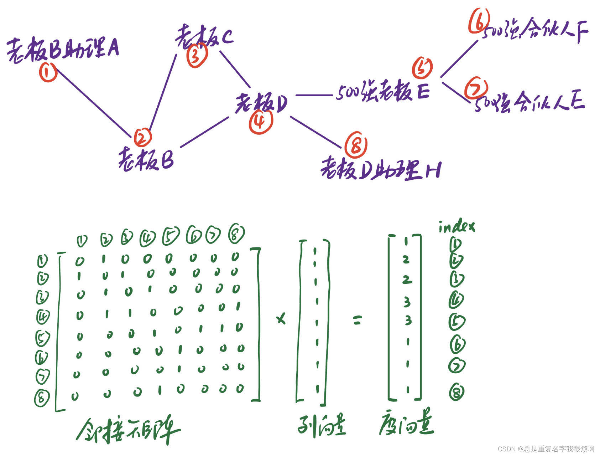
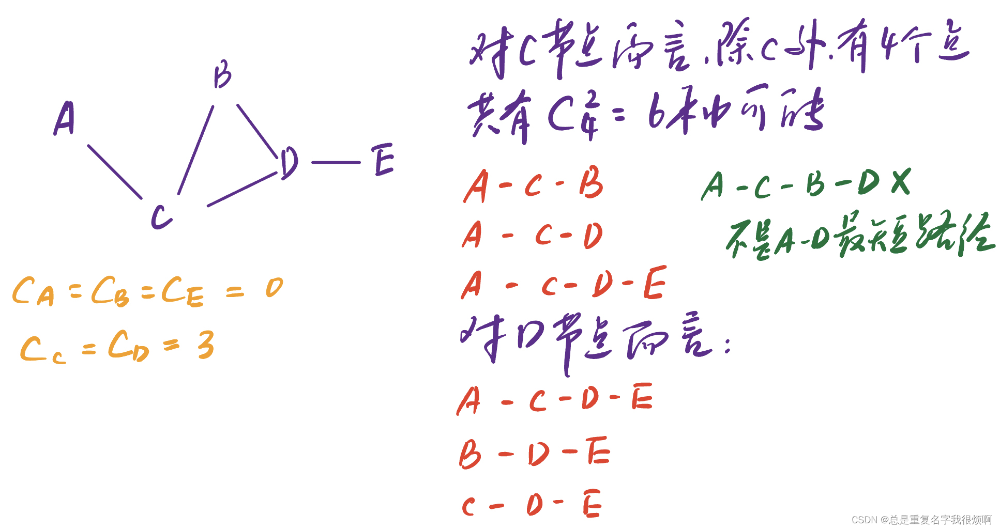
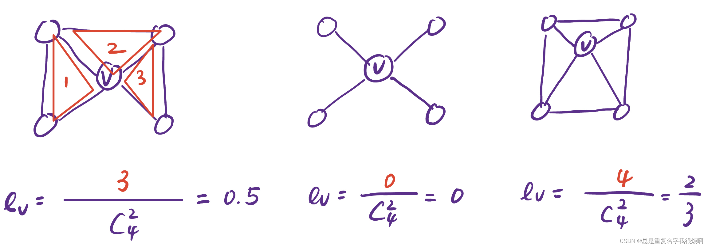
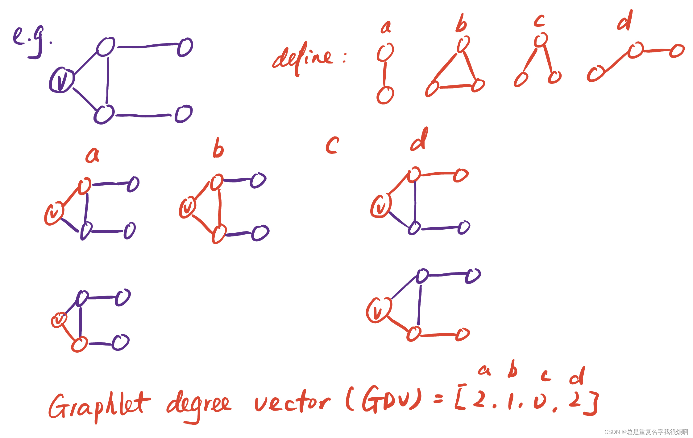
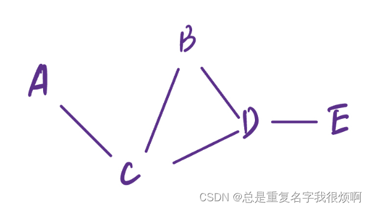
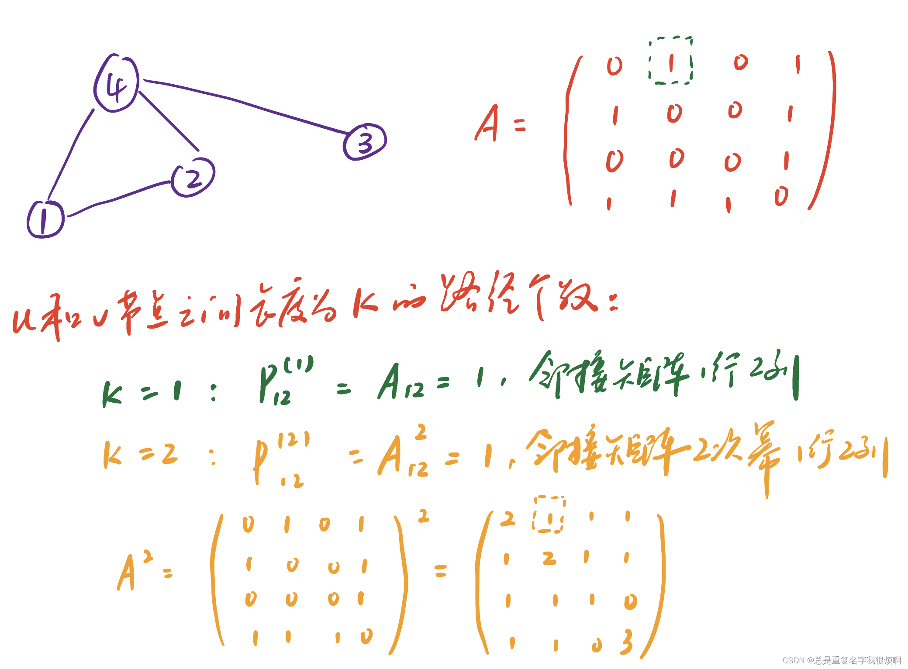
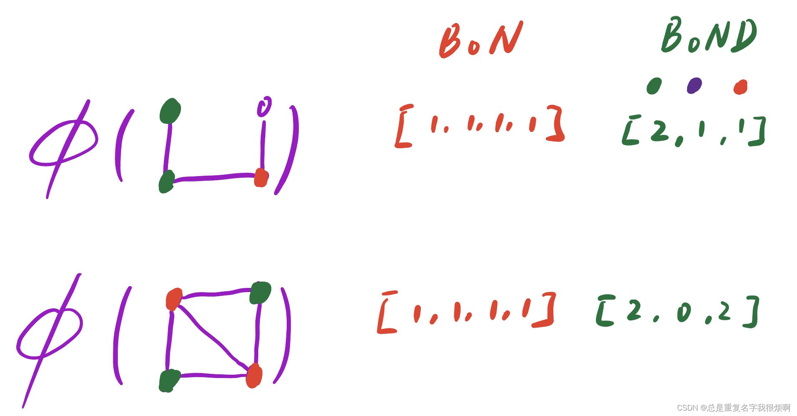
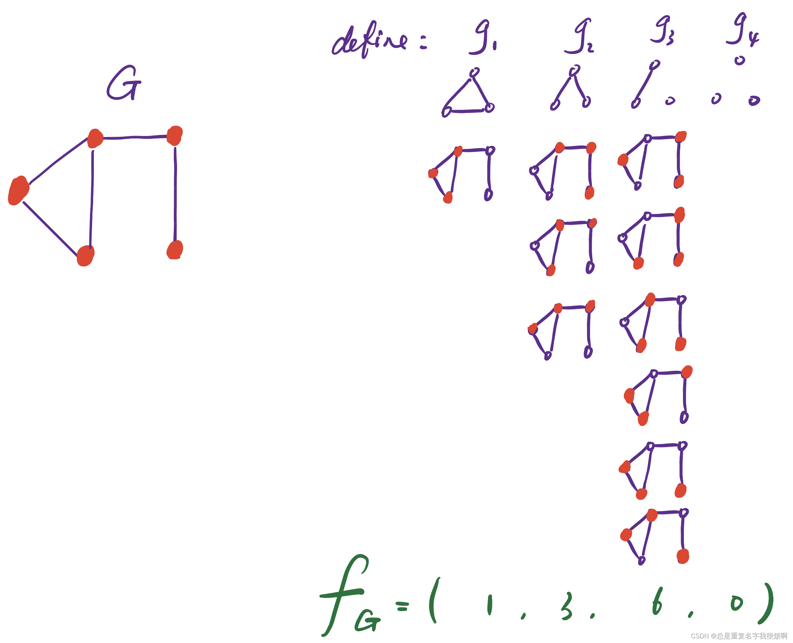
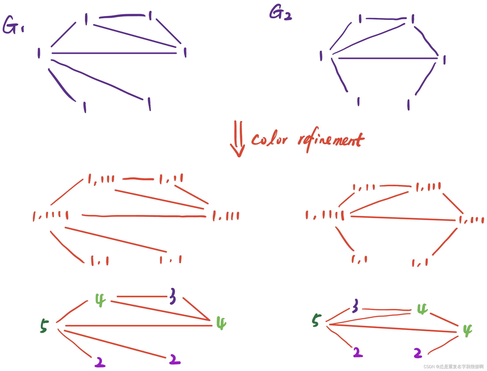

图有三层信息可以写成向量的形式：

- 节点信息

- 连接信息

- 区域信息

但是节点信息包含的属性往往是多模态的形式，例如这个人的头像（图像信息）、个性签名（文本信息）等。但是机器学习对多模态的处理稍显困难，所以传统机器学习主要挖掘节点之间的连接特征信息，例如这个节点在整个社群中扮演什么作用。

> 配套代码[networkx-计算节点特征](graph/nextworkx/node_feature/)

## 如何做图的特征工程（节点层面）
简单来说，这一部分要做的事，就是通过所有的节点信息去猜测未知节点的信息，比如用成都地铁网络所有节点的类别去猜测磨子桥站是否可能是一个地铁站。做法就是把节点信息编辑成一个D维向量，然后导入算法进行计算。
$$G=(V,E)\\
f:V→ \mathbb{R}
$$
输入某个节点的D维向量，输出该节点是某类的概率。这个的关键在于D维向量如何构造。

一般来说，在传统机器学习中可以包含以下四个信息：（1）node degree，度 (2) node centrality，重要性 (3) clustering coefficient，聚集系数 (4) graphlets，子图拆分

### 连接度重要性(node degree centrality)——单一相似

单独用连接度来描述，只能说明单一维度的相似性，并不能涵盖更多信息，例如1和7，明显他们的质量存在差异，但是node degree都是1。所以需要其他重要度指标来进一步描述图信息。（这里的度向量实际上就是node degree centrality）
### 特征向量重要度(eigenvector centrality)——物以类聚

这是一个很常规的思想：如果一个节点和他相邻的节点都很重要，那这个节点也很重要。

我们用$c_v$表示v节点的重要度，此时这个节点的重要度为：

$$c_v=\frac{1}{\lambda} \sum c_u$$其中$\lambda$为邻接矩阵最大的特征值，$c_u$为v相邻的节点重要度。也就是对v相邻节点的重要度求和再标准化，就可以得到v节点的重要度。

那么这个问题就变成了一个经典的递归问题。在这种情况下就可以用特征向量来解决。

$$c_v=\frac{1}{\lambda} \sum c_u \equiv \lambda \bm{c} = \bm{A} \bm{c}$$

这里A是邻接矩阵。我们可以用矩阵的秩来理解这样一个过程。假设v节点和4个节点相邻，对于左侧$\lambda \bm{c}$是一个4x1的矩阵，对于右侧，邻接矩阵A是一个4x4的矩阵，c是一个4x1的矩阵，他们的结果仍然是一个4x1的矩阵。

$$\lambda 
\left[\begin{array}{c}
a  \\
b  \\
c  \\
d 
\end{array}\right]_{4*1} = 
\left[\begin{array}{c}
0\ a_{12}\ a_{13}\ a_{14}\\
b_{11}\ 0\ b_{13}\ b_{14}\\
c_{11}\ c_{12}\ 0\ c_{14}\\
d_{11}\ d_{12}\ d_{13}\ 0 
\end{array}\right]_{4*4} \left[\begin{array}{c}
a  \\
b  \\
c  \\
d 
\end{array}\right]_{4*1}
$$

在这种情况下，$\bm{c}$就是A的特征向量。并且，这个$\bm{c}$就是我们需要求得的eigenvector centrality。

### 间重要度(betweenness centrality)——中心地带

这个重要度指标主要用来衡量这个节点是否处于中心地带。例如五月天北京演唱会，那么五月天肯定处于所有关联的中心。间重要度的计算方式如下：

$$c_v = \sum \frac{共有多少对节点的最短路径经过v}{除v节点之外，两两节点对的数量}$$

用一个例子来更好说明：

通过间重要度可以发现，C和D在整个图处在交通要道的位置，而B虽然和CD相邻，但是B的重要性显然没有CD高。

### 最短路径重要度(closeness centrality)——到哪都近

可以用以下公式计算该重要度。

$$c_v = \sum \frac{1}{节点v到其他节点u的最短路径}$$

同样用上图作为例子。节点A的最短路径重要度为：

$$c_a=\frac{1}{2+1+2+3}=\frac{1}{8}$$

节点路径长度分为是A-C-B（2），A-B（1），A-C-D（2），A-C-D-E（3）

节点C的最短路径重要度为：

$$c_c=\frac{1}{1+1+1+2}=\frac{1}{5}$$

节点路径长度分为是C-A（1），C-B（1），C-D（1），C-D-E（2）

由于$c_c>c_a$，因此c点的重要度会高于a点，这意味着c点离哪都近，a就有点郊区之感。

### 聚集系数(clustering coefficient)——抱团取暖

$$e_v=\frac{v节点相邻节点构成三角形的个数}{v节点相邻节点两两对数}$$

会发现第三个的$e_v$大于第一个$e_v$，说明对于v节点而言，第三个的抱团会更严重一点。这种以一个中心链接出去，连接出去的点又可以构成新的网络，这种网络又可称为自我中心网络。

### 子图向量(graphlet degree vector)
我们可以通过自己定义的一些拓扑结构，来表示节点v的局部邻域拓扑结构。相当于构建了一个直方图，然后对自己定义的节点角色进行一个各自的描述。进一步的，可以用GDV来计算节点的相似度等。若我们定义的节点数量是5个，那么会有73个拓扑结构，这种情况下，GDV是一个73维向量，在这种情况下，节点的拓扑信息描述会更加全面。

## 关于节点重要度的一些思考
无论如何描述节点之间的重要度，始终只能描述节点的图信息，却不能描述节点的属性信息。在这种情况下，即使特征工程做到了最好，也很难实现社群分类，例如存在3个一样的图，他们隶属于朝阳区、海淀区、西城区，通过这样的方式，是很难把他们区分为三类，特征工程做到极致，则他们三个表示的信息越一致，那么划分为一类的可能性就越大。这就是机器学习的弊端。因此，在算力不受限的情况下，尽可能考虑更多维度的信息来描述图，才是最可行的办法。

## 如何做图的特征工程（连接层面）
这一部分，我们需要把节点之间的连接表示成D维向量，通过节点之间的连接信息，实现节点之间未知连接信息的预测和分析。所以关键在于如何抽取这个D维向量。

> 思路一

直接抽取link信息变成D维向量

> 思路二

把link两端的节点信息拼接成一个D维向量

这样的做法其实和之前节点信息挖掘是一样的，会丢失连接结构信息，例如老板A和员工A他们的节点信息无法表示老板和员工这样一个从属关系的连接信息。因此这种方法不推荐。

### 最短路径距离

在这里A到B，B到E和C到E的最短路径长度都是2，但是可以发现，假若C D点是一个权重很高的点，那么A-C-B和A-C-D这两条连接的质量是不一样的。因此只关注距离长度会丢失质量信息。

### 邻域关系

（1）Common neighbors（共同好友个数）。

$$|N(v_1)  \cap N(v_2)|$$

（2）Jaccard's Coefficent（交并比）

$$\frac{|N(v_1)  \cap N(v_2)|}{|N(v_1)  \cup N(v_2)|}$$

以上图为例，AB节点的交集为C，AB节点的并集为CD，那么AB节点的交并比就是$\frac{1}{2}$。

（3）Adamic-Adar index

$$\sum_{u\in{|N(v_1)  \cap N(v_2)|}} \frac{1}{log(k_u)}$$

以上图为例，AB节点的共同好友只有C，此时Adamic-Adar index为$\frac{1}{log3}$。一般来说，如果两个节点的共同好友是一个公共点（类似社牛或者海王），那么这两个节点的连接就并没有那么牢固，比如小明和小红都在四川大学，那么小明和小红不一定产生太大的交集。反过来，如果两个节点的共同好友是一个社恐，例如小明和小红都认识课题组的小王。那么小明和小红之间产生关系的连接就会强一些。此时如果小王是一个深居简出，常年住在实验室的人，那么小明和小红大概率情比金坚了。

### Katz Index

假如两个节点没有共同好友，那么这个时候共同好友个数、交并比都是0，但实际上这两个节点可能存在一定的联系。因此在这种情况，需要看全图信息。往往用卡姿系数(Katz index)来表示，他表示节点u和节点v之间长度为k的路径个数。可以用邻接矩阵的幂来计算katz index。

proof：
$$P_{uv}^{(2)}=\sum_i A_{ui}*P_{iv}^{(1)}=\sum_i A_{ui}*A_{iv}=A_{uv}^{2}$$
理解：
$A_{ui}$表示与u节点隔1步邻居i，$P_{iv}$表示i是否与u隔1步。还是用12号节点举例，此时u=1，v=2，$A_{1i}$表示的是与1号节点隔一步的节点，也就是2和4号节点，邻接矩阵里就是[0 1 0 1]第一行行向量，$P_{i2}$在1阶是等价于$A_{i2}$的，邻接矩阵里就是[1 0 0 1]第二列列向量。在这里，i和u隔1步，i和v隔1步，实际上就是u和v隔了2步。

继续证明：
$$P_{uv}^{(2)} \equiv A_{uv}^{2}\\ P_{uv}^{(3)}=\sum_i A_{ui}*P_{iv}^{(2)}=\sum_i A_{ui}*A_{iv}^{2}=A_{uv}^{3}\\……\\P_{uv}^{(l)}=A_{uv}^{l}$$

进一步，可以把这个长度加到无穷大（1，2，3，……，∞）。那么节点v1和v2的所有路径长度之和个数为：
$$S_{v_1v_2}= \sum_{i=1} \beta ^i A_{v_1v_2}^i$$

这里，$\beta$是一个折减系数，通常$0<\beta<1$。长度越大，折减的就越厉害。

实际上，$S= \sum_{i=1} {(\beta A)}^i$就是一个等比数列求和，可以用几何级数展开。

$$S= \sum_{i=1} {(\beta A)}^i=(I-\beta A)^{-1}-I$$

对这个公式进行一个证明：

$$(I+S)(I-\beta A)\\
=(I+ \beta A +  \beta ^2A^2+\dots+ \beta ^nA^n)(I- \beta A)\\
=I+ \beta A +  \beta ^2A^2+\dots+ \beta ^nA^n-( \beta A +  \beta ^2A^2+\dots+ \beta ^{n+1}A^{n+1})\\
=I$$

因此：

$$S=(I-\beta A)^{-1}-I$$

## 如何做图的特征工程（全图层面）

### 从BoW到BoN
这部分需要提取一个D维向量来描述整张图的特点。在NLP没有进入transformer时期，还在机器学习的阶段（N-Gram），面临同样的问题，就是如何把文字文本信息转化为向量信息输入到计算机中。这时有一个非常伟大的思想提出(bag-of-words,BoW)。这个思想的核心就是，统计一段文本中某一个词或者字出现的次数，然后编码成向量形式，例如，“我爱你你爱他”，这句话我和他出现了1次，爱你出现了2次，那么这句话就可以被编码成[1,2,2,2,2,1]。当然，这种编码方式粗糙且问题很多，并且也没有考虑分词，存在很多问题，但是这个思想实现了文本信息向张量信息转换的关键一步。顺便推销一下之前的文章，如果想进步一了解NLP相关内容，可以翻阅我blog里NLP系列文章[NLP从零开始](https://blog.csdn.net/D_Ddd0701/article/details/122506622?spm=1001.2014.3001.5502)。

基于BoW的思想，我们可以把图的节点看做单词，提出一个bag of nodes(BoN)的思路。

$$\phi (G_1) = [nodes1 \ number, nodes2 \ number, \dots ]$$

当然，这种思路也有很多弊端，最致命的一点，他只有节点信息，没有连接信息，所以需要在这个思想上进一步升级。

### 从BoN到BoND
只看node degree个数，不看节点不看连接个数。

如果用BoN的思想，则两张图的向量表示是一样的，每个点都只出现了一次（4个节点均不相同），若用BoND的思想，则可以区分出这两张图。

### BoG（bag of graphlet）

这个时候，如果把两个图的$f_G$做数量积，即$K(G,G')=f_G^T f_{G'}$，即可反应出这两张图的相似度。当然，如果两张图的数量差异非常大，例如一个是北京地铁网络，一个是阿里地区车流网络，那么即使相似，这个数量积也非常大。因此，一般需要对$f_G$做一个归一化处理。

$$h_G=\frac{f_G}{\sum f_G}\\
K(G,G')=h_G^T h_{G'}$$

但是如果真有一张巨大的节点数为n的网络图，做这一个k-size的子图匹配计算是非常不划算的，因为需要对全图的节点做子图匹配，计算复杂度是$n^k$

### BoC（Weisfeiler-Lehman Kernel）
这是一个基于颜色微调(color refinement)的方法。

假设初始节点是1，那么经过color refinement和hash map过程，可以变成最下方的形式。在这种情况下，1,1对应2，1,11对应3，1,111对应4，1,1111对应5。当然，这幅图可以重复这个过程，再重复一次，2,4对应6，2,5对应7，3,44对应8以此类推。然后就可以把图变成一个13维向量。

对于左侧的图：[6,2,1,2,1,0,2,1,0,0,2,1,0]

对于右侧的图：[6,2,1,2,1,1,1,0,1,1,1,0,1]