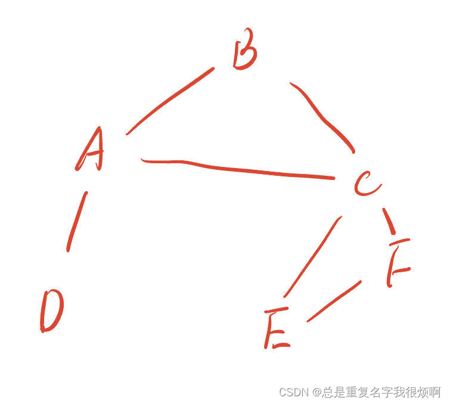
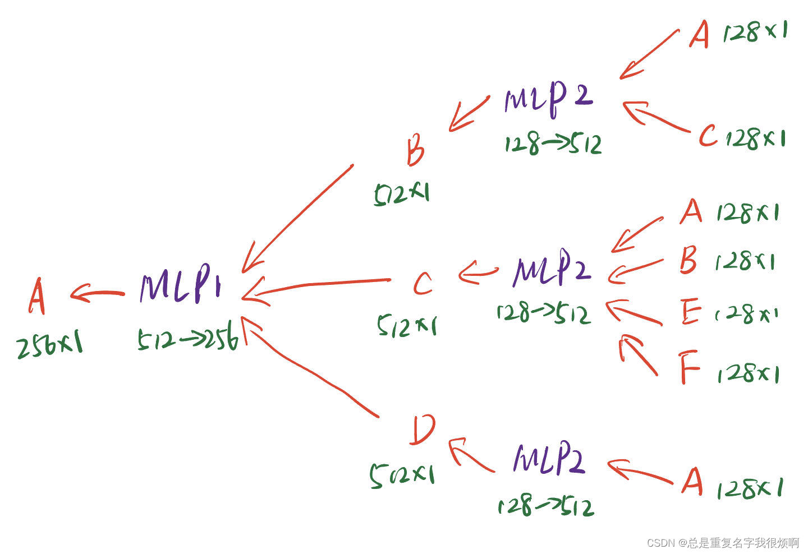
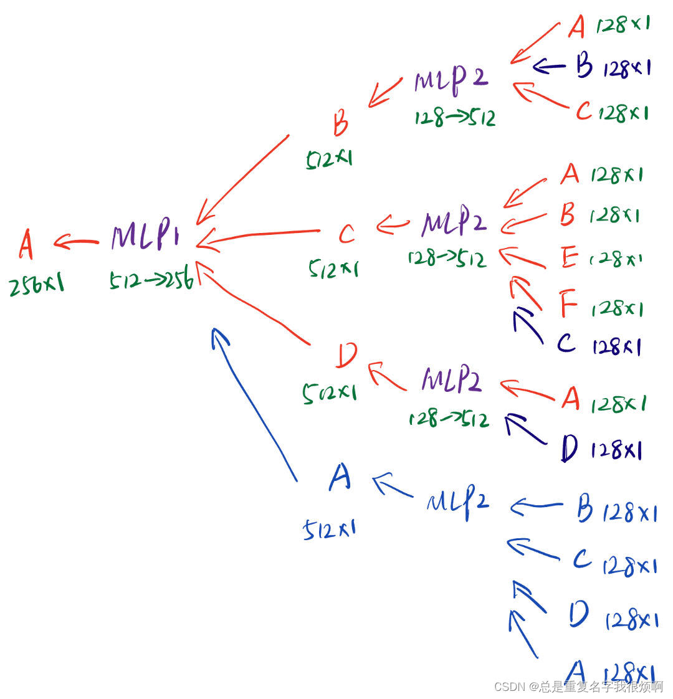

> 配套代码[空手道俱乐部GCN](graph/pyg/karate/)，[论文引用数据GCN](graph/pyg/inf_paper/)

## 最基础的图神经网络

在这部分，需要默认你对深度学习有最基础的认知，包括全连接线性网络（MLP基础）、常见的卷积网络（CNN基础）、常见的序列网络（RNN基础）等，不需要深入了解，但是需要明白常见的概念。从发展的角度看，最开始人们希望通过MLP，CNN和RNN的方式去实现图信息挖掘，但是直接搬过来的“拿来主义”并不能起到特别好的效果，这是因为图信息在某种程度上并不是一个一维数据，例如A->B->C，反过来C->B->A也有一定道理。在RNN中有双向RNN网络，可是图的信息又不完全呈线性。所以图神经网络核心思想，是在深度学习发展长河的基础上，加入前文提到的节点嵌入和信息传递实现。

具体的，假如这里有一张网络：



首先，根据词嵌入，我们可以整合节点的特征信息成一个固定维度的稠密向量；根据消息传递，A节点可以由B C D节点推断得到。同理，B节点可以由AC节点推断得到。如果要预测A节点，则只需要把BCD节点的信息融合放到一个MLP中，而BCD节点的信息可以通过他们的相邻节点通过一个MLP完成消息传递：




这是一个两层的图卷积网络示意。在进行信息融合的时候，通常采用平均，这样的好处是不限制输入顺序（这就一定程度上解决了A-B-C和C-B-A的尴尬），并且计算也比较简单，当然也可以换其他的方法，只要不限制顺序并且实现融合就是可行的。在每一层中，MLP是共享的。**这就是最基础的图卷积网络。**
它的数学表达如下：

1、最开始输入的是它的属性特征：

$$h_v^{(0)}=x_v$$

2、进行平均过程：

$$h_v^{(k+1)}=\sigma (W_k \sum_{u \in N(v)} \frac{h_u^{k}}{|N(v)|})$$

这里表示k+1层v节点的嵌入是由k层v节点的邻域节点u算出来的。首先找到v节点所有的邻居节点，例如C节点，就是ABEF四个节点，然后把ABEF四个节点上一层的嵌入求和再除以连接数4个，本质上就是求平均过程（$\sum_{u \in N(v)} \frac{h_u^{k}}{|N(v)|})$）。然后新得到的向量输入到MLP网络中（$W_k \sum_{u \in N(v)} \frac{h_u^{k}}{|N(v)|}$），因为MLP网络本质上就是一个矩阵乘法，是一个权重再计算的过程，因此Wk表示的是MLP的权重矩阵。然后再加一个激活函数ReLU、tanh、Sigmoid等（$\sigma (W_k \sum_{u \in N(v)} \frac{h_u^{k}}{|N(v)|})$）。

3、最终得到输出结果：

$$z_v=h_v^K$$

这里的K就是计算网络的层数，例如上图，K就等于2。那么输出的结果就是第二层的输出结果。

为了更方便计算，用矩阵表示如下：

再节点嵌入后，可以得到一个$\Phi$表用来储存嵌入的向量。我们用H矩阵来表示这样一张表，H矩阵里每一个元素表示某一行的嵌入向量。

$$H^{(k)}=[h_1^{(k)} \dots h_{|V|}^{(k)}]^T$$

我们知道邻接矩阵储存了节点邻接节点的信息。因此我们可以左乘v节点的邻接矩阵，选出v节点邻接节点的嵌入向量并完成求和。

$$\sum_{u \in N_v}h_u^{(k)}=A_vH^{(K)}$$

求平均的过程只需要除以连接数，Degree matrix正好储存了我们想要的信息。这样，上面复杂的求平均表达式用矩阵可以轻松表达：

$$\sum_{u \in N(v)} \frac{h_u^{k}}{|N(v)|})=D^{-1}A_vH^{(K)}$$

这里的$D^{-1}A$被称作标准化行矩阵（Row Normalized Matrix），它的最大特征值为1。

还是用上图举例，用代码一步一步算一下，更加形象地展示过程：

```python
import numpy as np
from scipy.linalg import fractional_matrix_power

# 创建A节点的邻接矩阵A
A = np.mat('0,1,1,1,0,0;1,0,1,0,0,0;1,1,0,0,1,1;1,0,0,0,0,0;0,0,1,0,0,1;0,0,1,0,1,0')

# 创建Degree Matrix D
D = np.mat('3,0,0,0,0,0;0,2,0,0,0,0;0,0,4,0,0,0;0,0,0,1,0,0;0,0,0,0,2,0;0,0,0,0,0,2')

# D 1/2
D_halg = fractional_matrix_power(D, 0.5)

# D -1/2
D_half_neg = fractional_matrix_power(D, -0.5)

# 计算Row Normalized Matrix
A_row = np.matmul(D**(-1),A)
>>matrix([[0.      , 0.33333333, 0.33333333, 0.33333333, 0.        ,0.        ],
        [0.5       , 0.        , 0.5       , 0.        , 0.        ,0.        ],
        [0.25      , 0.25      , 0.        , 0.        , 0.25      ,0.25      ],
        [1.        , 0.        , 0.        , 0.        , 0.        ,0.        ],
        [0.        , 0.        , 0.5       , 0.        , 0.        ,0.5       ],
        [0.        , 0.        , 0.5       , 0.        , 0.5       ,0.        ]])
```
在这里先暂停。我们已经计算得到了A的Row Normalized Matrix，但是可以发现这样实际上是一个简单粗暴的计算，只是单纯的按照自己的度，对所有渠道来的信息强行求平均，没有考虑到信息传递的权重。例如B是一个诺奖得主引用了A的论文，D只是A的一个研究生，那显然B对A的权重会极大于D。因此，这里可以使用之前C&S部分使用过的混淆矩阵标准化方法（$\widetilde{A}$）：

$$\widetilde{A}_{sym}=D^{-1/2}AD^{-1/2}$$

这个矩阵在很多论文都有提到，常见的有这三种表达：Normalized Adjacency Matrix，Normailized Diffusion Matrix, Symmetric Normalized Matrix，如果看到类似的表达记得反应过来，就是这个$\widetilde{A}$矩阵。
```python
A_sym = D_half_neg @ A @ D_half_neg
matrix([[0.        , 0.40824829, 0.28867513, 0.57735027, 0.        ,0.        ],
        [0.40824829, 0.        , 0.35355339, 0.        , 0.        ,0.        ],
        [0.28867513, 0.35355339, 0.        , 0.        , 0.35355339,0.35355339],
        [0.57735027, 0.        , 0.        , 0.        , 0.        ,0.        ],
        [0.        , 0.        , 0.35355339, 0.        , 0.        ,0.5       ],
        [0.        , 0.        , 0.35355339, 0.        , 0.5       ,0.        ]])
```

使用对称矩阵，既考虑了自己的度，也考虑了对方的度，并且最大特征值为1，不会产生梯度消失（证明过程参考C&S章节）。

至此，最开始的公式可以进一步优化$\sum_{u \in N(v)} \frac{h_u^{k}}{|N(v)|}$:

$$\sum_{u \in N(v)} \frac{h_u^{k}}{|N(v)|} = \widetilde{A}_{sym}H^{(k)}=D^{-1/2}AD^{-1/2}H^{(k)}$$

在GCN论文中的经典公式也就非常容易理解：

$$H^{(l+1)}=\sigma (D^{-1/2}AD^{-1/2}H^{(l)}W^{(l)})$$

即，第l+1层的隐向量等于l层的隐向量左乘一个$\widetilde{A}$再过一个MLP的权重，再经过一个激活函数。

## 计算图的改进

在基础的GCN网络中，A的隐向量是他的邻域节点计算得到，但实际上能够表示A信息最好的，就是A他本身。所以可以在第每层加入自己本身的向量进行融合。



在计算B的时候加入了B，在计算C的时候加入了C，在计算D的时候加入了D，另外额外增加了A本身。在这种情况下，邻接矩阵需要做相应的调整：

$$\widetilde{A} = A + E$$

即，之前为0的主对角线元素全部加1。这就是图卷积网络发展到目前的最终形态。

这里的$\widetilde{A}$也就是论文里提到的：

$$H^{k+1} = \sigma (\widetilde{D}^{-1/2} \widetilde{A} \widetilde{D}^{-1/2} H^kW^k)$$

$$H^k_i=\sigma (\sum_{j\in\{N(i)\cup i\}} \frac{\widetilde{A}_{ij}}{\sqrt {\widetilde{D}_{ii}\widetilde{D}_{jj}}}H_j^{k-1}W^k)$$

下面这个公式实际上就是换了个写法，因为如果i和j节点相连，那么他们的$D^{-1/2}$其实就是取倒数再开根号，下面的表示形式。

当然还可以再优化，对于自己信息MLP融合而来的信息可以用一套权重$B_k$，其他的用一套权重$W_k$。

$$H^{(k+1)}=\sigma ({D}^{-1/2}A{D}^{-1/2}H^{(k)}W_k^T+H^{(k)}B_k^T)$$

## GCN损失函数

由于在其他文档并没有整理这部分内容，所以在这里做一个小小的整理。

### 回归问题：L2损失函数 & 分类问题：交叉熵损失函数

论文中经常提到一个词叫Objective function，这就是目标损失函数。一般化的表达是：

$$min \ \mathcal L(y,f(x))$$

即最小化预测值和真实值之间的差异。

如果是最简单的回归问题，我们可以用最简单的L2 loss。

$$\mathcal L (y,f(x))=||y-f(x)||_2$$

分类问题最常用的是交叉熵损失函数（corss entropy）。这个在某度，某团，某巴巴的算法岗面试是重灾区。

交叉熵的计算公式是：

$$CrossEntropy=-y_ilogP_i$$

其中$y_i$是真实标签值，$P_i$是预测概率值。

|训练样本集编号| 类型| 猫|狗|马|猪|交叉熵|
|--|--|--|--|--|--|--|
|1 | 标签| 0|1|0|0|-log0.6|
|1 | 预测| 0.2|0.6|0.1|0.1|
|2 | 标签| 0|0|1|0|-log0.3|
|2| 预测| 0.1|0.5|0.3|0.1|
|3 | 标签| 1|0|0|0|-log0.7|
|3| 预测| 0.7|0.1|0.1|0.1|

我们希望这三个样本都可以预测正确，他的理论概率$P=0.6*0.3*0.7=0.126$。很显然，P越大，预测的结果越好，模型也越好。

当然，当样本数量非常庞大，我们把这些概率连乘起来就会很小，因此往往用对数来表示。

$$logP=log0.6+log0.3+log0.7$$

在数学上，我们并不希望最大化一个优化函数，而希望最小化一个损失函数。我们希望logP最大化，实际上等价于希望-logP最小化。

### 训练GCN

有监督学习，可以参考其他有标注模型，计算交叉熵即可。在这里GCN的交叉熵损失函数表示如下：

$$\mathcal L=\sum_{v \in V}y_vlog(\sigma(z_v^T\theta))+(1-y_v)log(1-\sigma(z_v^T \theta))$$

这里的$\theta$是分类预测头的权重参数，$y_v$是节点标签类别，$z_v^T$是节点嵌入向量。

## 图注意力机制

在NLP和CV中有一个非常著名的概念，叫做注意力机制。并且目前主流的顶分算法（NLP中的Transformer架构的GPT BERT等，CV中的MAE等）都能发现注意力机制的身影。所谓注意力机制，即通过某一种计算规则，可以发现输入的繁琐信息中哪些信息重要，哪些信息不重要，进而有偏有侧重的进行学习。

在图中，无非是发现哪些节点的连接重要。

GCN计算的通常方法：

$$h_i=\sigma(\sum W*h_j)$$

即，假设5个节点，每个节点嵌入维度为3，引入一个可学习的[3，8]的矩阵，则可以把嵌入信息更新为一个[5，8]矩阵。那么在这个基础上引入一个权重项即是注意力机制。

$$h_i=\sigma(\sum \alpha_{ij}W*h_j)$$

实际上，就是对邻接矩阵进行重构。最初，邻接矩阵都是1，代表每条边的权重一样。通过一个加权处理，实际上就可以计算得到不同的权重。$\widetilde{D}^{-1/2} \widetilde{A} \widetilde{D}^{-1/2}$本质上也是一种注意力机制。

## 图神经网络相比较传统方法的优点

DeepWalk，Node2Vec，PageRank的优化目标是一个$\Phi$表，每次都需要维护这么一个庞大的编码表，工作量和参数量都非常大，并且这种直推式学习无法泛化到新节点，神经网络这种归纳式学习，可以泛化到新节点。

具体而言，在DeepWalk中，假如加入了一个新节点，虽然不需要全图重新训练，但是仍然需要增量训练。而图神经网络可以瞬间获得新节点的计算图，直接得到节点向量。此外，DeepWalk这种受到步长限制，对于长距离节点的关系捕捉不够敏锐，而神经网络可以捕捉长距离关系。

对于神经网络，最大的优点在于可以使用属性特征，可以用标注信息，实现多模态的计算。这是传统学习方法鞭长莫及的。