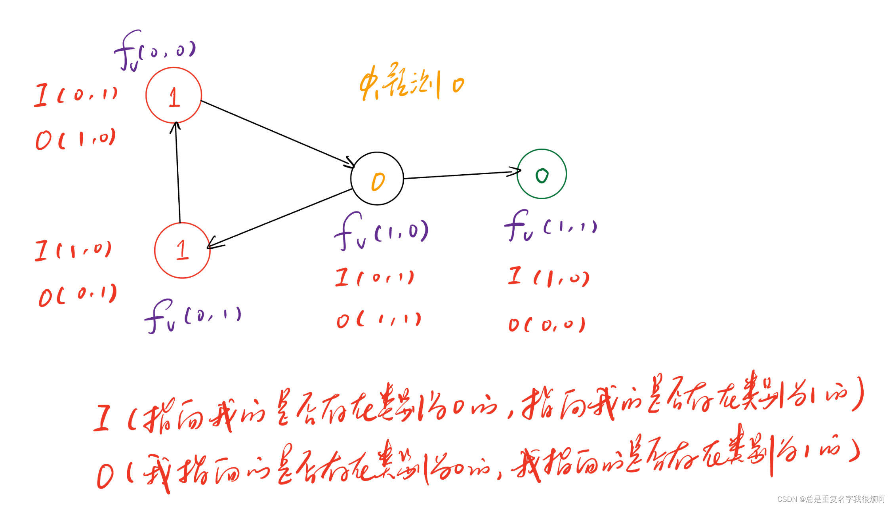

这部分是图学习向图深度学习过度的部分。在图深度学习的相关论文中，经常可以看到半监督学习（semi-supervised node classification）出现在里面（当然，出现的原因就是因为被新的算法吊打）。所以作为一个论文出现的常客，在这里依然做一个梳理。

首先构建这样一个场景。假设知道了ABC和LMN六个节点的属性，例如ABC承担功能x，LMN承担功能y，那么EFGHIJK节点他们的功能是什么呢？如何利用ABC和LMM这样有标签的节点去推理得到未知节点的标签，就是半监督节点分类想要完成的东西。

至于为什么GNN论文经常出现它的身影，我想主要是因为他们的工作目的是类似的，但是工作方式完全不同。具体体现在，半监督学习依然属于机器学习范畴，它是一种根据已知推理未知的预测方式；深度学习则是直接把预测节点的信息丢进网络跑一次前向传播，即可自动分类，这是一种归纳式的学习。

作为机器学习，绕不开的就是特征向量。通过之前的内容，我们知道可以通过人工特征工程和图嵌入来实现。在这里，它使用的是第三种思路，标签传播（信息传递），它甚至根本不需要图嵌入，不需要表示学习，只利用节点的属性特征就可以进行。第四种方式则是深度学习。

在正式开始之前，有必要做一个直观的对比。

- 人工特征工程：通过数学计算得到节点重要度、集群系数、拓扑结构等，并且揉成一个向量作为特征表示；
- 随机游走方法：代表算法有DeepWalk，Node2Vec，LINE，SDNE等。构造自监督表示学习模型（skip-gram）实现图信息的融合。无法泛化到新节点。
- 标签传播：代表算法有Label Propagation，Iteratinve Classification，Belief Propagation，Correct & Smooth等。假设物以类聚、人以群分。利用邻域节点类别猜测当前节点类别。无法泛化到新节点。
- 图神经网络：代表算法有GCN，GraphSAGE，GAT，GIN等。利用神经网络构造邻域节点信息聚合计算图，实现节点嵌入，可泛化到新节点。

因此，基于标签传播的半监督学习其实是独立于其他存在的一个“异类”。回到所谓标签传播，其实就是类似的节点会聚集出现，例如我们俩都喜欢玩王者荣耀，那我们俩作为游戏群体的节点会挨的比较近。这个时候有个人在我们俩附近，那他大概率也喜欢玩王者荣耀。

## 标签传播算法
配套代码：[NetworkX社群检测](graph/netxworkx/community/)

我们先假设一个节点二分类问题。即节点存在0和1两种类别。对于未知节点，我们标记为0.5。


此时，若要更新3的类别：

$$P_3=（P_4+P_1+P_2）/3=0.17$$
更新了3之后，4也可以更新为：

$$P_4=（P_1+P_3+P_5+P_6）/4=0.42$$

一次类推，可以把整张图都更新一次：


接下去可以更新多轮，当数值波动小于0.01则认为收敛，最终结果：


我们可以认为大于0.5为1类，小于0.5为0类。这样就完成了消息传递的分类。可以发现，4号节点介于0和1之间，是最摸棱两可的，其他节点的结果都非常偏向于聚类结果。当然，如果这里的连接有权重，可以加权计算，过程一样。

但是这个算法存在如下问题：

- 不保证收敛。实际上，我们在进行这样（加权）计算的时候，就是不断的左乘邻接矩阵，如果邻接矩阵的特征值不在-1到1之间，那么结果就会发散。线代知识：对于对称矩阵和非对称矩阵中的可对角化对阵，最大奇异值（特征值）在-1到1之间，连续幂乘是收敛的，反之是发散的。
- 只用到了连接信息，没有用到节点的属性特征。

## Iterative Classification（ICA算法）
由于标签传播特征没有用到节点的属性特征，因此可以进一步优化。ICA算法的核心思路是，把节点的属性特征用$f_v$向量表示，连接属性用$z_v$向量表示。至于这里的$z_v$如何表示，就是完全人工设定了，可以用邻接矩阵，可以用邻接节点最多类别的数量，可以用邻接节点的类别等等。接着用两个学习器$\phi_1 \phi_2$分别学习。其中$\phi_1$只使用节点的属性特征，$\phi_2$除了使用节点属性特征，还使用连接特征。

第一步：对于已标注好的节点训练$\phi_1$和$\phi_2$

第二步：用$\phi_1$训练未知节点得到$Y_v$，由于得到$Y_v$，因此可以计算$z_v$，再把$f_v$和$z_v$放到$\phi_2$学习器进行学习得到$\phi_2$预测的$z_v$。

第三步：把更新得到的$z_v$放到$\phi_2$学习器学习预测得到新的$Y_v$，再用更新好的$Y_v$放到$\phi_2$再次更新$z_v$周而复始直到收敛。

举个例子说明：


这里$\phi_1$训练出来的决策边界可能如由上图所示，此时中间节点会划分到0类，但如果中间节点是1类，那就错了。而且只靠$\phi_1$这个基学习器很难修正。因此需要引入$z_v$。

首先，我们用$\phi_1$预测的0类，计算得到$z_v$。



然后，基于$f_v$和$z_v$，我们用$\phi_2$预测，并且更新$f_v$和$z_v$


这个时候就能预测到1这个分类结果。
当然，这个算法也不能保证收敛，依然使用人工特征工程，相较于消息传递，只是考虑了更多的信息。也算是一个进步。

## Correct & Smooth（C&S，一种后处理方法）

在节点预测时，通常遵循以下步骤：

第一步、训练一个基分类器。在已经有类别标注的节点上训练一个基础分类器，分类器不指定用什么，只要是一个分类的机器学习模型都可以。

第二步、用基分类器预测所有节点的预测结果。

至此，输出的结果，假如是一个二分类，那么就是(0.66,0.34)这样的一个二维向量，分别表示不同类别的概率。然后选择概率高的作为预测结果。但是C&S在这里进行了一些trick。

### Correct

C&S把分类器输出的结果称作soft labels，我们举个例子：


在这里，6和8号节点，就属于比较模棱两可，分类器出错概率较大。5 7 9则看上去稳妥很多。之前提到过物以类聚人以群分的思想，在图网络中，这些摸棱两可的节点往往也是呈现一定聚集分布。以8号节点为例，如果0.6的概率是第二类，那么错误的概率则是0.4，C&S想要做就是让错误更加均匀的分布在各个节点，即分散不确定性和困惑度，把错误率大的节点分一些给错误率小的，或者把错误小的匀一些给错误大的容错。具体做法 如下图：


假设12已知2类，67已知是1类，那么可以得到他们的初始错误矩阵E0（Initial Training Error Matrix）。接下来，有点类似PageRank，就要把这个矩阵削峰填谷，分配到其他节点上，t+1时刻的错误是t时刻和t时刻传播过来的错误共同决定的：

$$E^{(t+1)}⬅(1-\alpha)\cdot E^{(t)}+\alpha \cdot \widetilde{A} E^{(t)}$$

当$\alpha$为1的时候，就是PageRank不考虑死胡同和黑洞情况下，连续迭代左乘M矩阵的算法，考虑$\alpha$时，则类似Label Propagation为了满足Column Stochastic矩阵，改写M矩阵的形式，可以翻到上面PageRank部分对照学习。

因此，首先需要计算一个标准化的混淆矩阵$\widetilde{A}$（Normalized diffusion matrix）：

$$\widetilde{A} \equiv D^{-1/2}AD^{-1/2}$$

这里的D是degree matrix，除了主对角线外所有元素都是0，主对角线元素表示节点的连接度。这里的A是邻接矩阵，如果要考虑自己对自己的影响，主对角线为1即可。

这样的标准化混淆矩阵是有诸多好处的，与PageRank一样，最直观的好处在于，标准化后，特征值范围为[-1,1]，连续迭代左乘$\widetilde{A}$矩阵后不会发散。

并且$\widetilde{A}$的最大特征值始终为1，证明过程如下：

$$\widetilde{A}D^{1/2}1=D^{-1/2}AD^{-1/2}D^{1/2}=D^{-1/2}A1=D^{-1/2}D1=1\cdot D^{1/2}1$$


经过三轮迭代后，可以发现错误已经被传播开。接下来只需要把这个错误矩阵加权，和之前的预测结果做一个加和即可，这里取加权2：


```python
# 计算代码
import numpy as np

A = np.array([
    [0,1,1,1,0,0,0,0,0],
    [1,0,1,0,0,0,0,0,0],
    [1,1,0,1,0,0,0,0,0],
    [1,0,1,0,1,1,0,0,0],
    [0,0,0,1,0,1,1,0,0],
    [0,0,0,1,1,0,0,1,0],
    [0,0,0,0,1,0,0,1,1],
    [0,0,0,0,0,1,1,0,0],
    [0,0,0,0,0,0,1,0,0]
])

D = np.array([
    [1/3,0,0,0,0,0,0,0,0],
    [0,1/2,0,0,0,0,0,0,0],
    [0,0,1/3,0,0,0,0,0,0],
    [0,0,0,1/4,0,0,0,0,0],
    [0,0,0,0,1/3,0,0,0,0],
    [0,0,0,0,0,1/3,0,0,0],
    [0,0,0,0,0,0,1/3,0,0],
    [0,0,0,0,0,0,0,1/2,0],
    [0,0,0,0,0,0,0,0,1/1]
])

E = np.array([
    [-0.05, 0.05],
    [-0.3,0.3],
    [0,0],
    [0,0],
    [0,0],
    [0.4,-0.4],
    [0.05,-0.05],
    [0,0],
    [0,0]
])

# 计算normalized diffusion matrix
dm = np.dot(np.dot(D**(0.5),A),D**(0.5))

# 迭代三次计算：
E0 = E
E1 = 0.2 * E0 + 0.8 * np.dot(dm, E0)
E2 = 0.2 * E1 + 0.8 * np.dot(dm, E1)
E3 = 0.2 * E2 + 0.8 * np.dot(dm, E2)
```

### Smooth
Smooth过程和Correct唯一的区别在于把E矩阵改成了Correct之后的Z矩阵，即上图。但是把已知节点的类别用真实标签代替。
 
