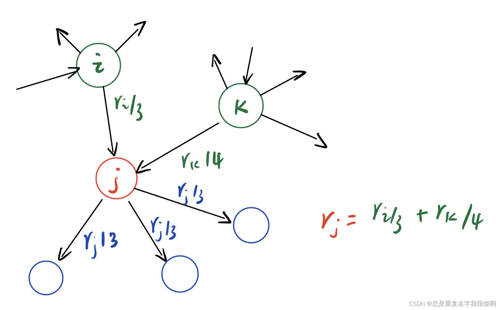
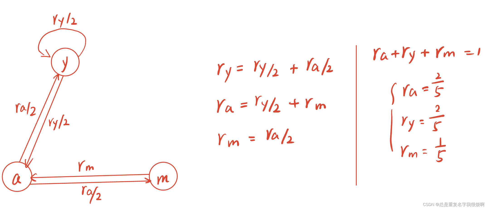
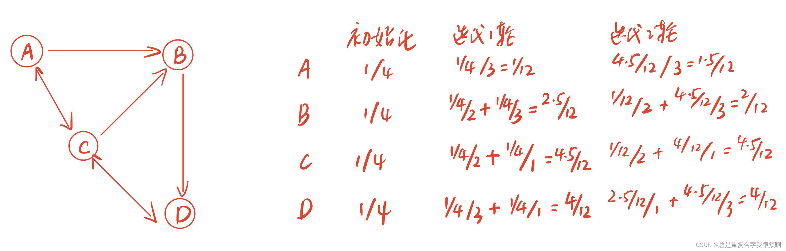
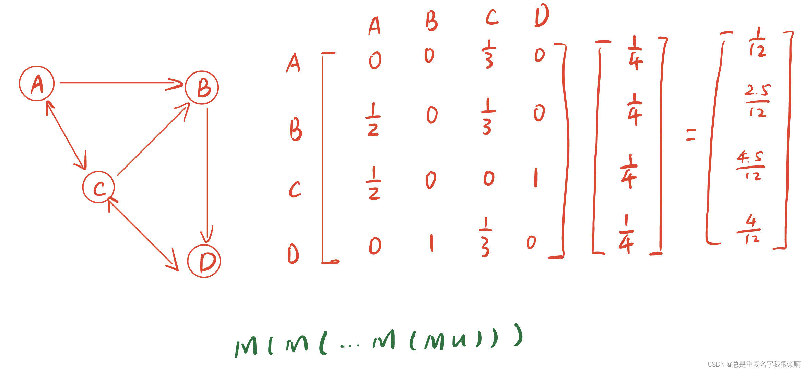
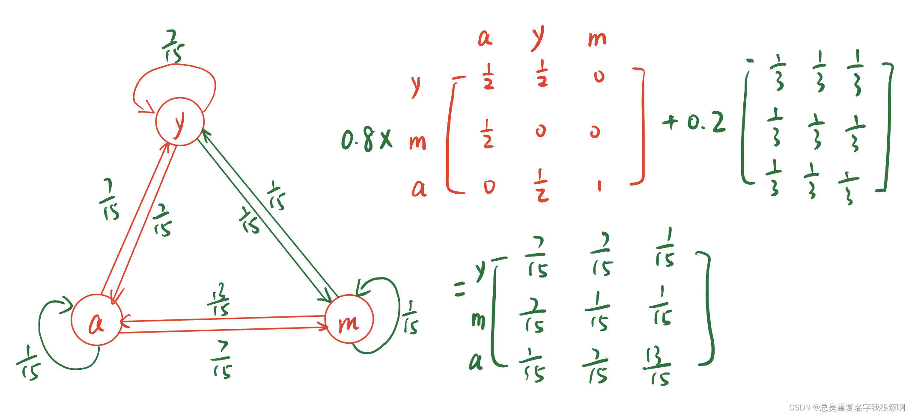

> 配套代码[networkx-计算节点特征-pagerank](graph/nextworkx/node_feature/)

## 迭代求解线性方程组
PageRank中有一个很重的概念，叫做出入度。用一个通俗的例子解释，A写论文引用了B的文章，那么A->B就构成了一条指向关系。对于B，A就是一个入方向；对于A，B就是一个出方向。在这种概念前提下，可以把节点的重要度用一个传递的方式进行表示。假设A和B同时引用了C的文章，那么C的重要度就应该是A和B共同贡献的。用下图做一个具体计算示例：

计算j节点的PageRank值，需要通过指向j节点的i和k节点。由于i一共有3条指向别人的边，k一共有4条，因此j的重要度计算为：
$$r_j=\frac{r_i}{3}+\frac{r_k}{4}$$

在论文中有这么一个例子：

用同样的方法可以得到ry，ra，rm的计算表达，但是为了计算，需要规定ra+ry+rm=1这样一个前提条件（高斯求解）。这样，节点的重要度就变成了线性方程组的求解问题（n元一次方程组）。但是如果这个图很大，有数千万上亿的节点，每一个节点都要这么计算，那么计算量大不说，同样不具备可拓展性，即每次都需要重新统计，这也是PageRank的一个弊端。在知晓这样一个前提后，我们可以进行多轮迭代计算：

4个节点，我们把他们的重要度都初始化为1/4，满足ra+rb+rc+rd=1。以第一轮为例，由于只有C节点指向A，因此A的PageRank值被更新为$\frac{\frac{1}{4}}{3}$，B节点同时具有A和C两个节点的指向，并且A一共有2个指向关系，C一共有3个指向关系，因此B的PageRank值被更新为$\frac{\frac{1}{4}}{2}+\frac{\frac{1}{4}}{3}=\frac{2.5}{12}$，C节点被AD节点指向，因此C的PageRank可以计算$\frac{\frac{1}{4}}{2}+\frac{\frac{1}{4}}{1}=\frac{4.5}{12}$，D节点为$\frac{\frac{1}{4}}{3}+\frac{\frac{1}{4}}{1}=\frac{4}{12}$。

用这样的方式多轮迭代，实际上迭代到第二轮，也可以发现一些结论，节点C是最重要的，节点A是最不重要的。可能节点A只是一个研究生，而C是一个知名教授。

## 迭代左乘M矩阵
上述的步骤是从出入度的角度进行分析，实际上，个线性方程组的求解过程完全可以用矩阵幂计算来简化。这样可以更好解释和计算迭代递归的过程。

我们用u表示迭代的结果，那么

$$\bold u_i= \bold M \bold u_{i-1}$$

对于无穷次迭代结果，可以表示为：

$$\bold u= \bold M(\bold M(...\bold M(\bold M \bold u)))$$

在线性代数中，如果一个矩阵可以写成：

$$A \alpha = \lambda \alpha$$

那么$\alpha$被称作A的特征向量，$\lambda$被称作A的特征值。在这里

$$ \bold M \bold u=1 \bold u$$

此时，u就变成了M的主特征向量，特征值为1。

对于Column Stochastic矩阵，由Perreon-Frobenius定理，可以知道最大特征值为1，存在唯一的主特征向量，向量所有元素和为1。

## 随机游走 & 马尔可夫链
假设有一个小人按照这个有向图随机游走，那么只要足够有耐心，每次访问到一个新节点，他的计数就加1，那么最终这个访问量的概率分布，就是PageRank值。

## 迭代左乘M矩阵求解PageRank

迭代运算的数学表达。

1、初始化u矩阵。$\bold u^{(0)}=[1/N,\dots,1/N]^T$

2、迭代运算。$\bold u^{(t+1)}=\bold M \cdot \bold u^{(t)}$

3、停止迭代判断。$\sum_i |u_{i}^{t+1}-u_i^t|<\epsilon$

迭代计算收敛的判断中：

$$\sum_i |u_{i}^{t+1}-u_i^t|<\epsilon$$

可以对当前结果和上一步结果做差值计算，如果小于设定的阈值则代表收敛。这里的差值可以逐元素做差平方求和（L2范数）也可以逐元素做差绝对值求和（L1范数）。

关于收敛性这部分，存在如下问题：

Q:能否稳定收敛而不发散？不同的初始值是否收敛至同一结果？

A:存在定理，对于一个马尔可夫链，若要稳定收敛，则需要保证两个条件。其一是不可约（irreducible），其二是非周期（aperiodic）。

首先来看是否约束。节点的约束指的是不同节点之间是不是各玩各的，例如A课题组内部互相引用论文，B课题组内部也互相引用论文，A和B两个课题组各玩各的，互不影响，这种就是reducible。很显然，我们在这里讨论的网络都是互相可以查询到关系的，即使不是相邻节点，也可以通过网络图产生远距离的联系。因此满足第一个条件。

再来看周期性。这里的周期性可以理解成节点之间的关系是同时且周期变化的，例如A今天看10本书，B今天看5本书，明天A看B看的5本，B看A看的10本，第三天再交换。即同步、周期变化。很显然我们讨论的节点关系并不是这种互相串门的链。因此存在唯一稳定解且一定可以收敛到稳定解。

至于是否是需要的结果，这里可以用两个极端的例子做分析。第一个例子是“爬虫”节点。例如我从微信上看到了别人分享给我的抖音的视频，然后我就去抖音一直看啊看，然后我分析给我的朋友，他们也来抖音一直看啊看，渐渐的所有的人都住在抖音了。那么初始化重要度可能是[1,0]，最终节点的重要度[0,1]，抖音是1，其他全是0，并且无穷此迭代后依然是[0,1]。第二个例子是“死胡同”节点。例如有一个比特币的销毁黑洞地址，人们只要把比特币打入这个地址，就会立马消失，在这种情况下，初始化[1,0]，一轮迭代后（发送到黑洞地址），变成[0,1]，再次迭代后变成[0,0]。

对于这两种情况，都无法收敛。主要原因在于，他不符合Column Stochastic矩阵，即每一列求和都是1。针对这种情况，需要设置一个跳转的功能，即陷在一个节点（抖音）里，可能会随机跳转到其他节点。实现起来也非常简单，只需要改写M矩阵即可。

$$r_j = \sum_{i->j} \beta \frac{r_i}{d_i}+(1-\beta)\frac{1}{N}$$

这里$\beta$为1则不存在跳转选项。

当然也可以用M矩阵表示：

$$G=\beta M + (1-\beta)[\frac{1}{N}]_{N*N} \\ u = G\cdot u$$

具体计算示例如下：

