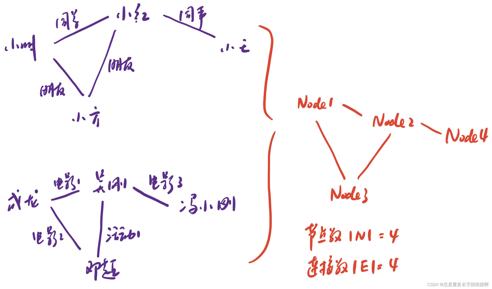
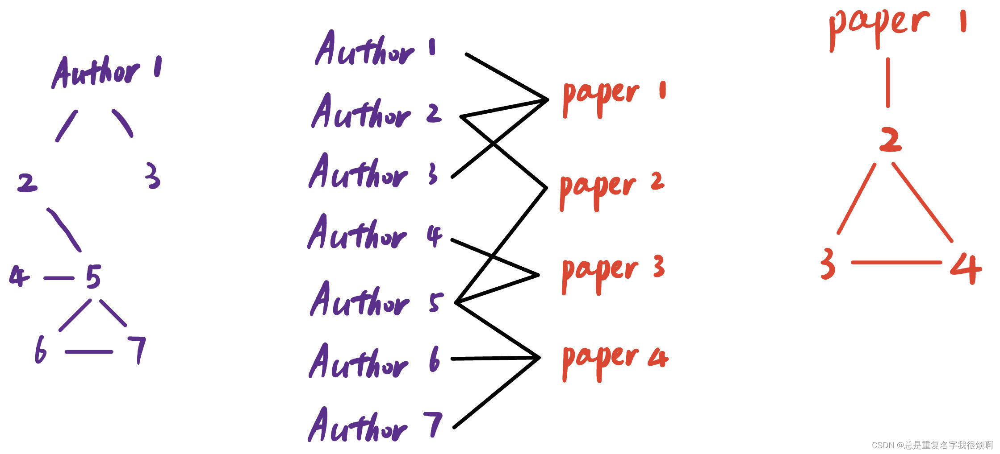
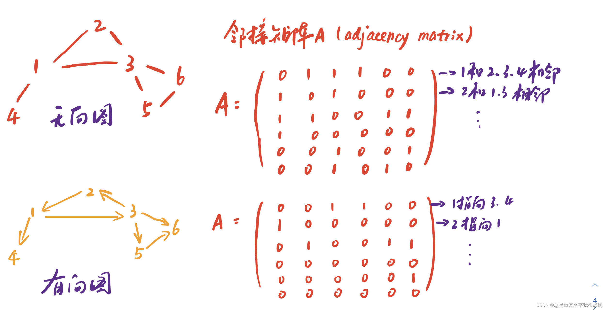
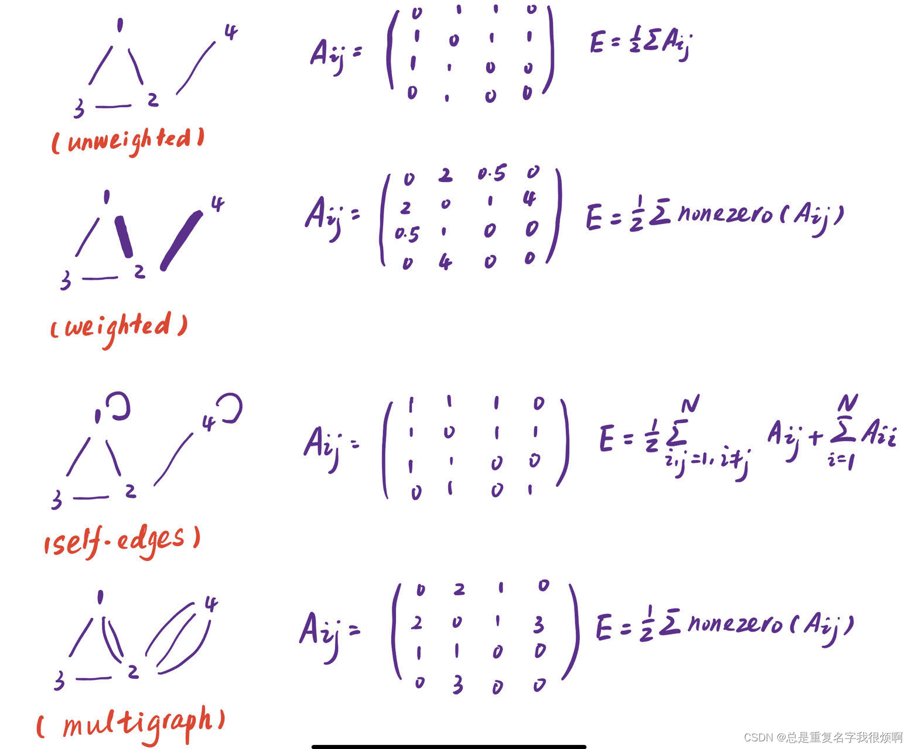

## 图的基本参数

> 节点

nodes/vertices $N$

> 边

links/egdes $E$

> 系统

network/graph $G(N,E)$

例如，这两个信息图本质上可以绘制成一张图（节点数4，连接数4）。实际上，图的设计需要根据你想解决问题的实际关系来进行确定。

## 图的类别
对于有无指向关系可以分为，无向图和有向图。

对于关系的种类，又可分n维异质图。

$$G=(V,E,R,T) \\
v_i \in V ，环境的影响因素如血压，是否患病，年龄，性别等\\
(v_i, r, v_j) \in E，这些环境因素的联合作用效果\\
边的关系r \in R\\
节点类别T节点类别T$$

最常见的异质图为二分图（2种节点，bipartite graph）。如工作和人名的关系，作者和发表论文题目等。这种二分图可以直接展开。

## 节点连接数（Node degree）

对上图paper2而言，节点的连接数为3，记作$k_{paper2}=3$

平局度$k_{avg}=<k>=\frac {2E}{N}$

若是有向图，则不存在节点共享，此时平局度$k_{avg}=<k>=\frac {E}{N}$

我们可以用node degree描述节点的重要性

## 图的矩阵表示（邻接矩阵）

对于无向图，他的邻接矩阵是一个对称阵，无向图是一个非对称阵。用数学语言表示：

$$A_{ij}=1，if\ there\ is\ a\ link\ from\ node\ i\ to\ node\ j, else\ 0$$

由于无向图的邻接矩阵是一个对称阵，所以连接总数$L=\frac{1}{2} \sum A_{ij}$。有向图的连接总数$L=\sum A_{ij}$

> 思考1

为什么要把图表示成矩阵形式？

> 思考2

看似完美的邻接矩阵在实际情况中大多是稀疏矩阵。

## 连接列表和邻接列表
> 连接列表

只记录存在连接节点对的列表。上图有向图则可记录为：（1，3）（1，4）（2，1）（3，2）（3，5）（3，6）（5，6）

> 邻接列表

只记录邻接的节点。上图有向图则可记录为：（只用了4行就可以表示图信息）

1：3，4

2：1

3：2，5，6

4：

5：6

6：
## 其他图
