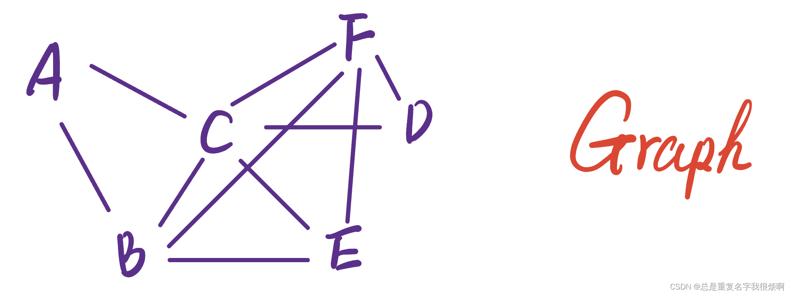

神经网络是一个非常强大的工具，他可以处理不同模态不同类型的数据。在NLP中，介绍了循环网络在序列数据（文章主要是文本信息，由于音频信息处理由于暂未过多涉及，因此未做归纳总结）的使用，包括Transformer和注意力机制的相关解释和应用。在gephi和networkx中，介绍了图的绘制和一些自带的图分析和可视化，gephi只是为我们打开了图分析的冰山一角，networkx也并没有深究其原理。实际上我们并没有足够的工具去挖掘和解释图背后的信息。图分析也是一种序列信息，但这个序列信息更多在于关联性、因果推论上。因此，图的分析可以独立于NLP方向，作为一个全新的方向去探索、学习。本篇将主要汇总有关图机器学习和深度学习的相关理论内容，用作补充。此外，由于代码实现的工作量巨大，因此会另起文档整理代码，并且附在**配套笔记**超链接，可以按需阅读。由于图的知识会涉及到大量图论和矩阵的相关运算，因此在本文完结后，会继续开启一篇新的文档用以整理相关的数学内容，相关经典算法的论文精读作为图系列文章补充内容。

> Why

传统的机器学习领域，数据样本A和数据样本B，C，D之间的关联并没有纳入考虑，我们把这些参数变量默认为独立同分布彼此无关变量。当然也可以用相似矩阵来描述这些变量之间的相似性和关联度，但是这并不是机器学习的初衷。而图刚好是描述这样数据关系的通用语言，利用图信息可以挖掘出更多关联信息。

> How

充分利用节点Node和边Edge的关系，进行数据挖掘。若想用网络处理图数据，首先需要明确，图的输入数据尺寸是不固定的，一个Node可能和N个点构成关系，这个N可以是及其庞大的无上限的数据。对于图像数据（卷积网络）处理，卷积核的卷积过程是一个从左到右，从上到下的一个扫描过程；对于文本数据（循环网络）处理，也是从左到右的一个计算过程；对于图数据，并没有一个初始锚点，并且具备多模态特性，例如某音乐的受欢迎程度可能和作曲家和歌手有关（文本数据），可能和听众画像有关（文本数据），可能和MV拍摄的好不好看节奏是否动感有关（音频数据），可能和专辑封面是否好看有关（图像数据）。因此，图数据处理，本质上也是各种卷积操作、正则化操作、监督学习操作等等把节点信息变成一个d维向量的端到端学习的结合体，这个过程叫做图嵌入(gragh embedding)，搞明白如何做好gragh embedding做好，就和NLP搞好word embedding一样重要。

> 应用

- 最短路径（图论问题）。
- 节点重要度分析（度中心性评价）。
- 社群检测（找到在广泛群体中有着相似性的重要群体）。
- 相似度和关联预测（隔很远的节点之间可能存在联系）。
- 联合作用检测（若有极大的组合可能性，超越临床医学检测的能力，则图可以发现这些节点的潜在关联，如a+k并没有得到临床验证的前提下，图分析a+k是否有利于临床表现）。
- 图嵌入问题（和深度学习建立联系的核心）。

**个人学习下来的感受：其实图挖掘的核心仍然是NLP的那套方式，只不过弱化了一定序列感知，强化了拓扑结构认知，是统筹了时间和空间维度的一套模型方法，从学习的角度上，仍然是NLP优先级高于GNN。**