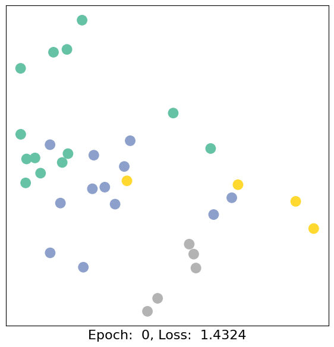
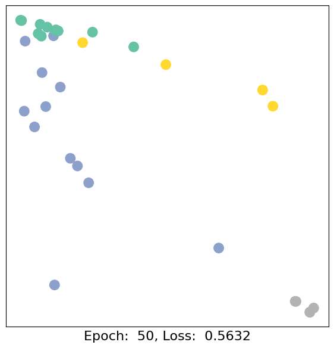
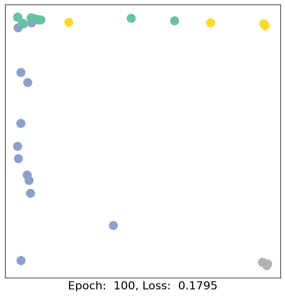
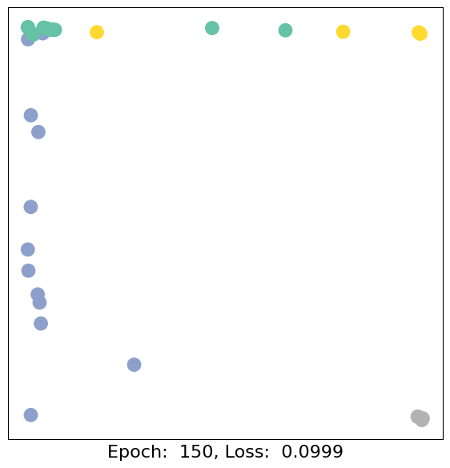
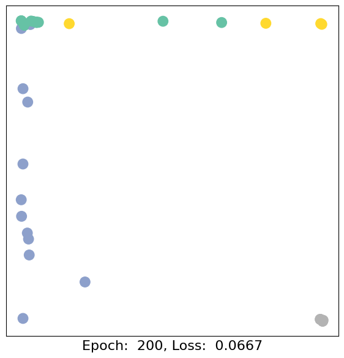
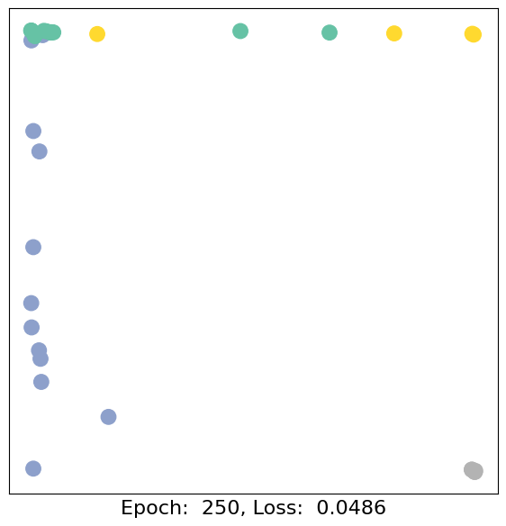
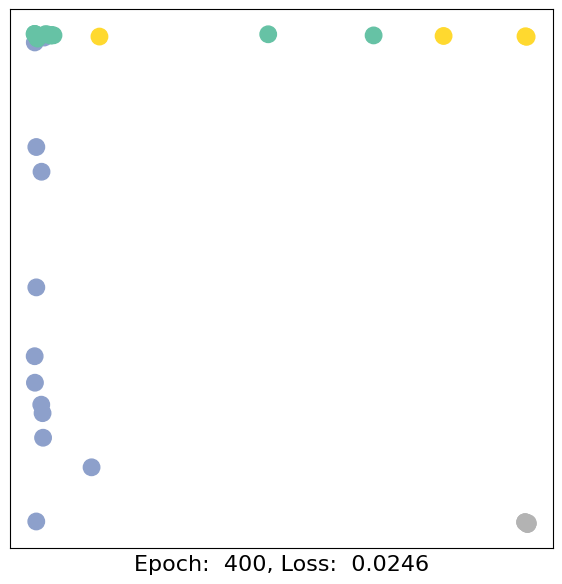
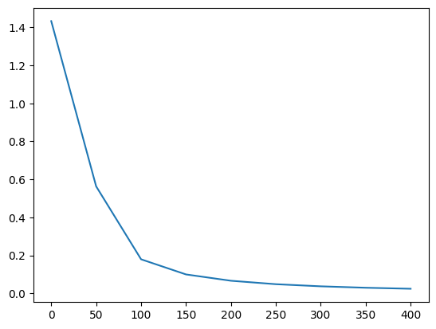

### 空手道俱乐部数据熟悉PyG

> 导入数据集

```python
from torch_geometric.datasets import KarateClub

dataset = KarateClub()
```

```python
print(len(dataset))
print(dataset.num_features)
print(dataset.num_classes)
print(dataset[0])
```

    1
    34
    4
    Data(x=[34, 34], edge_index=[2, 156], y=[34], train_mask=[34])

空手道俱乐部数据是一个图（len=1），每个节点有34个特征（num_features=34），一共有4个节点类别(num_classes=4)。

对于这张图，x=[34 x 34]表示[样本数 x 每个特征的维度]，edge_index=[2, 156]表示这个点和156个点存在关系,156是边的个数，y=[34]表示标签，train_mask=[34]表示有标签数据

> networkx可视化

torch_geometric内置了一个networkx可视化的工具，实际上用networkx直接画也是可以的。

```python
import matplotlib.pyplot as plt
import networkx as nx
import torch
from torch_geometric.utils import to_networkx

def visualize_graph(G, color):
    plt.figure(figsize=(7,7))
    plt.xticks([])
    plt.yticks([])
    nx.draw_networkx(G, pos=nx.spring_layout(G, seed=42), with_labels = False, node_color=color, cmap='Set2')
    plt.show()

G = to_networkx(dataset[0], to_undirected=True)
visualize_graph(G, color = data.y)
```

> 用GCN完成训练

```python
from torch.nn import Linear
from torch_geometric.nn import GCNConv

def visualize_embedding(h, color, epoch=None, loss=None):
    plt.figure(figsize=(7,7))
    plt.xticks([])
    plt.yticks([])
    h = h.detach().cpu().numpy()
    plt.scatter(h[:,0], h[:,1], s=140, c=color, cmap='Set2')
    if epoch is not None and loss is not None:
        plt.xlabel(f'Epoch:  {epoch}, Loss:  {loss.item():.4f}', fontsize=16)
    plt.show()

class GCN(torch.nn.Module):
    def __init__(self):
            super().__init__()
            torch.manual_seed(1234)
            self.conv1 = GCNConv(dataset.num_features, 4)
            self.conv2 = GCNConv(4, 4)
            self.conv3 = GCNConv(4, 2)
            self.classifier = Linear(2, dataset.num_classes)
        
    def forward(self, x, edge_index):
            h = self.conv1(x, edge_index)
            h = h.tanh()
            h = self.conv2(h, edge_index)
            h = h.tanh()
            h = self.conv3(h, edge_index)
            h = h.tanh()
            
            out = self.classifier(h)
            
            return out, h # h主要用来做可视化展示，out是最终的结果
        
model = GCN()

import time

criterion = torch.nn.CrossEntropyLoss()
optimizer = torch.optim.Adam(model.parameters(), lr=0.01)

l = []
step = []

def train(data):
    optimizer.zero_grad()
    out, h = model(data.x, data.edge_index)
    # loss计算只看train_mask，即有标签的数据
    loss = criterion(out[data.train_mask], data.y[data.train_mask])
    loss.backward()
    optimizer.step()
    return loss, h

for epoch in range(401):
    loss, h = train(data)
    if epoch % 50 == 0:
        visualize_embedding(h, color=data.y, epoch=epoch, loss=loss)
        l.append(loss.item())
        step.append(epoch)
        time.sleep(0.3)
        
plt.plot(step, l)
```









