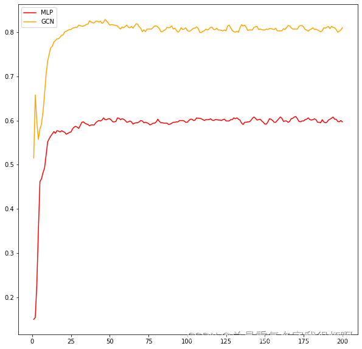
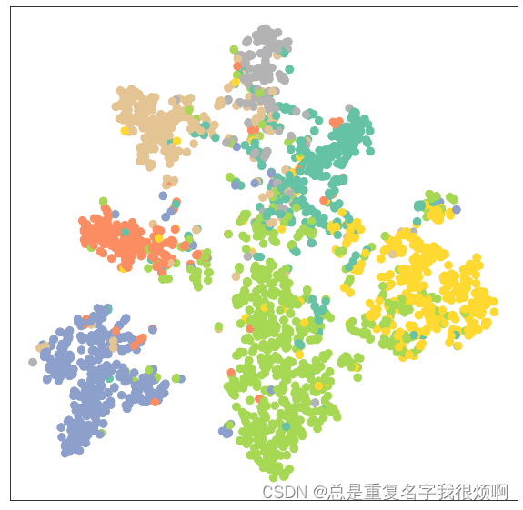

> 准备工作

```python
from torch_geometric.datasets import Planetoid
from torch_geometric.transforms import NormalizeFeatures

dataset = Planetoid(root='data./Planetoid', name='Cora', transform=NormalizeFeatures())
print(dataset)
print(len(dataset))
print(dataset.num_features)
print(dataset.num_classes)
>>Cora()
1
1433
7
```
> 读取数据

```python
data = dataset[0]
data
>>Data(x=[2708, 1433], edge_index=[2, 10556], y=[2708], train_mask=[2708], val_mask=[2708], test_mask=[2708])
```
2708个点，每一个点1433维，10556对连接，2708个标签

> 可视化

由于输出的维度是一个7维，因此需要用降维工具降到2维，这里选用sklearn的老朋友TSNE。
```python
%matplotlib inline
import matplotlib.pyplot as plt
from sklearn.manifold import TSNE

def visualize(h, color):
    z = TSNE(n_components=2).fit_transform(h.detach().cpu().numpy())
    
    plt.figure(figsize=(10,10))
    plt.xticks([])
    plt.yticks([])
    
    plt.scatter(z[:, 0], z[:, 1], s=70, c=color, cmap='Set2')
    plt.show()
```

> MLP和GCN代码对比

```python
import torch
import torch.nn as nn
from torch.nn import Linear
import torch.nn.functional as F

# MLP试验
class MLP(nn.Module):
    def __init__(self, hidden_channels):
        super().__init__()
        torch.manual_seed(12345)
        self.lin1 = Linear(dataset.num_features, hidden_channels)
        self.lin2 = Linear(hidden_channels, dataset.num_classes)
    
    def forward(self, x):
        x = self.lin1(x)
        x = x.relu()
        x = F.dropout(x, p=0.5, training=self.training)
        x = self.lin2(x)
        return x

mlp_model = MLP(hidden_channels=128)
criterion = nn.CrossEntropyLoss()
optimizer = torch.optim.Adam(model.parameters(), lr=0.01, weight_decay=5e-4)

def train():
    mlp_model.train()
    optimizer.zero_grad()
    out = mlp_model(data.x)
    loss = criterion(out[data.train_mask], data.y[data.train_mask])
    loss.backward()
    optimizer.step()
    return loss

def test():
    mlp_model.eval()
    out = mlp_model(data.x)
    pred = out.argmax(dim=1)
    test_correct = pred[data.test_mask] == data.y[data.test_mask]
    test_acc = int(test_correct.sum()) / int(data.test_mask.sum())
    return test_acc

mlp_acc = []

for epoch in range(1, 201):
    loss = train()
    if epoch % 40 == 0:
        print(f'Epoch:{epoch}, Loss:{loss:4f}')
    test_acc = test()
    mlp_acc.append(test_acc)

# GCN
from torch_geometric.nn import GCNConv

class GCN(nn.Module):
    def __init__(self, hidden_channel):
        super().__init__()
        torch.manual_seed(12345)
        self.conv1 = GCNConv(dataset.num_features, hidden_channel)
        self.conv2 = GCNConv(hidden_channel, dataset.num_classes)
        
    def forward(self, x, edge_index):
        x = self.conv1(x, edge_index)
        x = x.relu()
        x= F.dropout(x, p=0.5, training=self.training)
        x = self.conv2(x, edge_index)
        return x

gcn_model = GCN(hidden_channel=128)
criterion = nn.CrossEntropyLoss()
optimizer = torch.optim.Adam(model.parameters(), lr=0.01, weight_decay=5e-4)

def train():
    gcn_model.train()
    optimizer.zero_grad()
    out = gcn_model(data.x, data.edge_index)
    loss = criterion(out[data.train_mask], data.y[data.train_mask])
    loss.backward()
    optimizer.step()
    return loss

def test():
    gcn_model.eval()
    out = gcn_model(data.x, data.edge_index)
    pred = out.argmax(dim=1)
    test_correct = pred[data.test_mask] == data.y[data.test_mask]
    test_acc = int(test_correct.sum()) / int(data.test_mask.sum())
    return test_acc

gcn_acc = []

for epoch in range(1, 201):
    loss = train()
    if epoch % 40 == 0:
        print(f'Epoch:{epoch}, Loss:{loss:4f}')
    test_acc = test()
    gcn_acc.append(test_acc)
```

> MLP和GCN准确度对比和GCN结果可视化

```python
x = [i for i in range(1,201)]
plt.figure(figsize=(10,10))
plt.plot(x, mlp_acc, color='red', label='MLP')
plt.plot(x, gcn_acc, color='orange', label='GCN')
plt.legend()
```



```python
out = model(data.x ,data.edge_index)
visualize(out, color=data.y)
```

