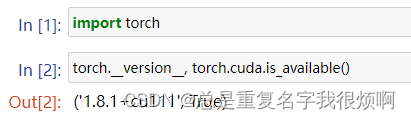

- PyG is available for Python 3.7 to Python 3.11.（安装3.7以上的python版本，推荐2017年10月3.7版本，兼容性最好）
- You can now install PyG via Anaconda for all major OS/PyTorch/CUDA combinations 🤗 If you have not yet installed PyTorch, install it via conda as described in the official PyTorch documentation. （安装pytorch，相关教程可以直接在torch官网看，也可以去其他博主看，有cuda版本和cpu版本，我的版本如下）



- From PyG 2.3 onwards, you can install and use PyG without any external library required except for PyTorch. (除torch外，不需要额外安装其他依赖，直接pip安装)

```python
!pip install torch_geometric -i https://pypi.tuna.tsinghua.edu.cn/simple
```

在本文代码运行过程中，如果出现其他库没有的，请自行安装。

****
**注意：**
2.3版本以上的PyG由于取消了依赖，因此有些经典代码的运行会出问题。如果安装低于2.3版本的PyG则需要手动安装依赖，具体操作可以参考知乎文章：[PyG手动安装依赖步骤](https://zhuanlan.zhihu.com/p/601236097?utm_id=0)

****

> API

[Github地址](https://github.com/pyg-team/pytorch_geometric)

[官方文档地址](https://pytorch-geometric.readthedocs.io/en/latest/)