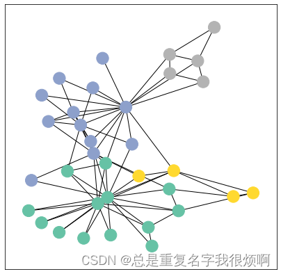
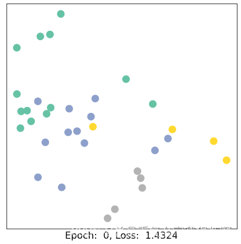
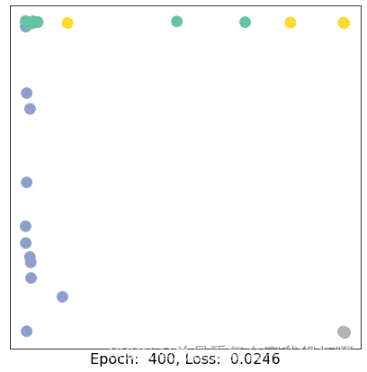
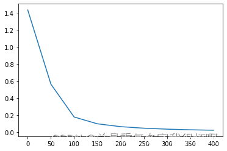

> 准备工作

```python
%matplotlib inline
import matplotlib.pyplot as plt
import networkx as nx
import torch

from torch_geometric.datasets import KarateClub
from torch_geometric.utils import to_networkx

# 两个画图函数
def visualize_graph(G, color):
    plt.figure(figsize=(7,7))
    plt.xticks([])
    plt.yticks([])
    nx.draw_networkx(G, pos=nx.spring_layout(G, seed=42), with_labels = False, node_color=color, cmap='Set2')
    plt.show()
    
def visualize_embedding(h, color, epoch=None, loss=None):
    plt.figure(figsize=(7,7))
    plt.xticks([])
    plt.yticks([])
    h = h.detach().cpu().numpy()
    plt.scatter(h[:,0], h[:,1], s=140, c=color, cmap='Set2')
    if epoch is not None and loss is not None:
        plt.xlabel(f'Epoch:  {epoch}, Loss:  {loss.item():.4f}', fontsize=16)
    plt.show()
```

> 读取数据

```python
dataset = KarateClub()

print(dataset)
print(len(dataset))
print(dataset.num_features)
print(dataset.num_classes)
>>KarateClub()
1
34
4
```

```python
data = dataset[0]
data

>>Data(x=[34, 34], edge_index=[2, 156], y=[34], train_mask=[34])
```
这个表示34个样本量，每个样本34个特征，一共有156对关系，标签是34，预测的train_mask是34。

```python
edge_index = data.edge_index
edge_index
>>tensor([[ 0,  0,  0,  0,  0,  0,  0,  0,  0,  0,  0,  0,  0,  0,  0,  0,  1,  1,
          1,  1,  1,  1,  1,  1,  1,  2,  2,  2,  2,  2,  2,  2,  2,  2,  2,  3,
          3,  3,  3,  3,  3,  4,  4,  4,  5,  5,  5,  5,  6,  6,  6,  6,  7,  7,
          7,  7,  8,  8,  8,  8,  8,  9,  9, 10, 10, 10, 11, 12, 12, 13, 13, 13,
         13, 13, 14, 14, 15, 15, 16, 16, 17, 17, 18, 18, 19, 19, 19, 20, 20, 21,
         21, 22, 22, 23, 23, 23, 23, 23, 24, 24, 24, 25, 25, 25, 26, 26, 27, 27,
         27, 27, 28, 28, 28, 29, 29, 29, 29, 30, 30, 30, 30, 31, 31, 31, 31, 31,
         31, 32, 32, 32, 32, 32, 32, 32, 32, 32, 32, 32, 32, 33, 33, 33, 33, 33,
         33, 33, 33, 33, 33, 33, 33, 33, 33, 33, 33, 33],
        [ 1,  2,  3,  4,  5,  6,  7,  8, 10, 11, 12, 13, 17, 19, 21, 31,  0,  2,
          3,  7, 13, 17, 19, 21, 30,  0,  1,  3,  7,  8,  9, 13, 27, 28, 32,  0,
          1,  2,  7, 12, 13,  0,  6, 10,  0,  6, 10, 16,  0,  4,  5, 16,  0,  1,
          2,  3,  0,  2, 30, 32, 33,  2, 33,  0,  4,  5,  0,  0,  3,  0,  1,  2,
          3, 33, 32, 33, 32, 33,  5,  6,  0,  1, 32, 33,  0,  1, 33, 32, 33,  0,
          1, 32, 33, 25, 27, 29, 32, 33, 25, 27, 31, 23, 24, 31, 29, 33,  2, 23,
         24, 33,  2, 31, 33, 23, 26, 32, 33,  1,  8, 32, 33,  0, 24, 25, 28, 32,
         33,  2,  8, 14, 15, 18, 20, 22, 23, 29, 30, 31, 33,  8,  9, 13, 14, 15,
         18, 19, 20, 22, 23, 26, 27, 28, 29, 30, 31, 32]])
```
这个就是156对对应关系。

> 可视化

```python
G = to_networkx(dataset[0], to_undirected=True)
visualize_graph(G, color = data.y)
```


## GCN训练

```python
import torch
from torch.nn import Linear
from torch_geometric.nn import GCNConv

class GCN(torch.nn.Module):
    def __init__(self):
            super().__init__()
            torch.manual_seed(1234)
            self.conv1 = GCNConv(dataset.num_features, 16)
            self.conv2 = GCNConv(16, 4)
            self.conv3 = GCNConv(4, 2)
            self.classifier = Linear(2, dataset.num_classes)
        
    def forward(self, x, edge_index):
            h = self.conv1(x, edge_index)
            h = h.tanh()
            h = self.conv2(h, edge_index)
            h = h.tanh()
            h = self.conv3(h, edge_index)
            h = h.tanh()
            
            out = self.classifier(h)
            
            return out, h

model = GCN()
```
这里就非常简单，输入的是一个34维向量，然后经过三个GCN降到2维，然后接一个MLP把结果输出到我们需要的4分类上。

```python
import time

criterion = torch.nn.CrossEntropyLoss()
optimizer = torch.optim.Adam(model.parameters(), lr=0.01)

def train(data):
    optimizer.zero_grad()
    out, h = model(data.x, data.edge_index)
    loss = criterion(out[data.train_mask], data.y[data.train_mask])
    loss.backward()
    optimizer.step()
    return loss, h

for epoch in range(401):
    loss, h = train(data)
    if epoch % 50 == 0:
        visualize_embedding(h, color=data.y, epoch=epoch, loss=loss)
        time.sleep(0.3)
```




> 损失下降曲线

