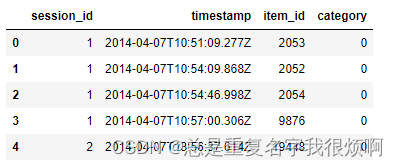
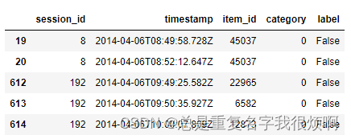
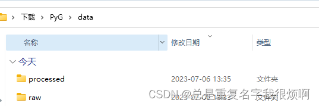
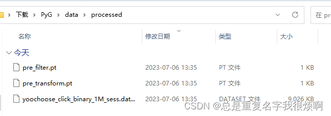

## 单图和多图情景下的代码框架
PyG格式的写入主要是通过`torch_geometric.data`模块或`torch_geometric.InMemoryDataset`实现。这里InMemoryDataset是PyG推荐的一种写入数据方式，类似torch中DataLoader类。对于简单的数据，直接使用data即可，如果有很多图需要集成数据，则需要首先使用data封装单个图数据，再用InMemoryDataset封装多个data数据。

首先介绍最简单的Data。
假设这里有一个邻接矩阵为matrix([[0, 1, 0, 1],[1, 0, 1, 0],[0, 1, 0, 1],[1, 0, 1, 0]])的图，假设每个节点嵌入维度是2维，则：

```python
import torch
# 嵌入向量x
x = torch.tensor([[2,1],[5,6],[3,7],[12,0]], dtype=torch.float)
# 节点类别y
y = torch.tensor([0,1,0,1], dtype=torch.float)
# 连接信息，edge_index[0]表示起始点，edge_index[1]表示连接终点，顺序无所谓
edge_index = torch.tensor([[0,1,2,0,3],
                           [1,0,1,3,2]], dtype=torch.long)

from torch_geometric.data import Data
data = Data(x=x, y=y, edge_index=edge_index)
data
>>Data(x=[4, 2], edge_index=[2, 5], y=[4])
```
4个节点，每个节点嵌入2维向量，一共有5对连接关系，一共有4个标签。

关于InMemoryDataset，直接复制官方代码进行改写。注意，这里所有的函数名都不可改，通常来说，只需要改写process部分。操作完全类似于Torch DataLoader。ClassName类名称可以自己取。
```python
from torch_geometric.data import InMemoryDataset

class ClassName(InMemoryDataset):
    def __init__(self, root, transform=None, pre_transform=None):
        super(YooChooseBinaryDataset, self).__init__(root, transform, pre_transform)
        self.data, self.slices = torch.load(self.processed_paths[0])
 
    @property
    def raw_file_names(self): #检查self.raw_dir目录下是否存在raw_file_names()属性方法返回的每个文件,有文件不存在，则调用download()方法执行原始文件下载
        return []
    
    @property
    def processed_file_names(self): #检查self.processed_dir目录下是否存在self.processed_file_names属性方法返回的所有文件，没有就会走process
        return ['想要保存在本地的名字，用来服务最后一行torch.save']
 
    def download(self):
        pass
    
    def process(self):
        
        data_list = []
        
        开始循环处理数据
 		for i in data_iteration:
        	这里放你的数据处理过程，找到Data需要的x、y和edge_index
        	data = Data(x=x, edge_index=edge_index, y=y)
        	data_list.append(data)
        
        data_list储存了所有的图信息，然后封装保存到本地。
        data, slices = self.collate(data_list)
        torch.save((data, slices), self.processed_paths[0])

# 然后调用这个类就可以把数据保存在本地
dataset = ClassName(root='data/')
```

## 雅虎电商数据集（多图）用迭代器加载成PyG格式

yoochoose-clicks储存用户浏览行为，session_id表示登录一次浏览了什么，item_id就是浏览的商品，yoochoose-buy描述是否购买，这里的数据如下：
```python
from sklearn.preprocessing import LabelEncoder
import pandas as pd

df = pd.read_csv('yoochoose-clicks.dat', header = None)
df.columns = ['session_id', 'timestamp','item_id','category']

buy_df = pd.read_csv('yoochoose-buys.dat', header = None)
buy_df.columns = ['session_id', 'timestamp','item_id','price', 'quantity']

item_encoder = LabelEncoder()
df['item_id'] = item_encoder.fit_transform(df.item_id)
df.head()
```



结合两张表，给是否购买添加label：

```python
df['label'] = df.session_id.isin(buy_df.session_id)
df.head()
```



这里由于有很多用户，每个用户都会产生点击、购买行为，把每一个session_id都当作一个图，每一个图具有多个点和一个标签，因此属于多张图。所以需要InMemoryDataset迭代器。此外，对每一组session_id中的所有item_id进行编码（例如15453,3651,15452）就按照数值大小编码成（2，0，1），因为edge_index要0123这种格式。
明晰这些之后，直接改写上面的类：

```python
from torch_geometric.data import InMemoryDataset
from tqdm import tqdm

df_test = df[:100]
grouped = df_test.groupby('session_id')

class YooChooseBinaryDataset(InMemoryDataset):
    def __init__(self, root, transform=None, pre_transform=None):
        super(YooChooseBinaryDataset, self).__init__(root, transform, pre_transform)
        self.data, self.slices = torch.load(self.processed_paths[0])
 
    @property
    def raw_file_names(self):
        return []
    
    @property
    def processed_file_names(self):
        return ['yoochoose_click_binary_1M_sess.dataset']
 
    def download(self):
        pass
    
    def process(self):
        
        data_list = []
 
        # process by session_id
        grouped = df.groupby('session_id')
        for session_id, group in tqdm(grouped):
            sess_item_id = LabelEncoder().fit_transform(group.item_id)
            group = group.reset_index(drop=True)
            group['sess_item_id'] = sess_item_id
            node_features = group.loc[group.session_id==session_id,['sess_item_id','item_id']].sort_values('sess_item_id').item_id.drop_duplicates().values
 
            node_features = torch.LongTensor(node_features).unsqueeze(1)
            target_nodes = group.sess_item_id.values[1:]
            source_nodes = group.sess_item_id.values[:-1]
 
            edge_index = torch.tensor([source_nodes, target_nodes], dtype=torch.long)
            x = node_features
 
            y = torch.FloatTensor([group.label.values[0]])
 
            data = Data(x=x, edge_index=edge_index, y=y)
            data_list.append(data)
        
        data, slices = self.collate(data_list)

dataset = YooChooseBinaryDataset(root='data/')
```




这样数据以PyG要求的格式保存在本地了。接下来就是训练部分。