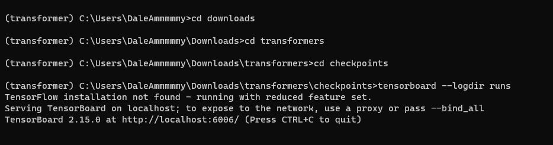
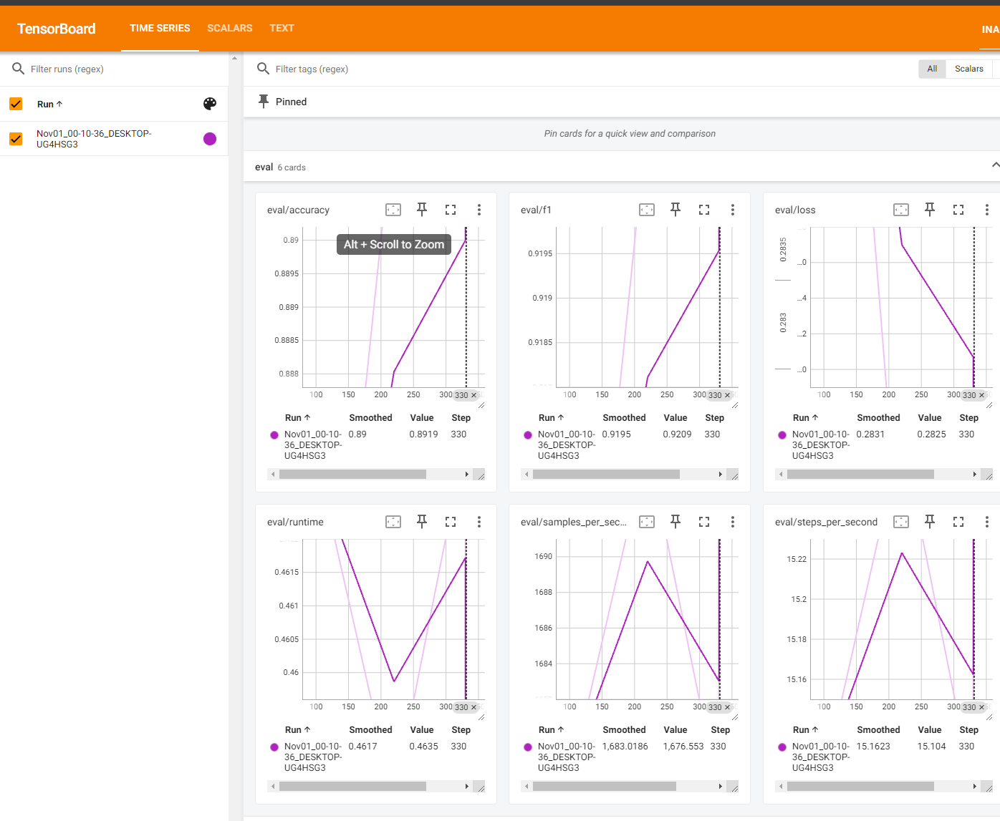
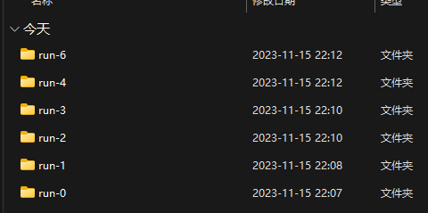
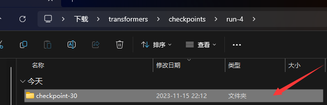

[数据集下载](https://github.com/SophonPlus/ChineseNlpCorpus)

使用该数据集datasets下**ChnSentiCorp_htl_all.csv**作为数据集

### Step1 导入工具包


```python
from transformers import AutoTokenizer, AutoModelForSequenceClassification
import pandas as pd
import tqdm

import torch
from torch.utils.data import Dataset
from torch.utils.data import random_split
from torch.utils.data import DataLoader
from torch.optim import Adam

import warnings
warnings.filterwarnings('ignore') 

device = 'cuda' if torch.cuda.is_available() else 'cpu'
```

### Step2 加载数据


```python
data = pd.read_csv('ChnSentiCorp_htl_all.csv')
data
```


<div>
<style scoped>
    .dataframe tbody tr th:only-of-type {
        vertical-align: middle;
    }

    .dataframe tbody tr th {
        vertical-align: top;
    }

    .dataframe thead th {
        text-align: right;
    }
</style>
<table border="1" class="dataframe">
  <thead>
    <tr style="text-align: right;">
      <th></th>
      <th>label</th>
      <th>review</th>
    </tr>
  </thead>
  <tbody>
    <tr>
      <th>0</th>
      <td>1</td>
      <td>距离川沙公路较近,但是公交指示不对,如果是"蔡陆线"的话,会非常麻烦.建议用别的路线.房间较...</td>
    </tr>
    <tr>
      <th>1</th>
      <td>1</td>
      <td>商务大床房，房间很大，床有2M宽，整体感觉经济实惠不错!</td>
    </tr>
    <tr>
      <th>2</th>
      <td>1</td>
      <td>早餐太差，无论去多少人，那边也不加食品的。酒店应该重视一下这个问题了。房间本身很好。</td>
    </tr>
    <tr>
      <th>3</th>
      <td>1</td>
      <td>宾馆在小街道上，不大好找，但还好北京热心同胞很多~宾馆设施跟介绍的差不多，房间很小，确实挺小...</td>
    </tr>
    <tr>
      <th>4</th>
      <td>1</td>
      <td>CBD中心,周围没什么店铺,说5星有点勉强.不知道为什么卫生间没有电吹风</td>
    </tr>
    <tr>
      <th>...</th>
      <td>...</td>
      <td>...</td>
    </tr>
    <tr>
      <th>7761</th>
      <td>0</td>
      <td>尼斯酒店的几大特点：噪音大、环境差、配置低、服务效率低。如：1、隔壁歌厅的声音闹至午夜3点许...</td>
    </tr>
    <tr>
      <th>7762</th>
      <td>0</td>
      <td>盐城来了很多次，第一次住盐阜宾馆，我的确很失望整个墙壁黑咕隆咚的，好像被烟熏过一样家具非常的...</td>
    </tr>
    <tr>
      <th>7763</th>
      <td>0</td>
      <td>看照片觉得还挺不错的，又是4星级的，但入住以后除了后悔没有别的，房间挺大但空空的，早餐是有但...</td>
    </tr>
    <tr>
      <th>7764</th>
      <td>0</td>
      <td>我们去盐城的时候那里的最低气温只有4度，晚上冷得要死，居然还不开空调，投诉到酒店客房部，得到...</td>
    </tr>
    <tr>
      <th>7765</th>
      <td>0</td>
      <td>说实在的我很失望，之前看了其他人的点评后觉得还可以才去的，结果让我们大跌眼镜。我想这家酒店以...</td>
    </tr>
  </tbody>
</table>
<p>7766 rows × 2 columns</p>
</div>


```python
# 数据预处理
data = data.dropna()
data
```


<div>
<style scoped>
    .dataframe tbody tr th:only-of-type {
        vertical-align: middle;
    }

    .dataframe tbody tr th {
        vertical-align: top;
    }

    .dataframe thead th {
        text-align: right;
    }
</style>
<table border="1" class="dataframe">
  <thead>
    <tr style="text-align: right;">
      <th></th>
      <th>label</th>
      <th>review</th>
    </tr>
  </thead>
  <tbody>
    <tr>
      <th>0</th>
      <td>1</td>
      <td>距离川沙公路较近,但是公交指示不对,如果是"蔡陆线"的话,会非常麻烦.建议用别的路线.房间较...</td>
    </tr>
    <tr>
      <th>1</th>
      <td>1</td>
      <td>商务大床房，房间很大，床有2M宽，整体感觉经济实惠不错!</td>
    </tr>
    <tr>
      <th>2</th>
      <td>1</td>
      <td>早餐太差，无论去多少人，那边也不加食品的。酒店应该重视一下这个问题了。房间本身很好。</td>
    </tr>
    <tr>
      <th>3</th>
      <td>1</td>
      <td>宾馆在小街道上，不大好找，但还好北京热心同胞很多~宾馆设施跟介绍的差不多，房间很小，确实挺小...</td>
    </tr>
    <tr>
      <th>4</th>
      <td>1</td>
      <td>CBD中心,周围没什么店铺,说5星有点勉强.不知道为什么卫生间没有电吹风</td>
    </tr>
    <tr>
      <th>...</th>
      <td>...</td>
      <td>...</td>
    </tr>
    <tr>
      <th>7761</th>
      <td>0</td>
      <td>尼斯酒店的几大特点：噪音大、环境差、配置低、服务效率低。如：1、隔壁歌厅的声音闹至午夜3点许...</td>
    </tr>
    <tr>
      <th>7762</th>
      <td>0</td>
      <td>盐城来了很多次，第一次住盐阜宾馆，我的确很失望整个墙壁黑咕隆咚的，好像被烟熏过一样家具非常的...</td>
    </tr>
    <tr>
      <th>7763</th>
      <td>0</td>
      <td>看照片觉得还挺不错的，又是4星级的，但入住以后除了后悔没有别的，房间挺大但空空的，早餐是有但...</td>
    </tr>
    <tr>
      <th>7764</th>
      <td>0</td>
      <td>我们去盐城的时候那里的最低气温只有4度，晚上冷得要死，居然还不开空调，投诉到酒店客房部，得到...</td>
    </tr>
    <tr>
      <th>7765</th>
      <td>0</td>
      <td>说实在的我很失望，之前看了其他人的点评后觉得还可以才去的，结果让我们大跌眼镜。我想这家酒店以...</td>
    </tr>
  </tbody>
</table>
<p>7765 rows × 2 columns</p>
</div>


### Step3 创建Dataset


```python
class MyDataset(Dataset):
    def __init__(self):
        super().__init__()
        self.data = pd.read_csv('ChnSentiCorp_htl_all.csv')
        self.data = self.data.dropna()
    
    def __getitem__(self, index):
        return self.data.iloc[index]['review'], self.data.iloc[index]['label']
    
    def __len__(self):
        return len(self.data)
```


```python
dataset = MyDataset()
for i in dataset:
    print(i)
    break
```

    ('距离川沙公路较近,但是公交指示不对,如果是"蔡陆线"的话,会非常麻烦.建议用别的路线.房间较为简单.', 1)
    

### Step4 划分数据集


```python
trainset, validset = random_split(dataset, lengths=[0.9, 0.1])
len(trainset), len(validset)
```


    (6989, 776)


### Step5 创建Dataloader


```python
tokenizer = AutoTokenizer.from_pretrained('hfl/rbt3')

def collate_func(batch):
    texts, labels = [],[]
    for item in batch:
        texts.append(item[0])
        labels.append(item[1])
    inputs = tokenizer(texts, max_length=128, padding='max_length', truncation=True, return_tensors = 'pt')
    inputs['labels'] = torch.tensor(labels)
    return inputs
```


```python
trainloader = DataLoader(trainset, batch_size=128, shuffle=True, collate_fn=collate_func)
validloader = DataLoader(validset, batch_size=256, shuffle=False,collate_fn=collate_func)

next(enumerate(trainloader))[1]
```


    {'input_ids': tensor([[ 101, 3315, 3613,  ..., 6121, 3330,  102],
            [ 101, 2145, 6225,  ..., 3198, 6206,  102],
            [ 101, 6655, 4895,  ...,    0,    0,    0],
            ...,
            [ 101, 1296,  782,  ...,    0,    0,    0],
            [ 101, 1765, 3667,  ...,    0,    0,    0],
            [ 101, 2791, 7313,  ...,    0,    0,    0]]), 'token_type_ids': tensor([[0, 0, 0,  ..., 0, 0, 0],
            [0, 0, 0,  ..., 0, 0, 0],
            [0, 0, 0,  ..., 0, 0, 0],
            ...,
            [0, 0, 0,  ..., 0, 0, 0],
            [0, 0, 0,  ..., 0, 0, 0],
            [0, 0, 0,  ..., 0, 0, 0]]), 'attention_mask': tensor([[1, 1, 1,  ..., 1, 1, 1],
            [1, 1, 1,  ..., 1, 1, 1],
            [1, 1, 1,  ..., 0, 0, 0],
            ...,
            [1, 1, 1,  ..., 0, 0, 0],
            [1, 1, 1,  ..., 0, 0, 0],
            [1, 1, 1,  ..., 0, 0, 0]]), 'labels': tensor([1, 0, 1, 1, 1, 1, 1, 0, 1, 0, 1, 0, 1, 1, 0, 1, 1, 1, 1, 1, 1, 1, 1, 1,
            1, 0, 1, 0, 1, 1, 1, 1, 0, 0, 0, 1, 1, 1, 1, 1, 0, 0, 1, 1, 1, 0, 1, 1,
            0, 0, 1, 1, 1, 1, 0, 1, 1, 0, 1, 1, 1, 0, 0, 1, 1, 1, 1, 1, 0, 0, 1, 1,
            1, 0, 1, 1, 1, 0, 1, 1, 0, 1, 1, 1, 1, 0, 1, 1, 0, 1, 1, 1, 0, 1, 1, 1,
            0, 0, 1, 1, 0, 1, 1, 1, 1, 1, 0, 1, 1, 1, 1, 1, 0, 0, 1, 1, 1, 1, 1, 0,
            1, 0, 1, 0, 1, 0, 0, 1])}


### Step6 创建模型及优化器


```python
model = AutoModelForSequenceClassification.from_pretrained('hfl/rbt3').cuda()
optimizer = Adam(model.parameters(), lr=2e-5)
```

    Some weights of BertForSequenceClassification were not initialized from the model checkpoint at hfl/rbt3 and are newly initialized: ['classifier.weight', 'classifier.bias']
    You should probably TRAIN this model on a down-stream task to be able to use it for predictions and inference.
    

### Step7 训练与验证


```python
def evaluate():
    model.eval()
    acc_num = 0
    with torch.inference_mode():
        for batch in validloader:
            if torch.cuda.is_available():
                batch = {k: v.cuda() for k,v in batch.items()}
            output = model(**batch)
            pred = torch.argmax(output.logits, dim=-1)
            acc_num += (pred.long() == batch['labels'].long()).float().sum()
    return acc_num / len(validset)


def train(epochs=5, log_step=100):
    global_step=0
    for ep in tqdm.tqdm(range(epochs)):
        model.train()
        for batch in trainloader:
            if torch.cuda.is_available():
                batch = {k: v.cuda() for k,v in batch.items()}
            optimizer.zero_grad()
            output = model(**batch)
            output.loss.backward()
            optimizer.step()
            if global_step % log_step == 0:
                print(f'ep:{ep}, global_step:{global_step}, loss:{output.loss.item()}')
            global_step += 1
        acc = evaluate()
        print(f'ep:{ep},acc:{acc}')
```

### Step8 模型训练


```python
train()
```

      0%|          | 0/5 [00:00<?, ?it/s]

    ep:0, global_step:0, loss:0.30435019731521606
    

     20%|██        | 1/5 [00:08<00:34,  8.53s/it]

    ep:0,acc:0.9007731676101685
    ep:1, global_step:100, loss:0.2100108116865158
    

     40%|████      | 2/5 [00:16<00:25,  8.38s/it]

    ep:1,acc:0.8981958627700806
    

     60%|██████    | 3/5 [00:25<00:16,  8.35s/it]

    ep:2,acc:0.8917525410652161
    ep:3, global_step:200, loss:0.09420793503522873
    

     80%|████████  | 4/5 [00:33<00:08,  8.32s/it]

    ep:3,acc:0.89304119348526
    

    100%|██████████| 5/5 [00:41<00:00,  8.33s/it]

    ep:4,acc:0.8904638886451721
    

    
    

### Step9 模型预测


```python
sen = '这家酒店不错，饭好吃，分量足！'
id2label = {0:'差评',1:'好评'}
model.eval()
with torch.inference_mode():
    inputs = tokenizer(sen, return_tensors='pt')
    inputs = {k: v.cuda() for k, v in inputs.items()}
    logits = model(**inputs).logits
    pred = torch.argmax(logits, dim=-1)
    print(f'输入：{sen}，\n 预测：{id2label.get(pred.item())}')
```

    输入：这家酒店不错，饭好吃，分量足！，
     预测：好评
    

所以，这么复杂为什么不用pipeline呢？

```python
from transformers import pipeline

model.config.id2label = id2label
pipe = pipeline('text-classification', model=model, tokenizer=tokenizer, device=0)
pipe(sen)
```


    [{'label': '好评', 'score': 0.9960534572601318}]


其实一整个训练流程也比较长，自己写了很多内容，包括数据加载数据划分，也要自己找数据，计算准确率也是自己写，也容易写出bug，针对以上这些问题，Transformers也给出了一些解决方案，可以简化代码撰写，增强代码复用率。

> 对DataLoader流程优化

### Step2 加载数据集

```python
from transformers import DataCollatorWithPadding
from torch.utils.data import DataLoader

dataset = load_dataset('csv', data_files='ChnSentiCorp_htl_all.csv', split='train')
dataset = dataset.filter(lambda x: x['review'] is not None)
```

### Step3-4 划分数据集
```python
datasets = dataset.train_test_split(test_size=0.1)
```

### Step5 创建DataLoader
```python
tokenizer = AutoTokenizer.from_pretrained('hlf/rbt3')

def process_function(examples):
    tokenized_example = tokenizer(examples['review'], max_length=128, truncation=True)
    tokenized_example['labels'] = examples['label']
    return tokenized_example

tokenized_dataset = datasets.map(process_function, batched=True, remove_columns=dataset.column_names)
collator = DataCollatorWithPadding(tokenizer = tokenizer)

trainset, validset = tokenized_dataset['train'], tokenized_dataset['test']
trainloader = DataLoader(trainset, batch_size=128, shuffle=True, collate_fn=collator)
validloader = DataLoader(validset, batch_size=256, shuffle=False,collate_fn=collator)
```

> 对Evaluate流程优化

### Step7 训练与验证
```python
import evaluate

clf_metrics = evaluate.combine(['accuracy', 'f1'])

def evaluate():
    model.eval()
    with torch.inference_mode():
        for batch in validloader:
            if torch.cuda.is_available():
                batch = {k: v.cuda() for k,v in batch.items()}
            output = model(**batch)
            pred = torch.argmax(output.logits, dim=-1)
            clf_metrics.add_batch(predictions=pred.long(), references=batch['labels'].long())
    return clf_metrics.compute()


def train(epochs=5, log_step=100):
    global_step=0
    for ep in tqdm.tqdm(range(epochs)):
        model.train()
        for batch in trainloader:
            if torch.cuda.is_available():
                batch = {k: v.cuda() for k,v in batch.items()}
            optimizer.zero_grad()
            output = model(**batch)
            output.loss.backward()
            optimizer.step()
            if global_step % log_step == 0:
                print(f'ep:{ep}, global_step:{global_step}, loss:{output.loss.item()}')
            global_step += 1
        clf = evaluate()
        print(f'ep:{ep},{clf}')
```

这里只对evaluate进行了优化，train流程并没有优化，可以发现这个train的流程还是比较长的，并且这里的train代码只写了最简单的训练部分，保存模型到本地这些都没有写，接下来就对trainer进行简化。

由于模型预测部分并不需要修改代码，因此train的修改将是最后一步。考虑到代码整体性，下面将从头开始重构基于bert的文本分类代码。

## Transformers简化实现

### Step1 导入工具包


```python
from transformers import AutoTokenizer, AutoModelForSequenceClassification, DataCollatorWithPadding, Trainer, TrainingArguments
from datasets import load_dataset
import evaluate
```

### Step2 加载数据


```python
dataset = load_dataset('csv', data_files='ChnSentiCorp_htl_all.csv', split='train')
dataset = dataset.filter(lambda x: x['review'] is not None)
dataset
```


    Dataset({
        features: ['label', 'review'],
        num_rows: 7765
    })


### Step3 数据集划分


```python
datasets = dataset.train_test_split(test_size=0.1)
datasets
```


    DatasetDict({
        train: Dataset({
            features: ['label', 'review'],
            num_rows: 6988
        })
        test: Dataset({
            features: ['label', 'review'],
            num_rows: 777
        })
    })


### Step4 数据预处理


```python
tokenizer = AutoTokenizer.from_pretrained('hfl/rbt3')

def process_function(examples):
    tokenized_example = tokenizer(examples['review'], max_length=128, truncation=True)
    tokenized_example['labels'] = examples['label']
    return tokenized_example

tokenized_dataset = datasets.map(process_function, batched=True, remove_columns=dataset.column_names)
tokenized_dataset
```

    Map: 100%|██████████| 6988/6988 [00:00<00:00, 12227.27 examples/s]
    Map: 100%|██████████| 777/777 [00:00<00:00, 10799.42 examples/s]
    


    DatasetDict({
        train: Dataset({
            features: ['input_ids', 'token_type_ids', 'attention_mask', 'labels'],
            num_rows: 6988
        })
        test: Dataset({
            features: ['input_ids', 'token_type_ids', 'attention_mask', 'labels'],
            num_rows: 777
        })
    })


### Step5 创建模型


```python
model = AutoModelForSequenceClassification.from_pretrained('hfl/rbt3')
```

    Some weights of BertForSequenceClassification were not initialized from the model checkpoint at hfl/rbt3 and are newly initialized: ['classifier.weight', 'classifier.bias']
    You should probably TRAIN this model on a down-stream task to be able to use it for predictions and inference.
    

### Step6 创建评估函数


```python
acc_metrics = evaluate.load('accuracy')
f1_metrics = evaluate.load('f1')

def eval_metric(eval_predict):
    predictions, labels = eval_predict
    predictions = predictions.argmax(axis=-1)
    acc = acc_metrics.compute(predictions=predictions, references=labels)
    f1  = f1_metrics.compute(predictions=predictions, references=labels)
    acc.update(f1)
    return acc
```

### Step7 创建TrainingArguments


```python
train_args = TrainingArguments(output_dir='./checkpoints',        # 日志文件夹
                               per_device_train_batch_size=64,    # 训练时batch_size
                               per_device_eval_batch_size =128,   # 验证时batch_size
                               logging_steps=50,                  # 每50步打印一次日志
                               evaluation_strategy='epoch',       # 每一步验证
                               save_strategy='epoch',             # 每一步都保存模型
                               save_total_limit=3,                # 设置最大保存数
                               learning_rate=2e-5,                # 学习率
                               weight_decay=0.01,                 # weight_decay
                               metric_for_best_model='f1',        # 以f1得分评价模型
                               load_best_model_at_end=True       # 训练完成后加载最优模型
                              )
train_args
```


    TrainingArguments(
    _n_gpu=1,
    adafactor=False,
    adam_beta1=0.9,
    adam_beta2=0.999,
    adam_epsilon=1e-08,
    auto_find_batch_size=False,
    bf16=False,
    bf16_full_eval=False,
    data_seed=None,
    dataloader_drop_last=False,
    dataloader_num_workers=0,
    dataloader_pin_memory=True,
    ddp_backend=None,
    ddp_broadcast_buffers=None,
    ddp_bucket_cap_mb=None,
    ddp_find_unused_parameters=None,
    ddp_timeout=1800,
    debug=[],
    deepspeed=None,
    disable_tqdm=False,
    dispatch_batches=None,
    do_eval=True,
    do_predict=False,
    do_train=False,
    eval_accumulation_steps=None,
    eval_delay=0,
    eval_steps=None,
    evaluation_strategy=epoch,
    fp16=False,
    fp16_backend=auto,
    fp16_full_eval=False,
    fp16_opt_level=O1,
    fsdp=[],
    fsdp_config={'min_num_params': 0, 'xla': False, 'xla_fsdp_grad_ckpt': False},
    fsdp_min_num_params=0,
    fsdp_transformer_layer_cls_to_wrap=None,
    full_determinism=False,
    gradient_accumulation_steps=1,
    gradient_checkpointing=False,
    greater_is_better=True,
    group_by_length=False,
    half_precision_backend=auto,
    hub_always_push=False,
    hub_model_id=None,
    hub_private_repo=False,
    hub_strategy=every_save,
    hub_token=<HUB_TOKEN>,
    ignore_data_skip=False,
    include_inputs_for_metrics=False,
    include_tokens_per_second=False,
    jit_mode_eval=False,
    label_names=None,
    label_smoothing_factor=0.0,
    learning_rate=2e-05,
    length_column_name=length,
    load_best_model_at_end=True,
    local_rank=0,
    log_level=passive,
    log_level_replica=warning,
    log_on_each_node=True,
    logging_dir=./checkpoints\runs\Nov01_00-10-36_DESKTOP-UG4HSG3,
    logging_first_step=False,
    logging_nan_inf_filter=True,
    logging_steps=50,
    logging_strategy=steps,
    lr_scheduler_type=linear,
    max_grad_norm=1.0,
    max_steps=-1,
    metric_for_best_model=f1,
    mp_parameters=,
    no_cuda=False,
    num_train_epochs=3.0,
    optim=adamw_torch,
    optim_args=None,
    output_dir=./checkpoints,
    overwrite_output_dir=False,
    past_index=-1,
    per_device_eval_batch_size=128,
    per_device_train_batch_size=64,
    prediction_loss_only=False,
    push_to_hub=False,
    push_to_hub_model_id=None,
    push_to_hub_organization=None,
    push_to_hub_token=<PUSH_TO_HUB_TOKEN>,
    ray_scope=last,
    remove_unused_columns=True,
    report_to=['tensorboard'],
    resume_from_checkpoint=None,
    run_name=./checkpoints,
    save_on_each_node=False,
    save_safetensors=False,
    save_steps=500,
    save_strategy=epoch,
    save_total_limit=3,
    seed=42,
    sharded_ddp=[],
    skip_memory_metrics=True,
    tf32=None,
    torch_compile=False,
    torch_compile_backend=None,
    torch_compile_mode=None,
    torchdynamo=None,
    tpu_metrics_debug=False,
    tpu_num_cores=None,
    use_cpu=False,
    use_ipex=False,
    use_legacy_prediction_loop=False,
    use_mps_device=False,
    warmup_ratio=0.0,
    warmup_steps=0,
    weight_decay=0.01,
    )


### Step8 创建Trainer


```python
trainer = Trainer(model=model,
                  args=train_args,
                  train_dataset=tokenized_dataset['train'],
                  eval_dataset = tokenized_dataset['test'],
                  data_collator = DataCollatorWithPadding(tokenizer=tokenizer),
                  compute_metrics=eval_metric)
```

### Step9 模型训练


```python
trainer.train()
```


    [330/330 00:31, Epoch 3/3]
    TrainOutput(global_step=330, training_loss=0.29691082203026975, metrics={'train_runtime': 31.7282, 'train_samples_per_second': 660.736, 'train_steps_per_second': 10.401, 'total_flos': 351909933963264.0, 'train_loss': 0.29691082203026975, 'epoch': 3.0})


### Step10 模型评估


```python
trainer.evaluate(tokenized_dataset['test'])
```


    {'eval_loss': 0.28181448578834534,
     'eval_accuracy': 0.8918918918918919,
     'eval_f1': 0.9210526315789473,
     'eval_runtime': 0.4478,
     'eval_samples_per_second': 1735.269,
     'eval_steps_per_second': 15.633,
     'epoch': 3.0}


### Step11 模型预测


```python
trainer.predict(tokenized_dataset['test'])
```


    PredictionOutput(predictions=array([[-2.0227263 ,  2.424919  ],
           [-2.219304  ,  2.2150843 ],
           [-2.4332108 ,  2.5620613 ],
           ...,
           [ 0.38877887, -0.920023  ],
           [-2.4756782 ,  2.527947  ],
           [-1.92486   ,  1.5597372 ]], dtype=float32), label_ids=array([1, 1, 1, 1, 1, 0, 0, 1, 0, 1, 1, 0, 1, 1, 0, 1, 1, 0, 1, 1, 0, 1,
           0, 0, 1, 0, 1, 1, 1, 0, 0, 1, 1, 1, 1, 1, 0, 1, 1, 1, 0, 1, 1, 1,
           0, 1, 1, 1, 1, 1, 1, 1, 1, 0, 0, 1, 1, 1, 0, 0, 0, 1, 1, 1, 1, 1,
           1, 0, 0, 0, 1, 1, 1, 1, 1, 1, 1, 0, 1, 1, 1, 0, 0, 1, 1, 0, 1, 1,
           1, 1, 1, 1, 1, 1, 1, 1, 1, 1, 1, 1, 1, 0, 1, 0, 1, 1, 1, 0, 1, 1,
           1, 1, 1, 1, 0, 1, 0, 0, 1, 1, 1, 0, 1, 0, 1, 1, 1, 0, 1, 0, 1, 1,
           0, 0, 1, 0, 0, 1, 1, 1, 1, 1, 1, 0, 1, 1, 1, 1, 1, 1, 1, 1, 0, 0,
           1, 1, 0, 1, 1, 1, 0, 1, 1, 1, 1, 0, 1, 0, 0, 1, 1, 1, 1, 1, 1, 1,
           1, 0, 0, 1, 1, 0, 1, 0, 1, 1, 0, 0, 1, 0, 1, 0, 0, 1, 1, 0, 0, 1,
           0, 1, 1, 1, 1, 1, 1, 1, 1, 1, 0, 1, 0, 1, 1, 1, 0, 0, 1, 0, 0, 1,
           1, 1, 0, 1, 1, 0, 1, 0, 1, 1, 1, 1, 0, 0, 1, 1, 1, 1, 1, 1, 0, 1,
           1, 1, 1, 1, 1, 0, 1, 1, 1, 1, 0, 1, 1, 1, 1, 1, 1, 0, 1, 1, 1, 1,
           1, 1, 1, 1, 1, 0, 1, 1, 1, 1, 1, 0, 1, 1, 1, 0, 1, 0, 1, 1, 0, 1,
           0, 1, 0, 0, 0, 0, 0, 0, 1, 1, 1, 1, 1, 0, 0, 0, 1, 0, 1, 1, 1, 1,
           1, 0, 0, 0, 1, 1, 1, 0, 1, 1, 0, 1, 0, 1, 1, 0, 0, 0, 1, 0, 1, 0,
           1, 1, 1, 1, 0, 0, 1, 0, 1, 1, 1, 1, 0, 1, 1, 0, 1, 0, 0, 1, 1, 1,
           1, 0, 1, 1, 1, 1, 1, 1, 1, 1, 0, 0, 0, 1, 0, 1, 0, 1, 1, 1, 1, 1,
           0, 1, 1, 1, 1, 0, 1, 1, 1, 1, 1, 1, 1, 1, 1, 1, 1, 1, 1, 1, 1, 1,
           1, 1, 1, 0, 0, 0, 1, 1, 0, 1, 1, 1, 0, 0, 0, 1, 0, 1, 1, 1, 1, 1,
           1, 1, 0, 1, 1, 1, 1, 1, 1, 1, 1, 1, 0, 1, 1, 1, 1, 1, 1, 0, 1, 1,
           0, 1, 1, 1, 1, 1, 1, 1, 1, 1, 0, 1, 1, 0, 1, 0, 0, 1, 1, 0, 1, 1,
           1, 0, 1, 1, 1, 1, 0, 1, 1, 0, 1, 0, 1, 1, 0, 0, 1, 1, 1, 1, 1, 0,
           1, 0, 1, 1, 1, 1, 0, 0, 1, 0, 1, 1, 0, 0, 1, 0, 0, 0, 1, 0, 1, 0,
           0, 0, 1, 0, 0, 1, 1, 1, 1, 1, 1, 0, 0, 1, 0, 1, 1, 1, 1, 0, 0, 1,
           0, 0, 1, 0, 0, 0, 1, 1, 1, 1, 1, 1, 0, 1, 1, 1, 0, 1, 0, 1, 1, 0,
           1, 1, 1, 1, 0, 1, 0, 1, 0, 0, 0, 1, 1, 1, 0, 0, 1, 1, 1, 1, 1, 0,
           0, 0, 0, 1, 1, 1, 1, 0, 1, 1, 1, 1, 1, 0, 1, 1, 0, 0, 1, 1, 1, 0,
           0, 1, 1, 1, 1, 1, 0, 0, 1, 1, 1, 1, 0, 1, 1, 1, 1, 0, 1, 1, 1, 0,
           1, 1, 1, 0, 0, 0, 0, 1, 1, 1, 1, 1, 1, 1, 0, 1, 0, 0, 0, 1, 1, 1,
           1, 0, 1, 0, 0, 1, 1, 1, 0, 1, 1, 0, 1, 1, 1, 1, 1, 0, 0, 0, 1, 0,
           1, 1, 0, 1, 1, 1, 1, 1, 1, 1, 0, 0, 0, 1, 1, 1, 0, 0, 0, 0, 1, 1,
           1, 1, 1, 1, 1, 0, 0, 1, 1, 0, 1, 1, 1, 0, 0, 1, 1, 1, 1, 1, 1, 1,
           1, 0, 1, 1, 0, 1, 1, 0, 0, 1, 0, 1, 1, 1, 1, 1, 1, 1, 0, 1, 0, 0,
           1, 1, 1, 1, 1, 0, 1, 1, 0, 0, 1, 1, 0, 0, 0, 1, 1, 1, 1, 1, 1, 0,
           1, 1, 0, 1, 1, 1, 0, 0, 1, 1, 1, 1, 0, 1, 1, 0, 0, 0, 1, 1, 1, 1,
           0, 0, 1, 0, 0, 1, 1], dtype=int64), metrics={'test_loss': 0.28181448578834534, 'test_accuracy': 0.8918918918918919, 'test_f1': 0.9210526315789473, 'test_runtime': 0.4588, 'test_samples_per_second': 1693.712, 'test_steps_per_second': 15.259})


```python
sen = '这家酒店不错，饭好吃，分量足！'
id2label = {0:'差评',1:'好评'}
model.eval()
with torch.inference_mode():
    inputs = tokenizer(sen, return_tensors='pt')
    inputs = {k: v.cuda() for k, v in inputs.items()}
    logits = model(**inputs).logits
    pred = torch.argmax(logits, dim=-1)
    print(f'输入：{sen}，\n 预测：{id2label.get(pred.item())}')
```

    输入：这家酒店不错，饭好吃，分量足！，
     预测：好评
    

最后，在checkpoints文件夹内有一个runs子文件夹，这个是tensorboard。我们可以在终端启用看看。





## Optuna调参

首先安装Optuna工具:`!pip install -i https://pypi.tuna.tsinghua.edu.cn/simple Optuna`

只需要在model和trainer部分做一些修改，数据处理代码可以完全复用。

### Step1 导入工具包

```python
from transformers import AutoTokenizer, AutoModelForSequenceClassification, DataCollatorWithPadding, Trainer, TrainingArguments
from datasets import load_dataset
import evaluate
```

### Step2 加载数据


```python
dataset = load_dataset('csv', data_files='clsdata/ChnSentiCorp_htl_all.csv', split='train')
dataset = dataset.filter(lambda x: x['review'] is not None)
```

### Step3 数据集划分


```python
datasets = dataset.train_test_split(test_size=0.1)
```

### Step4 数据预处理


```python
tokenizer = AutoTokenizer.from_pretrained('hfl/rbt3')

def process_function(examples):
    tokenized_example = tokenizer(examples['review'], max_length=128, truncation=True)
    tokenized_example['labels'] = examples['label']
    return tokenized_example

tokenized_dataset = datasets.map(process_function, batched=True, remove_columns=dataset.column_names)
```


### Step5 创建模型

在这里需要做一个修改，把直接加载的模型改成一个函数返回。
```python
def model_init():
    model = AutoModelForSequenceClassification.from_pretrained('hfl/rbt3')
    return model
```

### Step6 创建评估函数


```python
acc_metrics = evaluate.load('accuracy')
f1_metrics = evaluate.load('f1')

def eval_metric(eval_predict):
    predictions, labels = eval_predict
    predictions = predictions.argmax(axis=-1)
    acc = acc_metrics.compute(predictions=predictions, references=labels)
    f1  = f1_metrics.compute(predictions=predictions, references=labels)
    acc.update(f1)
    return acc
```

### Step7 创建TrainingArguments


```python
train_args = TrainingArguments(output_dir='./checkpoints',        # 日志文件夹
                               per_device_train_batch_size=1,    # 训练时batch_size
                               per_device_eval_batch_size =1,    # 验证时batch_size
                               gradient_accumulation_steps=32,   # 梯度累加32
                               gradient_checkpointing=True,      # 删除前向传播无需记录的值
                               optim = 'adafactor',               # 用ada优化器
                               num_train_epochs=1,                # 训练轮次1
                               logging_steps=500,                  # 每500步打印一次日志
                               evaluation_strategy='epoch',       # 每一步验证
                               save_strategy='epoch',             # 每一步都保存模型
                               save_total_limit=3,                # 设置最大保存数
                               learning_rate=2e-5,                # 学习率
                               weight_decay=0.01,                 # weight_decay
                               metric_for_best_model='f1',        # 以f1得分评价模型
                               load_best_model_at_end=True       # 训练完成后加载最优模型
                              )
```

### Step8 创建Trainer

这里把model改成model_init。

```python
trainer = Trainer(model_init=model_init,
                  args=train_args,
                  train_dataset=tokenized_dataset['train'],
                  eval_dataset = tokenized_dataset['test'],
                  data_collator = DataCollatorWithPadding(tokenizer=tokenizer),
                  compute_metrics=eval_metric)
```

### Step9 模型训练


```python
trainer.train()
```

### Step10 Optuna调参


```python
def default_hp_space_optuna(trial):
    return {
        "learning_rate": trial.suggest_float("learning_rate", 1e-6, 1e-4, log=True),
        "num_train_epochs": trial.suggest_int("num_train_epochs", 1, 5),
        "seed": trial.suggest_int("seed", 1, 40),
        "per_device_train_batch_size": trial.suggest_categorical("per_device_train_batch_size", [4, 8, 16, 32, 64]),
        "optim": trial.suggest_categorical("optim", ["sgd", "adamw_hf"]),
    }

# 可传参数有
# hp_space：表示调参空间，如learning_rate，weight_decay等
# compute_objective：计算目标，如loss，f1
# direction：最大化/最小化计算目标，可选maximize/minimize
# hp_name：实验名称，可自定义
# backend：自动调参工具，有Optuna/RayTune/SigOpt/Wandb，这里会自动选择，前提是要安装
# n_trials：自动调参的轮次
trainer.hyperparameter_search(compute_objective=lambda x:x['eval_f1'],
                              direction='maximize',
                              n_trials=10,
                              hp_space = default_hp_space_optuna
                             )
```

    BestRun(run_id='4', objective=0.9232209737827716, hyperparameters={'learning_rate': 8.895744492574059e-05, 'num_train_epochs': 5, 'seed': 21, 'per_device_train_batch_size': 32}, run_summary=None)

调参训练的模型会保存在同目录的checkpoints下，要调用这个模型只需要在前面加载模型的时候选择这个模型的路径地址即可。



