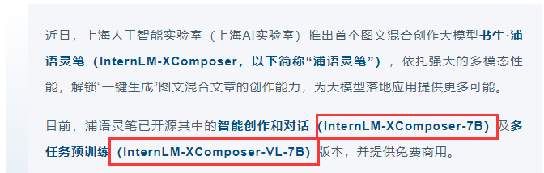
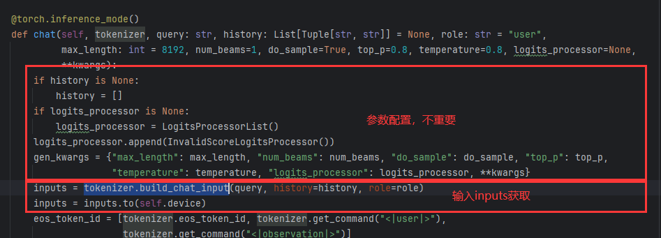
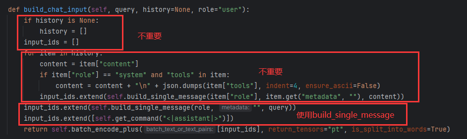
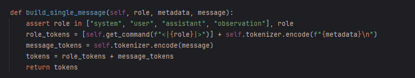
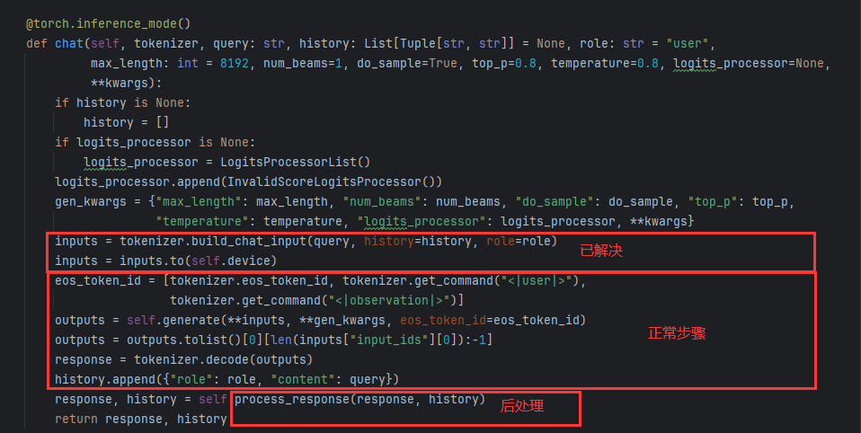
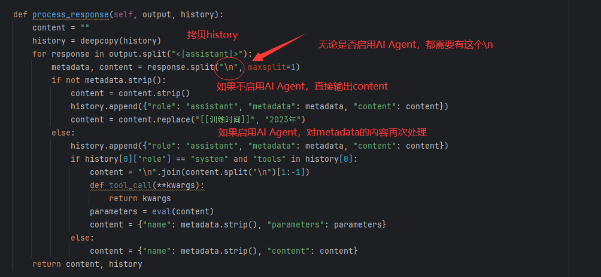

## PEFT也有办不到的？

在BitFit调参部分，介绍了计算模型显存开销的计算方式，以1.3B模型为例：

    model size: 1.3B
    
    model:1.3Gb * 4 = 5.2Gb
    
    gradient: 1.3Gb * 4 = 5.2Gb
    
    optimizer: 1.3Gb * 4 * 2 = 10.4Gb
    
    sum: 20.8Gb

然后介绍了基于PEFT的主流局部调参的办法，prompt-tuning，p-tuning，prefix-tuning，lora，IA3。前三个tuning的方式是做一个重参数层，用一个prompt监督训练的方式进行微调，把大模型调参转化为prompt局部网络调参。后两个的方式是对模型内部的某些特定注意力层和网络层进行参数调整，学习一个低参数向量，只更新这个参数，最后把更新好的参数加到原模型中，把大模型调参转化为可学习向量调优。

****
> 思考：这些调参方式的共性是什么？

他们都没有对模型本身的参数进行瘦身，只是对更新的东西进行了选择。
****

基于这个思考，假设现在有一个7B参数的模型，实际上这种模型已经存在很多：



我们如果想要加载这样一个7B模型，需要多少显存呢？

    model size: 7B
    
    model:7Gb * 4 = 28Gb

不训练，光是加载，一张3090或者4090这种消费级显卡已经无法升任。在这种情况下，PEFT的方案似乎只有在更高显存的专业显卡上执行。实际上很多实验室连一张24Gb显卡都没有，因此，需要提出另外一种训练微调的方式——直接对模型瘦身。

当然，直接删掉一些网络层对模型魔改也是可以的，对于7B模型，如果是魔改，大刀阔斧之下，模型性能还能保障吗？如果不删掉网络层，最有效的办法就是降低模型每个参数占用的字节数。

在上面计算模型显存开销时，我们的公式是4Bytes * 参数量，一个参数占用4个字节。默认的数值精度是单精度fp32，用32bits表示4bytes，这时如果用fp16（半精度），bfloat16，fp4（低精度）等这种，就能对模型大瘦身。

那既然这样，为什么所有主流模型设计都还是用4bytes而不是2bytes呢，虽然现在的大模型有低精度半精度的版本，但是为什么还是要开源base版呢？当然，获得了瘦身的好处，也要付出瘦身的代价。以FP16为例，最大的问题就是数据溢出，出现这种情况，loss就会不收敛，甚至爆炸。举个最简单的例子，Adam优化器的epsilon默认1e-8，而fp16最小值是6.1e-5，就会直接导致FP16数据下溢出，然后被默认为0。

| 数据存储类型   | $x_{mins}$            | $x_{min}$              | $x_{max}$             |
|----------|-----------------------|------------------------|-----------------------| 
| fp32     | $1.4 \times 10^{-45}$ | $1.18 \times 10^{-38}$      | $3.4 \times 10^{38}$  |
| fp16     | $5.96 \times 10^{-8}$ | $6.1 \times 10^{-5}$   | $6.55 \times 10^{4}$  |
| bf16     | 无                     | $1.18 \times 10^{-38}$ | $3.39 \times 10^{38}$ |

为了解决fp16的储存限制，英特尔计划在其即将推出的Nervana神经网络处理器中支持bfloat16(bf16)，于2018年11月发布了一份白皮书，对该格式进行了精确定义。可惜的是，目前bf16并不是所有GPU都支持。

> **注意，后面的内容会基于7B左右模型展开，建议去modelscope下载modelscope/Llama-2-7b-ms和ZhipuAI/chatglm3-6b，hugging face太慢了！如何在modelscope下载模型查阅[ModelScope(国内网络模型下载)](nlp/modelscope/)章节内容即可**

## 如何启用半精度训练

> 方法1

`model=model.half()`或`model=model.float16()`

这种方式的弊端在于model在第一次定义的时候仍然是单精度加载，就像前面说，加载模型并不是一个很便宜的事。

> 方法2

`model=AutoModelForxxx.from_pretrained('...', torch_dtype=torch.half)`

## 官方模型LlaMA2-7B半精度训练

LLaMA2是meta开源的Causal Mask Language Model，常规步骤代码复用之前的即可。

### 前期工作Step1 导入工具包


```python
from datasets import Dataset
from transformers import AutoTokenizer, AutoModelForCausalLM, DataCollatorForSeq2Seq, TrainingArguments, Trainer
```

### 前期工作Step2 加载数据集


```python
dataset = Dataset.load_from_disk('alpaca_data_zh/')
```

### Step3 LlaMa2数据预处理

```python
tokenizer = AutoTokenizer.from_pretrained('D:\pretrained_models\modelscope\Llama-2-7b-ms')

# 这里tokenizer默认左padding，需要设置为右padding才能保证loss收敛
tokenizer.padding_side = 'right'

# tokenizer.pad_token设置为和tokenizer.eos_token_id一样的结果才能保证loss收敛
tokenizer.pad_token = 2

tokenizer
```


    LlamaTokenizerFast(name_or_path='D:\pretrained_models\modelscope\Llama-2-7b-ms', vocab_size=32000, model_max_length=1000000000000000019884624838656, is_fast=True, padding_side='right', truncation_side='right', special_tokens={'bos_token': AddedToken("<s>", rstrip=False, lstrip=False, single_word=False, normalized=True), 'eos_token': AddedToken("</s>", rstrip=False, lstrip=False, single_word=False, normalized=True), 'unk_token': AddedToken("<unk>", rstrip=False, lstrip=False, single_word=False, normalized=True), 'pad_token': 2}, clean_up_tokenization_spaces=False)


这里对之前的工作做了修订，在LlaMa2中，由于词表的问题，如果把[eos]放在response的结尾然后编码输入再拼接，会发现inputs_ids的最后不是tokenizer.eos_token_id，也就是2，因此需要手动处理一下，如果不放在respones中自动处理，那就在labels，attention_mask，input_ids后面手动加上。
```python
def process_func(example, MAX_LENGTH = 384):
    instruction = tokenizer("\n".join(['Human: ' + example['instruction'], example['input']]).strip() + '\n\nAssistant: ', add_special_tokens=False)
    response = tokenizer(example['output'], add_special_tokens=False)
    input_ids = instruction['input_ids'] + response['input_ids'] + [tokenizer.eos_token_id]
    attention_mask = instruction['attention_mask'] + response['attention_mask'] + [1]
    labels = [-100] * len(instruction['input_ids']) + response['input_ids'] + [tokenizer.eos_token_id]
    if len(input_ids) > MAX_LENGTH:
        input_ids = input_ids[:MAX_LENGTH]
        attention_mask = attention_mask[:MAX_LENGTH]
        labels = labels[:MAX_LENGTH]
    return {
        'input_ids': input_ids,
        'attention_mask': attention_mask,
        'labels': labels
    }

tokenized_dataset = dataset.map(process_func, remove_columns=dataset.column_names)
```

### Step4 导入模型


```python
import torch
model = AutoModelForCausalLM.from_pretrained('D:\pretrained_models\modelscope\Llama-2-7b-ms', torch_dtype=torch.half, device_map='auto')
```


###  LoRa

####  PEFT Step1 配置文件


```python
from peft import get_peft_model, LoraConfig, TaskType

config = LoraConfig(task_type=TaskType.CAUSAL_LM)
config
```


    LoraConfig(peft_type=<PeftType.LORA: 'LORA'>, auto_mapping=None, base_model_name_or_path=None, revision=None, task_type=<TaskType.CAUSAL_LM: 'CAUSAL_LM'>, inference_mode=False, r=8, target_modules=None, lora_alpha=8, lora_dropout=0.0, fan_in_fan_out=False, bias='none', modules_to_save=None, init_lora_weights=True, layers_to_transform=None, layers_pattern=None)


####  PEFT Step2 创建模型


```python
model = get_peft_model(model, config)

# 执行gradient_checkpointing=True需设置
model.enable_input_require_grads()

model.print_trainable_parameters()
```

    trainable params: 4,194,304 || all params: 6,742,609,920 || trainable%: 0.06220594176090199
    

此时模型已经加载了LoRa配置。

    PeftModelForCausalLM(
      (base_model): LoraModel(
        (model): LlamaForCausalLM(
          (model): LlamaModel(
            (embed_tokens): Embedding(32000, 4096, padding_idx=0)
            (layers): ModuleList(
              (0-31): 32 x LlamaDecoderLayer(
                (self_attn): LlamaAttention(
                  (q_proj): Linear(
                    in_features=4096, out_features=4096, bias=False
                    (lora_dropout): ModuleDict(
                      (default): Identity()
                    )
                    (lora_A): ModuleDict(
                      (default): Linear(in_features=4096, out_features=8, bias=False)
                    )
                    (lora_B): ModuleDict(
                      (default): Linear(in_features=8, out_features=4096, bias=False)
                    )
                    (lora_embedding_A): ParameterDict()
                    (lora_embedding_B): ParameterDict()
                  )
                  (k_proj): Linear(in_features=4096, out_features=4096, bias=False)
                  (v_proj): Linear(
                    in_features=4096, out_features=4096, bias=False
                    (lora_dropout): ModuleDict(
                      (default): Identity()
                    )
                    (lora_A): ModuleDict(
                      (default): Linear(in_features=4096, out_features=8, bias=False)
                    )
                    (lora_B): ModuleDict(
                      (default): Linear(in_features=8, out_features=4096, bias=False)
                    )
                    (lora_embedding_A): ParameterDict()
                    (lora_embedding_B): ParameterDict()
                  )
                  (o_proj): Linear(in_features=4096, out_features=4096, bias=False)
                  (rotary_emb): LlamaRotaryEmbedding()
                )
                (mlp): LlamaMLP(
                  (gate_proj): Linear(in_features=4096, out_features=11008, bias=False)
                  (up_proj): Linear(in_features=4096, out_features=11008, bias=False)
                  (down_proj): Linear(in_features=11008, out_features=4096, bias=False)
                  (act_fn): SiLUActivation()
                )
                (input_layernorm): LlamaRMSNorm()
                (post_attention_layernorm): LlamaRMSNorm()
              )
            )
            (norm): LlamaRMSNorm()
          )
          (lm_head): Linear(in_features=4096, out_features=32000, bias=False)
        )
      )
    )


### 前期工作Step5 配置训练参数


```python
args = TrainingArguments(
    output_dir = './llama',
    per_device_train_batch_size=2,
    gradient_accumulation_steps=8,
    logging_steps=10,
    num_train_epochs=1,
    gradient_checkpointing=True
)
```

### 前期工作Step6 配置trainer


```python
trainer = Trainer(
    args = args,
    train_dataset=tokenized_dataset,
    model = model,
    data_collator = DataCollatorForSeq2Seq(tokenizer=tokenizer, padding=True)
)
```

### 前期工作Step7 模型训练


```python
trainer.train()
```

### 思考

加载模型的时候选择半精度加载，但是导入的LoRa并不是半精度的，所以可以在导入LoRa后使用方法1改成全局半精度：

```python
model = model.half()
```

但随之而来就会伴随一个问题， 正如前面提到的，FP16的下精度只能到$6.1 \times 10^{-5}$，因此Adam的epsilon为$10^{-8}$时就会被默认设置为0，无法正常训练。因此如果需要修改args参数：

```python
args = TrainingArguments(
    output_dir = './llama',
    per_device_train_batch_size=2,
    gradient_accumulation_steps=8,
    logging_steps=10,
    num_train_epochs=1,
    # gradient_checkpointing=True,
    adam_epsilon=1e-4
)
```

但epsilon贸然扩大10000倍，模型的稳定性也会受到一定影响。所以，如果非要全局半精度，最好的办法则是开启bf16模式（如果不支持bf16，非要全量半精度的话，还是调大epsilon吧），那么需要对如下参数进行修改：

> 导入模型

```python
model = AutoModelForCausalLM.from_pretrained('D:\pretrained_models\modelscope\Llama-2-7b-ms', torch_dtype=torch.bfloat16, device_map='auto')
```

> 合并LoRa后二次修改

```python
model = model.bfloat16()
```

并且，如果设置bf16，那么前面数据预处理提到的设置`tokenizer.pad_token = 2`实际上是可以不用设置的。

**建议：当遇到loss消失或爆炸，大概率是fp16导致数据溢出，但这类问题排查相当困难。因此如果GPU支持bf16，尽量选择bf16方案，会少遇到很多奇奇怪怪的bug**

### 显存对比

| 条件                                 | 初始显存占用 | 训练加载   | 训练显存占用 |
|------------------------------------|--------|--------|--------|
| per_device_train_batch_size=1      | 1.5Gb  | 14.9Gb | 19.1Gb |
| per_device_train_batch_size=2      | 1.5Gb  | 14.9Gb | 23.4Gb |
| per_device_train_batch_size=2<br/>gradient_checkpointing=True | 1.5Gb  | 14.9Gb | 15.8Gb |

## 民科模型ChatGLM3-6B半精度训练

在[文本摘要任务解决方案-民间科学](nlp/huggingface/abstract/)中介绍了GLM模型，它是一个只用了encoder结构的生成模型。它首先把一段文本的部分token做掩码处理，然后让模型输入掩码的句子，预测缺失的token，并且带有绝对位置和相对位置信息用来定位预测的token具体位置。

它的数据格式为：带[MASK]或[gMASK]的原始inputs + [sop] + targets + [eop]

ChatGLM第一代延续GLM训练方式，只不过换成了问答的形式，数据格式为：prompt [gMASK] [sop] Response [eop]

ChatGLM第二代采用Causal LM的方式进行训练，数据格式为：[gMASK] [sop] Prompt Response [eos]

ChatGLM第三代加入AI Agent功能，重新设计Prompt模板。

> 注意：由于ChatGLM3和LlaMA2在半精度微调代码上很多都是一致的，最大的区别在于如何加载ChatGLM3这种民间大模型，如何处理数据规范格式，因此在ChatGLM3就不做bf16以及`gradient_checkpointing=True or False`的设置，不再进行显存开销对比实验，重点放在模型加载和数据格式获取。学会这一套，无论是民间大模型还是官方大模型，都可以直接上手开干！

### 获取ChatGLM3的数据模板

由于ChatGLM3和很多民间大牛开发的LLM一样，并不属于hugging face官方指定的模型，因此不能沿用LlaMA2的那套数据处理模板，需要自己把数据处理成需要的格式。看论文获取数据格式又显得过于繁琐，这里直接从源码入手：

> 导入tokenizer和model并进行简单的推理

```python
from transformers import AutoModel, AutoTokenizer
import torch

tokenizer = AutoTokenizer.from_pretrained('D:/pretrained_models/ZhipuAI/chatglm3-6b/', trust_remote_code=True)
model = AutoModel.from_pretrained('D:/pretrained_models/ZhipuAI/chatglm3-6b/', trust_remote_code=True, low_cpu_mem_usage=True, torch_dtype=torch.half, device_map='auto')
model.chat(tokenizer, '如何准备数据分析师面试？', history=[])
```

    ('为了帮助您更好地准备数据分析师面试，我为您提供了以下建议：\n\n1. 了解面试官和公司：在面试前，了解面试官和公司的背景、业务范围以及数据分析师在团队中的角色。这将有助于您在面试过程中表现出对公司和职位的关注。\n\n2. 准备基础知识：熟练掌握数据分析师所需的基本知识，如统计学、数据建模、数据可视化等。复习相关概念、公式和算法，以便在面试中能够自如地讨论。\n\n3. 学习业务案例：研究数据分析在业务场景中的应用，了解如何从海量数据中挖掘有价值的信息。这将帮助您在面试中展示出对实际业务问题的理解。\n\n4. 练习编程技能：掌握常见的数据分析编程语言，如Python、R或SQL。熟悉常用的数据分析库和工具，如pandas、numpy、matplotlib、seaborn、sklearn等。在面试过程中，展示您对编程技能的熟练程度。\n\n5. 了解数据仓库和数据库：熟悉数据仓库的基本概念，如ETL（提取、转换、加载）过程，以及关系型数据库和非关系型数据库（如MongoDB）的使用。\n\n6. 项目经验展示：准备一个或多个数据分析项目案例，展示您在实际工作中解决实际问题的能力。包括数据收集、数据清洗、数据分析和可视化等步骤。\n\n7. 增强沟通能力：练习如何用简洁、明了的语言解释复杂的数据分析概念。注意在面试过程中，与面试官保持良好的眼神交流，展示自信和专业的态度。\n\n8. 提前练习：在面试前，进行多次模拟面试，以熟悉面试流程和题型。这有助于您在面试中更加从容应对。\n\n9. 准备简历和求职信：确保您的简历和求职信突出您的数据分析师技能和经验。在面试前，通读一遍自己的简历，以便在面试中能够顺利回答与简历相关的问题。\n\n10. 保持积极和自信：在面试过程中，保持积极、专业的态度，展示出对数据分析师职位的热情。面试官喜欢自信的应聘者，所以要相信自己，展现出最佳状态。',
     [{'role': 'user', 'content': '如何准备数据分析师面试？'},
      {'role': 'assistant',
       'metadata': '',
       'content': '为了帮助您更好地准备数据分析师面试，我为您提供了以下建议：\n\n1. 了解面试官和公司：在面试前，了解面试官和公司的背景、业务范围以及数据分析师在团队中的角色。这将有助于您在面试过程中表现出对公司和职位的关注。\n\n2. 准备基础知识：熟练掌握数据分析师所需的基本知识，如统计学、数据建模、数据可视化等。复习相关概念、公式和算法，以便在面试中能够自如地讨论。\n\n3. 学习业务案例：研究数据分析在业务场景中的应用，了解如何从海量数据中挖掘有价值的信息。这将帮助您在面试中展示出对实际业务问题的理解。\n\n4. 练习编程技能：掌握常见的数据分析编程语言，如Python、R或SQL。熟悉常用的数据分析库和工具，如pandas、numpy、matplotlib、seaborn、sklearn等。在面试过程中，展示您对编程技能的熟练程度。\n\n5. 了解数据仓库和数据库：熟悉数据仓库的基本概念，如ETL（提取、转换、加载）过程，以及关系型数据库和非关系型数据库（如MongoDB）的使用。\n\n6. 项目经验展示：准备一个或多个数据分析项目案例，展示您在实际工作中解决实际问题的能力。包括数据收集、数据清洗、数据分析和可视化等步骤。\n\n7. 增强沟通能力：练习如何用简洁、明了的语言解释复杂的数据分析概念。注意在面试过程中，与面试官保持良好的眼神交流，展示自信和专业的态度。\n\n8. 提前练习：在面试前，进行多次模拟面试，以熟悉面试流程和题型。这有助于您在面试中更加从容应对。\n\n9. 准备简历和求职信：确保您的简历和求职信突出您的数据分析师技能和经验。在面试前，通读一遍自己的简历，以便在面试中能够顺利回答与简历相关的问题。\n\n10. 保持积极和自信：在面试过程中，保持积极、专业的态度，展示出对数据分析师职位的热情。面试官喜欢自信的应聘者，所以要相信自己，展现出最佳状态。'}])

可以发现推理的结果和之前GLM的分布完全不同，我们查看`model.chat`源码：



接下来我们继续定位到`tokenizer.build_chat_input`：



然后我们看`build_singel_message`：



当role都是user时，需要调用`get_command`方法来获取tokens_id。

大概理清逻辑后，所以我们用刚刚的测试案例写一个代码看看：

```python
tokenizer.build_chat_input('如何准备数据分析师面试？', history=[], role='user')
```

    {'input_ids': tensor([[64790, 64792, 64795, 30910,    13, 51310, 32080, 31786, 43454, 33605,
         31514, 64796]]), 'attention_mask': tensor([[1, 1, 1, 1, 1, 1, 1, 1, 1, 1, 1, 1]]), 'position_ids': tensor([[ 0,  1,  2,  3,  4,  5,  6,  7,  8,  9, 10, 11]])}

然后我们解码这个input_ids就是他的数据输入格式了：

```python
tokenizer.decode([64790, 64792, 64795, 30910,    13, 51310, 32080, 31786, 43454, 33605, 31514, 64796])
```

    '[gMASK]sop<|user|> \n 如何准备数据分析师面试？<|assistant|>'

这里的\n不出意外，就是`build_singel_message`源码中对应的`self.tokenizer.encode(f"{metadata}\n")`，由于没有输入metadata，所以只返回了\n。

然后继续看`model.chat`，在取到outputs之后放到history存储，推理就应该结束了，但是他增加了一个`process_response`操作：



点开`process_response`源码继续看：



所以数据格式的核心就是用`build_chat_input`的格式，然后把\n拼在response的前面。因此处理好的数据应该是这样的：

    [gMASK]sop<|user|> \n 如何准备数据分析师面试？<|assistant|> \n response [eos]

### 前期工作Step1 导入工具包

```python
from datasets import Dataset
from transformers import AutoTokenizer, AutoModelForCausalLM, DataCollatorForSeq2Seq, TrainingArguments, Trainer
```

### 前期工作Step2 加载数据集


```python
dataset = Dataset.load_from_disk('alpaca_data_zh/')
```

### Step3 LLaMa2数据预处理


```python
tokenizer = AutoTokenizer.from_pretrained('D:/pretrained_models/ZhipuAI/chatglm3-6b-base/', trust_remote_code=True)
tokenizer
```

    ChatGLMTokenizer(name_or_path='D:/pretrained_models/ZhipuAI/chatglm3-6b-base/', vocab_size=64798, model_max_length=1000000000000000019884624838656, is_fast=False, padding_side='left', truncation_side='right', special_tokens={}, clean_up_tokenization_spaces=False)

```python
def process_func(example, MAX_LENGTH = 384):
    instruction = "\n".join([example['instruction'], example['input']]).strip()
    instruction = tokenizer.build_chat_input(instruction, history=[], role='user') # [gMASK]sop<|user|> \n 如何准备数据分析师面试？
    response  = tokenizer('\n' + example['output'], add_special_tokens=False)      # [gMASK]sop<|user|> \n 如何准备数据分析师面试？\n response
    input_ids = instruction['input_ids'][0].numpy().tolist() + response['input_ids'] + [tokenizer.eos_token_id] # [gMASK]sop<|user|> \n 如何准备数据分析师面试？\n response [eos]
    attention_mask = instruction['attention_mask'][0].numpy().tolist() + response['attention_mask'] + [1]
    labels = [-100] * len(instruction['input_ids'][0].numpy().tolist()) + response['input_ids'] + [tokenizer.eos_token_id]
    if len(input_ids) > MAX_LENGTH:
        input_ids = input_ids[:MAX_LENGTH]
        attention_mask = attention_mask[:MAX_LENGTH]
        labels = labels[:MAX_LENGTH]
    return {
        'input_ids': input_ids,
        'attention_mask': attention_mask,
        'labels': labels
    }

tokenized_dataset = dataset.map(process_func, remove_columns=dataset.column_names)
```

```python
tokenizer.decode(tokenized_dataset[1]['input_ids'])
```

    '[gMASK]sop<|user|> \n 解释为什么以下分数等同于1/4\n输入：4/16<|assistant|> \n4/16等于1/4是因为我们可以约分分子分母都除以他们的最大公约数4，得到（4÷4）/ (16÷4）=1/4。分数的约分是用分子和分母除以相同的非零整数，来表示分数的一个相同的值，这因为分数实际上表示了分子除以分母，所以即使两个数同时除以同一个非零整数，分数的值也不会改变。所以4/16 和1/4是两种不同的书写形式，但它们的值相等。'

```python
tokenizer.decode(list(filter(lambda x: x!= -100, tokenized_dataset[1]['labels'])))
```

    '\n4/16等于1/4是因为我们可以约分分子分母都除以他们的最大公约数4，得到（4÷4）/ (16÷4）=1/4。分数的约分是用分子和分母除以相同的非零整数，来表示分数的一个相同的值，这因为分数实际上表示了分子除以分母，所以即使两个数同时除以同一个非零整数，分数的值也不会改变。所以4/16 和1/4是两种不同的书写形式，但它们的值相等。'

### Step4 导入模型


```python
import torch
model = AutoModelForCausalLM.from_pretrained('D:/pretrained_models/ZhipuAI/chatglm3-6b-base/', trust_remote_code=True, low_cpu_mem_usage=True, torch_dtype=torch.half, device_map='auto')
```

```python
model
```

    ChatGLMForConditionalGeneration(
      (transformer): ChatGLMModel(
        (embedding): Embedding(
          (word_embeddings): Embedding(65024, 4096)
        )
        (rotary_pos_emb): RotaryEmbedding()
        (encoder): GLMTransformer(
          (layers): ModuleList(
            (0-27): 28 x GLMBlock(
              (input_layernorm): RMSNorm()
              (self_attention): SelfAttention(
                (query_key_value): Linear(in_features=4096, out_features=4608, bias=True)
                (core_attention): CoreAttention(
                  (attention_dropout): Dropout(p=0.0, inplace=False)
                )
                (dense): Linear(in_features=4096, out_features=4096, bias=False)
              )
              (post_attention_layernorm): RMSNorm()
              (mlp): MLP(
                (dense_h_to_4h): Linear(in_features=4096, out_features=27392, bias=False)
                (dense_4h_to_h): Linear(in_features=13696, out_features=4096, bias=False)
              )
            )
          )
          (final_layernorm): RMSNorm()
        )
        (output_layer): Linear(in_features=4096, out_features=65024, bias=False)
      )
    )

###  LoRa

####  PEFT Step1 配置文件

```python
from peft import get_peft_model, LoraConfig, TaskType

config = LoraConfig(task_type=TaskType.CAUSAL_LM,
                    target_modules = ['query_key_value'],
                   )
config
```

    LoraConfig(peft_type=<PeftType.LORA: 'LORA'>, auto_mapping=None, base_model_name_or_path=None, revision=None, task_type=<TaskType.CAUSAL_LM: 'CAUSAL_LM'>, inference_mode=False, r=8, target_modules=['query_key_value'], lora_alpha=8, lora_dropout=0.0, fan_in_fan_out=False, bias='none', modules_to_save=None, init_lora_weights=True, layers_to_transform=None, layers_pattern=None)

####  PEFT Step2 创建模型


```python
model = get_peft_model(model, config)
```

```python
model.print_trainable_parameters()
```

    trainable params: 1,949,696 || all params: 6,245,533,696 || trainable%: 0.031217444255383614

### 前期工作Step5 配置训练参数

```python
args = TrainingArguments(
    output_dir = './chatglm3',
    per_device_train_batch_size=2,
    gradient_accumulation_steps=16,
    logging_steps=10,
    num_train_epochs=1,
)
```

### 前期工作Step6 配置trainer

```python
trainer = Trainer(
    args = args,
    train_dataset=tokenized_dataset,
    model = model,
    data_collator = DataCollatorForSeq2Seq(tokenizer=tokenizer, padding=True)
)
```

### 前期工作Step7 模型训练

```python
trainer.train()
```

### Step8 推理

```python
model.eval()
print(model.chat(tokenizer, "如何准备数据分析师面试？", history=[])[0])
```

由于没有完整训练，这里就只放出推理的代码，不展示推理结果了。

### 显存开销

| 条件                            | 初始显存占用 | 训练加载   | 训练显存占用 |
|-------------------------------|--------|--------|--------|
| per_device_train_batch_size=2 | 1.2Gb  | 13.5Gb | 17.7Gb |

### 民科模型微调的一个技巧

在`LoraConfig`中，我们指定了任务`task_type=TaskType.CAUSAL_LM`，这是因为论文提到了ChatGLM3是延用的ChatGLM2的Causal LM训练，实际上有一些大模型是不知道任务类型的。因此我们可以在这里不指定这个任务，但是需要在`args`中指明`remove_unused_columns=False`。

```python
config = LoraConfig(target_modules = ['query_key_value'])

args = TrainingArguments(
    output_dir = './chatglm3',
    per_device_train_batch_size=2,
    gradient_accumulation_steps=16,
    logging_steps=10,
    num_train_epochs=1,
    remove_unused_columns=False
)
```