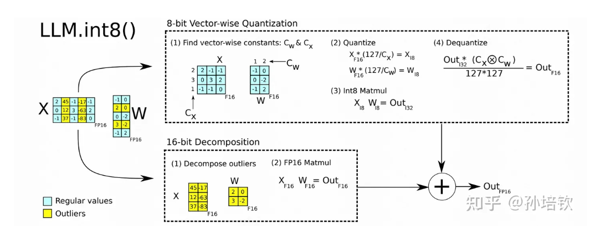

## 什么是量化

在前面，我们介绍了冻结参数的和基于peft的微调算法，以及半精度训练，使得我们可以在自己的机器上微调庞大的语言模型进行下游数据的训练，现在我们需要来思考一下推理成本。

训练好的大模型在进行部署时，无论是推理速度还是推理功耗，都和参数量紧密相关，大模型部署对GPU资源的消耗依然巨大，量化(Quantization)可以很好地将float模型表征为低位宽模型实现减小模型存储空间（FP32>FP16>INT8）, 加速模型推理的目标。

截至目前（2023年11月），量化的研究基本全部集中在对线性层网络算子，下面我们也以线性层算子举例，带大家直观感受一下一种最常见的INT8量化计算：

```python
x = [3.5, 5.1, -5.8, 4.8]
x_absmax = max([abs(i) for i in x])
scale = 127 / x_absmax
quantization = [round(i*scale) for i in x]
quantization
```

    [77, 112, -127, 105]

假设线性层算子是[3.5, 5.1, -5.8, 4.8]，那么他的绝对值最大值是5.8，因为INT8最大127，这样就可以得到这些算子在INT8上的映射，然后隐射（缩放）到INT8上即可。

当然，如果想要反过来把INT8数据还原，只需要除以一个scale即可。

```python
anti_quantization = [round(q/scale,2) for q in quantization]
anti_quantization
```

    [3.52, 5.11, -5.8, 4.8]

可以发现，由于INT8是把结果限定在整数上，如果我们反量化回去，那么数值的精度就会出现一些偏差。解决这种差异的办法就是更多的scale。

除了有些许偏差外（至少在这个例子中，这个偏差还是可以接受的），这种方式还有一个问题：

```python
x = [3.5, 5.1, -5.8, 99]
x_absmax = max([abs(i) for i in x])
scale = 127 / x_absmax
quantization = [round(i*scale) for i in x]
quantization
```

    [4, 7, -7, 127]

```python
anti_quantization = [round(q/scale,2) for q in quantization]
anti_quantization
```

    [3.12, 5.46, -5.46, 99.0]

当一个数过大时（又被称为离群值），就会让这个偏差变得不可接受。 不幸的是，研究表明，在线性层网络的算子中，这种离群值并不罕见。

因此，这里要介绍的第一个量化，也就是传说中的8bits量化：



8bits量化的思想非常简单，既然有离群值，那就设置一个阈值来把这些离群值找出来，离群值用FP16来进行单独处理，非离群值该怎么量化怎么量化。然后把正常的值最终再映射到FP16和这些离群值合并相加，获得最终FP16的结果。

## LlaMA2的8bit/16bit混合精度训练

为什么是混合训练呢？回到开头说的，截至目前，量化的研究基本全部集中在对线性层网络算子，因此`LLM.int8()`一般只在线性层使用。但后面我们打印模型的时候会看到，fp16的网络层很少，基本都是int8，所以说是8bit训练也不为过。

### 前期工作Step1 导入工具包


```python
from datasets import Dataset
from transformers import AutoTokenizer, AutoModelForCausalLM, DataCollatorForSeq2Seq, TrainingArguments, Trainer
```

    bin D:\anaconda\envs\transformer\lib\site-packages\bitsandbytes\libbitsandbytes_cuda121.dll
    

### 前期工作Step2 加载数据集


```python
dataset = Dataset.load_from_disk('alpaca_data_zh/')
```

### Step3 LLaMa2数据预处理


```python
tokenizer = AutoTokenizer.from_pretrained('D:\pretrained_models\modelscope\Llama-2-7b-ms')

# 这里tokenizer默认左padding，需要设置为右padding才能保证loss收敛
tokenizer.padding_side = 'right'

# tokenizer.pad_token设置为和tokenizer.eos_token_id一样的结果才能保证loss收敛
tokenizer.pad_token = 2

tokenizer
```


    LlamaTokenizerFast(name_or_path='D:\pretrained_models\modelscope\Llama-2-7b-ms', vocab_size=32000, model_max_length=1000000000000000019884624838656, is_fast=True, padding_side='right', truncation_side='right', special_tokens={'bos_token': AddedToken("<s>", rstrip=False, lstrip=False, single_word=False, normalized=True), 'eos_token': AddedToken("</s>", rstrip=False, lstrip=False, single_word=False, normalized=True), 'unk_token': AddedToken("<unk>", rstrip=False, lstrip=False, single_word=False, normalized=True), 'pad_token': 2}, clean_up_tokenization_spaces=False)


```python
def process_func(example, MAX_LENGTH = 384):
    instruction = tokenizer("\n".join(['Human: ' + example['instruction'], example['input']]).strip() + '\n\nAssistant: ', add_special_tokens=False)
    response = tokenizer(example['output'], add_special_tokens=False)
    input_ids = instruction['input_ids'] + response['input_ids'] + [tokenizer.eos_token_id]
    attention_mask = instruction['attention_mask'] + response['attention_mask'] + [1]
    labels = [-100] * len(instruction['input_ids']) + response['input_ids'] + [tokenizer.eos_token_id]
    if len(input_ids) > MAX_LENGTH:
        input_ids = input_ids[:MAX_LENGTH]
        attention_mask = attention_mask[:MAX_LENGTH]
        labels = labels[:MAX_LENGTH]
    return {
        'input_ids': input_ids,
        'attention_mask': attention_mask,
        'labels': labels
    }

tokenized_dataset = dataset.map(process_func, remove_columns=dataset.column_names)
```


### Step4 导入模型


```python
import torch
model = AutoModelForCausalLM.from_pretrained('D:\pretrained_models\modelscope\Llama-2-7b-ms',
                                             torch_dtype=torch.half,
                                             load_in_8bit=True, # 开启8bit
                                             device_map='auto')
```


```python
for name, param in model.named_parameters():
    print(name, param.dtype)
```

    model.embed_tokens.weight torch.float16
    model.layers.0.self_attn.q_proj.weight torch.int8
    model.layers.0.self_attn.k_proj.weight torch.int8
    model.layers.0.self_attn.v_proj.weight torch.int8
    model.layers.0.self_attn.o_proj.weight torch.int8
    model.layers.0.mlp.gate_proj.weight torch.int8
    model.layers.0.mlp.up_proj.weight torch.int8
    model.layers.0.mlp.down_proj.weight torch.int8
    model.layers.0.input_layernorm.weight torch.float16
    model.layers.0.post_attention_layernorm.weight torch.float16
    model.layers.1.self_attn.q_proj.weight torch.int8
    model.layers.1.self_attn.k_proj.weight torch.int8
    model.layers.1.self_attn.v_proj.weight torch.int8
    model.layers.1.self_attn.o_proj.weight torch.int8
    model.layers.1.mlp.gate_proj.weight torch.int8
    model.layers.1.mlp.up_proj.weight torch.int8
    model.layers.1.mlp.down_proj.weight torch.int8
    model.layers.1.input_layernorm.weight torch.float16
    model.layers.1.post_attention_layernorm.weight torch.float16
    model.layers.2.self_attn.q_proj.weight torch.int8
    model.layers.2.self_attn.k_proj.weight torch.int8
    model.layers.2.self_attn.v_proj.weight torch.int8
    model.layers.2.self_attn.o_proj.weight torch.int8
    model.layers.2.mlp.gate_proj.weight torch.int8
    model.layers.2.mlp.up_proj.weight torch.int8
    model.layers.2.mlp.down_proj.weight torch.int8
    model.layers.2.input_layernorm.weight torch.float16
    model.layers.2.post_attention_layernorm.weight torch.float16
    model.layers.3.self_attn.q_proj.weight torch.int8
    model.layers.3.self_attn.k_proj.weight torch.int8
    model.layers.3.self_attn.v_proj.weight torch.int8
    model.layers.3.self_attn.o_proj.weight torch.int8
    model.layers.3.mlp.gate_proj.weight torch.int8
    model.layers.3.mlp.up_proj.weight torch.int8
    model.layers.3.mlp.down_proj.weight torch.int8
    model.layers.3.input_layernorm.weight torch.float16
    model.layers.3.post_attention_layernorm.weight torch.float16
    model.layers.4.self_attn.q_proj.weight torch.int8
    model.layers.4.self_attn.k_proj.weight torch.int8
    model.layers.4.self_attn.v_proj.weight torch.int8
    model.layers.4.self_attn.o_proj.weight torch.int8
    model.layers.4.mlp.gate_proj.weight torch.int8
    model.layers.4.mlp.up_proj.weight torch.int8
    model.layers.4.mlp.down_proj.weight torch.int8
    model.layers.4.input_layernorm.weight torch.float16
    ...
    

###  LoRA

####  PEFT Step1 配置文件


```python
from peft import get_peft_model, LoraConfig, TaskType

config = LoraConfig(task_type=TaskType.CAUSAL_LM)
config
```


    LoraConfig(peft_type=<PeftType.LORA: 'LORA'>, auto_mapping=None, base_model_name_or_path=None, revision=None, task_type=<TaskType.CAUSAL_LM: 'CAUSAL_LM'>, inference_mode=False, r=8, target_modules=None, lora_alpha=8, lora_dropout=0.0, fan_in_fan_out=False, bias='none', modules_to_save=None, init_lora_weights=True, layers_to_transform=None, layers_pattern=None)


####  PEFT Step2 创建模型


```python
model = get_peft_model(model, config)
```


```python
model.print_trainable_parameters()
```

    trainable params: 4,194,304 || all params: 6,742,609,920 || trainable%: 0.06220594176090199
    


```python
# 执行gradient_checkpointing=True需设置
model.enable_input_require_grads()
```

### 前期工作Step5 配置训练参数


```python
args = TrainingArguments(
    output_dir = './8bit',
    per_device_train_batch_size=2,
    gradient_accumulation_steps=8,
    logging_steps=10,
    num_train_epochs=1,
    gradient_checkpointing=True
)
```

### 前期工作Step6 配置trainer


```python
trainer = Trainer(
    args = args,
    train_dataset=tokenized_dataset,
    model = model,
    data_collator = DataCollatorForSeq2Seq(tokenizer=tokenizer, padding=True)
)
```

### 前期工作Step7 模型训练


```python
trainer.train()
```

### 显存对比

| 条件                                                                     | 初始显存占用 | 训练加载   | 训练显存占用 |
|------------------------------------------------------------------------|--------|--------|--------|
| per_device_train_batch_size=1                                          | 1.5Gb  | 14.9Gb | 19.1Gb |
| per_device_train_batch_size=2                                          | 1.5Gb  | 14.9Gb | 23.4Gb |
| per_device_train_batch_size=2<br/>gradient_checkpointing=True          | 1.5Gb  | 14.9Gb | 15.8Gb |
| per_device_train_batch_size=2<br/>gradient_checkpointing=True<br/>8INT | 1.9Gb  | 10.0Gb | 10.9Gb |


## ChatGLM3的8bit/16bit混合精度训练

只需要在加载模型的时候开启`load_in_8bit = True`即可，其他代码都完全复用。

> 显存对比

| 条件        | 初始显存占用 | 训练加载  | 训练显存占用 |
|------------|--------|-------|--------|
| 8INT       | 1.5Gb  | 9.4Gb | 13.0Gb |

## QLoRA

QLoRA就是LoRA的量化版本。由于LoRA微调时不需要更新原本的模型参数，可以对它们进行8bit甚至4bit量化存储，节省显存、加速训练。

在QloRA的论文中提到，微调65B的模型只需要48GB显存，并且效果不输16bit全参数微调。因此QLoRA被视作目前最重要节省显存的PEFT方法。

QLoRA提出两个主要技术：

- 4bit数据类型（4-bit NormalFloat, NF4），更适合对正态分布的权重做量化。
- 使用双量化技术（Double Quantization），进一步节省量化常数空间占用。

QLoRA 中，模型的权重有两种格式：用NF4存储；用BF16计算。需要用相应权重计算前向传播时，对NF4的权重反量化为BF16；计算结束后，再量化为NF4。

## LlaMA2的4bit/16bit混合精度训练

### 前期工作Step1 导入工具包


```python
from datasets import Dataset
from transformers import AutoTokenizer, AutoModelForCausalLM, DataCollatorForSeq2Seq, TrainingArguments, Trainer
```

    bin D:\anaconda\envs\transformer\lib\site-packages\bitsandbytes\libbitsandbytes_cuda121.dll
    

### 前期工作Step2 加载数据集


```python
dataset = Dataset.load_from_disk('alpaca_data_zh/')
```

### Step3 LLaMa2数据预处理


```python
tokenizer = AutoTokenizer.from_pretrained('D:\pretrained_models\modelscope\Llama-2-7b-ms')

# 这里tokenizer默认左padding，需要设置为右padding才能保证loss收敛
tokenizer.padding_side = 'right'

# tokenizer.pad_token设置为和tokenizer.eos_token_id一样的结果才能保证loss收敛
tokenizer.pad_token = 2

tokenizer
```


    LlamaTokenizerFast(name_or_path='D:\pretrained_models\modelscope\Llama-2-7b-ms', vocab_size=32000, model_max_length=1000000000000000019884624838656, is_fast=True, padding_side='right', truncation_side='right', special_tokens={'bos_token': AddedToken("<s>", rstrip=False, lstrip=False, single_word=False, normalized=True), 'eos_token': AddedToken("</s>", rstrip=False, lstrip=False, single_word=False, normalized=True), 'unk_token': AddedToken("<unk>", rstrip=False, lstrip=False, single_word=False, normalized=True), 'pad_token': 2}, clean_up_tokenization_spaces=False)


```python
def process_func(example, MAX_LENGTH = 384):
    instruction = tokenizer("\n".join(['Human: ' + example['instruction'], example['input']]).strip() + '\n\nAssistant: ', add_special_tokens=False)
    response = tokenizer(example['output'], add_special_tokens=False)
    input_ids = instruction['input_ids'] + response['input_ids'] + [tokenizer.eos_token_id]
    attention_mask = instruction['attention_mask'] + response['attention_mask'] + [1]
    labels = [-100] * len(instruction['input_ids']) + response['input_ids'] + [tokenizer.eos_token_id]
    if len(input_ids) > MAX_LENGTH:
        input_ids = input_ids[:MAX_LENGTH]
        attention_mask = attention_mask[:MAX_LENGTH]
        labels = labels[:MAX_LENGTH]
    return {
        'input_ids': input_ids,
        'attention_mask': attention_mask,
        'labels': labels
    }

tokenized_dataset = dataset.map(process_func, remove_columns=dataset.column_names)
```

### Step4 导入模型


```python
import torch
model = AutoModelForCausalLM.from_pretrained('D:\pretrained_models\modelscope\Llama-2-7b-ms',
                                             torch_dtype=torch.bfloat16,
                                             load_in_4bit=True, # 开启4bit
                                             bnb_4bit_use_double_quant=True, # 启用QLoRA双重量化
                                             bnb_4bit_quant_type="nf4", # 使用NF4存储
                                             bnb_4bit_compute_dtype=torch.bfloat16, # 使用BF16计算
                                             device_map='auto')
```


    Loading checkpoint shards:   0%|          | 0/2 [00:00<?, ?it/s]


```python
for name, param in model.named_parameters():
    print(name, param.dtype)
```

    model.embed_tokens.weight torch.bfloat16
    model.layers.0.self_attn.q_proj.weight torch.uint8
    model.layers.0.self_attn.k_proj.weight torch.uint8
    model.layers.0.self_attn.v_proj.weight torch.uint8
    model.layers.0.self_attn.o_proj.weight torch.uint8
    model.layers.0.mlp.gate_proj.weight torch.uint8
    model.layers.0.mlp.up_proj.weight torch.uint8
    model.layers.0.mlp.down_proj.weight torch.uint8
    model.layers.0.input_layernorm.weight torch.bfloat16
    model.layers.0.post_attention_layernorm.weight torch.bfloat16
    model.layers.1.self_attn.q_proj.weight torch.uint8
    model.layers.1.self_attn.k_proj.weight torch.uint8
    model.layers.1.self_attn.v_proj.weight torch.uint8
    model.layers.1.self_attn.o_proj.weight torch.uint8
    model.layers.1.mlp.gate_proj.weight torch.uint8
    model.layers.1.mlp.up_proj.weight torch.uint8
    model.layers.1.mlp.down_proj.weight torch.uint8
    model.layers.1.input_layernorm.weight torch.bfloat16
    model.layers.1.post_attention_layernorm.weight torch.bfloat16
    model.layers.2.self_attn.q_proj.weight torch.uint8
    model.layers.2.self_attn.k_proj.weight torch.uint8
    model.layers.2.self_attn.v_proj.weight torch.uint8
    model.layers.2.self_attn.o_proj.weight torch.uint8
    model.layers.2.mlp.gate_proj.weight torch.uint8
    model.layers.2.mlp.up_proj.weight torch.uint8
    model.layers.2.mlp.down_proj.weight torch.uint8
    model.layers.2.input_layernorm.weight torch.bfloat16
    model.layers.2.post_attention_layernorm.weight torch.bfloat16
    ...

    

###  QLoRA

####  PEFT Step1 配置文件


```python
from peft import prepare_model_for_kbit_training, LoraConfig, get_peft_model, TaskType

config = LoraConfig(task_type=TaskType.CAUSAL_LM)
config
```


    LoraConfig(peft_type=<PeftType.LORA: 'LORA'>, auto_mapping=None, base_model_name_or_path=None, revision=None, task_type=<TaskType.CAUSAL_LM: 'CAUSAL_LM'>, inference_mode=False, r=8, target_modules=None, lora_alpha=8, lora_dropout=0.0, fan_in_fan_out=False, bias='none', modules_to_save=None, init_lora_weights=True, layers_to_transform=None, layers_pattern=None, rank_pattern={}, alpha_pattern={})


####  PEFT Step2 创建模型

这里需要额外设置`use_cache=False`，`use_cache`是对解码速度的优化，它会使用KV cache，默认开启；如果同时使用gradient checkpoint，中间激活值不会存储，二者存在冲突。
```python
model = prepare_model_for_kbit_training(model)
model = get_peft_model(model, config)

# 执行gradient_checkpointing=True需设置
model.enable_input_require_grads()

# 当执行gradient_checkpointing=True时需设置
model.config.use_cache = False
```


```python
model.print_trainable_parameters()
```

    trainable params: 4,194,304 || all params: 6,742,609,920 || trainable%: 0.06220594176090199
    

### 前期工作Step5 配置训练参数


```python
args = TrainingArguments(
    output_dir = './4bit',
    per_device_train_batch_size=2,
    gradient_accumulation_steps=8,
    logging_steps=10,
    num_train_epochs=1,
    gradient_checkpointing=True
)
```

### 前期工作Step6 配置trainer


```python
trainer = Trainer(
    args = args,
    train_dataset=tokenized_dataset,
    model = model,
    data_collator = DataCollatorForSeq2Seq(tokenizer=tokenizer, padding=True)
)
```

### 前期工作Step7 模型训练


```python
trainer.train()
```


### 显存对比

| 条件                                    | 初始显存占用 | 训练加载  | 训练显存占用 |
|---------------------------------------|--------|-------|--------|
| QLoRA<br/>gradient_checkpointing=True | 1.2Gb  | 6.1Gb | 8.1Gb  |


## ChatGLM3的4bit/16bit混合精度训练

和之前一样，这里只放导入模型之后的代码。更改的地方只有加载QLoRA相关参数，model和LoraConfig合并时需转化为bit模式。

```python
import torch
model = AutoModelForCausalLM.from_pretrained('D:/pretrained_models/ZhipuAI/chatglm3-6b-base/', 
                                             trust_remote_code=True, 
                                             low_cpu_mem_usage=True, 
                                             torch_dtype=torch.bfloat16, 
                                             device_map='auto',
                                             load_in_4bit=True,
                                             bnb_4bit_use_double_quant=True, # 启用QLoRA双重量化
                                             bnb_4bit_quant_type="nf4", # 使用NF4存储
                                             bnb_4bit_compute_dtype=torch.bfloat16, # 使用BF16计算
                                            )
```

```python
from peft import prepare_model_for_kbit_training, LoraConfig, get_peft_model, TaskType

config = LoraConfig(task_type=TaskType.CAUSAL_LM,
                    target_modules = ['query_key_value'],
                   )

model = prepare_model_for_kbit_training(model)
model = get_peft_model(model, config)


model.enable_input_require_grads()
model.config.use_cache = False
```

```python
args = TrainingArguments(
    output_dir = './chatglm3-4bit',
    per_device_train_batch_size=2,
    gradient_accumulation_steps=16,
    logging_steps=10,
    num_train_epochs=1,
    remove_unused_columns=False,
    gradient_checkpointing=True
)

trainer = Trainer(
    args = args,
    train_dataset=tokenized_dataset,
    model = model,
    data_collator = DataCollatorForSeq2Seq(tokenizer=tokenizer, padding=True)
)

trainer.train()
```

> 显存对比

| 条件                                    | 初始显存占用 | 训练加载  | 训练显存占用 |
|---------------------------------------|--------|-------|--------|
| QLoRA<br/>gradient_checkpointing=True | 1.2Gb  | 5.7Gb | 8.3Gb  |