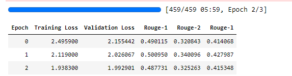
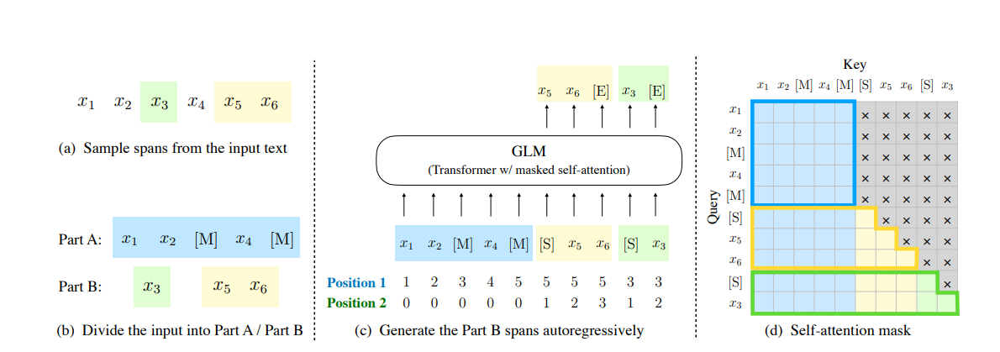
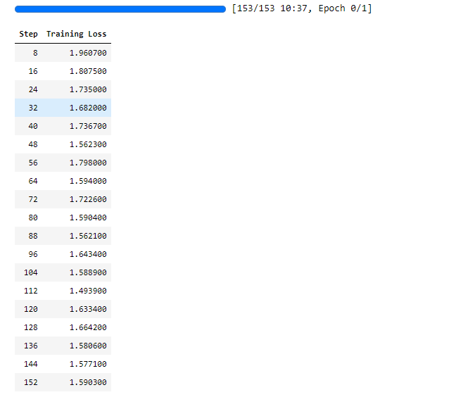

## 文本摘要任务简介

文本摘要(Text Summarization)任务是输入长单个或多个长文本，转化为简短的概要，且要求概要内容能够充分表达长文本的核心主要内容。表现形式上，和论文的Abstract一致。

> 评价指标：Rouge

Rouge-1(1-gram)，Rouge-2(2-gram)，Rouge-3(LCS，最长子序列)

| 真实文本        | Rouge-1       | Rouge-2           
|-------------|---------------|-------------------|
| 我爱北京        | 我 爱 北 京       | 我爱 爱北 北京          |
| 我爱北京天安门     | 我 爱 北 京 天 安 门 | 我爱 爱北 北京 京天 天安 安门 |

- Rouge-1 Precision=4/4, Recall=4/7, $F=\frac{2 \times P \times R}{(P+R)}=\frac{8}{11}$
- Rouge-2 Precision=3/3, Recall=3/6, $F=\frac{2 \times P \times R}{(P+R)}=\frac{2}{3}$
- Rouge-L Precision=4/4, Recall=4/7, $F=\frac{2 \times P \times R}{(P+R)}=\frac{8}{11}$

这个评价指标也可以直接调包计算：
```python
pip install rouge-chinese
```

## Transformers解决方案

本文摘要任务是序列到序列任务(Sequence2Sequence Task)，即输入一段序列，被encoder编码，然后通过decoder端输出一段序列。具体的原理可以参考[英译法](/nlp/rnn_seq2seq/)项目对Sequence2Sequence任务的介绍，简单来说就是encoder是双向注意力机制而decoder是单向的，decoder当前的输出是由encoder向量和生成的tokens向量决定。从Transformers的实现角度看，和[自回归模型训练](nlp/huggingface/pretrain/)的实现是大差不差的，只不过在生成第一个字的时候，是参考了[cls]和前面编码器的特征向量，多了一个encoder过程。

> 模型结构: XXModelForSeq2SeqLM

模型的数据流是：输入文本，进入encoder，拿到特征向量，进入decoder，经过分类头计算生成token的最大概率然后输出，然后再把encoder向量和生成的token向量放到decoder重复，直到生成[eos]结束。

### 编码器-解码器实现(推荐方案)

前面所有的步骤都和其他任务几乎一样，只需要在数据处理部分稍作更改。

导入工具包的时候Transformers提供了`Seq2SeqTrainer, Seq2SeqTrainingArguments`两个训练配置接口。不使用其他任务的`Trainer, TrainingArguments`。

#### Step1 导入工具包

```python
from transformers import AutoTokenizer, AutoModelForSeq2SeqLM, DataCollatorForSeq2Seq, Seq2SeqTrainer, Seq2SeqTrainingArguments
from datasets import Dataset
```

#### Step2 加载数据集


```python
dataset = Dataset.load_from_disk('nlpcc_2017/')
dataset
```

    Dataset({
        features: ['title', 'content'],
        num_rows: 5000
    })

```python
dataset = dataset.train_test_split(100, seed=42)
dataset
```

    DatasetDict({
        train: Dataset({
            features: ['title', 'content'],
            num_rows: 4900
        })
        test: Dataset({
            features: ['title', 'content'],
            num_rows: 100
        })
    })


```python
dataset['train'][0]
```


    {'title': '组图:黑河边防军人零下30℃户外训练,冰霜沾满眉毛和睫毛,防寒服上满是冰霜。',
     'content': '中国军网2014-12-1709:08:0412月16日,黑龙江省军区驻黑河某边防团机动步兵连官兵,冒着-30℃严寒气温进行体能训练,挑战极寒,锻造钢筋铁骨。该连素有“世界冠军的摇篮”之称,曾有5人24人次登上世界军事五项冠军的领奖台。(魏建顺摄)黑龙江省军区驻黑河某边防团机动步兵连官兵冒着-30℃严寒气温进行体能训练驻黑河某边防团机动步兵连官兵严寒中户外训练,防寒服上满是冰霜驻黑河某边防团机动步兵连官兵严寒中户外训练,防寒服上满是冰霜官兵睫毛上都被冻上了冰霜官兵们睫毛上都被冻上了冰霜驻黑河某边防团机动步兵连官兵严寒中进行户外体能训练驻黑河某边防团机动步兵连官兵严寒中进行户外体能训练驻黑河某边防团机动步兵连官兵严寒中进行户外体能训练'}


#### Step3 数据预处理

同样的导入tokenizer

```python
tokenizer = AutoTokenizer.from_pretrained('Langboat/mengzi-t5-base')
```

这里follow一下T5模型的结果，给每一个content前面加一个摘要生成。由于这里的label也是一个序列，因此需要对label也进行tokenizer.encode过程。

```python
def process_func(examples):
    # T5模型指令
    contents = ['摘要生成：\n' + example for example in examples['content']]
    inputs = tokenizer(contents, max_length=384, truncation=True)
    labels = tokenizer(text_target = examples['title'], max_length=64, truncation=True)
    inputs['labels'] = labels['input_ids']
    return inputs
```


```python
tokenized_dataset = dataset.map(process_func, batched=True)
tokenized_dataset
```

    DatasetDict({
        train: Dataset({
            features: ['title', 'content', 'input_ids', 'attention_mask', 'labels'],
            num_rows: 4900
        })
        test: Dataset({
            features: ['title', 'content', 'input_ids', 'attention_mask', 'labels'],
            num_rows: 100
        })
    })

标准的数据格式就是content前面有一个“摘要生成:”，结束的时候有一个[eos]，label的结束也有一个[eos]。对于生成模型而言，预测得到[eos]才是模型的停止。

```python
tokenizer.decode(tokenized_dataset['train'][0]['input_ids'])
```

    '摘要生成: 中国军网2014-12-1709:08:0412月16日,黑龙江省军区驻黑河某边防团机动步兵连官兵,冒着-30°C严寒气温进行体能训练,挑战极寒,锻造钢筋铁骨。该连素有“世界冠军的摇篮”之称,曾有5人24人次登上世界军事五项冠军的领奖台。(魏建顺摄)黑龙江省军区驻黑河某边防团机动步兵连官兵冒着-30°C严寒气温进行体能训练驻黑河某边防团机动步兵连官兵严寒中户外训练,防寒服上满是冰霜驻黑河某边防团机动步兵连官兵严寒中户外训练,防寒服上满是冰霜官兵睫毛上都被冻上了冰霜官兵们睫毛上都被冻上了冰霜驻黑河某边防团机动步兵连官兵严寒中进行户外体能训练驻黑河某边防团机动步兵连官兵严寒中进行户外体能训练驻黑河某边防团机动步兵连官兵严寒中进行户外体能训练</s>'


```python
tokenizer.decode(tokenized_dataset['train'][0]['labels'])
```

    '组图:黑河边防军人零下30°C户外训练,冰霜沾满眉毛和睫毛,防寒服上满是冰霜。</s>'


#### Step4 创建模型


```python
model = AutoModelForSeq2SeqLM.from_pretrained('Langboat/mengzi-t5-base')
```

#### Step5 创建评估函数

评估函数直接调用现成的工具包Rouge即可。Rouge要求输入预测的本文和真实的文本，返回一个score，这个score包含rouge-1，rouge-2和rouge-l。

由于预测的都是logits，因此需要把logits解码成文本，此外由于解码出来格式并不符合输入要求，需要用字符串拼接成需要的格式。

```python
from rouge_chinese import Rouge
import numpy as np

rouge = Rouge()

def compute_metric(pred):
    predictions, labels = pred
    decode_preds = tokenizer.batch_decode(predictions, skip_special_tokens=True)
    decode_preds = [' '.join(p) for p in decode_preds]
    
    labels = np.where(labels != -100, labels, tokenizer.pad_token_id)
    decode_labels = tokenizer.batch_decode(labels, skip_special_tokens=True)
    decode_labels = [' '.join(p) for p in decode_labels]
    
    scores = rouge.get_scores(decode_preds, decode_labels, avg=True)
    
    return {
        'rouge-1': scores['rouge-1']['f'],
        'rouge-2': scores['rouge-2']['f'],
        'rouge-l': scores['rouge-l']['f']
    }
```

#### Step6 配置训练参数

在Seq2Seq任务中，只需要注意把`predict_with_generate`设置为`True`。
```python
args = Seq2SeqTrainingArguments(
    output_dir = 'T5_summary',
    per_device_train_batch_size=8,
    gradient_accumulation_steps=4,
    per_device_eval_batch_size=8,
    logging_steps=8,
    fp16=True,
    save_strategy='epoch',
    evaluation_strategy='epoch',
    metric_for_best_model='rouge-l',
    # 生成模型需要设置
    predict_with_generate=True
)
```

#### Step7 创建Trainer


```python
trainer = Seq2SeqTrainer(
    model = model,
    args = args,
    tokenizer=tokenizer,
    train_dataset=tokenized_dataset['train'],
    eval_dataset =tokenized_dataset['test'],
    compute_metrics=compute_metric,
    data_collator = DataCollatorForSeq2Seq(tokenizer=tokenizer)
)
```

#### Step8 模型训练


```python
trainer.train()
```



#### Step9 推理


```python
from transformers import pipeline
```


```python
pipe = pipeline('text2text-generation', model=model, tokenizer=tokenizer, device=0)
```


```python
pipe('摘要生成:\n'+dataset['test'][-2]['content'], max_length=64, do_sample=True)
```

    [{'generated_text': '赣州一女子骑摩托车后不慎从积水中坠河中溺亡,在暴雨天气,女子骑摩托时不慎跌入积水路面,目前已溺亡;网友称系洪水冲上当路附近村民。'}]


```python
dataset['test'][-2]['title']
```

    '赣州一女子骑摩托车不听路人劝阻执意驶入积水路面,不慎跌入路边河道内失踪;被警方找到时已溺亡'

### 前缀语言模型实现(民间科学)

**注意：tansformers版本需要<=4.33.2**

前缀语言模型的代表就是GLM模型，他和T5的encoder-decoder结构不同，它只用了encoder。用论文的图来做一个简要解释：



具体而言，它会先掩码部分token，然后通过位置信息定位解码顺序，从识别到[MASK]开始生成。比如图里，拿到了x1 x2 [MASK] x4 [MASK]的encoder结果，然后预测[sep] x5 x6，预测的结果是x5 x6 [eos]。然后再拿着前面x1到x6的结果预测[sep] x3，预测的结果是x3 [eos]。

从Transformers实现而言，和T5的区别主要就在于数据处理部分。GLM把input和labels合并在一起处理，做一个简明对比：

> T5

编码器端的inputs: x1 x2 x3 x4 eos

解码器需要预测的labels: bos x7 x8 x9 x10 eos

> GLM

编码器端的inputs：x1 x2 x3 x4 eos

labels：-100 -100 -100 -100 -100 -100 x7 x8 x9 x10 eos

由于GLM不是transformers官方的方案（暂时），因此在模型导入，分词器导入以及训练部分都要做一些调整：

- 模型和分词器导入需要设置`trust_remote_code=True`
- 配置训练参数和训练器都不要eval部分，只保留最原始的训练部分参数。

下面是代码框架，在数据预处理前都不需要修改，直接copy。

#### Step1 导入工具包


```python
from transformers import AutoTokenizer, AutoModelForSeq2SeqLM, DataCollatorForSeq2Seq, Seq2SeqTrainer, Seq2SeqTrainingArguments
from datasets import Dataset
```


#### Step2 加载数据集

```python
dataset = Dataset.load_from_disk('nlpcc_2017/')
dataset
```

    Dataset({
        features: ['title', 'content'],
        num_rows: 5000
    })

```python
dataset = dataset.train_test_split(100, seed=42)
dataset
```

    DatasetDict({
        train: Dataset({
            features: ['title', 'content'],
            num_rows: 4900
        })
        test: Dataset({
            features: ['title', 'content'],
            num_rows: 100
        })
    })


```python
dataset['train'][0]
```

    {'title': '组图:黑河边防军人零下30℃户外训练,冰霜沾满眉毛和睫毛,防寒服上满是冰霜。',
     'content': '中国军网2014-12-1709:08:0412月16日,黑龙江省军区驻黑河某边防团机动步兵连官兵,冒着-30℃严寒气温进行体能训练,挑战极寒,锻造钢筋铁骨。该连素有“世界冠军的摇篮”之称,曾有5人24人次登上世界军事五项冠军的领奖台。(魏建顺摄)黑龙江省军区驻黑河某边防团机动步兵连官兵冒着-30℃严寒气温进行体能训练驻黑河某边防团机动步兵连官兵严寒中户外训练,防寒服上满是冰霜驻黑河某边防团机动步兵连官兵严寒中户外训练,防寒服上满是冰霜官兵睫毛上都被冻上了冰霜官兵们睫毛上都被冻上了冰霜驻黑河某边防团机动步兵连官兵严寒中进行户外体能训练驻黑河某边防团机动步兵连官兵严寒中进行户外体能训练驻黑河某边防团机动步兵连官兵严寒中进行户外体能训练'}


#### Step3 数据预处理

导入GLM的tokenizer

```python
tokenizer = AutoTokenizer.from_pretrained("THUDM/glm-large-chinese", trust_remote_code=True)
tokenizer
```

    GLMChineseTokenizer(name_or_path='THUDM/glm-large-chinese', vocab_size=50000, model_max_length=1000000000000000019884624838656, is_fast=False, padding_side='right', truncation_side='left', special_tokens={'eos_token': '<|endoftext|>', 'unk_token': '[UNK]', 'pad_token': '<|endoftext|>', 'cls_token': '[CLS]', 'mask_token': '[MASK]', 'additional_special_tokens': ['<|startofpiece|>', '<|endofpiece|>', '[gMASK]', '[sMASK]']}, clean_up_tokenization_spaces=True)

由于是inputs和labels一起输入，按照论文的做法，是要在inputs的后面加上[MASK]表示后面都是需要预测的labels

此外，`tokenizer.build_inputs_for_generation`是GLM的tokenizer自己写的一个方法，传入inputs和targets就行。还可以额外设置最大生成的长度。

```python
def process_func(examples):
    contents = ['摘要生成：\n' + example + tokenizer.mask_token for example in examples['content']]
    inputs = tokenizer(contents, max_length=384, truncation=True, padding='max_length', return_tensors='pt')
    inputs = tokenizer.build_inputs_for_generation(inputs, targets=examples['title'], padding=True, max_gen_length=64)
    return inputs
```


```python
tokenized_dataset = dataset.map(process_func, batched=True, remove_columns=dataset["train"].column_names)
tokenized_dataset
```

    DatasetDict({
        train: Dataset({
            features: ['input_ids', 'position_ids', 'attention_mask', 'labels'],
            num_rows: 4900
        })
        test: Dataset({
            features: ['input_ids', 'position_ids', 'attention_mask', 'labels'],
            num_rows: 100
        })
    })


打印inputs_ids会发现后面很多padding的 <|endoftext|> ，一直到<|startofpiece|>才表示labels的开始。后面<|endofpiece|>表示labels的padding。
```python
tokenizer.decode(tokenized_dataset['train'][0]['input_ids'])
```

    '[CLS] 摘要生成: 中国军网2014-12-1709:08:0412月16日,黑龙江省军区驻黑河某边防团机动步兵连官兵,冒着-30°C严寒气温进行体能训练,挑战极寒,锻造钢筋铁骨。该连素有“世界冠军的摇篮”之称,曾有5人24人次登上世界军事五项冠军的领奖台。(魏建顺摄)黑龙江省军区驻黑河某边防团机动步兵连官兵冒着-30°C严寒气温进行体能训练驻黑河某边防团机动步兵连官兵严寒中户外训练,防寒服上满是冰霜驻黑河某边防团机动步兵连官兵严寒中户外训练,防寒服上满是冰霜官兵睫毛上都被冻上了冰霜官兵们睫毛上都被冻上了冰霜驻黑河某边防团机动步兵连官兵严寒中进行户外体能训练驻黑河某边防团机动步兵连官兵严寒中进行户外体能训练驻黑河某边防团机动步兵连官兵严寒中进行户外体能训练 [MASK] <|endoftext|> <|endoftext|> <|endoftext|> <|endoftext|> <|endoftext|> <|endoftext|> <|endoftext|> <|endoftext|> <|endoftext|> <|endoftext|> <|endoftext|> <|endoftext|> <|endoftext|> <|endoftext|> <|endoftext|> <|endoftext|> <|endoftext|> <|endoftext|> <|endoftext|> <|endoftext|> <|endoftext|> <|endoftext|> <|endoftext|> <|endoftext|> <|endoftext|> <|endoftext|> <|endoftext|> <|endoftext|> <|endoftext|> <|endoftext|> <|endoftext|> <|endoftext|> <|endoftext|> <|endoftext|> <|endoftext|> <|endoftext|> <|endoftext|> <|endoftext|> <|endoftext|> <|endoftext|> <|endoftext|> <|endoftext|> <|endoftext|> <|endoftext|> <|endoftext|> <|endoftext|> <|endoftext|> <|endoftext|> <|endoftext|> <|endoftext|> <|endoftext|> <|endoftext|> <|endoftext|> <|endoftext|> <|endoftext|> <|endoftext|> <|endoftext|> <|endoftext|> <|endoftext|> <|endoftext|> <|endoftext|> <|endoftext|> <|endoftext|> <|endoftext|> <|endoftext|> <|endoftext|> <|endoftext|> <|endoftext|> <|endoftext|> <|endoftext|> <|endoftext|> <|endoftext|> <|endoftext|> <|endoftext|> <|endoftext|> <|endoftext|> <|endoftext|> <|endoftext|> <|endoftext|> <|endoftext|> <|endoftext|> <|endoftext|> <|endoftext|> <|endoftext|> <|endoftext|> <|endoftext|> <|endoftext|> <|endoftext|> <|endoftext|> <|endoftext|> <|endoftext|> <|endoftext|> <|endoftext|> <|endoftext|> <|endoftext|> <|endoftext|> <|endoftext|> <|endoftext|> <|endoftext|> <|endoftext|> <|endoftext|> <|endoftext|> <|endoftext|> <|endoftext|> <|endoftext|> <|endoftext|> <|endoftext|> <|endoftext|> <|endoftext|> <|endoftext|> <|endoftext|> <|endoftext|> <|endoftext|> <|endoftext|> <|endoftext|> <|endoftext|> <|endoftext|> <|endoftext|> <|endoftext|> <|endoftext|> <|endoftext|> <|endoftext|> <|endoftext|> <|endoftext|> <|endoftext|> <|endoftext|> <|endoftext|> <|endoftext|> <|endoftext|> <|endoftext|> <|endoftext|> <|endoftext|> <|endoftext|> <|endoftext|> <|endoftext|> <|endoftext|> <|endoftext|> <|endoftext|> <|endoftext|> <|endoftext|> <|endoftext|> <|endoftext|> <|endoftext|> <|endoftext|> <|endoftext|> <|endoftext|> <|endoftext|> <|endoftext|> <|endoftext|> <|endoftext|> <|endoftext|> <|endoftext|> <|endoftext|> <|endoftext|> <|endoftext|> <|endoftext|> <|endoftext|> <|endoftext|> <|endoftext|> <|endoftext|> <|endoftext|> <|endoftext|> <|endoftext|> <|endoftext|> <|endoftext|> <|endoftext|> <|endoftext|> <|endoftext|> <|endoftext|> <|endoftext|> <|endoftext|> <|endoftext|> <|startofpiece|> 组图:黑河边防军人零下30°C户外训练,冰霜沾满眉毛和睫毛,防寒服上满是冰霜。 <|endofpiece|> <|endoftext|> <|endoftext|> <|endoftext|> <|endoftext|> <|endoftext|> <|endoftext|> <|endoftext|> <|endoftext|> <|endoftext|> <|endoftext|> <|endoftext|> <|endoftext|> <|endoftext|> <|endoftext|> <|endoftext|> <|endoftext|> <|endoftext|> <|endoftext|> <|endoftext|> <|endoftext|> <|endoftext|> <|endoftext|> <|endoftext|> <|endoftext|> <|endoftext|> <|endoftext|> <|endoftext|> <|endoftext|> <|endoftext|> <|endoftext|> <|endoftext|> <|endoftext|> <|endoftext|>'

打印labels会发现很多-100，这是inputs的内容（文本+padding），后面37275开始表示labels的内容，最后的-100表示labels的padding。
```python
print(tokenized_dataset['train'][0]['labels'])
```

    [-100, -100, -100, -100, -100, -100, -100, -100, -100, -100, -100, -100, -100, -100, -100, -100, -100, -100, -100, -100, -100, -100, -100, -100, -100, -100, -100, -100, -100, -100, -100, -100, -100, -100, -100, -100, -100, -100, -100, -100, -100, -100, -100, -100, -100, -100, -100, -100, -100, -100, -100, -100, -100, -100, -100, -100, -100, -100, -100, -100, -100, -100, -100, -100, -100, -100, -100, -100, -100, -100, -100, -100, -100, -100, -100, -100, -100, -100, -100, -100, -100, -100, -100, -100, -100, -100, -100, -100, -100, -100, -100, -100, -100, -100, -100, -100, -100, -100, -100, -100, -100, -100, -100, -100, -100, -100, -100, -100, -100, -100, -100, -100, -100, -100, -100, -100, -100, -100, -100, -100, -100, -100, -100, -100, -100, -100, -100, -100, -100, -100, -100, -100, -100, -100, -100, -100, -100, -100, -100, -100, -100, -100, -100, -100, -100, -100, -100, -100, -100, -100, -100, -100, -100, -100, -100, -100, -100, -100, -100, -100, -100, -100, -100, -100, -100, -100, -100, -100, -100, -100, -100, -100, -100, -100, -100, -100, -100, -100, -100, -100, -100, -100, -100, -100, -100, -100, -100, -100, -100, -100, -100, -100, -100, -100, -100, -100, -100, -100, -100, -100, -100, -100, -100, -100, -100, -100, -100, -100, -100, -100, -100, -100, -100, -100, -100, -100, -100, -100, -100, -100, -100, -100, -100, -100, -100, -100, -100, -100, -100, -100, -100, -100, -100, -100, -100, -100, -100, -100, -100, -100, -100, -100, -100, -100, -100, -100, -100, -100, -100, -100, -100, -100, -100, -100, -100, -100, -100, -100, -100, -100, -100, -100, -100, -100, -100, -100, -100, -100, -100, -100, -100, -100, -100, -100, -100, -100, -100, -100, -100, -100, -100, -100, -100, -100, -100, -100, -100, -100, -100, -100, -100, -100, -100, -100, -100, -100, -100, -100, -100, -100, -100, -100, -100, -100, -100, -100, -100, -100, -100, -100, -100, -100, -100, -100, -100, -100, -100, -100, -100, -100, -100, -100, -100, -100, -100, -100, -100, -100, -100, -100, -100, -100, -100, -100, -100, -100, -100, -100, -100, -100, -100, -100, -100, -100, -100, -100, -100, -100, -100, -100, -100, -100, -100, -100, -100, -100, -100, -100, -100, -100, -100, -100, -100, -100, -100, -100, -100, -100, -100, -100, -100, -100, -100, -100, -100, -100, -100, -100, -100, -100, -100, -100, -100, -100, 37275, 43736, 43383, 43979, 25079, 44010, 8740, 41929, 34437, 43573, 4620, 995, 43359, 44508, 45333, 46056, 43993, 15210, 43384, 15022, 43359, 44010, 44773, 43674, 43387, 32058, 44508, 45333, 43361, 50007, -100, -100, -100, -100, -100, -100, -100, -100, -100, -100, -100, -100, -100, -100, -100, -100, -100, -100, -100, -100, -100, -100, -100, -100, -100, -100, -100, -100, -100, -100, -100, -100, -100, -100]

打印position_ids发现有两个list，第一个list后面很多211，这表示211之后就没有正文了，211之后开始的都是labels。第二个列表前面全是0，表示是正文内容，从1开始表示预测的顺序。
```python
print(tokenized_dataset['train'][0]['position_ids'])
```

    [[0, 1, 2, 3, 4, 5, 6, 7, 8, 9, 10, 11, 12, 13, 14, 15, 16, 17, 18, 19, 20, 21, 22, 23, 24, 25, 26, 27, 28, 29, 30, 31, 32, 33, 34, 35, 36, 37, 38, 39, 40, 41, 42, 43, 44, 45, 46, 47, 48, 49, 50, 51, 52, 53, 54, 55, 56, 57, 58, 59, 60, 61, 62, 63, 64, 65, 66, 67, 68, 69, 70, 71, 72, 73, 74, 75, 76, 77, 78, 79, 80, 81, 82, 83, 84, 85, 86, 87, 88, 89, 90, 91, 92, 93, 94, 95, 96, 97, 98, 99, 100, 101, 102, 103, 104, 105, 106, 107, 108, 109, 110, 111, 112, 113, 114, 115, 116, 117, 118, 119, 120, 121, 122, 123, 124, 125, 126, 127, 128, 129, 130, 131, 132, 133, 134, 135, 136, 137, 138, 139, 140, 141, 142, 143, 144, 145, 146, 147, 148, 149, 150, 151, 152, 153, 154, 155, 156, 157, 158, 159, 160, 161, 162, 163, 164, 165, 166, 167, 168, 169, 170, 171, 172, 173, 174, 175, 176, 177, 178, 179, 180, 181, 182, 183, 184, 185, 186, 187, 188, 189, 190, 191, 192, 193, 194, 195, 196, 197, 198, 199, 200, 201, 202, 203, 204, 205, 206, 207, 208, 209, 210, 211, 212, 213, 214, 215, 216, 217, 218, 219, 220, 221, 222, 223, 224, 225, 226, 227, 228, 229, 230, 231, 232, 233, 234, 235, 236, 237, 238, 239, 240, 241, 242, 243, 244, 245, 246, 247, 248, 249, 250, 251, 252, 253, 254, 255, 256, 257, 258, 259, 260, 261, 262, 263, 264, 265, 266, 267, 268, 269, 270, 271, 272, 273, 274, 275, 276, 277, 278, 279, 280, 281, 282, 283, 284, 285, 286, 287, 288, 289, 290, 291, 292, 293, 294, 295, 296, 297, 298, 299, 300, 301, 302, 303, 304, 305, 306, 307, 308, 309, 310, 311, 312, 313, 314, 315, 316, 317, 318, 319, 320, 321, 322, 323, 324, 325, 326, 327, 328, 329, 330, 331, 332, 333, 334, 335, 336, 337, 338, 339, 340, 341, 342, 343, 344, 345, 346, 347, 348, 349, 350, 351, 352, 353, 354, 355, 356, 357, 358, 359, 360, 361, 362, 363, 364, 365, 366, 367, 368, 369, 370, 371, 372, 373, 374, 375, 376, 377, 378, 379, 380, 381, 382, 383, 211, 211, 211, 211, 211, 211, 211, 211, 211, 211, 211, 211, 211, 211, 211, 211, 211, 211, 211, 211, 211, 211, 211, 211, 211, 211, 211, 211, 211, 211, 211, 211, 211, 211, 211, 211, 211, 211, 211, 211, 211, 211, 211, 211, 211, 211, 211, 211, 211, 211, 211, 211, 211, 211, 211, 211, 211, 211, 211, 211, 211, 211, 211, 211], [0, 0, 0, 0, 0, 0, 0, 0, 0, 0, 0, 0, 0, 0, 0, 0, 0, 0, 0, 0, 0, 0, 0, 0, 0, 0, 0, 0, 0, 0, 0, 0, 0, 0, 0, 0, 0, 0, 0, 0, 0, 0, 0, 0, 0, 0, 0, 0, 0, 0, 0, 0, 0, 0, 0, 0, 0, 0, 0, 0, 0, 0, 0, 0, 0, 0, 0, 0, 0, 0, 0, 0, 0, 0, 0, 0, 0, 0, 0, 0, 0, 0, 0, 0, 0, 0, 0, 0, 0, 0, 0, 0, 0, 0, 0, 0, 0, 0, 0, 0, 0, 0, 0, 0, 0, 0, 0, 0, 0, 0, 0, 0, 0, 0, 0, 0, 0, 0, 0, 0, 0, 0, 0, 0, 0, 0, 0, 0, 0, 0, 0, 0, 0, 0, 0, 0, 0, 0, 0, 0, 0, 0, 0, 0, 0, 0, 0, 0, 0, 0, 0, 0, 0, 0, 0, 0, 0, 0, 0, 0, 0, 0, 0, 0, 0, 0, 0, 0, 0, 0, 0, 0, 0, 0, 0, 0, 0, 0, 0, 0, 0, 0, 0, 0, 0, 0, 0, 0, 0, 0, 0, 0, 0, 0, 0, 0, 0, 0, 0, 0, 0, 0, 0, 0, 0, 0, 0, 0, 0, 0, 0, 0, 0, 0, 0, 0, 0, 0, 0, 0, 0, 0, 0, 0, 0, 0, 0, 0, 0, 0, 0, 0, 0, 0, 0, 0, 0, 0, 0, 0, 0, 0, 0, 0, 0, 0, 0, 0, 0, 0, 0, 0, 0, 0, 0, 0, 0, 0, 0, 0, 0, 0, 0, 0, 0, 0, 0, 0, 0, 0, 0, 0, 0, 0, 0, 0, 0, 0, 0, 0, 0, 0, 0, 0, 0, 0, 0, 0, 0, 0, 0, 0, 0, 0, 0, 0, 0, 0, 0, 0, 0, 0, 0, 0, 0, 0, 0, 0, 0, 0, 0, 0, 0, 0, 0, 0, 0, 0, 0, 0, 0, 0, 0, 0, 0, 0, 0, 0, 0, 0, 0, 0, 0, 0, 0, 0, 0, 0, 0, 0, 0, 0, 0, 0, 0, 0, 0, 0, 0, 0, 0, 0, 0, 0, 0, 0, 0, 0, 0, 0, 0, 0, 0, 0, 0, 0, 0, 0, 0, 0, 0, 0, 0, 0, 0, 0, 0, 0, 0, 0, 0, 0, 0, 0, 1, 2, 3, 4, 5, 6, 7, 8, 9, 10, 11, 12, 13, 14, 15, 16, 17, 18, 19, 20, 21, 22, 23, 24, 25, 26, 27, 28, 29, 30, 31, 32, 33, 34, 35, 36, 37, 38, 39, 40, 41, 42, 43, 44, 45, 46, 47, 48, 49, 50, 51, 52, 53, 54, 55, 56, 57, 58, 59, 60, 61, 62, 63, 64]]

#### Step4 创建模型

```python
model = AutoModelForSeq2SeqLM.from_pretrained("THUDM/glm-large-chinese", trust_remote_code=True)
```

****
注意：GLM是没有评估函数的，具体rouge计算最后拿到预测的需要手动算一下。不过代码基本也不用改。
****

#### Step5 配置训练参数

```python
args = Seq2SeqTrainingArguments(
    output_dir = 'glm',
    per_device_train_batch_size=8,
    gradient_accumulation_steps=4,
    per_device_eval_batch_size=8,
    logging_steps=8,
    fp16=True,
    num_train_epochs=1
)
```

#### Step6 创建Trainer


```python
trainer = Seq2SeqTrainer(
    model = model,
    args = args,
    tokenizer=tokenizer,
    train_dataset=tokenized_dataset['train']
)
```

#### Step7 模型训练


```python
trainer.train()
```



GLM的初始损失明显比T5低。训练1轮损失到了1.5左右，T5三轮才到1.98（和GLM初始差不多）。但是损失小不一定效果好。

#### Step8 推理

同样，transformers是没有现成的api调用pipeline直接进行推理，因此需要手写推理过程，输入预测的信息，拿到结果，然后输出：
```python
input_text = dataset['test'][-2]['content']
model = model.eval()
inputs = tokenizer('摘要生成：\n' + input_text + tokenizer.mask_token, return_tensors='pt')
inputs = tokenizer.build_inputs_for_generation(inputs, max_gen_length=64)
inputs = inputs.to('cuda')
output = model.generate(**inputs, max_new_tokens=64, eos_token_id=tokenizer.eop_token_id, do_sample=True)
tokenizer.decode(output[0].tolist())
```

    '[CLS] 摘要生成: 路面积水严重,摩托车被淹没。落水女子所骑摩托中国江西网讯汪生钦、记者孙娟报道:5月26日13时30分许,赣州龙南县新华村一名女子骑摩托车通过积满水的马路时不慎跌入路旁的河道内。27日,记者从龙南县相关部门获悉,该名妇女已于今日上午被找到,证实已溺亡。“26日14时20分,我们抵达现场,当时事故周围围满了群众。”前往救援的消防官兵称,由于近日降水量大,河道里水位高且水流湍急。据现场目击者介绍,当时该名女子穿着雨衣驾驶摩托车欲从旁边驶过,当旁人劝阻她别过去时,对方不听,不料最后竟落入水中。消防官兵提醒广大网友,通过积水较深的马路,切不可盲目穿行,切忌要做好在确保安全的情况下方可通过,“如果遇上危险,请及时拨打119电话求助”。 [MASK] <|endoftext|> <|startofpiece|> 赣州:赣州一名女骑摩托车闯积水路段 骑车劝其不要过去不听 从桥下驶入河道时溺亡 <|endofpiece|>'

实际上前面的内容都不是我们要的，预测的内容是从[MASK]开始，也就是：赣州:赣州一名女骑摩托车闯积水路段 骑车劝其不要过去不听 从桥下驶入河道时溺亡 

```python
dataset['test'][-2]['title']
```

这是真实的label:赣州一女子骑摩托车不听路人劝阻执意驶入积水路面,不慎跌入路边河道内失踪;被警方找到时已溺亡


#### Step9 评估

把上述过程用于test数据集，输出他们预测的结果，然后导入Rouge工具包就可以评估训练效果了。

```python
import torch
from tqdm import tqdm

model = model.eval()

def predict_test():
    predict = []
    with torch.inference_mode():
        for d in tqdm(dataset["test"]):
            inputs = tokenizer("摘要生成: \n" + d["content"] + tokenizer.mask_token, return_tensors="pt")
            inputs = tokenizer.build_inputs_for_generation(inputs, max_gen_length=64)
            inputs = inputs.to('cuda')
            output = model.generate(**inputs, max_new_tokens=64, eos_token_id=tokenizer.eop_token_id, do_sample=True)
            predict.append(tokenizer.decode(output[0].tolist()).split("<|startofpiece|>")[1].replace("<|endofpiece|>", "").strip())
    return predict

result = predict_test()
```


```python
from rouge_chinese import Rouge

rouge = Rouge()

docode_preds = [" ".join(p) for p in result]
decode_labels = [" ".join(l) for l in dataset["test"]["title"]]
scores = rouge.get_scores(docode_preds, decode_labels, avg=True)
{
    "rouge-1": scores["rouge-1"]["f"],
    "rouge-2": scores["rouge-2"]["f"],
    "rouge-l": scores["rouge-l"]["f"],
}
```


    {'rouge-1': 0.5170096729494164,
     'rouge-2': 0.32618610068346116,
     'rouge-l': 0.42766902784637073}

和T5对比，

    {'rouge-1': 0.0.487731，
     'rouge-2': 0.0.325263，
     'rouge-l': 0.415348}

发现GLM略有提升，但提升也没那么大，所以从实现简易性来看，还是用T5更加舒适。

## 总结

和其他任务一样，难点和麻烦点在于手写数据处理过程：

- T5模型使用的传统的encoder-decoder，要求输入为【摘要生成：】+context+[eos]，labels也需要加入一个[eos]结束。然后分别传入模型。
- GLM模型使用的单独的encoder结构，要求输入为【摘要生成：】+context+[MASK]+labels+[eop]，这里的[eop]实际上就是[eos]，只不过GLM团队换了个写法。

在训练评估部分：
- T5模型按照正常评估流程进行，利用Rouge工具计算compute_metric，在`trainer`添加即可，并且在`args`设置时需设置`predict_with_generate=True`表示生成模型。
- GLM模型无法在训练时评估，因此需要取消掉args和trainer所有关于eval的配置（其实不取消也没关系，因为根本不会eval），训练好模型后需要手动完成预测推理代码撰写（输入模型，得到结果，解码输出），对验证集上的数据使用该流程，即可得到验证结果，利用Rouge工具包即可得到当前模型的Rouge分数。
