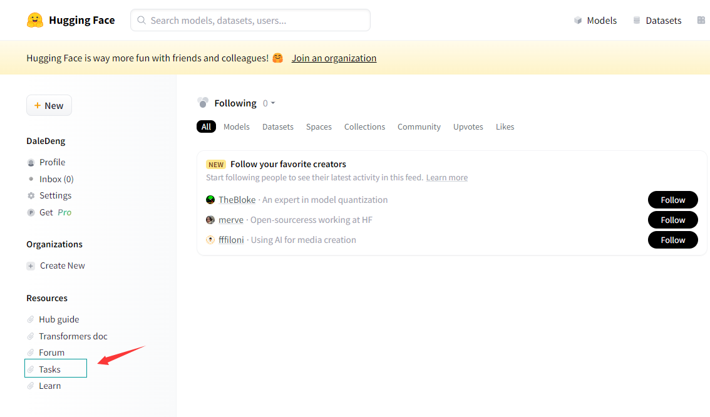

[环境依赖](nlp/huggingface/yilai.md)

> Transformers常用API

| 函数          | 功能                      |
|-------------|-------------------------|
| Transformer | 核心库，加载模型，训练模型，pipeline等 |
| Tokenizer   | 分词器，文本预处理               |
| Datasets    | 数据库，提供数据集加载处理           |
| Evaluate    | 评估函数                    |
| PEFT        | 小参数撬动大模型的高效微调库          |
| Accelerate  | 分布式训练                   |
| Optimum     | 优化加速，支持ONNX等            |
| Gradio      | WebUI演示                 |

## 调包体验Transformers

```python
# 文本分类
import gradio as gr
from transformers import *
gr.Interface.from_pipeline(pipeline('text-classification', model='uer/roberta-base-finetuned-dianping-chinese')).launch()
```


```python
# 阅读理解
import gradio as gr
from transformers import *
gr.Interface.from_pipeline(pipeline('text-classification', model='uer/roberta-base-finetuned-dianping-chinese')).launch()
```


## Pipeline

所谓Pipeline，即Transformers提供了一个全流程封装好的操作，从tokenizer到model到post processing，使得我们能够直接输入文本便获得最终答案。这种方式可以极大的简化代码，但是缺少了一些自由度。

> Pipeline支持的任务类型

| 任务名称(name)                              | 任务类型(type) |
|-----------------------------------------|------------|
| text-classification(sentiment-analysis) | text       |
| token-classification(ner)               | text       |
| question-answering                      | text       |
| fill-mask                               | text       |
| summarization                           | text       |
| translation                             | text       |
| text2text-generation                    | text       |
| text-generation                         | text       |
| conversational                          | text       |
| table-question-answering                | text       |
| zero-shot-classification                | text       |
| automatic-speech-recognition            | multimodal |
| feature-extraction                      | multimodal |
| audio-classification                    | audio      |
| visual-question-answering               | multimodal |
| document-question-answering             | multimodal |
| zero-shot-image-classification          | multimodal |
| zero-shot-audio-classification          | multimodal |
| image-classification                    | image      |
| zero-shot-object-detection              | multimodal |
| vedio-classification                    | video      |

```python
from transformers.pipelines import SUPPORTED_TASKS

for k,v in SUPPORTED_TASKS.items():
    print(k,v)
```
```python
audio-classification {'impl': <class 'transformers.pipelines.audio_classification.AudioClassificationPipeline'>, 'tf': (), 'pt': (<class 'transformers.models.auto.modeling_auto.AutoModelForAudioClassification'>,), 'default': {'model': {'pt': ('superb/wav2vec2-base-superb-ks', '372e048')}}, 'type': 'audio'}
automatic-speech-recognition {'impl': <class 'transformers.pipelines.automatic_speech_recognition.AutomaticSpeechRecognitionPipeline'>, 'tf': (), 'pt': (<class 'transformers.models.auto.modeling_auto.AutoModelForCTC'>, <class 'transformers.models.auto.modeling_auto.AutoModelForSpeechSeq2Seq'>), 'default': {'model': {'pt': ('facebook/wav2vec2-base-960h', '55bb623')}}, 'type': 'multimodal'}
text-to-audio {'impl': <class 'transformers.pipelines.text_to_audio.TextToAudioPipeline'>, 'tf': (), 'pt': (<class 'transformers.models.auto.modeling_auto.AutoModelForTextToWaveform'>, <class 'transformers.models.auto.modeling_auto.AutoModelForTextToSpectrogram'>), 'default': {'model': {'pt': ('suno/bark-small', '645cfba')}}, 'type': 'text'}
feature-extraction {'impl': <class 'transformers.pipelines.feature_extraction.FeatureExtractionPipeline'>, 'tf': (), 'pt': (<class 'transformers.models.auto.modeling_auto.AutoModel'>,), 'default': {'model': {'pt': ('distilbert-base-cased', '935ac13'), 'tf': ('distilbert-base-cased', '935ac13')}}, 'type': 'multimodal'}
text-classification {'impl': <class 'transformers.pipelines.text_classification.TextClassificationPipeline'>, 'tf': (), 'pt': (<class 'transformers.models.auto.modeling_auto.AutoModelForSequenceClassification'>,), 'default': {'model': {'pt': ('distilbert-base-uncased-finetuned-sst-2-english', 'af0f99b'), 'tf': ('distilbert-base-uncased-finetuned-sst-2-english', 'af0f99b')}}, 'type': 'text'}
token-classification {'impl': <class 'transformers.pipelines.token_classification.TokenClassificationPipeline'>, 'tf': (), 'pt': (<class 'transformers.models.auto.modeling_auto.AutoModelForTokenClassification'>,), 'default': {'model': {'pt': ('dbmdz/bert-large-cased-finetuned-conll03-english', 'f2482bf'), 'tf': ('dbmdz/bert-large-cased-finetuned-conll03-english', 'f2482bf')}}, 'type': 'text'}
question-answering {'impl': <class 'transformers.pipelines.question_answering.QuestionAnsweringPipeline'>, 'tf': (), 'pt': (<class 'transformers.models.auto.modeling_auto.AutoModelForQuestionAnswering'>,), 'default': {'model': {'pt': ('distilbert-base-cased-distilled-squad', '626af31'), 'tf': ('distilbert-base-cased-distilled-squad', '626af31')}}, 'type': 'text'}
table-question-answering {'impl': <class 'transformers.pipelines.table_question_answering.TableQuestionAnsweringPipeline'>, 'pt': (<class 'transformers.models.auto.modeling_auto.AutoModelForTableQuestionAnswering'>,), 'tf': (), 'default': {'model': {'pt': ('google/tapas-base-finetuned-wtq', '69ceee2'), 'tf': ('google/tapas-base-finetuned-wtq', '69ceee2')}}, 'type': 'text'}
visual-question-answering {'impl': <class 'transformers.pipelines.visual_question_answering.VisualQuestionAnsweringPipeline'>, 'pt': (<class 'transformers.models.auto.modeling_auto.AutoModelForVisualQuestionAnswering'>,), 'tf': (), 'default': {'model': {'pt': ('dandelin/vilt-b32-finetuned-vqa', '4355f59')}}, 'type': 'multimodal'}
document-question-answering {'impl': <class 'transformers.pipelines.document_question_answering.DocumentQuestionAnsweringPipeline'>, 'pt': (<class 'transformers.models.auto.modeling_auto.AutoModelForDocumentQuestionAnswering'>,), 'tf': (), 'default': {'model': {'pt': ('impira/layoutlm-document-qa', '52e01b3')}}, 'type': 'multimodal'}
fill-mask {'impl': <class 'transformers.pipelines.fill_mask.FillMaskPipeline'>, 'tf': (), 'pt': (<class 'transformers.models.auto.modeling_auto.AutoModelForMaskedLM'>,), 'default': {'model': {'pt': ('distilroberta-base', 'ec58a5b'), 'tf': ('distilroberta-base', 'ec58a5b')}}, 'type': 'text'}
summarization {'impl': <class 'transformers.pipelines.text2text_generation.SummarizationPipeline'>, 'tf': (), 'pt': (<class 'transformers.models.auto.modeling_auto.AutoModelForSeq2SeqLM'>,), 'default': {'model': {'pt': ('sshleifer/distilbart-cnn-12-6', 'a4f8f3e'), 'tf': ('t5-small', 'd769bba')}}, 'type': 'text'}
translation {'impl': <class 'transformers.pipelines.text2text_generation.TranslationPipeline'>, 'tf': (), 'pt': (<class 'transformers.models.auto.modeling_auto.AutoModelForSeq2SeqLM'>,), 'default': {('en', 'fr'): {'model': {'pt': ('t5-base', '686f1db'), 'tf': ('t5-base', '686f1db')}}, ('en', 'de'): {'model': {'pt': ('t5-base', '686f1db'), 'tf': ('t5-base', '686f1db')}}, ('en', 'ro'): {'model': {'pt': ('t5-base', '686f1db'), 'tf': ('t5-base', '686f1db')}}}, 'type': 'text'}
text2text-generation {'impl': <class 'transformers.pipelines.text2text_generation.Text2TextGenerationPipeline'>, 'tf': (), 'pt': (<class 'transformers.models.auto.modeling_auto.AutoModelForSeq2SeqLM'>,), 'default': {'model': {'pt': ('t5-base', '686f1db'), 'tf': ('t5-base', '686f1db')}}, 'type': 'text'}
text-generation {'impl': <class 'transformers.pipelines.text_generation.TextGenerationPipeline'>, 'tf': (), 'pt': (<class 'transformers.models.auto.modeling_auto.AutoModelForCausalLM'>,), 'default': {'model': {'pt': ('gpt2', '6c0e608'), 'tf': ('gpt2', '6c0e608')}}, 'type': 'text'}
zero-shot-classification {'impl': <class 'transformers.pipelines.zero_shot_classification.ZeroShotClassificationPipeline'>, 'tf': (), 'pt': (<class 'transformers.models.auto.modeling_auto.AutoModelForSequenceClassification'>,), 'default': {'model': {'pt': ('facebook/bart-large-mnli', 'c626438'), 'tf': ('roberta-large-mnli', '130fb28')}, 'config': {'pt': ('facebook/bart-large-mnli', 'c626438'), 'tf': ('roberta-large-mnli', '130fb28')}}, 'type': 'text'}
zero-shot-image-classification {'impl': <class 'transformers.pipelines.zero_shot_image_classification.ZeroShotImageClassificationPipeline'>, 'tf': (), 'pt': (<class 'transformers.models.auto.modeling_auto.AutoModelForZeroShotImageClassification'>,), 'default': {'model': {'pt': ('openai/clip-vit-base-patch32', 'f4881ba'), 'tf': ('openai/clip-vit-base-patch32', 'f4881ba')}}, 'type': 'multimodal'}
zero-shot-audio-classification {'impl': <class 'transformers.pipelines.zero_shot_audio_classification.ZeroShotAudioClassificationPipeline'>, 'tf': (), 'pt': (<class 'transformers.models.auto.modeling_auto.AutoModel'>,), 'default': {'model': {'pt': ('laion/clap-htsat-fused', '973b6e5')}}, 'type': 'multimodal'}
conversational {'impl': <class 'transformers.pipelines.conversational.ConversationalPipeline'>, 'tf': (), 'pt': (<class 'transformers.models.auto.modeling_auto.AutoModelForSeq2SeqLM'>, <class 'transformers.models.auto.modeling_auto.AutoModelForCausalLM'>), 'default': {'model': {'pt': ('microsoft/DialoGPT-medium', '8bada3b'), 'tf': ('microsoft/DialoGPT-medium', '8bada3b')}}, 'type': 'text'}
image-classification {'impl': <class 'transformers.pipelines.image_classification.ImageClassificationPipeline'>, 'tf': (), 'pt': (<class 'transformers.models.auto.modeling_auto.AutoModelForImageClassification'>,), 'default': {'model': {'pt': ('google/vit-base-patch16-224', '5dca96d'), 'tf': ('google/vit-base-patch16-224', '5dca96d')}}, 'type': 'image'}
image-segmentation {'impl': <class 'transformers.pipelines.image_segmentation.ImageSegmentationPipeline'>, 'tf': (), 'pt': (<class 'transformers.models.auto.modeling_auto.AutoModelForImageSegmentation'>, <class 'transformers.models.auto.modeling_auto.AutoModelForSemanticSegmentation'>), 'default': {'model': {'pt': ('facebook/detr-resnet-50-panoptic', 'fc15262')}}, 'type': 'multimodal'}
image-to-text {'impl': <class 'transformers.pipelines.image_to_text.ImageToTextPipeline'>, 'tf': (), 'pt': (<class 'transformers.models.auto.modeling_auto.AutoModelForVision2Seq'>,), 'default': {'model': {'pt': ('ydshieh/vit-gpt2-coco-en', '65636df'), 'tf': ('ydshieh/vit-gpt2-coco-en', '65636df')}}, 'type': 'multimodal'}
object-detection {'impl': <class 'transformers.pipelines.object_detection.ObjectDetectionPipeline'>, 'tf': (), 'pt': (<class 'transformers.models.auto.modeling_auto.AutoModelForObjectDetection'>,), 'default': {'model': {'pt': ('facebook/detr-resnet-50', '2729413')}}, 'type': 'multimodal'}
zero-shot-object-detection {'impl': <class 'transformers.pipelines.zero_shot_object_detection.ZeroShotObjectDetectionPipeline'>, 'tf': (), 'pt': (<class 'transformers.models.auto.modeling_auto.AutoModelForZeroShotObjectDetection'>,), 'default': {'model': {'pt': ('google/owlvit-base-patch32', '17740e1')}}, 'type': 'multimodal'}
depth-estimation {'impl': <class 'transformers.pipelines.depth_estimation.DepthEstimationPipeline'>, 'tf': (), 'pt': (<class 'transformers.models.auto.modeling_auto.AutoModelForDepthEstimation'>,), 'default': {'model': {'pt': ('Intel/dpt-large', 'e93beec')}}, 'type': 'image'}
video-classification {'impl': <class 'transformers.pipelines.video_classification.VideoClassificationPipeline'>, 'tf': (), 'pt': (<class 'transformers.models.auto.modeling_auto.AutoModelForVideoClassification'>,), 'default': {'model': {'pt': ('MCG-NJU/videomae-base-finetuned-kinetics', '4800870')}}, 'type': 'video'}
mask-generation {'impl': <class 'transformers.pipelines.mask_generation.MaskGenerationPipeline'>, 'tf': (), 'pt': (<class 'transformers.models.auto.modeling_auto.AutoModelForMaskGeneration'>,), 'default': {'model': {'pt': ('facebook/sam-vit-huge', '997b15')}}, 'type': 'multimodal'}
image-to-image {'impl': <class 'transformers.pipelines.image_to_image.ImageToImagePipeline'>, 'tf': (), 'pt': (<class 'transformers.models.auto.modeling_auto.AutoModelForImageToImage'>,), 'default': {'model': {'pt': ('caidas/swin2SR-classical-sr-x2-64', '4aaedcb')}}, 'type': 'image'}
```

### 创建和使用pipeline

> 以文本分类为例直接创建Pipeline

```python
pipe = pipeline('text-classification')
pipe('Nice to meet u')
```
```result
[{'label': 'POSITIVE', 'score': 0.9998334646224976}]
```

这种方式简单粗暴，但是都是默认的英文模型，实际上我们也会存在较多的中文使用场景，因此需要加载中文模型。

所以现在的问题是，如何提供中文模型，在前面的demo中我们演示了中文模型，model='...'这一串地址是如何找到的呢？

首先，我们需要进入[hugging face模型库](https://huggingface.co/models)


```python
pipe = pipeline('text-classification', model='uer/roberta-base-finetuned-dianping-chinese')
pipe('达咩')
```
```result
[{'label': 'negative (stars 1, 2 and 3)', 'score': 0.8353546261787415}]
```

可以发现在这个模型介绍界面，有一个How to use的demo：


这是2022年以前Transformers常用的调用API方式，现在时代更迭，我们会选择兼容性更强，代码更少的做法。
这种方式需要我们同时定义模型和分词器。


```python
from transformers import AutoModelForSequenceClassification,AutoTokenizer,pipeline
model = AutoModelForSequenceClassification.from_pretrained('uer/roberta-base-finetuned-dianping-chinese')
tokenizer = AutoTokenizer.from_pretrained('uer/roberta-base-finetuned-chinanews-chinese')
pipe = pipeline('text-classification', model=model, tokenizer=tokenizer)
pipe('达咩')
```
```result
[{'label': 'negative (stars 1, 2 and 3)', 'score': 0.8353546261787415}]
```

### 使用GPU推理

首先用CPU推理100次看看性能。

```python
import torch
import time

times = []
for i in range(100):
    torch.cuda.synchronize()
    start = time.time()
    pipe('达咩')
    torch.cuda.synchronize()
    end = time.time()
    times.append(end-start)
print(sum(times)/100)
```
```text
0.029385766983032226
```

在Transformers里指定cuda非常简单，只需要设置device=0表示第一张显卡即可，多张显卡以此类推。

```python
pipe = pipeline('text-classification', model='uer/roberta-base-finetuned-dianping-chinese', device=0)
pipe.model.device
```
```text
device(type='cuda', index=0)
```

GPU推理100次试试。我这里使用的是3090 GPU和i9-11900 CPU。

```python
import torch
import time

times = []
for i in range(100):
    torch.cuda.synchronize()
    start = time.time()
    pipe('达咩')
    torch.cuda.synchronize()
    end = time.time()
    times.append(end-start)
print(sum(times)/100)
```
```text
0.011393644809722901
```

### 确定pipeline参数

```python
qa_pipe = pipeline('question-answering', model='uer/roberta-base-chinese-extractive-qa')
```
在jupyter可以查看参数类型：


这个demo只是一个最基础的演示，表示你只需要输入这几个就能用，实际上参数在下面的call中：


```python
qa_pipe(question='中国的首都是哪里？',context='中国的首都是北京',max_answer_len=1)
```
```text
{'score': 0.002287398325279355, 'start': 6, 'end': 7, 'answer': '北'}
```

### pipeline背后实现逻辑

- Step1 初始化tokenizer和model

```python
model = AutoModelForSequenceClassification.from_pretrained('uer/roberta-base-finetuned-dianping-chinese')
tokenizer = AutoTokenizer.from_pretrained('uer/roberta-base-finetuned-chinanews-chinese')
```
- Step2 数据预处理
```python
input_text = '达咩'
inputs = tokenizer(input_text, return_tensors='pt')
```
- 模型预测
```python
res = model(**inputs).logits
```
- 结果后处理
```python
pred = torch.argmax(torch.softmax(res, dim=-1)).item()
result = model.config.id2label.get(pred)
```

## Tokenizer

这里的Tokenizer和前面讲过的分词再转化成词向量是一致的。具体步骤：

1. 分词
2. 构建词典
3. 根据词典做数据转换
4. 数据填充和截断，保证batch内的数据维度大小保持一致

醒醒，兄弟，都3202年了，如果使用nn.embedding是不是太out了！

> IN 2023, "**Tokenizer is all you need!**"

### 加载与保存
```python
# 从hugging face上加载
tokenizer = AutoTokenizer.from_pretrained('uer/roberta-base-finetuned-chinanews-chinese')
# 保存到本地
tokenizer.save_pretrained('./roberta_tokenizer')
# 从本地加载
tokenizer.from_pretrained('./roberta_tokenizer/')
```

****
从hugging face上下载的文件保存在本地哪？
```text
C:\Users\DaleAmmmmmy\.cache\huggingface\hub\models--uer--roberta-base-finetuned-dianping-chinese\snapshots\25faf1874b21e76db31ea9c396ccf2a0322e0071
```
****

### 分词
```python
tokens = tokenizer.tokenize(sen)
tokens
```
```text
['弱', '小', '的', '我', '也', '有', '大', '梦', '想', '！']
```

注意，这里的分词和我们之前介绍的jieba不一样，他不是按词分，而是按字分，这种语义理解的精读会略逊一筹，但是操作起来方便不少。此外，并不是所有的中文分词都是一个字一个字拆，也有按词拆的，并且当模型足够大时，分词精度对结果产生的影响也会降低。

> 查看词典

```python
tokenizer.vocab
```

### 索引转换
```python
# token 2 索引
ids = tokenizer.convert_tokens_to_ids(tokens)
# 索引 2 token
tokens = tokenizer.convert_ids_to_tokens(ids)
# token 2 str
str_sen = tokenizer.convert_tokens_to_string(tokens)
```
```text
ids:
[2483, 2207, 4638, 2769, 738, 3300, 1920, 3457, 2682, 8013]
tokens
['弱', '小', '的', '我', '也', '有', '大', '梦', '想', '！']
str_sen
'弱 小 的 我 也 有 大 梦 想 ！'
```

当然，这么原始的办法早就被淘汰了，tokenizer提供了更简单的实现方法

```python
ids = tokenizer.encode(sen)
str_sen = tokenizer.decode(ids)
```
```text
ids:
[101, 2483, 2207, 4638, 2769, 738, 3300, 1920, 3457, 2682, 8013, 102]
str_sen
'[CLS] 弱 小 的 我 也 有 大 梦 想 ！ [SEP]'
```

### 填充和截断
```python
# 填充15
ids_pad = tokenizer.encode(sen, padding='max_length', max_length=15)
# 截断5
ids_tru = tokenizer.encode(sen, max_length=5, truncation=True)
```
```text
ids_pad
[101, 2483, 2207, 4638, 2769, 738, 3300, 1920, 3457, 2682, 8013, 102, 0, 0, 0]
ids_tru
[101, 2483, 2207, 4638, 102]
```

### 其他输入部分(BERT模型)
```python
# 句子编码
ids = tokenizer.encode(sen, padding='max_length', max_length=15)
# 哪些是填充的哪些是句子本身
attention_mask = [1 if idx != 0 else 0 for idx in ids]
# 输入的句子编号
token_type_ids = [0] * len(ids)
```

同样，直接调用Transformers的API快速实现（难道encode不是调用吗？是的，你很难想象还有个encode_plus方法）

```python
inputs = tokenizer.encode_plus(sen, padding='max_length', max_length=15)
# 实际上还能更简单
inputs = tokenizer(sen, padding='max_length', max_length=15)
```
```text
{'input_ids': [101, 2483, 2207, 4638, 2769, 738, 3300, 1920, 3457, 2682, 8013, 102, 0, 0, 0], 'token_type_ids': [0, 0, 0, 0, 0, 0, 0, 0, 0, 0, 0, 0, 0, 0, 0], 'attention_mask': [1, 1, 1, 1, 1, 1, 1, 1, 1, 1, 1, 1, 0, 0, 0]}
```

**简而言之，你只需要一个tokenizer(input)**

### 处理batch数据

```python
sens = ['中国的首都是哪里？',
       '中国的首都是北京。',
       '有梦想谁都了不起！']
res = tokenizer(sens)
```
```text
{'input_ids': [[101, 704, 1744, 4638, 7674, 6963, 3221, 1525, 7027, 8043, 102], [101, 704, 1744, 4638, 7674, 6963, 3221, 1266, 776, 511, 102], [101, 3300, 3457, 2682, 6443, 6963, 749, 679, 6629, 8013, 102]], 'token_type_ids': [[0, 0, 0, 0, 0, 0, 0, 0, 0, 0, 0], [0, 0, 0, 0, 0, 0, 0, 0, 0, 0, 0], [0, 0, 0, 0, 0, 0, 0, 0, 0, 0, 0]], 'attention_mask': [[1, 1, 1, 1, 1, 1, 1, 1, 1, 1, 1], [1, 1, 1, 1, 1, 1, 1, 1, 1, 1, 1], [1, 1, 1, 1, 1, 1, 1, 1, 1, 1, 1]]}
```

> 批数据比单数据处理n次效率更高

### 特殊Tokenizer的加载

例如清华的chatgplm-6b，他是把tokenizer放在一个远程仓库里，想要调用它的中文分类器，则需要设置参数trust_remote_code=True。

```python
tokenizer = AutoTokenizer.from_pretrained('THUDM/chatglm3-6b', trust_remote_code=True)
```

同样，这里下载的tokenizer也可以保存到本地，方法和上面一样，就不演示了。

## Model(hugging face模型下载)

在Transfomer部分，花了大量的篇幅介绍注意力机制的encoder和decoder模块，并且写代码复现了block的计算数据流。但这里我们并不是介绍transformer的注意力机制模块，而是各种预训练模型的魔改。

- 模型类型

编码器模型：自编码模型，encoder，拥有双向注意力机制，即每个词都看到完整上下文

解码器模型：自回归模型，decoder，拥有单向注意力机制，即每个词都看到完整的上文

编码器解码器模型：encoder+decoder，encoder使用双向注意力，decoder使用单向注意力

这是几个非常有名的预训练模型类型：

| 模型类型              | 预训练模型               | 适用任务             |
|-------------------|---------------------|------------------|
| encoder模型，自编码模型   | ALBERT,BERT,RoBERTa | 文本分类，命名实体识别，阅读理解 |
| decoder模型，自回归模型   | GPT,GPT-2,LLaMA     | 文本生成             |
| encoder-decoder模型 | BART,mBART,GLM      | 文本摘要、机器翻译        |

实际上现在，伴随着模型的强大，encoder和decoder模型的任务界限也越来越模糊。

### Model Head

- Model Head是连接在模型后的层，通常为1个或多个全连接层
- Model Head将模型的编码结果表示为结果映射，以解决不同类型的任务

> 在Transformers中的Model Head

- *Model(模型本身，只返回编码结果)
- *ForCausalLM
- *FroMaskedLM
- *ForSeq2SeqLM
- *ForMultipleChoice
- *ForQuestionAnswering
- *ForSequenceClassification
- *ForTokenClassification
- ... ...

```python
model = AutoModel.from_pretrained('hfl/rbt3')
# 打印查看模型参数
model.config
```
```text
BertConfig {
  "_name_or_path": "hfl/rbt3",
  "architectures": [
    "BertForMaskedLM"
  ],
  "attention_probs_dropout_prob": 0.1,
  "classifier_dropout": null,
  "directionality": "bidi",
  "hidden_act": "gelu",
  "hidden_dropout_prob": 0.1,
  "hidden_size": 768,
  "initializer_range": 0.02,
  "intermediate_size": 3072,
  "layer_norm_eps": 1e-12,
  "max_position_embeddings": 512,
  "model_type": "bert",
  "num_attention_heads": 12,
  "num_hidden_layers": 3,
  "output_past": true,
  "pad_token_id": 0,
  "pooler_fc_size": 768,
  "pooler_num_attention_heads": 12,
  "pooler_num_fc_layers": 3,
  "pooler_size_per_head": 128,
  "pooler_type": "first_token_transform",
  "position_embedding_type": "absolute",
  "transformers_version": "4.34.1",
  "type_vocab_size": 2,
  "use_cache": true,
  "vocab_size": 21128
}
```

查看模型参数的代码也可以用AutoConfig实现。
```python
config = AutoConfig.from_pretrained('hfl/rbt3')
```

并且这里的config是可以查看具体修改参数。

### 不带Model Head的模型调用

```python
sen = '弱小的我也有大梦想！'
tokenizer = AutoTokenizer.from_pretrained('hfl/rbt3')
inputs = tokenizer(sen, return_tensors='pt')
inputs
```
```text
{'input_ids': tensor([[ 101, 2483, 2207, 4638, 2769,  738, 3300, 1920, 3457, 2682, 8013,  102]]), 'token_type_ids': tensor([[0, 0, 0, 0, 0, 0, 0, 0, 0, 0, 0, 0]]), 'attention_mask': tensor([[1, 1, 1, 1, 1, 1, 1, 1, 1, 1, 1, 1]])}
```

```python
model = AutoModel.from_pretrained('hfl/rbt3')
output = model(**inputs)
output
```
```text
BaseModelOutputWithPoolingAndCrossAttentions(last_hidden_state=tensor([[[ 0.6804,  0.6664,  0.7170,  ..., -0.4102,  0.7839, -0.0262],
         [-0.7378, -0.2748,  0.5034,  ..., -0.1359, -0.4331, -0.5874],
         [-0.0212,  0.5642,  0.1032,  ..., -0.3617,  0.4646, -0.4747],
         ...,
         [ 0.0853,  0.6679, -0.1757,  ..., -0.0942,  0.4664,  0.2925],
         [ 0.3336,  0.3224, -0.3355,  ..., -0.3262,  0.2532, -0.2507],
         [ 0.6761,  0.6688,  0.7154,  ..., -0.4083,  0.7824, -0.0224]]],
       grad_fn=<NativeLayerNormBackward0>), pooler_output=tensor([[-1.2646e-01, -9.8619e-01, -1.0000e+00, -9.8325e-01,  8.0238e-01,
         -6.6269e-02,  6.6919e-02,  1.4784e-01,  9.9451e-01,  9.9995e-01,
         -8.3051e-02, -1.0000e+00, -9.8865e-02,  9.9980e-01, -1.0000e+00,
         ...,
          6.7297e-03,  9.9942e-01, -1.8233e-01]], grad_fn=<TanhBackward0>), hidden_states=None, past_key_values=None, attentions=None, cross_attentions=None)
```

可以发现这里输出的结果hidden_states=None, past_key_values=None, attentions=None, cross_attentions=None都是None，我们修改模型的配置参数试一下：

```python
model = AutoModel.from_pretrained('hfl/rbt3',output_attentions=True)
output = model(**inputs)
output
```
```text
grad_fn=<TanhBackward0>), hidden_states=None, past_key_values=None, attentions=(tensor([[[[4.7840e-01, 3.7087e-04, 1.6194e-04,  ..., 1.4241e-04,
```

由于这个是不带model head的训练模型，因此他的作用就是对输入的序列输出一个编码。因此，可以用一行代码提取出这个last hidden state

```python
output.last_hidden_state
```
```text
tensor([[[ 0.6804,  0.6664,  0.7170,  ..., -0.4102,  0.7839, -0.0262],
         [-0.7378, -0.2748,  0.5034,  ..., -0.1359, -0.4331, -0.5874],
         [-0.0212,  0.5642,  0.1032,  ..., -0.3617,  0.4646, -0.4747],
         ...,
         [ 0.0853,  0.6679, -0.1757,  ..., -0.0942,  0.4664,  0.2925],
         [ 0.3336,  0.3224, -0.3355,  ..., -0.3262,  0.2532, -0.2507],
         [ 0.6761,  0.6688,  0.7154,  ..., -0.4083,  0.7824, -0.0224]]],
       grad_fn=<NativeLayerNormBackward0>)
```
这是一个1x12x768维度的数据。即一句话，12个tokens，每个token被映射到768维。

### 带Model Head的模型调用
```python
cls_model = AutoModelForSequenceClassification.from_pretrained('hfl/rbt3')
cls_model(**inputs)
```
```text
SequenceClassifierOutput(loss=None, logits=tensor([[ 0.1115, -0.5115]], grad_fn=<AddmmBackward0>), hidden_states=None, attentions=None)
```

因为没有传入label，所以loss是None。并且可以发现这里默认输出的是一个2分类结果，这也是可以调的参数。
```python
cls_model.config.num_labels
```
```text
2
```

具体修改如下：

```python
cls_model = AutoModelForSequenceClassification.from_pretrained('hfl/rbt3', num_labels=10)
cls_model(**inputs)
```
```text
SequenceClassifierOutput(loss=None, logits=tensor([[-0.2409, -0.6203, -0.4246,  0.4505, -0.1436, -0.4396,  0.3772, -0.2053,
         -0.2590, -0.1136]], grad_fn=<AddmmBackward0>), hidden_states=None, attentions=None)
```

这就是一个10分类任务。

## Datasets

在hugging face里有很多现成数据集。


> 用API加载数据集

```python
datasets = load_dataset('madao33/new-title-chinese')
datasets
```
```text
DatasetDict({
    train: Dataset({
        features: ['title', 'content'],
        num_rows: 5850
    })
    validation: Dataset({
        features: ['title', 'content'],
        num_rows: 1679
    })
})
```

这个数据集的训练集和验证集都是title和content两列数据，分别有5850和1679条数据。

> 指定子数据集

对于类似glue这种内部包含很多子数据集的而言，可以指定具体子数据

```python
datasets = load_dataset('super_glue', 'boolq')
```

> 按照数据集划分进行加载

```python
dataset = load_dataset('madao33/new-title-chinese', split='train')
# 按百分比加载
dataset = load_dataset('madao33/new-title-chinese', split='train[:50%]')
dataset = load_dataset('madao33/new-title-chinese', split=['train[:50%]','train[:50%]'])
```

### 查看数据集

```python
# 查看train前2个数据
datasets['train'][:2]

# 查看列名
datasets['train'].column_names

# 查看特征类型
datasets['train'].features
```

### 数据集划分

在torch中，我们通常使用torch.utils.dataset.random_split方法，在Transformers中也提供了解决方案。

```python
dataset = datasets['train']
dataset.train_test_split(test_size=0.1)
```
```text
DatasetDict({
    train: Dataset({
        features: ['title', 'content'],
        num_rows: 5265
    })
    test: Dataset({
        features: ['title', 'content'],
        num_rows: 585
    })
})
```

### 数据选取与过滤

前面已经按比例划分了数据，可能还想进一步筛选数据，如果直到索引，可以用select方法。

```python
# select里面写index
datasets['train'].select([0,1])
```

```python
# 筛选title有中国的数据
datasets['train'].filter(lambda example: '中国' in example['title'])
```

### 数据映射

用map方法给每个title加一个前缀。
```python
def add_prefix(example):
    example['title'] = 'Prefix' + example['title']
    return example

prefix_dataset = datasets.map(add_prefix)
prefix_dataset['train'][:10]['title']
```
```text
['Prefix望海楼美国打“台湾牌”是危险的赌博',
 'Prefix大力推进高校治理能力建设',
 'Prefix坚持事业为上选贤任能',
 'Prefix“大朋友”的话儿记心头',
 'Prefix用好可持续发展这把“金钥匙”',
 'Prefix跨越雄关，我们走在大路上',
 'Prefix脱贫奇迹彰显政治优势',
 'Prefix拱卫亿万人共同的绿色梦想',
 'Prefix为党育人、为国育才',
 'Prefix净化网络语言']
```

实际上，在真实使用时，会结合tokenizer这些处理工具来完成相关工作

```python
tokenizer = AutoTokenizer.from_pretrained('bert-base-chinese')
def preprocess_function(example):
    model_inputs = tokenizer(example['content'], max_length=512, truncation=True, return_tensors='pt')
    labels = tokenizer(example['title'], max_length=32, truncation=True, return_tensors='pt')
    model_inputs['labels'] = labels['input_ids']
    return model_inputs

processed_datasets = datasets.map(preprocess_function)
processed_datasets
```
```text
DatasetDict({
    train: Dataset({
        features: ['title', 'content', 'input_ids', 'token_type_ids', 'attention_mask', 'labels'],
        num_rows: 5850
    })
    validation: Dataset({
        features: ['title', 'content', 'input_ids', 'token_type_ids', 'attention_mask', 'labels'],
        num_rows: 1679
    })
})
```

当然，这里也提供两种加速的方法。

> 多线程

```python
tokenizer = AutoTokenizer.from_pretrained('bert-base-chinese')
def preprocess_function(example, tokenizer=tokenizer):
    model_inputs = tokenizer(example['content'], max_length=512, truncation=True)
    labels = tokenizer(example['title'], max_length=32, truncation=True)
    model_inputs['labels'] = labels['input_ids']
    return model_inputs
processed_datasets = datasets.map(preprocess_function, num_proc=8)
```

> 批处理

```python
tokenizer = AutoTokenizer.from_pretrained('bert-base-chinese')
def preprocess_function(example):
    model_inputs = tokenizer(example['content'], max_length=512)
    labels = tokenizer(example['title'], max_length=32)
    model_inputs['labels'] = labels['input_ids']
    return model_inputs
processed_datasets = datasets.map(preprocess_function, batched=True)
```

处理完之后的数据除了原始字段，还包含了一些新的字段，map方法可以进一步优化，去掉原有字段，只保留处理后可以输入模型的字段。

```python
processed_datasets = datasets.map(preprocess_function, batched=True, remove_columns=datasets['train'].column_names)
processed_datasets
```
```text
DatasetDict({
    train: Dataset({
        features: ['input_ids', 'token_type_ids', 'attention_mask', 'labels'],
        num_rows: 5850
    })
    validation: Dataset({
        features: ['input_ids', 'token_type_ids', 'attention_mask', 'labels'],
        num_rows: 1679
    })
})
```

### 保存与加载

```python
# 本地保存
processed_datasets.save_to_disk('./processed_data')
# 本地加载
processed_datasets = load_from_disk('./processed_data')
```

### 加载本地规范数据集

```python
dataset = load_dataset('csv', data_files='./ChnSentiCorp_htl_all.csv', split='train')
dataset
```
```text
Dataset({
    features: ['label', 'review'],
    num_rows: 7766
})
```

或者用Dataset.from_csv也能更简洁实现

```python
dataset = Dataset.from_csv('ChnSentiCorp_htl_all.csv')
dataset
```

如果一个文件夹有很多csv文件都是训练集，对着这种情况分别写代码加载可能过于繁琐，Transformers提供了一种文件夹导入的方式

```python
dataset = load_dataset('csv', data_dir='./all_data/', split='train')
```

也可以预先加载其他格式转换加载数据集，例如pandas

```python
data = pd.read_csv('ChnSentiCorp_htl_all.csv')
dataset = Dataset.from_pandas(data)
```

Dataset.from_xxx是一个非常强大的数据加载工具，具体可以根据自己的数据找到对应的数据加载方法。

### 加载本地非规范数据集

> 方法一：先用pandas这类工具处理成规范数据集再加载

> 方法二：通过自定义加载脚本加载

用cmrc2018的数据做演示，cmrc2018json文件如下：


使用load_dataset直接加载json文件试试。如果是json格式，则需要再后面指定field超参数为数据所在的目录，在这里是data栏。

```python
load_dataset('json', data_files='./cmrc2018_trail.json', field='data')
```
```text
DatasetDict({
    train: Dataset({
        features: ['title', 'id', 'paragraphs'],
        num_rows: 256
    })
})
```

这个加载的字段并没有那么详细，从json文件上看，paragraph应该是有多个的。

写一个load_script.py脚本文件，具体代码如下：(当然，这个代码在公开下载数据集的时候一般是提供的，如果是自己的数据集，根据这个脚本文件改写相应代码即可)

```python
import json
import datasets
from datasets import DownloadManager, DatasetInfo


class CMRC2018TRIAL(datasets.GeneratorBasedBuilder):

    def _info(self) -> DatasetInfo:
        """
            info方法, 定义数据集的信息,这里要对数据的字段进行定义
        :return:
        """
        return datasets.DatasetInfo(
            description="CMRC2018 trial",
            features=datasets.Features({
                    "id": datasets.Value("string"),
                    "context": datasets.Value("string"),
                    "question": datasets.Value("string"),
                    "answers": datasets.features.Sequence(
                        {
                            "text": datasets.Value("string"),
                            "answer_start": datasets.Value("int32"),
                        }
                    )
                })
        )

    def _split_generators(self, dl_manager: DownloadManager):
        """
            返回datasets.SplitGenerator
            涉及两个参数: name和gen_kwargs
            name: 指定数据集的划分
            gen_kwargs: 指定要读取的文件的路径, 与_generate_examples的入参数一致
        :param dl_manager:
        :return: [ datasets.SplitGenerator ]
        """
        return [datasets.SplitGenerator(name=datasets.Split.TRAIN, 
                                        gen_kwargs={"filepath": "./cmrc2018_trial.json"})]

    def _generate_examples(self, filepath):
        """
            生成具体的样本, 使用yield
            需要额外指定key, id从0开始自增就可以
        :param filepath:
        :return:
        """
        # Yields (key, example) tuples from the dataset
        with open(filepath, encoding="utf-8") as f:
            data = json.load(f)
            for example in data["data"]:
                for paragraph in example["paragraphs"]:
                    context = paragraph["context"].strip()
                    for qa in paragraph["qas"]:
                        question = qa["question"].strip()
                        id_ = qa["id"]

                        answer_starts = [answer["answer_start"] for answer in qa["answers"]]
                        answers = [answer["text"].strip() for answer in qa["answers"]]

                        yield id_, {
                            "context": context,
                            "question": question,
                            "id": id_,
                            "answers": {
                                "answer_start": answer_starts,
                                "text": answers,
                            },
                        }
```

```python
dataset = load_dataset("./load_script.py", split="train")
dataset
```
```text
Dataset({
    features: ['id', 'context', 'question', 'answers'],
    num_rows: 1002
})
```

### DataCollator

这部分内容请参考[NLP实战](nlp/bert_cls/)

用内置的collator替换掉手写的collate_fn，可以简化代码量。

```python
from transformers import DataCollatorWithPadding
tokenizer = AutoTokenizer.from_pretrrained('hlf/rbt3')

# 手写collate_fn
def collate_func(batch):
    texts, labels = [],[]
    for item in batch:
        texts.append(item[0])
        labels.append(item[1])
    inputs = tokenizer(texts, max_length=128, padding='max_length', truncation=True, return_tensors = 'pt')
    inputs['labels'] = torch.tensor(labels)
    return inputs

# collator简化
collator = DataCollatorWithPadding(tokenizer = tokenizer)
```

## Evaluate

查看一下支持哪些评估函数
```python
import evaluate
evaluate.list_evaluation_modules()
```
```text
['precision',
 'code_eval',
 'roc_auc',
 'cuad',
 'xnli',
 'rouge',
 'pearsonr',
 'mse',
 'super_glue',
 'comet',
 'cer',
 'sacrebleu',
 'mahalanobis',
 'wer',
 'competition_math',
 'f1',
 'recall',
 'coval',
 'mauve',
 'xtreme_s',
 'bleurt',
 'ter',
 'accuracy',
 'exact_match',
 'indic_glue',
 'spearmanr',
 'mae',
 'squad',
 'chrf',
 'glue',
 'perplexity',
 'mean_iou',
 'squad_v2',
 'meteor',
 'bleu',
 'wiki_split',
 'sari',
 'frugalscore',
 'google_bleu',
 'bertscore',
 'matthews_correlation',
 'seqeval',
 'trec_eval',
 'rl_reliability',
 'angelina-wang/directional_bias_amplification',
 'cpllab/syntaxgym',
 'kaggle/ai4code',
 'codeparrot/apps_metric',
 'mfumanelli/geometric_mean',
 'poseval',
 'brier_score',
 'abidlabs/mean_iou',
 'abidlabs/mean_iou2',
 'giulio98/codebleu',
 'mase',
 'mape',
 'smape',
 'dvitel/codebleu',
 'NCSOFT/harim_plus',
 'JP-SystemsX/nDCG',
 'Drunper/metrica_tesi',
 'jpxkqx/peak_signal_to_noise_ratio',
 'jpxkqx/signal_to_reconstruction_error',
 'hpi-dhc/FairEval',
 'nist_mt',
 'lvwerra/accuracy_score',
 'character',
 'charcut_mt',
 'ybelkada/cocoevaluate',
 'harshhpareek/bertscore',
 'posicube/mean_reciprocal_rank',
 'bstrai/classification_report',
 'omidf/squad_precision_recall',
 'Josh98/nl2bash_m',
 'BucketHeadP65/confusion_matrix',
 'BucketHeadP65/roc_curve',
 'yonting/average_precision_score',
 'transZ/test_parascore',
 'transZ/sbert_cosine',
 'hynky/sklearn_proxy',
 'unnati/kendall_tau_distance',
 'r_squared',
 'Viona/fuzzy_reordering',
 'Viona/kendall_tau',
 'lhy/hamming_loss',
 'lhy/ranking_loss',
 'Muennighoff/code_eval_octopack',
 'yuyijiong/quad_match_score',
 'Splend1dchan/cosine_similarity',
 'AlhitawiMohammed22/CER_Hu-Evaluation-Metrics',
 'Yeshwant123/mcc',
 'transformersegmentation/segmentation_scores',
 'sma2023/wil',
 'chanelcolgate/average_precision',
 'ckb/unigram',
 'Felipehonorato/eer',
 'manueldeprada/beer',
 'tialaeMceryu/unigram',
 'He-Xingwei/sari_metric',
 'langdonholmes/cohen_weighted_kappa',
 'fschlatt/ner_eval',
 'hyperml/balanced_accuracy',
 'brian920128/doc_retrieve_metrics',
 'guydav/restrictedpython_code_eval',
 'k4black/codebleu',
 'Natooz/ece',
 'ingyu/klue_mrc',
 'Vipitis/shadermatch',
 'unitxt/metric',
 'gabeorlanski/bc_eval',
 'jjkim0807/code_eval',
 'vichyt/metric-codebleu',
 'repllabs/mean_reciprocal_rank',
 'repllabs/mean_average_precision',
 'mtc/fragments',
 'DarrenChensformer/eval_keyphrase',
 'kedudzic/charmatch',
 'Vallp/ter',
 'DarrenChensformer/relation_extraction',
 'Ikala-allen/relation_extraction',
 'danieldux/hierarchical_softmax_loss',
 'nlpln/tst',
 'bdsaglam/jer',
 'mcnemar',
 'exact_match',
 'wilcoxon',
 'kaleidophon/almost_stochastic_order',
 'word_length',
 'lvwerra/element_count',
 'word_count',
 'text_duplicates',
 'perplexity',
 'label_distribution',
 'toxicity',
 'regard',
 'honest',
 'ybelkada/toxicity',
 'ronaldahmed/ccl_win',
 'cakiki/tokens_per_byte',
 'lsy641/distinct']
```

这些评估函数，有些是官方实现的，有些是社区实现的，可以筛选一下

```python
evaluate.list_evaluation_modules(include_community=False, with_details=True)
```

### 加载accuracy评估函数

```python
accuracy = evaluate.load('accuracy')
```

可以查看这些评估函数对输入输出的要求

```python
accuracy.inputs_description
```
```text
Args:
    predictions (`list` of `int`): Predicted labels.
    references (`list` of `int`): Ground truth labels.
    normalize (`boolean`): If set to False, returns the number of correctly classified samples. Otherwise, returns the fraction of correctly classified samples. Defaults to True.
    sample_weight (`list` of `float`): Sample weights Defaults to None.

Returns:
    accuracy (`float` or `int`): Accuracy score. Minimum possible value is 0. Maximum possible value is 1.0, or the number of examples input, if `normalize` is set to `True`.. A higher score means higher accuracy.

Examples:

    Example 1-A simple example
        >>> accuracy_metric = evaluate.load("accuracy")
        >>> results = accuracy_metric.compute(references=[0, 1, 2, 0, 1, 2], predictions=[0, 1, 1, 2, 1, 0])
        >>> print(results)
        {'accuracy': 0.5}

    Example 2-The same as Example 1, except with `normalize` set to `False`.
        >>> accuracy_metric = evaluate.load("accuracy")
        >>> results = accuracy_metric.compute(references=[0, 1, 2, 0, 1, 2], predictions=[0, 1, 1, 2, 1, 0], normalize=False)
        >>> print(results)
        {'accuracy': 3.0}

    Example 3-The same as Example 1, except with `sample_weight` set.
        >>> accuracy_metric = evaluate.load("accuracy")
        >>> results = accuracy_metric.compute(references=[0, 1, 2, 0, 1, 2], predictions=[0, 1, 1, 2, 1, 0], sample_weight=[0.5, 2, 0.7, 0.5, 9, 0.4])
        >>> print(results)
        {'accuracy': 0.8778625954198473}
```

### 全局计算和迭代计算

> 全局计算

```python
accuracy_metric = evaluate.load("accuracy")
results = accuracy_metric.compute(references=[0, 1, 2, 0, 1, 2], predictions=[0, 1, 1, 2, 1, 0])
```

> 迭代计算

由于实际上很可能是一个batch的输入，所以可以预测一个计算一个，也可以batch计算

```python
accuracy_metric = evaluate.load("accuracy")
for ref, pred in zip([0,1,0,1],[1,0,0,1]):
    accuracy.add(references=ref, predictions=pred)
accuracy.compute()
```

```python
accuracy_metric = evaluate.load("accuracy")
for ref, pred in zip([[0,1],[1,0]],[[0,1],[0,1]]):
    accuracy.add_batch(references=ref, predictions=pred)
accuracy.compute()
```

### 多个评估指标计算

当然，你可以用上面的办法一个一个计算，然后再append到一个list或者dict内即可。不过，Transformers库提供了更简单的操作方式。

```python
clf_metrics = evaluate.combine(['accuracy', 'f1', 'recall', 'precision'])
clf_metrics.compute(predictions=[0,1,0], references=[0,1,1])
```
```text
{'accuracy': 0.6666666666666666,
 'f1': 0.6666666666666666,
 'recall': 0.5,
 'precision': 1.0}
```

### 评估结果可视化

在evaluate里提供了雷达图对比的可视化API（只有这一种，所以如果可以，还是用matplotlib自己画吧）

```python
from evaluate.visualization import radar_plot
data = [
    {'accuracy': 0.99,'f1': 0.95,'precision': 0.8},
    {'accuracy': 0.98,'f1': 0.91,'precision': 0.87},
    {'accuracy': 0.98,'f1': 0.88,'precision': 0.78},
    {'accuracy': 0.88,'f1': 0.81,'precision': 0.78},
]
model_names = ['Model 1', 'Model 2', 'Model 3', 'Model 4']
plot = radar_plot(data=data,model_names=model_names)
```


> 假如我是个新手，我怎么知道应该用什么评估函数来评价我的模型呢？

hugging face也想到了这样的问题。因此在官网提供了tasks界面，可以根据自己任务类型看到适合的评估函数。这里我们用文本分类为例：




