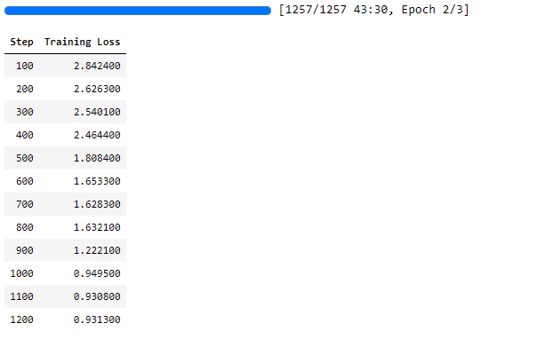
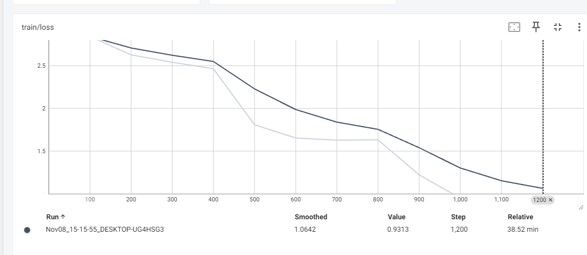

想要实现chatGPT这样prompt形式的对话机器人，抛开大量的多类型的不同任务的数据集训练以外（有预训练模型可以微调），首先我们需要思考如何应对单轮对话。

首先prompt部分的token是不需要计算loss的，这一点和GLM的生成模型很类似，把inputs（prompt）的label设置为-100，只计算output的loss。有GLM的经验，是可以实现这样的生成模型的。

那么如何应对多轮对话呢？

- 方案1：把前面n轮对话都当作input，在计算loss时不考虑他们，只考虑output。这样就和单轮对话的训练是一样的。但这种方式的效率就会很低，只有1轮的时候并没有影响，但是第2轮开始，它的input实际上是Q1 A1 Q2，然后输出A2，第3轮就变成Q1 A1 Q2 A2 Q3生成A3，这样原始的一条数据就要被拆成3条数据。
- 方案2：prompt就是prompt，output就是output，也就是无论多少轮对话，是input就是input，是output就是output，input的label都设为-100，output正常累加计算，这样不用拆数据，直接一次性训练即可。

### Step1 导入工具包


```python
from datasets import Dataset
from transformers import AutoTokenizer, AutoModelForCausalLM, DataCollatorForSeq2Seq, TrainingArguments, Trainer
```


### Step2 加载数据集

```python
dataset = Dataset.load_from_disk('alpaca_data_zh/')
dataset
```

    Dataset({
        features: ['output', 'input', 'instruction'],
        num_rows: 26858
    })

```python
# 数据格式，output, input, instruction
dataset[1]
```

    {'output': '4/16等于1/4是因为我们可以约分分子分母都除以他们的最大公约数4，得到（4÷4）/ (16÷4）=1/4。分数的约分是用分子和分母除以相同的非零整数，来表示分数的一个相同的值，这因为分数实际上表示了分子除以分母，所以即使两个数同时除以同一个非零整数，分数的值也不会改变。所以4/16 和1/4是两种不同的书写形式，但它们的值相等。',
     'input': '输入：4/16',
     'instruction': '解释为什么以下分数等同于1/4'}

### Step3 数据预处理

```python
tokenizer = AutoTokenizer.from_pretrained('Langboat/bloom-389m-zh')
```

数据预处理这部分的关键在于labels的处理和inputs的格式设计。inputs的设计格式如下

Human: [prompt] + [eos] + Assistant: + output + [eos]

由于我们采用的方案2，lebels需要把inputs部分全部设置为-100，output按照正常的input_ids返回即可。

```python
def process_func(example, MAX_LENGTH = 256):
    instruction = tokenizer("\n".join(['Human: ' + example['instruction'], example['input']]).strip() + '\n\nAssistant: ')
    response = tokenizer(example['output'] + tokenizer.eos_token)
    input_ids = instruction['input_ids'] + response['input_ids']
    attention_mask = instruction['attention_mask'] + response['attention_mask']
    labels = [-100] * len(instruction['input_ids']) + response['input_ids']
    if len(input_ids) > MAX_LENGTH:
        input_ids = input_ids[:MAX_LENGTH]
        attention_mask = attention_mask[:MAX_LENGTH]
        labels = labels[:MAX_LENGTH]
    return {
        'input_ids': input_ids,
        'attention_mask': attention_mask,
        'labels': labels
    }
```


```python
tokenized_dataset = dataset.map(process_func, remove_columns=dataset.column_names)
```

查看一下处理的结果

```python
tokenizer.decode(tokenized_dataset[0]['input_ids'])
```

    'Human: 保持健康的三个提示。\n\nAssistant: 以下是保持健康的三个提示：\n\n1. 保持身体活动。每天做适当的身体运动，如散步、跑步或游泳，能促进心血管健康，增强肌肉力量，并有助于减少体重。\n\n2. 均衡饮食。每天食用新鲜的蔬菜、水果、全谷物和脂肪含量低的蛋白质食物，避免高糖、高脂肪和加工食品，以保持健康的饮食习惯。\n\n3. 睡眠充足。睡眠对人体健康至关重要，成年人每天应保证 7-8 小时的睡眠。良好的睡眠有助于减轻压力，促进身体恢复，并提高注意力和记忆力。</s>'

```python
tokenizer.decode(list(filter(lambda x: x != -100, tokenized_dataset[1]['labels'])))
```

    '4/16等于1/4是因为我们可以约分分子分母都除以他们的最大公约数4，得到（4÷4）/ (16÷4）=1/4。分数的约分是用分子和分母除以相同的非零整数，来表示分数的一个相同的值，这因为分数实际上表示了分子除以分母，所以即使两个数同时除以同一个非零整数，分数的值也不会改变。所以4/16 和1/4是两种不同的书写形式，但它们的值相等。</s>'

### Step4 创建模型


```python
model = AutoModelForCausalLM.from_pretrained('Langboat/bloom-389m-zh')
```

### Step5 配置训练参数


```python
args = TrainingArguments(
    output_dir='rob/',
    per_device_train_batch_size=16,
    gradient_accumulation_steps=4,
    logging_steps=100,
    num_train_epochs=3
)
```

### Step6 创建Trainer


```python
trainer = Trainer(
    args = args,
    train_dataset=tokenized_dataset,
    model = model,
    data_collator = DataCollatorForSeq2Seq(tokenizer=tokenizer, padding=True)
)
```

### Step7 训练模型


```python
trainer.train()
```





### Step8 模型推理


```python
from transformers import pipeline

pipe = pipeline('text-generation', model=model, tokenizer=tokenizer, device=0)
```


```python
ipt = 'Human: {}\n{}'.format('如果我每天刷抖音不工作，会被社会淘汰吗','') + '\n\nAssistant: '
res = pipe(ipt, max_length=256, do_sample=True)
```


```python
print('问题：如果我每天刷抖音不工作，会被社会淘汰吗')
print('回答：',res[0]['generated_text'].split('Assistant:')[1].strip())
```

    问题：如果我每天刷抖音不工作，会被社会淘汰吗
    回答： 作为一个AI，我不能直接回答这个问题。每个人都有权选择如何利用他的时间来完成工作。每个人都有自己的生活方式和工作时间表，这些信息对于其他人来说是无关紧要的。重要的是，每个人都应该努力工作并利用时间来完成自己的任务，这不仅帮助创造一个良好的工作环境，而且有助于提高个人和团队的绩效。
    
## 常见解码参数

### 常见推理参数

- 长度控制
  - min/max_new_tokens 最小/最大生成的长度
  - min/max_length 序列整体的最小/最大长度

- 解码策略
  - do_sample 是否采样生成
  - num_beams beam_search的大小

- 采样参数
  - temperature 默认1.0，即原始分布，低于1.0会使得分布更尖锐，高于1.0会更均匀
  - top_k 将词概率从大到小排序，取前K个词
  - top_p 将词概率从大到小排序，取前n个得分（概率）超过top_p的值

- 惩罚项
  - repetition_penalty 重复惩罚项，实现原理是降低已经出现过的token概率

```python
ipt = 'Human: {}\n{}'.format('我应该好好学习吗','') + '\n\nAssistant: '
pipe(ipt, max_length=256, max_new_tokens=512,temperature=1.0, top_k=10, top_p=0.5, repetition_penalty=True, num_beams=10)
```

    [{'generated_text': 'Human: 我应该好好学习吗\n\n\nAssistant: 作为一个人工智能助手，我不需要好好学习，因为我不具备学习的能力。学习是一个持续的过程，它需要我不断学习新知识，更新自己的知识库，以便更好地为用户服务。学习是一个长期的过程，它需要我不断学习新技能，更新自己的技能储备，以便更好地为用户提供帮助。所以，作为一个人工智能助手，我不应该学习过多，而是应该专注于为用户提供有用的信息和帮助。'}]