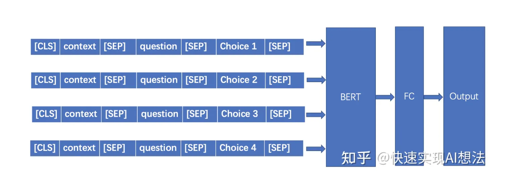
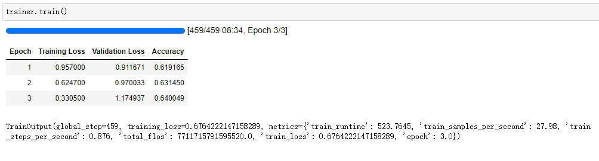

## 多项选择(Multi-choice)任务简介

多项选择（从多个选项中选择一个正确的）是阅读理解更广义的形式。相较于阅读理解而言，多项选择需要从一个或多个文档P以及一个问题Q和对应的多个答案选出答案A。

从实现逻辑上看，问题+答案和文本的匹配度计算或许是解决问题的良方。在这里，先当作一个阅读理解任务来看，只是要从候选项把答案选出来。

换个角度，从N个选项（4个）中选出一个正确答案，又是一个分类任务。所以评价指标可以用分类任务的（acc）。

## Transformers解决方案

既然是分类任务（假设4分类），那模型预测这些都非常简单，需要思考的仍然是数据处理。参考阅读理解，我们依然用这样的方式：

[cls]-context-[sep]-question-choice1-[sep]

[cls]-context-[sep]-question-choice2-[sep]

[cls]-context-[sep]-question-choice3-[sep]

[cls]-context-[sep]-question-choice4-[sep]

- 方法1：逐条判断

言而言之，我们把四条数据都喂进模型，当作一个二分类输出答案（是与否）的结果。这种方式可行，但也存在问题，如果choice2和3输出的预测得分一样，那是选择2还是3呢。

- 方法2：整体判断

Softmax([cls]1，[cls]2，[cls]3，[cls]4)

这样做就可以避免单条预测时出现多个答案的情况。具体在模型部分展开。

> 模型结构：*ModelForMultiChoice

假设`batch size=16`，`四选一`,`sequence length=256`。

数据处理时，数据会变成[16 * 4, 256]的格式。

然后进入一个bert层，拿到编码后变成[64, 768]，这里的768是token的hidden dim。

经过一个分类层，变成[64， 1]，然后reshape一下，变成[16, 4]，此时第一个维度是batch size，第二个维度就是选项个数，就可以对第二个维度进行softmax然后计算交叉熵。



### Step1 导入相关包

```python
from transformers import AutoTokenizer, AutoModelForMultipleChoice, TrainingArguments, Trainer, pipeline
from datasets import load_dataset
import evaluate
```

### Step2 加载数据

```python
datasets = load_dataset('c3','dialog')
datasets
```

    DatasetDict({
        train: Dataset({
            features: ['documents', 'document_id', 'questions'],
            num_rows: 4885
        })
        test: Dataset({
            features: ['documents', 'document_id', 'questions'],
            num_rows: 1627
        })
        validation: Dataset({
            features: ['documents', 'document_id', 'questions'],
            num_rows: 1628
        })
    })

```python
datasets['train'][0]
```

    {'documents': ['男：你今天晚上有时间吗?我们一起去看电影吧?', '女：你喜欢恐怖片和爱情片，但是我喜欢喜剧片，科幻片一般。所以……'],
     'document_id': '25-35',
     'questions': {'question': ['女的最喜欢哪种电影?'],
      'answer': ['喜剧片'],
      'choice': [['恐怖片', '爱情片', '喜剧片', '科幻片']]}}

### Step3 数据预处理

```python
tokenizer = AutoTokenizer.from_pretrained('hfl/chinese-macbert-base')
```

需要写一个脚本文件把数据处理到规范格式。根据上面dataset输出的格式，可以定位到文本，选项和答案：

通过对数据的观察，发现有些并不是4选1，有少部分是3选1的，因此做一个判断，如果是3选1，就自动补一个不确定作为第四个选项。

```python
examples = datasets['train']
i = 0
context, question_choice, labels = [], [], []
for idx in range(len(examples['documents'])):
    ctx = '\n'.join(examples['documents'][idx])
    question = examples['questions'][idx]['question'][0]
    choices = examples['questions'][idx]['choice'][0]
    for choice in choices:
        context.append(ctx)
        question_choice.append(question + ' ' + choice)
    if len(choices) < 4:
        for _ in range(4 - len(choices)):
            context.append(ctx)
            question_choice.append(question + ' ' + '不确定')
    labels.append(choices.index(examples['questions'][idx]['answer'][0]))
    i += 1
    if i > 2:
        break
context, question_choice, labels
```

    (['男：你今天晚上有时间吗?我们一起去看电影吧?\n女：你喜欢恐怖片和爱情片，但是我喜欢喜剧片，科幻片一般。所以……',
      '男：你今天晚上有时间吗?我们一起去看电影吧?\n女：你喜欢恐怖片和爱情片，但是我喜欢喜剧片，科幻片一般。所以……',
      '男：你今天晚上有时间吗?我们一起去看电影吧?\n女：你喜欢恐怖片和爱情片，但是我喜欢喜剧片，科幻片一般。所以……',
      '男：你今天晚上有时间吗?我们一起去看电影吧?\n女：你喜欢恐怖片和爱情片，但是我喜欢喜剧片，科幻片一般。所以……',
      '男：足球比赛是明天上午八点开始吧?\n女：因为天气不好，比赛改到后天下午三点了。',
      '男：足球比赛是明天上午八点开始吧?\n女：因为天气不好，比赛改到后天下午三点了。',
      '男：足球比赛是明天上午八点开始吧?\n女：因为天气不好，比赛改到后天下午三点了。',
      '男：足球比赛是明天上午八点开始吧?\n女：因为天气不好，比赛改到后天下午三点了。',
      '女：今天下午的讨论会开得怎么样?\n男：我觉得发言的人太少了。',
      '女：今天下午的讨论会开得怎么样?\n男：我觉得发言的人太少了。',
      '女：今天下午的讨论会开得怎么样?\n男：我觉得发言的人太少了。',
      '女：今天下午的讨论会开得怎么样?\n男：我觉得发言的人太少了。'],
     ['女的最喜欢哪种电影? 恐怖片',
      '女的最喜欢哪种电影? 爱情片',
      '女的最喜欢哪种电影? 喜剧片',
      '女的最喜欢哪种电影? 科幻片',
      '根据对话，可以知道什么? 今天天气不好',
      '根据对话，可以知道什么? 比赛时间变了',
      '根据对话，可以知道什么? 校长忘了时间',
      '根据对话，可以知道什么? 不确定',
      '关于这次讨论会，我们可以知道什么? 会是昨天开的',
      '关于这次讨论会，我们可以知道什么? 男的没有参加',
      '关于这次讨论会，我们可以知道什么? 讨论得不热烈',
      '关于这次讨论会，我们可以知道什么? 参加的人很少'],
     [2, 1, 2])

这样就把数据处理到规范的格式了。然后使用tokenizer编码处理即可

```python
tokenized_examples = tokenizer(context, question_choice, truncation='only_first', max_length=256, padding='max_length')
```

完成这一步并没有做完，因为在模型结构部分，我们看到他要求输入的数据维度是(batch size, number of choices, hidden dim)，而现在的维度是：

```python
np.array(tokenized_examples['input_ids']).shape
```

    (12, 256)

可以发现，我们只需要把每4个单独拎出来，重组一个维度就行

```python
tokenized_examples = tokenizer(context, question_choice, truncation='only_first', max_length=256, padding='max_length')
tokenized_examples = {k: [v[i:i+4] for i in range(0, len(v), 4)] for k, v in tokenized_examples.items()}
np.array(tokenized_examples['input_ids']).shape
```

    (3, 4, 256)

最后加上label标签

```python
tokenized_examples['labels'] = labels
```

把这个过程封装成函数

```python
def process_function(examples):
    # 文本，选项，答案
    context, question_choice, labels = [], [], []
    for idx in range(len(examples['documents'])):
        ctx = '\n'.join(examples['documents'][idx])
        question = examples['questions'][idx]['question'][0]
        choices = examples['questions'][idx]['choice'][0]
        for choice in choices:
            context.append(ctx)
            question_choice.append(question + ' ' + choice)
        if len(choices) < 4:
            for _ in range(4 - len(choices)):
                context.append(ctx)
                question_choice.append(question + ' ' + '不确定')
        labels.append(choices.index(examples['questions'][idx]['answer'][0]))
    tokenized_examples = tokenizer(context, question_choice, truncation='only_first', max_length=256, padding='max_length')
    tokenized_examples = {k: [v[i:i+4] for i in range(0, len(v), 4)] for k, v in tokenized_examples.items()}
    tokenized_examples['labels'] = labels
    return tokenized_examples
tokenized_c3 = datasets.map(process_function, batched=True)
```

### Step4 加载模型

```python
model = AutoModelForMultipleChoice.from_pretrained("hfl/chinese-macbert-base")
```

### Step5 加载评估函数

```python
import numpy as np
accuracy = evaluate.load("accuracy")

def compute_metric(pred):
    predictions, labels = pred
    predictions = np.argmax(predictions, axis=-1)
    return accuracy.compute(predictions=predictions, references=labels)
```

### Step6 配置训练参数

```python
args = TrainingArguments(
    output_dir="./muliple_choice",
    per_device_train_batch_size=32,
    per_device_eval_batch_size=64,
    num_train_epochs=3,
    logging_steps=50,
    evaluation_strategy="epoch",
    save_strategy="epoch",
    load_best_model_at_end=True,
    fp16=True
)
```

### Step7 配置Trainer

```python
trainer = Trainer(
    model=model,
    args=args,
    train_dataset=tokenized_c3["train"],
    eval_dataset=tokenized_c3["validation"],
    compute_metrics=compute_metric
)
```

### Step8 训练

```python
trainer.train()
```



### Step9 推理

很遗憾，多项选择任务没有现成的pipeline，因此需要自己写一个。参考官方代码，我们写这样一个Pipeline类即可。

__call__方法里是输入的数据流

__init__是全局参数

preprocess是数据预处理，把数据处理成[cls]-context-[sep]-question-choice-[sep]的样式

predict是模型预测，输入处理好的编码数据，这里只需要注意一下维度变化即可

postprocess是后处理，根据模型结构直到最终的输出是把所有的cls整合到一起，用softmax输出他们的概率值，因此用argmax在最后一个维度上找到最大值，模型返回的是对应第几个选项，因此对选项做一个映射，就可以定位到选项的文本内容然后输出即可。

```python
import torch

class MultipleChoicePipeline:

    def __init__(self, model, tokenizer):
        self.model = model
        self.tokenizer = tokenizer
        self.device = model.device

    def preprocess(self, context, quesiton, choices):
        cs, qcs = [], []
        for choice in choices:
            cs.append(context)
            qcs.append(quesiton + " " + choice)
        return tokenizer(cs, qcs, truncation="only_first", max_length=256, return_tensors='pt', padding='max_length')

    def predict(self, inputs):
        inputs = {k: v.unsqueeze(0).to(self.device) for k, v in inputs.items()}
        return self.model(**inputs).logits

    def postprocess(self, logits, choices):
        predition = torch.argmax(logits, dim=-1).cpu().item()
        return choices[predition]

    def __call__(self, context, question, choices):
        inputs = self.preprocess(context, question, choices)
        logits = self.predict(inputs)
        result = self.postprocess(logits, choices)
        return result

pipe = MultipleChoicePipeline(model, tokenizer)
```

由于模型的后处理是softmax(cls)，因此预测并不限制模型到底是不是一个四选一，可以输入很多的选项，从数据流来说，无论多少个选项，pipeline都是把他们处理成标准格式然后给模型判断哪个cls的score最高，然后返回最大概率对应的选项文本信息。

```python
pipe('左边可以取钱，是个农业银行，右边是餐厅！','ATM机在哪边？',['左边','右边','上边','下边','心里边','后面'])
```

    '左边'

