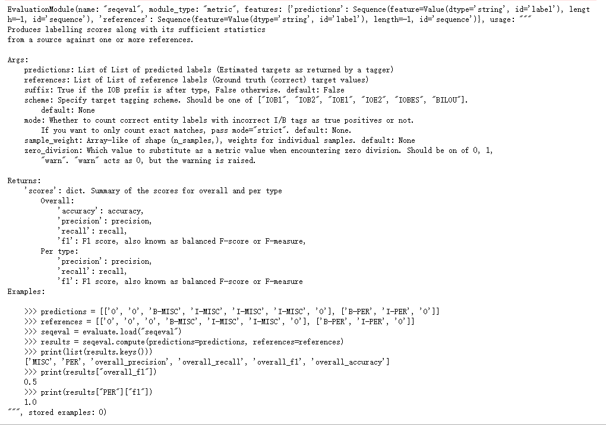
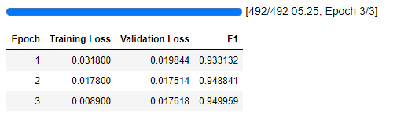

## 命名实体识别(NER)任务简介

在竞赛部分和NLP基础部分介绍过NER任务，这里简单再说一下。

所谓命名实体识别，即在一段文本中完成实体关系抽取。这里所谓的实体关系，可以理解成xxx是否构成一个命名实体。

用一句话举个具体的例子：

> 我要去过过儿过过的生活

我们要从这句话里抽取出人名，那么显然过儿是需要输出的结果，其他文本信息不重要。

当然，NER任务也可以抽取组织名，机构名，药名等等，例如从药方照片中通过OCR技术提取信息，再把具体药物文本提取出来。

对于NER常用的标注体系是IOB2和IOBES这两种。

> IOB2

I表示实体内部，O表示实体外部，B表示实体开始，B/I-xxx，xxx表示具体类别，例如”过儿过过的生活“，就是”B-Person I-Person O O O O O“。

对于这种方案，我们需要抽取BIII...直到出现O之前的所有内容。

> IOBES

I表示实体内部，O表示实体外部，B表示实体开始，E表示实体结束，S表示一个词单独形成一个命名实体。例如”过儿过过的生活“，就是”B-Person E-Person O O O O O“

对于这种方案，我们需要抽取出B...E的所有内容。

> 评价指标： macro F1 score

- 对每个样本的真实值(ground truth)和预测值(predictions)的类别(class)比较。
- 若GT与预测值重叠部分>=0.5，且预测值与GT重叠部分>=0.5，属于True Positive(TP)。若存在多个匹配，采用匹配部分最多的一个。
- 任何未匹配成果的真实值视为False Negative(FN)，任何未匹配的预测值视为False Positive(FP)。
- 按照每个类别分别计算F1值，取平均值为最后分数(macro F1 score)。

$$F1 = \frac{2}{recall^{-1} + {precision}^{-1}} = 2 \cdot \frac{precision \cdot recall}{precision + recall} = \frac{TP}{TP+\frac{1}{2}(FP+FN)}$$
$$macro \ F1 = \frac{1}{N} \sum_{i=0}^{N} F1_i$$

既然有TP FN FP这些指标，那么precision和recall自然也是NER任务常用的评价指标。至于accuracy一般不会用来作为主要衡量指标，这是因为大部分的标签都是O，如果全部预测O，accuracy也不会低，但是这个时候模型很烂。

在Transformers里，我们使用seqeval工具来做NER评估。

```python
pip install seqeval
```

seqeval只是一个工具，实际上也是集成了accuracy precision recall和F1 score。使用工具的好处就是，不需要我们去把预测结果解码成实体，然后再手动计算TP TN FP FN指标（虽然已经介绍了如何计算，但在NER任务中计算这四个指标不是一个特别简单的工作，尤其是考虑到性能和速度）。seqeval是用C++编译的，与Transformers配合，不仅代码量小，还兼顾了性能，速度。

具体而言，安装完成后，只需要一行代码`evaluate.load("seqeval")`即可调用。

## Transformers解决方案

> 模型结构：*ModelForTokenClassification

根据上面任务的描述，NER任务本质上就是对每个token进行多分类的任务。这种任务的一般流程是首先把句子放进一个bert模型，拿到整个句子的编码结果，然后对这个句子用分类器分类，这里的分类器可以是直接mlp，也可以是bilstm这样的循环神经网络，在2022年以前，工业界最常用的办法应该是bert+bilstm+crf。由于是对每一个token进行分类，因此和文本分类不同的是，NER的输出维度是batch x token number x label number，而文本分类是batch x label number，因为文本分类是一个句子一个标签。

> 模型选择：ModelScope下载的‘dienstag/chinese-macbert-large’

### Step1导入相关包

```python
from transformers import AutoTokenizer, AutoModelForTokenClassification, Trainer, TrainingArguments, DataCollatorForTokenClassification
from datasets import load_dataset
import evaluate
```

### Step2 加载数据集

```python
ner_datasets = load_dataset('peoples_daily_ner')
ner_datasets
```

    DatasetDict({
        train: Dataset({
            features: ['id', 'tokens', 'ner_tags'],
            num_rows: 20865
        })
        validation: Dataset({
            features: ['id', 'tokens', 'ner_tags'],
            num_rows: 2319
        })
        test: Dataset({
            features: ['id', 'tokens', 'ner_tags'],
            num_rows: 4637
        })
    })

可以看一下数据的格式，以后遇到类似任务也需要自己处理成这样的规范数据。
```python
ner_datasets['train'][0]
```

    {'id': '0',
     'tokens': ['海',
      '钓',
      '比',
      '赛',
      '地',
      '点',
      '在',
      '厦',
      '门',
      '与',
      '金',
      '门',
      '之',
      '间',
      '的',
      '海',
      '域',
      '。'],
     'ner_tags': [0, 0, 0, 0, 0, 0, 0, 5, 6, 0, 5, 6, 0, 0, 0, 0, 0, 0]}

对应ner_tags可以用features查看：
```python
ner_datasets['train'].features
```

    {'id': Value(dtype='string', id=None),
     'tokens': Sequence(feature=Value(dtype='string', id=None), length=-1, id=None),
     'ner_tags': Sequence(feature=ClassLabel(names=['O', 'B-PER', 'I-PER', 'B-ORG', 'I-ORG', 'B-LOC', 'I-LOC'], id=None), length=-1, id=None)}

自定义一个label映射：
```python
label_list = ner_datasets['train'].features['ner_tags'].feature.names
label_list
```

    ['O', 'B-PER', 'I-PER', 'B-ORG', 'I-ORG', 'B-LOC', 'I-LOC']

### Step3 数据集预处理

前面打印ner_datasets可以看到，输入的data是一个一个的token，这里用tokenizer编码会存在问题：
```python
tokenizer = AutoTokenizer.from_pretrained('chinese-macbert-large')
tokenizer(ner_datasets['train'][0]['tokens'])
```

    {'input_ids': [[101, 3862, 102], [101, 7157, 102], [101, 3683, 102], [101, 6612, 102], [101, 1765, 102], [101, 4157, 102], [101, 1762, 102], [101, 1336, 102], [101, 7305, 102], [101, 680, 102], [101, 7032, 102], [101, 7305, 102], [101, 722, 102], [101, 7313, 102], [101, 4638, 102], [101, 3862, 102], [101, 1818, 102], [101, 511, 102]], 'token_type_ids': [[0, 0, 0], [0, 0, 0], [0, 0, 0], [0, 0, 0], [0, 0, 0], [0, 0, 0], [0, 0, 0], [0, 0, 0], [0, 0, 0], [0, 0, 0], [0, 0, 0], [0, 0, 0], [0, 0, 0], [0, 0, 0], [0, 0, 0], [0, 0, 0], [0, 0, 0], [0, 0, 0]], 'attention_mask': [[1, 1, 1], [1, 1, 1], [1, 1, 1], [1, 1, 1], [1, 1, 1], [1, 1, 1], [1, 1, 1], [1, 1, 1], [1, 1, 1], [1, 1, 1], [1, 1, 1], [1, 1, 1], [1, 1, 1], [1, 1, 1], [1, 1, 1], [1, 1, 1], [1, 1, 1], [1, 1, 1]]}

发现这里输出的input_ids默认把每一个token都当成了一个句子，所以有一个101,102作为<cls>和<sep>，实际上我们想要的效果是101 3862 7157 ... 102。

想要处理这种情况很简单，Transformers设计了一个超参数`is_split_into_words`，这个参数默认是False，当我们调整成True之后就可以实现想要的效果

```python
tokenizer(ner_datasets['train'][0]['tokens'], is_split_into_words=True)
```
    
    {'input_ids': [101, 3862, 7157, 3683, 6612, 1765, 4157, 1762, 1336, 7305, 680, 7032, 7305, 722, 7313, 4638, 3862, 1818, 511, 102], 'token_type_ids': [0, 0, 0, 0, 0, 0, 0, 0, 0, 0, 0, 0, 0, 0, 0, 0, 0, 0, 0, 0], 'attention_mask': [1, 1, 1, 1, 1, 1, 1, 1, 1, 1, 1, 1, 1, 1, 1, 1, 1, 1, 1, 1]}

接下来我们要把label给拼接进来。第一个能想到的办法，自然是把101和102映射一个特殊的token <cls>和<sep>，然后把前面的ner_tags放在中间。在介绍Tokenizer时说过，它的vocab并不是完全按照token本身划分的，为了减少vocab数量，会设置有诸如#ing这样的后缀token，所以这里送入vocab编码好的token长度并一定等于ner_tags长度（纯中文一般不存在这样的问题，但是为了规范和泛用，还是使用一种通解）。

因此，最稳妥的办法，是把embed还原到token，先定位位置，然后再去对应。

可以用如下代码定位编码对应的token index
```python
tokenizer(ner_datasets['train']['tokens'], is_split_into_words=True).word_ids(0)
```

    [None, 0, 1, 2, 3, 4, 5, 6, 7, 8, 9, 10, 11, 12, 13, 14, 15, 16, 17, None]

所以可以写一个处理函数

```python
def process_function(examples, tokenizer=tokenizer):
    tokenized_examples = tokenizer(examples['tokens'], max_length=128, truncation=True, is_split_into_words=True)
    labels = []
    for i, label in enumerate(examples['ner_tags']):
        word_ids = tokenized_examples.word_ids(batch_index=i)
        label_ids = []
        for word_id in word_ids:
            if word_id is None:
                label_ids.append(-100)
            else:
                label_ids.append(label[word_id])
        labels.append(label_ids)
    tokenized_examples['labels'] = labels
    return tokenized_examples

tokenized_datasets = ner_datasets.map(process_function, batched=True)
tokenized_datasets
```

    DatasetDict({
        train: Dataset({
            features: ['id', 'tokens', 'ner_tags', 'input_ids', 'token_type_ids', 'attention_mask', 'labels'],
            num_rows: 20865
        })
        validation: Dataset({
            features: ['id', 'tokens', 'ner_tags', 'input_ids', 'token_type_ids', 'attention_mask', 'labels'],
            num_rows: 2319
        })
        test: Dataset({
            features: ['id', 'tokens', 'ner_tags', 'input_ids', 'token_type_ids', 'attention_mask', 'labels'],
            num_rows: 4637
        })
    })

打印第一个看看：

```python
tokenized_datasets['train'][0]
```
    
    {'id': '0',
     'tokens': ['海',
      '钓',
      '比',
      '赛',
      '地',
      '点',
      '在',
      '厦',
      '门',
      '与',
      '金',
      '门',
      '之',
      '间',
      '的',
      '海',
      '域',
      '。'],
     'ner_tags': [0, 0, 0, 0, 0, 0, 0, 5, 6, 0, 5, 6, 0, 0, 0, 0, 0, 0],
     'input_ids': [101,
      3862,
      7157,
      3683,
      6612,
      1765,
      4157,
      1762,
      1336,
      7305,
      680,
      7032,
      7305,
      722,
      7313,
      4638,
      3862,
      1818,
      511,
      102],
     'token_type_ids': [0,
      0,
      0,
      0,
      0,
      0,
      0,
      0,
      0,
      0,
      0,
      0,
      0,
      0,
      0,
      0,
      0,
      0,
      0,
      0],
     'attention_mask': [1,
      1,
      1,
      1,
      1,
      1,
      1,
      1,
      1,
      1,
      1,
      1,
      1,
      1,
      1,
      1,
      1,
      1,
      1,
      1],
     'labels': [-100, 0, 0, 0, 0, 0, 0, 0, 5, 6, 0, 5, 6, 0, 0, 0, 0, 0, 0, -100]}

这样编码和label都正确了

### Step4 创建模型

模型需要注意：

- 这是一个多分类任务，需要指定一下num_labels数量。
- 需要重写model.config.id2label，保证后面做推理的时候可以正确输出结果。

```python
model = AutoModelForTokenClassification.from_pretrained('chinese-macbert-large/', num_labels=len(label_list))
model.config.id2label = {idx: label for idx, label in enumerate(label_list)}
```

### Step5 创建评估函数

```python
seqeval = evaluate.load("seqeval")
```



打印这个评估函数可以看到他除了要输入predictions和references以外，还需要指定scheme和mode

scheme参数就是之前说的ner标注种类，在这里我们是IOB2

mode是判断TP(true positive)是全部匹配还是部分匹配，这里选择strict全部匹配。

```python
import numpy as np

def eval_metric(pred):
    predictions, labels = pred
    predictions = np.argmax(predictions, axis=-1)
    
    true_predictions = [
        [label_list[p] for p, l in zip(prediction, label) if l != -100]
        for prediction, label in zip(predictions, labels)
    ]
    
    true_labels = [
        [label_list[l] for p, l in zip(prediction, label) if l != -100]
        for prediction, label in zip(predictions, labels)
    ]
    
    result = seqeval.compute(predictions=true_predictions, references=true_labels, mode='strict', scheme='IOB2')
    
    return {
        'f1': results["overall_f1"]
    }
```

### Step6 配置训练参数

```python
args = TrainingArguments(
    output_dir = 'models_for_ner',
    per_device_train_batch_size=64,
    per_device_eval_batch_size=128,
    evaluation_strategy='epoch',
    save_strategy='epoch',
    metric_for_best_model='f1',
    load_best_model_at_end=True,
    logging_steps=50,
    num_train_epochs=3
)
```

### Step7 配置训练器

```python
trainer = Trainer(
    model = model,
    args = args,
    train_dataset=tokenized_datasets['train'],
    eval_dataset =tokenized_datasets['validation'],
    compute_metrics=eval_metric,
    data_collator=DataCollatorForTokenClassification(tokenizer=tokenizer)
)
```

### Step8 模型训练
```python
trainer.train()
```

macbert-large模型在3090单卡上windows系统训练时间大概1小时40分钟，linux大概是1小时10多分钟。考虑到时间成本，我偷偷换成了chinses-macbert-base模型，然后把per_device_train_batch_size设置成了128，per_device_eval_batch_size设置成256。

base+bs128，训练3个epoch的时间是5分25秒。



### Step9 模型评估

```python
trainer.evaluate(eval_dataset=tokenized_datasets['test'])
```

    {'eval_loss': 0.022869674488902092,
     'eval_f1': 0.9453522635949638,
     'eval_runtime': 10.7808,
     'eval_samples_per_second': 430.115,
     'eval_steps_per_second': 1.762,
     'epoch': 3.0}

在测试集上f1是0.9453，和validate的结果差不多。接下来，只需要完成reference的pipeline即可完成推理。

### Step10 模型预测

为了让流程更完整，这里我们加载刚刚训练好的本地模型，分词器同样可以加载本地的。（直接用jupyter的model也可以）
```python
local_model = AutoModelForTokenClassification.from_pretrained('models_for_ner/checkpoint-492/', trust_remote_code=True)
```

然后创建一个管线，指定GPU
```python
from transformers import pipeline
ner_pipe = pipeline('token-classification', model=local_model, tokenizer=tokenizer, device=0)
ner_pipe('小明小红和小王在总统府参观')
```

    [{'entity': 'B-PER',
      'score': 0.6665358,
      'index': 3,
      'word': '小',
      'start': 2,
      'end': 3},
     {'entity': 'I-PER',
      'score': 0.9519131,
      'index': 4,
      'word': '红',
      'start': 3,
      'end': 4},
     {'entity': 'B-PER',
      'score': 0.8874143,
      'index': 7,
      'word': '王',
      'start': 6,
      'end': 7},
     {'entity': 'B-LOC',
      'score': 0.6013688,
      'index': 9,
      'word': '总',
      'start': 8,
      'end': 9},
     {'entity': 'I-LOC',
      'score': 0.58898807,
      'index': 10,
      'word': '统',
      'start': 9,
      'end': 10},
     {'entity': 'I-LOC',
      'score': 0.55781597,
      'index': 11,
      'word': '府',
      'start': 10,
      'end': 11}]

这时我们发现他输出的结果是一个一个字的结果，并不是我们想要的实体，虽然我们可以通过拼接BI来后处理，但实际上只需要给pipeline添加一个`aggregation_strategy='simple'`参数就可以输出想要的实体：

```python
ner_pipe = pipeline('token-classification', model=local_model, tokenizer=tokenizer, device=0, aggregation_strategy='simple')
res = ner_pipe('小明小红和小王在总统府参观')
res
```
    [{'entity_group': 'PER',
      'score': 0.8092245,
      'word': '小 红',
      'start': 2,
      'end': 4},
     {'entity_group': 'PER',
      'score': 0.8874143,
      'word': '王',
      'start': 6,
      'end': 7},
     {'entity_group': 'LOC',
      'score': 0.5827243,
      'word': '总 统 府',
      'start': 8,
      'end': 11}]

先不管是否完全准确（毕竟只训练了3轮），这里还有一个非常直观的问题，就是小红和总统府的字符中间都有空格，这是因为bert默认了英文的token之间有一个空格，如果想要进一步后处理，可以写一个脚本提取：

这里提供两种脚本方案

> 一种是根据start和end的index来定位到输入pipeline的content，然后输出结果

```python
ner_result = {}
content = '小明小红和小王在总统府参观'
for r in res:
    if r['entity_group'] not in ner_result:
        ner_result[r['entity_group']] = []
    ner_result[r['entity_group']].append(content[r['start']:r['end']])
ner_result
```

    {'PER': ['小红', '王'], 'LOC': ['总统府']}

> 一种是根据抽取的实体内容word把空格去掉，然后输出结果

```python
ner_result = {}
for r in res:
    if r['entity_group'] not in ner_result:
        ner_result[r['entity_group']] = []
    ner_result[r['entity_group']].append(r['word'].replace(' ',''))
ner_result
```
    
    {'PER': ['小红', '王'], 'LOC': ['总统府']}

## 总结

> 1. 评估函数

如果一步一步写，其实这个任务最难的部分就是评估函数部分。评估函数的逻辑很清晰，我们需要拿到预测的和真实标签计算。打印seqeval可以看到指定的输入形式：

    >>> predictions = [['O', 'O', 'B-MISC', 'I-MISC', 'I-MISC', 'I-MISC', 'O'], ['B-PER', 'I-PER', 'O']]
    >>> references = [['O', 'O', 'O', 'B-MISC', 'I-MISC', 'I-MISC', 'O'], ['B-PER', 'I-PER', 'O']]
    >>> seqeval = evaluate.load("seqeval")
    >>> results = seqeval.compute(predictions=predictions, references=references)

首先，我们输入eval_metric的是预测值和标签，并且需要对预测值最后一个维度取最大值，这两步操作是不变的，此时预测值和标签都是0 1 2 3 4这样的映射形式，接下来需要写一个脚本把映射的编码还原到O B/I-xxx的形式。

这里我们用了两层循环来调用：

```python
# 首先抽取每一个句子对应的预测值和标签
true_predictions, true_labels = [], []
for prediction, label in zip(predictions, labels):
    # 接下来抽取这个句子的每一个预测和真实标签，如0 1 2 3...
    for p, l in zip(prediction, label)：
        # 如果这个标签不是-100，即不是开头和结尾，开始还原
        true_predictions.append(label_list[p])
        true_labels.append(label_list[l])
```

现在已经规范储存了predictions和references，只需要导入seqeval.compute()计算即可：

```python
result = seqeval.compute(predictions=true_predictions, references=true_labels, mode='strict', scheme='IOB2')
```

> 2. Tokenizer

需要指定is_split_into_word=True才能让token的输入变成一个sentence

同时，这里有一个需要自己写较多代码的脚本，实现标签对齐。具体而言，首先`tokenizer(ner_datasets['train']['tokens'], is_split_into_words=True).word_ids(i)`可以实现batch中第i个句子的token编码，对于开头和结尾，都返回的None，对于中间则是编码索引。

因此如果是None，则在label_ids中输入-100作为标识，如果不是None，则返回对应token编号，这里用一个句子做单步演示：

```python
# a是获取的token在句子里的编号
# label是token对应的类别
a = [None, 0, 1, 2, 3, 4, 5, 6, 7, 8, 9, 10, 11, 12, 13, 14, 15, 16, 17, None]
label = [0, 0, 0, 0, 0, 0, 0, 5, 6, 0, 5, 6, 0, 0, 0, 0, 0, 0]
labels = []
label_ids = []
for word_id in a:
    if word_id is None:
        label_ids.append(-100)
    else:
        label_ids.append(label[word_id])
labels.append(label_ids)
labels
```

    [[-100, 0, 0, 0, 0, 0, 0, 0, 5, 6, 0, 5, 6, 0, 0, 0, 0, 0, 0, -100]]

> 3. Model

对于模型而言，由于不是二分类任务，需要写一个num_labels

> 4. Inference

由于是GPU训练，需要在pipeline指定device。针对NER任务，还可以设置`aggregation_strategy=simple`，使得结果聚合。