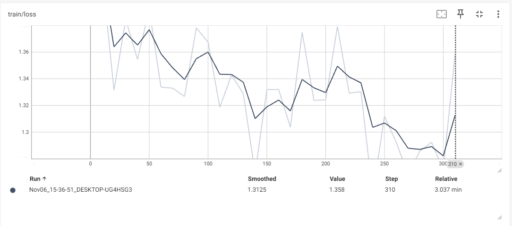
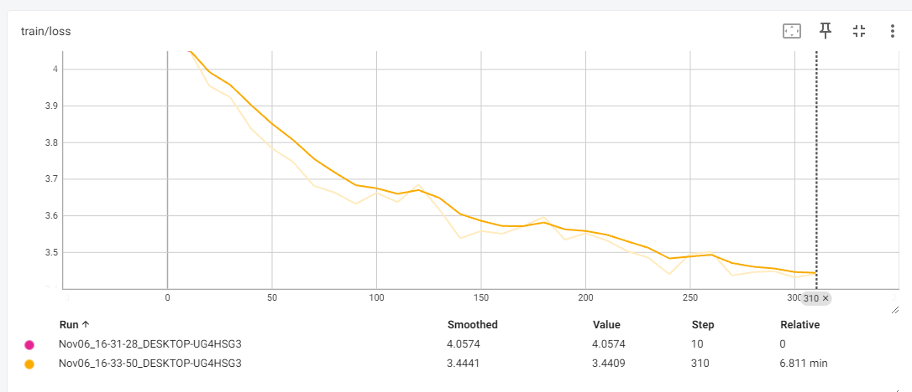

在[Transformers基础组件](nlp/huggingface/base/)]模型(Model)部分提到预训练模型类型主要有三类：自编码模型，自回归模型和编码器解码器模型。

> 自编码模型(encode model)：把token替换成[MASK]，预测这些被替换掉的字符，类似完形填空。

只计算掩码部分的loss，其余的loss都不计算（token映射为-100）

> 自回归模型(decode model)：llm（大语言模型）最常用的一种训练方式。输入一串文本，基于上文预测下文。最常见的就是手机输入法，会不断的提示你可能想输入的下一个字或下一个词。

输入我，预测爱（爱就是我的label）

输入我爱，预测你（你就是我爱的label）

输入我爱你，预测[eos]（[eos]就是我爱你的label）

这里的[eos]表示预测结束。计算loss的时候[eos]也不需要计算。

> 序列到序列(sequence2sequence model)：生成式模型。

训练任务多样化：

- 掩码生成：把一些token替换成[MASK]，预测这些被替换掉的字符，和自编码模型是一致的。
- 片段自回归：把一些token和他后面的所有token或者一段token都替换成[MASK]，然后预测这一串字符串。
- 乱序修正：把token顺序打散，然后按照正常语序还原出来。

loss只计算解码器部分，不计算编码器部分。

## 掩码模型训练

### Step1 导入相关包


```python
from transformers import AutoTokenizer, AutoModelForMaskedLM, DataCollatorForLanguageModeling, Trainer, TrainingArguments
from datasets import load_dataset, Dataset
```

### Step2 加载数据


```python
dataset = Dataset.load_from_disk('wiki_cn_filtered/')
dataset
```

    Dataset({
        features: ['source', 'completion'],
        num_rows: 10000
    })


```python
dataset[0]
```


    {'source': 'wikipedia.zh2307',
     'completion': "西安交通大学博物馆（Xi'an Jiaotong University Museum）是一座位于西安交通大学的博物馆，馆长是锺明善。\n历史\n2004年9月20日开始筹建，2013年4月8日正式建成开馆，位于西安交通大学兴庆校区陕西省西安市咸宁西路28号。建筑面积6,800平米，展厅面积4,500平米，馆藏文物4,900余件。包括历代艺术文物馆、碑石书法馆、西部农民画馆、邢良坤陶瓷艺术馆、陕西秦腔博物馆和书画展厅共五馆一厅。\n营业时间\n* 周一至周六：上午九点至十二点，下午一点至五点\n* 周日闭馆"}


### Step3 数据预处理


```python
tokenizer = AutoTokenizer.from_pretrained('hfl/chinese-macbert-base')

def process_func(examples):
    return tokenizer(examples['completion'], max_length=384, truncation=True)
```


```python
tokenized_dataset = dataset.map(process_func, batched=True, remove_columns=dataset.column_names)
```

    Map: 100%|██████████| 10000/10000 [00:03<00:00, 2764.20 examples/s]
    

### Step4 创建模型


```python
model = AutoModelForMaskedLM.from_pretrained('hfl/chinese-macbert-base')
```


### Step5 配置训练参数


```python
args = TrainingArguments(
    output_dir='/masked_lm',
    per_device_train_batch_size=32,
    logging_steps=10,
    num_train_epochs=1
)
```

### Step6 配置trainer


```python
trainer = Trainer(
    model = model,
    args = args,
    train_dataset=tokenized_dataset,
    data_collator = DataCollatorForLanguageModeling(tokenizer, mlm=True, mlm_probability=0.15)
)
```

### Step7 训练


```python
trainer.train()
```



### Step8 推理

```python
from transformers import pipeline

pipe = pipeline('fill-mask', model=model, tokenizer=tokenizer, device=0)
```


```python
result = pipe('最常见的就是手机[MASK][MASK]法，会不断的提示你可能想输入的下一个字或下一个词。')
answer1 = result[0][0]['token_str']
answer2 = result[1][0]['token_str']
print(answer1, answer2)
# result
print(f'最常见的就是手机{answer1}{answer2}法，会不断的提示你可能想输入的下一个字或下一个词。')
```

    输 入
    最常见的就是手机输入法，会不断的提示你可能想输入的下一个字或下一个词。


```python
result = pipe('插播一条[MASK][MASK]快讯，英雄联盟S13世界赛四强队伍有三席都被LPL占据，今晚LNG和SKT1将争夺最后一席四强名额，LPL能否创造历史，敬请期待！')
answer1 = result[0][0]['token_str']
answer2 = result[1][0]['token_str']
print(answer1, answer2)
print(f'插播一条{answer1}{answer2}快讯，英雄联盟S13世界赛四强队伍有三席都被LPL占据，今晚LNG和SKT1将争夺最后一席四强名额，LPL能否创造历史，敬请期待！')
```

    最 新
    插播一条最新快讯，英雄联盟S13世界赛四强队伍有三席都被LPL占据，今晚LNG和SKT1将争夺最后一席四强名额，LPL能否创造历史，敬请期待！

## 自回归模型训练

自回归模型和掩码预测的区别在于，我们需要在数据的最后加一个终止符表示句子结束，其他的Transformers已经帮我们写好了。

### Step1 导入相关包

```python
from transformers import AutoTokenizer, AutoModelForCausalLM, DataCollatorForLanguageModeling, Trainer, TrainingArguments
from datasets import load_dataset, Dataset
```


### Step2 加载数据


```python
dataset = Dataset.load_from_disk('wiki_cn_filtered/')
```


### Step3 数据预处理

加上终止符编码`tokenizer.eos_token`即可。

```python
tokenizer = AutoTokenizer.from_pretrained('Langboat/bloom-389m-zh')

def process_func(examples):
    contents = [str(e) + str(tokenizer.eos_token) for e in examples["completion"]]
    return tokenizer(contents, max_length=384, truncation=True)
```


```python
tokenized_dataset = dataset.map(process_func, batched=True, remove_columns=dataset.column_names)
```

### Step4 创建模型


```python
model = AutoModelForCausalLM.from_pretrained('Langboat/bloom-389m-zh')
```

### Step5 配置训练参数

这里选择梯度累积，3090单卡32batch size会报错CUDA out of memory。
```python
args = TrainingArguments(
    output_dir='causal_lm',
    per_device_train_batch_size=4,
    gradient_accumulation_steps=8,
    logging_steps=10,
    num_train_epochs=1,
    fp16=True
)
```

### Step6 配置trainer

这里需要设置`mlm=False`，mlm是mask language model，表示是否掩码，这个参数默认是True，之所以前面掩码训练写了这个参数，是为了和现在区分。这里做生成式推理任务，所以需要手动设置为False。

```python
trainer = Trainer(
    model = model,
    args = args,
    train_dataset=tokenized_dataset,
    data_collator = DataCollatorForLanguageModeling(tokenizer, mlm=False)
)
```

### Step7 训练

```python
trainer.train()
```



### Step8 推理

```python
from transformers import pipeline

pipe = pipeline('text-generation', model=model, tokenizer=tokenizer, device=0)
```

这里pipeline需要设置一个max_length表示生成句子的最大长度，do_sample的生成策略设置为True。

```python
res = pipe('我买了张刮刮乐，发现中了100万，赶紧发了条朋友圈，',max_length=128, do_sample=True)
print(res[0]['generated_text'])
```

    我买了张刮刮乐，发现中了100万，赶紧发了条朋友圈，却收到朋友的留言：这么好的事都给你来了，你还要来一张！原来这么好的事都能让你来张了，这是怎么可能！不过，从那时候开始，刮刮乐就不再只限中国了，大街小巷都有卖的，而且有赠送的刮刮乐。当时也才有了刮刮乐这种电子游戏币，不过好久之后就变成了微信支付。而且，这些红包不是点到即发，只是随机发在纸上，没有购买功能。所以刮刮乐的购买功能就
    
这种生成模型之所以好玩，就好玩在每次生成的结果都不能提前预知，并且是以一种符合人类语言又打破逻辑的无序输出。当模型足够强大，生成的句子真的可以以假乱真了，甚至生成引擎完全可以取代搜索引擎。