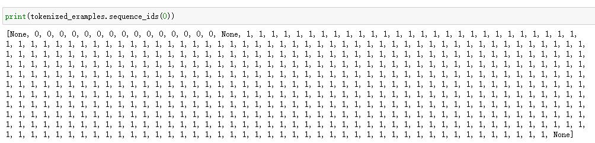
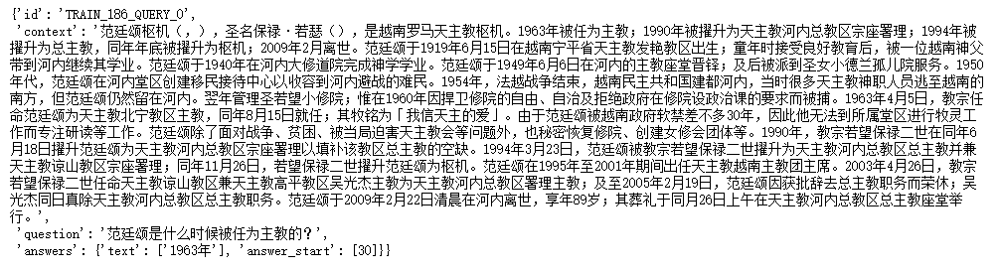
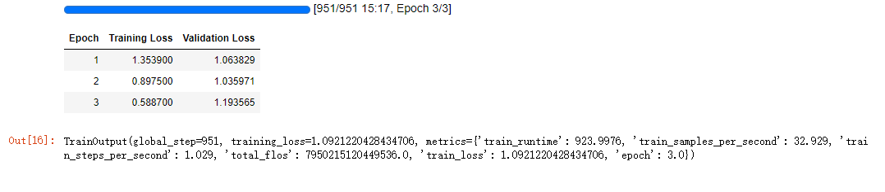
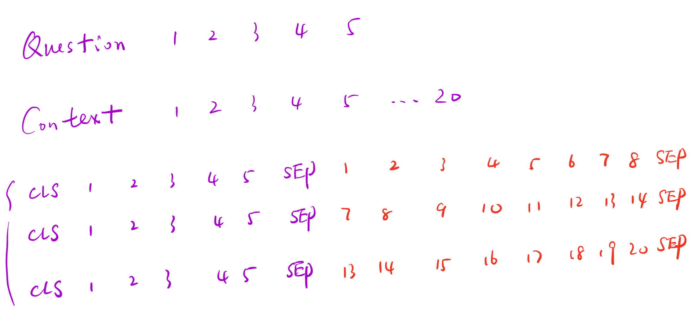
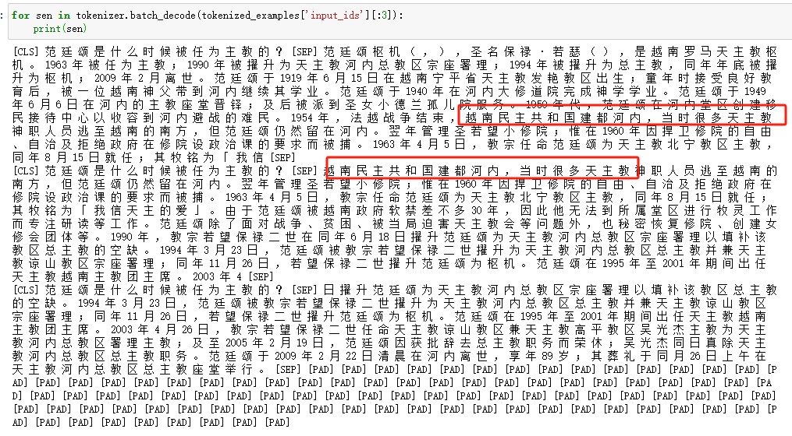
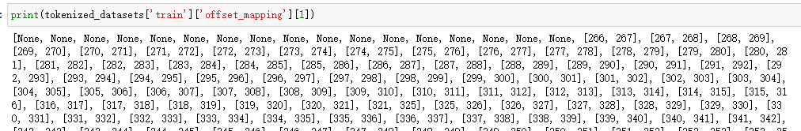
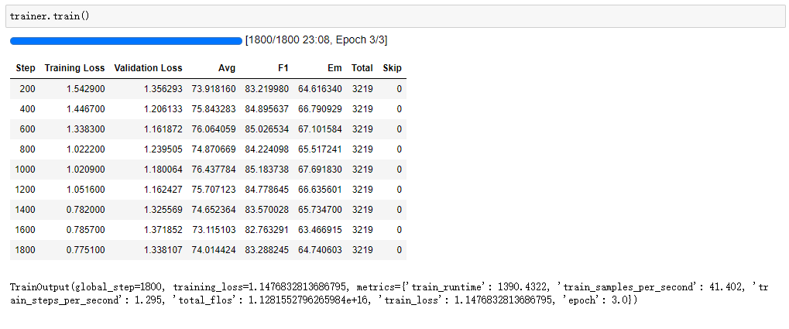

## 机器阅读理解(MRC)任务简介

从循环神经网络问世开始，人们开始探索如何让计算机理解长文本序列信息，其中一个典型的任务就是机器阅读理解(Machine Reading Comprehension, MRC)。简单来说，人们希望给机器输入一段或多段文本信息和一个问题，让机器输出问题的答案。

这个任务的难点在于，如何让机器在复杂的文本信息中抽取关键信息。也许注意力机制可以帮助算法定位核心区域，如何生成答案又是下一个难关。

并且这个任务的形式多样，除了自由生成答案以外（例如ChatGPT），还有完形填空（Bert系列），用输入的信息原文回答问题等。生成式的会在大模型后面说到，这里选择最简单的一种方式，即答案在原文中。例如

P：“小明今天去北京看升国旗了。”

Q：“小明今天去哪了？”

A：“北京”

当然这个例子过于简单了，但答案确实就在输入的文本中。看上去如此简单的一个问题，那么如何教会AI判断呢？

让AI用人类的思维去理解是不太可能的，这里的思路是，把抽取答案问题转化为定位文中序列位置的问题，把找到起点和重点又看作分类问题或者NER任务。

> 评价指标：精准匹配度(Exact Match,EM)，模糊匹配度(F1)

EM判断预测结果是否和标签完全一致，F1主要计算匹配程度。例如：

- 真实标签：梅赛德斯奔驰
- 预测结果：奔驰

此时：EM=0，precision=2/2=1，recall=2/6=0.333，F1=(2x1x0.333)/(1+0.333)=0.5

## Transformers解决方案

**（算法流程设计参考macbert方案）**

首先，不需要写评估函数。值得开香槟？因为这里我们只需要用最简单的loss计算就可以，具体怎么计算loss可以看**模型结构：AutoModelForQuestionAnswering**部分。虽然评估函数不用手写，然而MRC任务有比手写eval_metrics更更更复杂的数据处理。

如果非要验证评估，可以用pipeline推理一个阅读理解试试。

> 标准数据格式

MRC任务不像传统文本或Token级分类任务，输入的是一整个句子，Transformers在进行MRC任务时，需要把数据处理成如下格式

[cls]-question-[sep]-context-[sep]

即：开始 - 问题 - 间隔符 - 文本 - 间隔符

> 答案位置定位

只需要定位到start token和end token的位置（offset_mapping）

> question-context过长如何处理？

- strategy1. 截断。简单粗暴，但是如果答案被截断丢弃，则无法定位答案。
- strategy2. 滑窗。实现复杂，但更加科学。

> 模型结构：*ModelForQuestionAnswering

和众多NLP下游任务的基本流程一样，首先bert编码，然后用一个分类器二分类。这里分类输出的结果对应答案的起始位置和结束位置，然后把这两个位置分别计算交叉熵，再求和除2。

> 模型选择：macbert-base

### 基于截断策略处理question-context

#### Step1 导入相关包

```python
from transformers import AutoTokenizer, AutoModelForQuestionAnswering, TrainingArguments, Trainer, DefaultDataCollator, pipeline
from datasets import load_dataset
```

#### Step2 加载数据

```python
datasets = load_dataset("cmrc2018", cache_dir="data")
datasets['train'][0]
```

    {'id': 'TRAIN_186_QUERY_0',
     'context': '范廷颂枢机（，），圣名保禄·若瑟（），是越南罗马天主教枢机。1963年被任为主教；1990年被擢升为天主教河内总教区宗座署理；1994年被擢升为总主教，同年年底被擢升为枢机；2009年2月离世。范廷颂于1919年6月15日在越南宁平省天主教发艳教区出生；童年时接受良好教育后，被一位越南神父带到河内继续其学业。范廷颂于1940年在河内大修道院完成神学学业。范廷颂于1949年6月6日在河内的主教座堂晋铎；及后被派到圣女小德兰孤儿院服务。1950年代，范廷颂在河内堂区创建移民接待中心以收容到河内避战的难民。1954年，法越战争结束，越南民主共和国建都河内，当时很多天主教神职人员逃至越南的南方，但范廷颂仍然留在河内。翌年管理圣若望小修院；惟在1960年因捍卫修院的自由、自治及拒绝政府在修院设政治课的要求而被捕。1963年4月5日，教宗任命范廷颂为天主教北宁教区主教，同年8月15日就任；其牧铭为「我信天主的爱」。由于范廷颂被越南政府软禁差不多30年，因此他无法到所属堂区进行牧灵工作而专注研读等工作。范廷颂除了面对战争、贫困、被当局迫害天主教会等问题外，也秘密恢复修院、创建女修会团体等。1990年，教宗若望保禄二世在同年6月18日擢升范廷颂为天主教河内总教区宗座署理以填补该教区总主教的空缺。1994年3月23日，范廷颂被教宗若望保禄二世擢升为天主教河内总教区总主教并兼天主教谅山教区宗座署理；同年11月26日，若望保禄二世擢升范廷颂为枢机。范廷颂在1995年至2001年期间出任天主教越南主教团主席。2003年4月26日，教宗若望保禄二世任命天主教谅山教区兼天主教高平教区吴光杰主教为天主教河内总教区署理主教；及至2005年2月19日，范廷颂因获批辞去总主教职务而荣休；吴光杰同日真除天主教河内总教区总主教职务。范廷颂于2009年2月22日清晨在河内离世，享年89岁；其葬礼于同月26日上午在天主教河内总教区总主教座堂举行。',
     'question': '范廷颂是什么时候被任为主教的？',
     'answers': {'text': ['1963年'], 'answer_start': [30]}}

#### Step3 数据预处理

```python
tokenizer = AutoTokenizer.from_pretrained('hfl/chinese-macbert-base')
```

至此，我们需要把数据处理成标准格式。

首先把question和context都编码看看。以第一句为例

```python
sample_dataset = datasets['train'].select(range(10))
tokenized_example = tokenizer(text=sample_dataset['question'], text_pair=sample_dataset['context'])
print(tokenized_example['input_ids'][0], len(tokenized_example['input_ids'][0]))
```

这样会得到一个长度767的字符编码。显然过长了，我们直接截断。

```python
tokenized_examples = tokenizer(text=sample_dataset['question'], 
                               text_pair=sample_dataset['context'], 
                               max_length=512, 
                               padding='max_length', 
                               truncation='only_second',
                               return_offsets_mapping=True)
print(tokenized_examples['input_ids'][0], len(tokenized_examples['input_ids'][0]))
```

这样就会得到一个最大长度512的question-context序列，并且保证截断的是context。

在打印这段话的时候会出现满屏数字，可以用如下方式查看token属于question还是context



此外，tokenizer还设置了`return_offsets_mapping=True`，这样就可以返回连续元组：

```python
print(tokenized_examples['offset_mapping'][0], len(tokenized_examples['offset_mapping'][0]))
```

    [(0, 0), (0, 1), (1, 2), (2, 3), (3, 4), (4, 5), (5, 6), (6, 7), (7, 8), (8, 9), (9, 10), (10, 11), (11, 12), (12, 13), (13, 14), (14, 15), 
    (0, 0), (0, 1), (1, 2), (2, 3), (3, 4), (4, 5), (5, 6), (6, 7), (7, 8), (8, 9), (9, 10), (10, 11), (11, 12), (12, 13), (13, 14), (14, 15), (15, 16), (16, 17), (17, 18), (18, 19), (19, 20)...

可以发现上方到15之后又从（0，0）开始了。这表示前面15个就是问题，后面是文本。**注意：如果有英文，他就会出现一个token对应多个编码位置的情况，例如(182, 186)，这就是NER中提到的，1个英文token可能会对应多个位置**

然后用offset_mapping定位答案位置。现在的思路非常简单，在dataset里有answer的start位置，只需要加上answer的长度，就可以定位到结束位置。然后把字符位置在context编码中找到即可。



先把数据结构放在上图。

先取出offset_mapping：`offset_mapping = tokenized_examples.pop('offset_mapping')`

首先我们找到这个answers的起始位置start_，然后加上len(answers.text)就可以确定结束位置end_。

```python
for idx, offset in enumerate(offset_mapping):
    answer = sample_dataset[idx]['answers']
    start_ = answer['answer_start'][0]
    end_   = start_ + len(answer['text'][0])
    print(answer, start_, end_)
```

    {'text': ['1963年'], 'answer_start': [30]} 30 35
    {'text': ['1990年被擢升为天主教河内总教区宗座署理'], 'answer_start': [41]} 41 62
    {'text': ['范廷颂于1919年6月15日在越南宁平省天主教发艳教区出生'], 'answer_start': [97]} 97 126
    {'text': ['1994年3月23日，范廷颂被教宗若望保禄二世擢升为天主教河内总教区总主教并兼天主教谅山教区宗座署理'], 'answer_start': [548]} 548 598
    {'text': ['范廷颂于2009年2月22日清晨在河内离世'], 'answer_start': [759]} 759 780
    {'text': ['《全美超级模特儿新秀大赛》第十季'], 'answer_start': [26]} 26 42
    {'text': ['有前途的新面孔'], 'answer_start': [247]} 247 254
    {'text': ['《Jet》、《东方日报》、《Elle》等'], 'answer_start': [706]} 706 726
    {'text': ['售货员'], 'answer_start': [202]} 202 205
    {'text': ['大空翼'], 'answer_start': [84]} 84 87

这个定位的结果只是字符级别的，我们需要定位到token级别（因为有些英文单词会占用几个字符）。

现在我们可以用这样一个办法，我们定位到context的起始和结束位置，然后两边往中间靠，直到检索到answer。那么这个方法需要先找到context的起始位置和终止位置。


首先我们可以找到编码为1的（表示context）的第一个位置作为context起始位，然后最后一个None的前一个作为结束位置。

```python
for idx, offset in enumerate(offset_mapping):
    answer = sample_dataset[idx]['answers']
    start_ = answer['answer_start'][0]
    end_   = start_ + len(answer['text'][0])
    
    context_start = tokenized_examples.sequence_ids(idx).index(1)
    context_end   = tokenized_examples.sequence_ids(idx).index(None, context_start) - 1
    
    print(answer, start_, end_, context_start, context_end)
```

    {'text': ['1963年'], 'answer_start': [30]} 30 35 17 510
    {'text': ['1990年被擢升为天主教河内总教区宗座署理'], 'answer_start': [41]} 41 62 15 510
    {'text': ['范廷颂于1919年6月15日在越南宁平省天主教发艳教区出生'], 'answer_start': [97]} 97 126 15 510
    {'text': ['1994年3月23日，范廷颂被教宗若望保禄二世擢升为天主教河内总教区总主教并兼天主教谅山教区宗座署理'], 'answer_start': [548]} 548 598 17 510
    {'text': ['范廷颂于2009年2月22日清晨在河内离世'], 'answer_start': [759]} 759 780 12 510
    {'text': ['《全美超级模特儿新秀大赛》第十季'], 'answer_start': [26]} 26 42 21 510
    {'text': ['有前途的新面孔'], 'answer_start': [247]} 247 254 20 510
    {'text': ['《Jet》、《东方日报》、《Elle》等'], 'answer_start': [706]} 706 726 20 510
    {'text': ['售货员'], 'answer_start': [202]} 202 205 18 510
    {'text': ['大空翼'], 'answer_start': [84]} 84 87 21 486

这有几个最直观的问题，前面几个句子都被截断在512的位置，如果答案被截走了怎么办，或者答案被截走一部分怎么办。

对于第一种情况，因此需要做一个判断，这也很好实现，我们只需要确定context最后的一个值仍然小于start_，或者context第一个值仍大于end_就可以确定答案被截走了。

第二种情况，其实不需要单独考虑，因为我们是左右往中间靠，如果被截断了尾巴，那右边一定不满足往左寻找位置的条件，那自然就定位在最后一个位置。

```python
for idx, offset in enumerate(offset_mapping):
    answer = sample_dataset[idx]['answers']
    start_ = answer['answer_start'][0]
    end_   = start_ + len(answer['text'][0])
    
    context_start = tokenized_examples.sequence_ids(idx).index(1)
    context_end   = tokenized_examples.sequence_ids(idx).index(None, context_start) - 1
    
    # 答案全部被截走
    if offset[context_end][1] < start_ or offset[context_start][0] > end_:
        start_token_pos = 0
        end_token_pos = 0
    # 答案全部保留或部分保留
    else:
        token_id = context_start
        while token_id <= context_end and offset[token_id][0] < start_:
            token_id += 1
        start_token_pos = token_id
        token_id = context_end
        while token_id >= context_start and offset[token_id][1] > end_:
            token_id -= 1
        end_token_pos = token_id
    
    print(answer, 
          start_, 
          end_, 
          context_start, 
          context_end, 
          start_token_pos, 
          end_token_pos, 
          str(tokenizer.decode(tokenized_examples['input_ids'][idx][start_token_pos: end_token_pos + 1])).replace(' ',''))
```

    {'text': ['1963年'], 'answer_start': [30]} 30 35 17 510 47 48 1963年
    {'text': ['1990年被擢升为天主教河内总教区宗座署理'], 'answer_start': [41]} 41 62 15 510 53 70 1990年被擢升为天主教河内总教区宗座署理
    {'text': ['范廷颂于1919年6月15日在越南宁平省天主教发艳教区出生'], 'answer_start': [97]} 97 126 15 510 100 124 范廷颂于1919年6月15日在越南宁平省天主教发艳教区出生
    {'text': ['1994年3月23日，范廷颂被教宗若望保禄二世擢升为天主教河内总教区总主教并兼天主教谅山教区宗座署理'], 'answer_start': [548]} 548 598 17 510 0 0 [CLS]
    {'text': ['范廷颂于2009年2月22日清晨在河内离世'], 'answer_start': [759]} 759 780 12 510 0 0 [CLS]
    {'text': ['《全美超级模特儿新秀大赛》第十季'], 'answer_start': [26]} 26 42 21 510 47 62 《全美超级模特儿新秀大赛》第十季
    {'text': ['有前途的新面孔'], 'answer_start': [247]} 247 254 20 510 232 238 有前途的新面孔
    {'text': ['《Jet》、《东方日报》、《Elle》等'], 'answer_start': [706]} 706 726 20 510 0 0 [CLS]
    {'text': ['售货员'], 'answer_start': [202]} 202 205 18 510 205 207 售货员
    {'text': ['大空翼'], 'answer_start': [84]} 84 87 21 486 105 107 大空翼

好，没问题了，然后给他封装成一个函数

```python
def process_func(examples):
    start_positions, end_positions = [], []
    tokenized_examples = tokenizer(text=examples['question'], 
                               text_pair=examples['context'], 
                               max_length=512, 
                               padding='max_length', 
                               truncation='only_second',
                               return_offsets_mapping=True)
    offset_mapping = tokenized_examples.pop('offset_mapping')
    for idx, offset in enumerate(offset_mapping):
        # 这里的examples是DatasetDict，要先取answers
        answer = examples['answers'][idx]
        start_ = answer['answer_start'][0]
        end_   = start_ + len(answer['text'][0])

        context_start = tokenized_examples.sequence_ids(idx).index(1)
        context_end   = tokenized_examples.sequence_ids(idx).index(None, context_start) - 1

        # 答案全部被截走
        if offset[context_end][1] < start_ or offset[context_start][0] > end_:
            start_token_pos = 0
            end_token_pos = 0
        # 答案全部保留或部分保留
        else:
            token_id = context_start
            while token_id <= context_end and offset[token_id][0] < start_:
                token_id += 1
            start_token_pos = token_id
            token_id = context_end
            while token_id >= context_start and offset[token_id][1] > end_:
                token_id -= 1
            end_token_pos = token_id
        start_positions.append(start_token_pos)
        end_positions.append(end_token_pos)
    
    tokenized_examples['start_positions'] = start_positions
    tokenized_examples['end_positions'] = end_positions
    return tokenized_examples

tokenized_datasets = datasets.map(process_func, batched=True, remove_columns=datasets['train'].column_names)
```

#### Step4 加载模型

```python
model = AutoModelForQuestionAnswering.from_pretrained('hfl/chinese-macbert-base')
```

#### Step5 配置训练参数

```python
args = TrainingArguments(
    output_dir = 'models_for_mrc',
    per_device_train_batch_size=32,
    per_device_eval_batch_size=32,
    evaluation_strategy='epoch',
    save_strategy='epoch',
    logging_steps=50,
    num_train_epochs=3
)
```

#### Step6 配置Trainer

```python
trainer = Trainer(
    model = model,
    args = args,
    train_dataset=tokenized_datasets['train'],
    eval_dataset =tokenized_datasets['validation'],
    data_collator=DefaultDataCollator()
)
```

#### Step7 训练

```python
trainer.train()
```



#### Step8 推理

```python
pipe = pipeline('question-answering', model=model, tokenizer=tokenzier, device=0)
pipe(question='往左走是什么？',context='银行在你的左边！')
```

    {'score': 0.8708165287971497, 'start': 0, 'end': 2, 'answer': '银行'}

```python
pipe(question='往左走是什么？',context='左边可以取钱，是个农业银行，右边是餐厅！')
```

    {'score': 0.14375180006027222,
     'start': 0,
     'end': 13,
     'answer': '左边可以取钱，是个农业银行'}

```python
pipe(question='我饿了走哪边？',context='左边可以取钱，是个农业银行，右边是餐厅！')
```

    {'score': 0.05664796754717827, 'start': 14, 'end': 19, 'answer': '右边是餐厅'}

### 基于滑窗策略处理question-context

刚刚的策略最大的问题在于，答案很可能被裁掉，并且裁掉信息也会影响对语义的理解。因此更希望用一种可以收到全部信息的策略。

滑窗思想也非常容易想到，既然一条512的长度我都装不下你，我用3条256行不行？



可以发现这里第二条重复了7 8，第三条重复了13 14，实际上我们在使用的时候会重复更多（通常是128个），这是因为假如答案是9-11，那么只有第二条数据有，这是没问题的；如果答案是7-9，那么不重复则第一条第二条都不能匹配到答案。重复越多，虽然计算量变大，但是答案的宽容度会高很多。

在预测的时候，对三条数据都进行预测，假设结果是9-11，那么第一条和第三条数据的匹配结果就是cls，第二条是9-11，最后肯定就选择9-11了。

除此之外，在[NLP基础](nlp/n2l/)部分，我们介绍了nltk这个英文分词包，

前面的代码基本一样，直接copy过来。

#### Step1 导入相关包

```python
from transformers import AutoTokenizer, AutoModelForQuestionAnswering, TrainingArguments, Trainer, DefaultDataCollator, pipeline
from datasets import load_dataset
import nltk
```

#### Step2 加载数据

```python
datasets = load_dataset("cmrc2018", cache_dir="data")
```

#### Step3 数据预处理

这里需要修改一些参数了。 首先设定`return_overflowing_tokens=True`表示开始滑窗，设置`stride=128`表示重复128个tokens。
```python
tokenizer = AutoTokenizer.from_pretrained('hfl/chinese-macbert-base')
sample_dataset = datasets['train'].select(range(10))
tokenized_examples = tokenizer(text=sample_dataset['question'], 
                               text_pair=sample_dataset['context'], 
                               max_length=384, 
                               padding='max_length', 
                               truncation='only_second',
                               return_offsets_mapping=True,
                               stride=128,
                               return_overflowing_tokens=True)
```

```python
print(tokenized_examples.overflow_to_sample_mapping, len(tokenized_examples.overflow_to_sample_mapping))
```

    [0, 0, 0, 1, 1, 1, 2, 2, 2, 3, 3, 3, 4, 4, 4, 5, 5, 5, 6, 6, 6, 7, 7, 7, 8, 8, 8, 9, 9] 29

这样，10个句子就被拆分成了29个。并且重复128个字符位。



在这种情况下，offset_mapping也会同步变化，即第二条开始是第一条滑动窗口后的信息。

首先，在这种数据被分成几条的情况下，对于每一条数据，实际上和直接截断是没区别的，只需要多一行代码定位句子`tokenized_examples.overflow_to_sample_mapping`，确定第几条是第几篇文章的。

在截断成一句话的情况下，`answer = sample_dataset['answers'][idx]`，在这里，需要对每句话都判断一次，`answer = sample_dataset['answers'][sample_mapping[idx]]`。这样实际上就和直接截断的处理方式一致了。

```python
for idx, offset in enumerate(sample_mapping):
    offset = tokenized_examples.get('offset_mapping')[idx]
    answer = sample_dataset['answers'][sample_mapping[idx]]
    start_ = answer['answer_start'][0]
    end_   = start_ + len(answer['text'][0])
    
    context_start = tokenized_examples.sequence_ids(idx).index(1)
    context_end   = tokenized_examples.sequence_ids(idx).index(None, context_start) - 1
    
    # 答案全部被截走
    if offset[context_end][1] < start_ or offset[context_start][0] > end_:
        start_token_pos = 0
        end_token_pos = 0
    # 答案全部保留或部分保留
    else:
        token_id = context_start
        while token_id <= context_end and offset[token_id][0] < start_:
            token_id += 1
        start_token_pos = token_id
        token_id = context_end
        while token_id >= context_start and offset[token_id][1] > end_:
            token_id -= 1
        end_token_pos = token_id
    
    print(answer, 
          start_, 
          end_, 
          context_start, 
          context_end, 
          start_token_pos, 
          end_token_pos, 
          str(tokenizer.decode(tokenized_examples['input_ids'][idx][start_token_pos: end_token_pos + 1])).replace(' ',''))
```

    {'text': ['1963年'], 'answer_start': [30]} 30 35 17 382 47 48 1963年
    {'text': ['1963年'], 'answer_start': [30]} 30 35 17 382 0 0 [CLS]
    {'text': ['1963年'], 'answer_start': [30]} 30 35 17 289 0 0 [CLS]
    {'text': ['1990年被擢升为天主教河内总教区宗座署理'], 'answer_start': [41]} 41 62 15 382 53 70 1990年被擢升为天主教河内总教区宗座署理
    {'text': ['1990年被擢升为天主教河内总教区宗座署理'], 'answer_start': [41]} 41 62 15 382 0 0 [CLS]
    {'text': ['1990年被擢升为天主教河内总教区宗座署理'], 'answer_start': [41]} 41 62 15 283 0 0 [CLS]
    {'text': ['范廷颂于1919年6月15日在越南宁平省天主教发艳教区出生'], 'answer_start': [97]} 97 126 15 382 100 124 范廷颂于1919年6月15日在越南宁平省天主教发艳教区出生
    {'text': ['范廷颂于1919年6月15日在越南宁平省天主教发艳教区出生'], 'answer_start': [97]} 97 126 15 382 0 0 [CLS]
    {'text': ['范廷颂于1919年6月15日在越南宁平省天主教发艳教区出生'], 'answer_start': [97]} 97 126 15 283 0 0 [CLS]
    {'text': ['1994年3月23日，范廷颂被教宗若望保禄二世擢升为天主教河内总教区总主教并兼天主教谅山教区宗座署理'], 'answer_start': [548]} 548 598 17 382 0 0 [CLS]
    {'text': ['1994年3月23日，范廷颂被教宗若望保禄二世擢升为天主教河内总教区总主教并兼天主教谅山教区宗座署理'], 'answer_start': [548]} 548 598 17 382 287 332 1994年3月23日，范廷颂被教宗若望保禄二世擢升为天主教河内总教区总主教并兼天主教谅山教区宗座署理
    {'text': ['1994年3月23日，范廷颂被教宗若望保禄二世擢升为天主教河内总教区总主教并兼天主教谅山教区宗座署理'], 'answer_start': [548]} 548 598 17 289 49 94 1994年3月23日，范廷颂被教宗若望保禄二世擢升为天主教河内总教区总主教并兼天主教谅山教区宗座署理
    {'text': ['范廷颂于2009年2月22日清晨在河内离世'], 'answer_start': [759]} 759 780 12 382 0 0 [CLS]
    {'text': ['范廷颂于2009年2月22日清晨在河内离世'], 'answer_start': [759]} 759 780 12 382 0 0 [CLS]
    {'text': ['范廷颂于2009年2月22日清晨在河内离世'], 'answer_start': [759]} 759 780 12 274 225 241 范廷颂于2009年2月22日清晨在河内离世
    {'text': ['《全美超级模特儿新秀大赛》第十季'], 'answer_start': [26]} 26 42 21 382 47 62 《全美超级模特儿新秀大赛》第十季
    {'text': ['《全美超级模特儿新秀大赛》第十季'], 'answer_start': [26]} 26 42 21 382 0 0 [CLS]
    {'text': ['《全美超级模特儿新秀大赛》第十季'], 'answer_start': [26]} 26 42 21 174 0 0 [CLS]
    {'text': ['有前途的新面孔'], 'answer_start': [247]} 247 254 20 382 232 238 有前途的新面孔
    {'text': ['有前途的新面孔'], 'answer_start': [247]} 247 254 20 382 0 0 [CLS]
    {'text': ['有前途的新面孔'], 'answer_start': [247]} 247 254 20 171 0 0 [CLS]
    {'text': ['《Jet》、《东方日报》、《Elle》等'], 'answer_start': [706]} 706 726 20 382 0 0 [CLS]
    {'text': ['《Jet》、《东方日报》、《Elle》等'], 'answer_start': [706]} 706 726 20 382 0 0 [CLS]
    {'text': ['《Jet》、《东方日报》、《Elle》等'], 'answer_start': [706]} 706 726 20 171 155 170 《jet》、《东方日报》、《elle》等
    {'text': ['售货员'], 'answer_start': [202]} 202 205 18 382 205 207 售货员
    {'text': ['售货员'], 'answer_start': [202]} 202 205 18 382 0 0 [CLS]
    {'text': ['售货员'], 'answer_start': [202]} 202 205 18 165 0 0 [CLS]
    {'text': ['大空翼'], 'answer_start': [84]} 84 87 21 382 105 107 大空翼
    {'text': ['大空翼'], 'answer_start': [84]} 84 87 21 252 0 0 [CLS]

写成函数，除了上述功能，我们还补充了一个额外功能，即我们希望把每一句的question全部编码成None，这样在预测的时候如果预测到前面文本的内容就可以自动被屏蔽掉。`tokenized_examples.sequence_ids(i)`可以查看第i个编码的句子id，0表示问题，1表示文本。

    [None, 0, 0, 0, 0, 0, 0, 0, 0, 0, 0, 0, 0, 0, 0, 0, None, 1, 1, 1, 1, 1, 1, 1, 1, 1, 1, 1, 1, 1, 1, 1, 1, 1, 1, None]

我们只需要写一个循环遍历，如果`tokenized_examples.sequence_ids(i)=0`，就赋值成None：

```python
for idx, offset in enumerate(sample_mapping):
    for k, o in enumerate(tokenized_examples['offset_mapping'][idx]):
        if tokenized_examples.sequence_ids(idx)[k] == 0:
            tokenized_examples['offset_mapping'][idx] = None
        else:
            tokenized_examples['offset_mapping'][idx] = o

    # 或者用嵌套循环减小内存开销
    tokenized_examples['offset_mapping'][idx] = [
            (o if tokenized_examples.sequence_ids(idx)[k] == 1 else None)
            for k, o in enumerate(tokenized_examples['offset_mapping'][idx])
        ]
```

最终的效果如下图



最后整体函数如下：

```python
def process_func(examples):
    start_positions, end_positions, example_ids = [], [], []
    tokenized_examples = tokenizer(text=examples['question'], 
                                   text_pair=examples['context'], 
                                   max_length=384, 
                                   padding='max_length', 
                                   truncation='only_second',
                                   return_offsets_mapping=True,
                                   stride=128,
                                   return_overflowing_tokens=True)
    sample_mapping = tokenized_examples.pop('overflow_to_sample_mapping')
    for idx, offset in enumerate(sample_mapping):
        offset = tokenized_examples.get('offset_mapping')[idx]
        
        answer = examples['answers'][sample_mapping[idx]]
        start_ = answer['answer_start'][0]
        end_   = start_ + len(answer['text'][0])

        context_start = tokenized_examples.sequence_ids(idx).index(1)
        context_end   = tokenized_examples.sequence_ids(idx).index(None, context_start) - 1

        # 答案全部被截走
        if offset[context_end][1] < start_ or offset[context_start][0] > end_:
            start_token_pos = 0
            end_token_pos = 0
        # 答案全部保留或部分保留
        else:
            token_id = context_start
            while token_id <= context_end and offset[token_id][0] < start_:
                token_id += 1
            start_token_pos = token_id
            token_id = context_end
            while token_id >= context_start and offset[token_id][1] > end_:
                token_id -= 1
            end_token_pos = token_id
        start_positions.append(start_token_pos)
        end_positions.append(end_token_pos)
        example_ids.append(examples['id'][sample_mapping[idx]])
        
        tokenized_examples['offset_mapping'][idx] = [
            (o if tokenized_examples.sequence_ids(idx)[k] == 1 else None)
            for k, o in enumerate(tokenized_examples['offset_mapping'][idx])
        ]
        
    tokenized_examples['example_ids'] = example_ids
    tokenized_examples['start_positions'] = start_positions
    tokenized_examples['end_positions'] = end_positions
    return tokenized_examples

tokenized_datasets = datasets.map(process_func, batched=True, remove_columns=datasets['train'].column_names)
```

这里我们还增加了一个example_ids用来储存信息：

```python
tokenized_datasets['train']['example_ids'][:10]
```

    ['TRAIN_186_QUERY_0',
     'TRAIN_186_QUERY_0',
     'TRAIN_186_QUERY_0',
     'TRAIN_186_QUERY_1',
     'TRAIN_186_QUERY_1',
     'TRAIN_186_QUERY_1',
     'TRAIN_186_QUERY_2',
     'TRAIN_186_QUERY_2',
     'TRAIN_186_QUERY_2',
     'TRAIN_186_QUERY_3']

写一个转换函数：

```python
import numpy as np
import collections

def example2feature(features):
    example_to_feature = collections.defaultdict(list)
    for idx, example_id in enumerate(features['example_ids'][:10]):
        example_to_feature[example_id].append(idx)
    return example_to_feature

example2feature(tokenized_datasets['train'])
```

    defaultdict(list,
    {'TRAIN_186_QUERY_0': [0, 1, 2],
    'TRAIN_186_QUERY_1': [3, 4, 5],
    'TRAIN_186_QUERY_2': [6, 7, 8],
    'TRAIN_186_QUERY_3': [9]})

得益于返回None，因此即使3条数据，我们查询的依然是有答案返回值的那条。

#### Step4 获取模型输出

```python
import numpy as np
import collections

def get_result(start_logits, end_logits, examples, features):
    
    predictions = {}
    references = {}
    
    # example2feature
    example2feature = collections.defaultdict(list)
    for idx, example_id in enumerate(features['example_ids']):
        example2feature[example_id].append(idx)
    
    # 最优答案设置
    n_best = 20
    max_answer_length = 20
    
    for example in examples:
        example_id = example['id']
        context = example['context']
        ansewers= []
        # 拿到'TRAIN_186_QUERY_0': [0, 1, 2]这里的[0,1,2]
        for feature_idx in example2feature[example_id]:
            # 拿到单次预测的结果
            start_logit = start_logits[feature_idx]
            end_logit = end_logits[feature_idx]
            offset = features[feature_idx]['offset_mapping']
            start_indexes = np.argsort(start_logit)[::-1][:n_best].tolist()
            end_indexes = np.argsort(end_logit)[::-1][:n_best].tolist()
            for start_index in start_indexes:
                for end_index in end_indexes:
                    if offset[start_index] is None or offset[end_index] is None:
                        continue
                    elif end_index < start_index or end_index - start_index + 1 > max_answer_length:
                        continue
                    ansewers.append({
                        'text': context[offset[start_index][0]: offset[end_index][1]],
                        'score': start_logit[start_index] + end_logit[end_index]
                    })
        if len(ansewers) > 0:
            best_answer = max(ansewers, key=lambda x: x['score'])
            predictions[example_id] = best_answer['text']
        else:
            predictions[example_id] = ''
        references[example_id] = example['answers']['text']
    return predictions, references
```

#### Step5 评估函数

有一个官方的cmrc_eval.py文件用来验证，但是官方的文件是对最终生成的文件进行评估，这里是一个对pred和refer进行评估的魔改版。

```python
from cmrc_eval import evaluate_cmrc

def metric(pred):
    start_logits, end_logits = pred[0]
    if start_logits.shape[0] == len(tokenized_datasets['validation']):
        p, r = get_result(start_logits, end_logits,datasets['validation'], tokenized_datasets['validation'])
    else:
        p, r = get_result(start_logits, end_logits,datasets['test'], tokenized_datasets['test'])
    return evaluate_cmrc(p, r)
```

#### Step6 加载模型

```python
model = AutoModelForQuestionAnswering.from_pretrained('hfl/chinese-macbert-base')
```

#### Step7 配置Args

```python
args = TrainingArguments(
    output_dir = 'models_for_mrc',
    per_device_train_batch_size=32,
    per_device_eval_batch_size=32,
    evaluation_strategy='steps',
    eval_steps=100,
    save_strategy='epoch',
    logging_steps=50,
    num_train_epochs=3
)
```

#### Step8 配置Trainer

增加一个`compute_metrics = metric`就好
```python
trainer = Trainer(
    model = model,
    args = args,
    train_dataset=tokenized_datasets['train'],
    eval_dataset =tokenized_datasets['validation'],
    data_collator=DefaultDataCollator(),
    compute_metrics=metric
)
```

#### Step9 训练模型

```python
trainer.train()
```



#### Step10 推理

```python
pipe = pipeline('question-answering', model=model, tokenizer=tokenizer, device=0)
pipe(question='法拉第未来的困境是什么',context='根据最新的法拉第未来官方消息，公司计划在11月交付5辆旗舰汽车FF912.0未来主义者联盟版。同时，他们还计划从11月最后一周开始，每周交付2辆新车。这一消息对于一直期待交付的消费者来说是一个好消息。然而，回顾过去9年的投资情况，法拉第未来已经投资了约30亿美元（约合人民币219亿元）。虽然在今年8月，他们成功地交付了首辆FF912.0未来主义者联盟版，但迄今为止，总交付量仅为5辆新车。原计划是在今年4月开始交付第一批生产车型FuturistAlliance限量款300辆，但由于各种原因一再延迟，这个计划变得只是一纸空谈，回顾贾跃亭的经历，自从他于2017年飞赴美国并成功上市以来，法拉第未来的市值一度超过了300亿元。这一系列的成功动态让质疑他的人大跌眼镜。然而，随着高昂的造车投入和债务压力的持续存在，即使贾跃亭再次融资数亿美元，他仍然无法解决资金问题。长时间没有进展的造车事业也让市场对法拉第未来失去了信心，股价从最高的1660元跌至如今的1元。')
```

    {'score': 0.6176570653915405,
     'start': 382,
     'end': 394,
     'answer': '长时间没有进展的造车事业'}

## 总结

这里的MRC是最基础的用原文的话回答问题。

MRC任务最复杂的部分是数据预处理，难点其一在于数据处理成规范格式，其二在于如何实现编码到token的精准映射。

总体思路是：

- tokenizer(text=question,text_pair=context)实现规范格式的拼接
- tokenizer(return_offsets_mapping=True)返回元组，可以定位token被encode之后的长度（中文一般是1个，英文可能是多个）
- 根据元组的index就能定位token的位置，这意味着只要找到预测的标签是第几个元组，就能反过来定位到token，然后提取出关键信息。

由于存在长文本，有截断（简单粗暴）和滑窗（macbert等模型）两个思路

截断存在非常明显的短板，但是本质上和滑窗后结果处理模式是一样的，因为滑窗和截断核心区别就是在于一句话是否被截断成多句。对于滑窗的每一个结果，都可以用截断的处理流程进行处理。

具体处理思路是：

- case1：答案不在这一行context里，返回None
- case2：答案在这一行context里，直接把start索引和end索引分别放在第一个和最后一个位置，然后往中间逼近，最终确定我们要找的答案的起始位置和终止位置。在这种情况下，如果右边被截断，那么自然end索引就不用往左逼近（滑窗可以大概率解决这个问题）。

完成数据处理后，接下来还有一个复杂的工作，需要获取模型的输出，输入到评估函数。当然如果不写评估函数，直接用pipeline推理也是可以。

评估函数有现成的，只需要输入预测值和真实值就可以返回结果，所以任务的难点在如何获取预测值和真实值。

思路如下：

模型预测会输出start和end位置。如果是一段话被滑窗分成3段，就会输出3个start和end位置，对start和end做两层循环，找到最合适的答案。如果中间有None，则答案被抛弃。