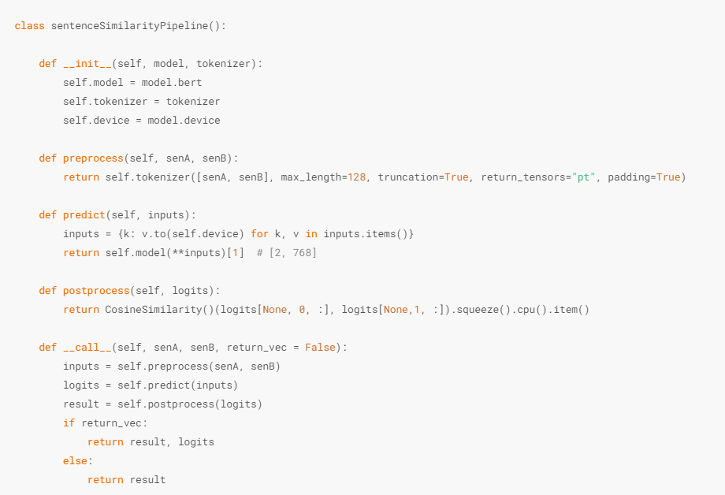

****
> 前置内容：[推荐系统相似度匹配解决方案](nlp/huggingface/wide/)

这里是该内容对应的算法应用实践，没有单独训练模型，所用的是前置内容已经训练好的模型。
****

## 文本检索任务简介

在这里我们想训练一个ai，学习大量的预料库，然后根据用户提出的问题，从语料库中搜索答案然后返回给用户。和ChatGPT这种生产式的对话机器人不同，这里还是使用的搜索定位方案，这种搜索实现的完全看预料库完备程度和模型训练精度。

这种AI机器人也有很多类型，有闲聊机器人，任务型对话机器人。

> 闲聊机器人：辅助主逻辑任务，当用户输入的信息和主逻辑不同时，例如这是一个智能对话诊断看病的AI服务，结果用户根本不描述自己的病情，为了保证整体智能化，需要连接一个闲聊机器人。至于如何判断用户信息是否符合主逻辑呢？只需要使用我们前面讲过的文本分类，确定上下文是否有关联即可。

> 任务型对话机器人：在对应垂直领域训练的AI，专门完成相关领域的专业对话。

## Transformers解决方案

根据任务描述，可以初步定义一下实现逻辑：用户输入文本信息 -> 文本信息处理 -> 匹配语料库最合适的回答 -> 返回用户。

因此，这也是推荐系统在文本信息的进一步深入。与此同时，我们同样可以复用文本相似度匹配部分的代码。

由于涉及到向量匹配工作，可以使用Meta（以前的Facebook）开发的faiss工具包。

```python
pip install faiss-cpu
```

> 数据集：这里使用一个法律垂直领域的问答QA库，放在同一个目录下，可直接下载

### Question-Question匹配

流程和相似度匹配的双塔模型是几乎一致的：

1. 语料库 -- bert model --> token embeddings (sentence length, embedding dim) -- pooling --> vec_dict (1 x embedding dim)
2. usr_question（用户输入的问题） -- bert model --> token embeddings (sentence length, embedding dim) -- pooling --> vec_usr (1 x embedding dim)
3. cosine_similarity(vec_usr, vec_dict[i])排序


#### Step1 读取语料库

```python
import pandas as pd

data = pd.read_csv('law_faq.csv')
data.head()
```


<div>
<style scoped>
    .dataframe tbody tr th:only-of-type {
        vertical-align: middle;
    }

    .dataframe tbody tr th {
        vertical-align: top;
    }

    .dataframe thead th {
        text-align: right;
    }
</style>
<table border="1" class="dataframe">
  <thead>
    <tr style="text-align: right;">
      <th></th>
      <th>title</th>
      <th>reply</th>
    </tr>
  </thead>
  <tbody>
    <tr>
      <th>0</th>
      <td>在法律中定金与订金的区别订金和定金哪个受</td>
      <td>“定金”是指当事人约定由一方向对方给付的，作为债权担保的一定数额的货币，它属于一种法律上的担...</td>
    </tr>
    <tr>
      <th>1</th>
      <td>盗窃罪的犯罪客体是什么，盗窃罪的犯罪主体</td>
      <td>盗窃罪的客体要件本罪侵犯的客体是公私财物的所有权。侵犯的对象，是国家、集体或个人的财物，一般...</td>
    </tr>
    <tr>
      <th>2</th>
      <td>非法微整形机构构成非法经营罪吗</td>
      <td>符合要件就有可能。非法经营罪，是指未经许可经营专营、专卖物品或其他限制买卖的物品，买卖进出口...</td>
    </tr>
    <tr>
      <th>3</th>
      <td>入室持刀行凶伤人能不能判刑</td>
      <td>对于入室持刀伤人涉嫌故意伤害刑事犯罪，一经定罪，故意伤害他人身体的，处三年以下有期徒刑、拘役...</td>
    </tr>
    <tr>
      <th>4</th>
      <td>对交通事故责任认定书不服怎么办，交通事故损</td>
      <td>事故认定书下发后，如果你对认定不满意，可在接到认定书3日内到上一级公安机关复议。</td>
    </tr>
  </tbody>
</table>
</div>


#### Step2 加载模型

这里我们直接加载之前训练好的双塔模型。

```python
from widerecModel import widerecModel

widerecModel = widerecModel.from_pretrained('./wide_model/checkpoint-500/')
widerecModel = widerecModel.cuda()
widerecModel.eval()

print('Successfully Loading Model!')
```
    

    Successfully Loading Model!


```python
from transformers import AutoTokenizer
tokenizer = AutoTokenizer.from_pretrained("hfl/chinese-macbert-base")
```

#### Step3 语料库Qustion2Vec

由于我们需要获取输入本文的词向量表示，进而计算余弦相似度，所以在这一步，本质上和之前的pipeline是一致的：



我们需要把pipeline的过程重写一下，取他的向量就可以：

```python
import torch
from tqdm import tqdm

def question2vec(questions):
    vectors = []
    with torch.inference_mode():
        for i in tqdm(range(0, len(questions), 32)):
            batch_ques = questions[i: i + 32]
            inputs = tokenizer(batch_ques, max_length=128, truncation=True, return_tensors="pt", padding=True)
            inputs = {k: v.to(widerecModel.device) for k, v in inputs.items()}
            vector = widerecModel.bert(**inputs)[1]
            vectors.append(vector)
    vectors = torch.concat(vectors, dim=0).cpu().numpy()
    return vectors
```


```python
vectors = question2vec(data["title"].to_list())
```

    100%|██████████| 570/570 [00:11<00:00, 47.59it/s]
    

#### Step4 faiss索引

用faiss可以自动确定所有向量的索引，这里的768是bert的词向量空间维度。

```python
import faiss

index = faiss.IndexFlatIP(768)
faiss.normalize_L2(vectors)
index.add(vectors)
```

#### Step5 用户Qustion2Vec

这里用户输入的文本为扰乱公共治安，可以得到这句话的向量表示

```python
urs_question = '扰乱公共治安'
q_vector = question2vec(urs_question)
```

    100%|██████████| 1/1 [00:00<00:00, 96.90it/s]
    

#### Step6 匹配

我们只需要指定k值，就能输出在前面储存的语料库中topk个最相近的答案。

```python
faiss.normalize_L2(q_vector)
scores, idx = index.search(q_vector, k=1)
match_question = data["title"].to_list()[idx[0][0]]
final_answer = data['reply'].tolist()[idx[0][0]]
match_question, final_answer
```

    ('两个轻微伤够寻衅滋事',
     '涉嫌寻衅滋事罪，要看有没有以下行为：随意殴打他人，情节恶劣的;追逐、拦截、辱骂、恐吓他人，情节恶劣的;强拿硬要或者任意损毁、占用公私财物，情节严重的;在公共场所起哄闹事，造成公共场所秩序严重混乱的。法律规定：《中华人民共和国刑法》第二百九十三条【寻衅滋事罪】有下列寻衅滋事行为之一，破坏社会秩序的，处五年以下有期徒刑、拘役或者管制：(一)随意殴打他人，情节恶劣的;(二)追逐、拦截、辱骂、恐吓他人，情节恶劣的;(三)强拿硬要或者任意损毁、占用公私财物，情节严重的;(四)在公共场所起哄闹事，造成公共场所秩序严重混乱的。纠集他人多次实施前款行为，严重破坏社会秩序的，处五年以上十年以下有期徒刑，可以并处罚金。')

当k=1时，会输出基于向量余弦相似度的最优答案，但跟我们在余弦相似模型训练的时候发现他的精度是不如分类模型的。因此这里常用的解决方案就是用分类模型再做一次筛选。

分类模型对上百万的数据推理速度慢，但是可以用余弦相似输出topk个备选项，然后对这些备选项做推理，找到他们的最大概率项然后输出即可。这就是推荐系统里常说的召回排序。

```python
faiss.normalize_L2(q_vector)
topk = 10
scores, idx = index.search(q_vector, k=topk)
topk_result = data.values[idx[0].tolist()]
topk_result
```

    array([['聚群斗殴',
        '打架斗殴违法，如果致人轻伤，则涉嫌故意伤害罪。《刑法》：第二百三十四条故意伤害他人身体的，处三年以下有期徒刑、拘役或者管制。犯前款罪的，致人重伤的，处三年以上十年以下有期徒刑；致人死亡或者以特别残忍手段致人重伤造成严重残疾的，处十年以上有期徒刑、无期徒刑或者死刑。本法另有规定高的，依照规定。'],
       ['十级工伤伤残',
        '十级工伤赔偿标准医疗费：1、职工治疗工伤应当在签订服务协议的医疗机构就医，情况紧急时可以先到就近的医疗机构急救。2、治疗工伤所需费用符合工伤保险诊疗项目目录、工伤保险药品目录、工伤保险住院服务标准的，从工伤保险基金支付。3、工伤职工治疗非工伤引发的疾病，不享受工伤医疗待遇，按照基本医疗保险办法处理。住院伙食补助费1、由所在单位按照本单位因公出差伙食补助标准的70%发给住院伙食补助费。2、经医疗机构出具证明，报经办机构同意，工伤职工到统筹地区以外就医的，所需交通、食宿费用由所在单位按照本单位职工因公出差标准报销。停工留薪期待遇（非法用工伤亡生活费）1、职工因工作遭受事故伤害或者患职业病需要暂停工作接受工伤医疗的，停工留薪期内，原工资福利待遇不变，由原单位按月支付。2、停工留薪期一般不超过12个月。伤情严重或者特殊，经设区的市级劳动能力鉴定委员会确认，可以适当延长，但延长不得超过12个月。3、工伤职工在停工留薪期满后仍需治疗的，继续享受工伤医疗待遇。护理费1、生活不能自理的工伤职工在停工留薪期需要护理的，由所在单位负责。2、工伤职工已经评定伤残等级并经劳动能力鉴定委员会确认需要生活护理的，从工伤保险基金按月支付生活护理费。生活护理费按照生活完全不能自理、生活大部分不能自理或者生活部分不能自理3个不同等级支付，其标准分别为统筹地区上年度职工月平均工资的50％、40％或者30％。一次性伤残补助金6个月的本人工资；一次性工伤医疗补助金10个月的统筹地区上年度职工月平均工资一次性伤残就业补助金10个月的统筹地区上年度职工月平均工资职工被确诊为职业病的，一次性工伤医疗补助金在上述标准基础上加发50%。工伤职工距法定退休年龄5年以上的，一次性工伤医疗补助金和一次性伤残就业补助金全额支付；距法定退休年龄不足5年的，每减少1年一次性伤残就业补助金递减20%。距法定退休年龄不足1年的按一次性伤残就业补助金全额的10%支付；达到法定退休年龄的，不支付一次性工伤医疗补助金其他规定：1、伤残津贴、供养亲属抚恤金、生活护理费由统筹地区劳动保障行政部门根据职工平均工资和生活费用变化等情况适时调整。调整办法由省、自治区、直辖市人民政府规定。2、职工因工外出期间发生事故或者在抢险救灾中下落不明的，从事故发生当月起3个月内照发工资，从第4个月起停发工资，由工伤保险基金向其供养亲属按月支付供养亲属抚恤金。生活有困难的，可以预支一次性工亡补助金的50％。职工被人民法院宣告死亡的，按照工伤保险条例第三十七条职工因工死亡的规定处理。3、工伤职工有下列情形之一的，停止享受工伤保险待遇：（一）丧失享受待遇条件的；（二）拒不接受劳动能力鉴定的；（三）拒绝治疗的；（四）被判刑正在收监执行的。4、用人单位分立、合并、转让的，承继单位应当承担原用人单位的工伤保险责任；原用人单位已经参加工伤保险的，承继单位应当到当地经办机构办理工伤保险变更登记。5、用人单位实行承包经营的，工伤保险责任由职工劳动关系所在单位承担。6、职工被借调期间受到工伤事故伤害的，由原用人单位承担工伤保险责任，但原用人单位与借调单位可以约定补偿办法。7、企业破产的，在破产清算时优先拨付依法应由单位支付的工伤保险待遇费用。8、职工被派遣出境工作，依据前往国家或者地区的法律应当参加当地工伤保险的，参加当地工伤保险，其国内工伤保险关系中止；不能参加当地工伤保险的，其国内工伤保险关系不中止。9、职工再次发生工伤，根据规定应当享受伤残津贴的，按照新认定的伤残等级享受伤残津贴待遇。10、本人工资是指工伤职工因工作遭受事故伤害或者患职业病前12个月平均月缴费工资。本人工资高于统筹地区职工平均工资300%的，按照统筹地区职工平均工资的300%计算；本人工资低于统筹地区职工平均工资60%的，按照统筹地区职工平均工资的60%计算。'],
       ['十级伤残工伤',
        '十级工伤赔偿标准医疗费：1、职工治疗工伤应当在签订服务协议的医疗机构就医，情况紧急时可以先到就近的医疗机构急救。2、治疗工伤所需费用符合工伤保险诊疗项目目录、工伤保险药品目录、工伤保险住院服务标准的，从工伤保险基金支付。3、工伤职工治疗非工伤引发的疾病，不享受工伤医疗待遇，按照基本医疗保险办法处理。住院伙食补助费1、由所在单位按照本单位因公出差伙食补助标准的70%发给住院伙食补助费。2、经医疗机构出具证明，报经办机构同意，工伤职工到统筹地区以外就医的，所需交通、食宿费用由所在单位按照本单位职工因公出差标准报销。停工留薪期待遇（非法用工伤亡生活费）1、职工因工作遭受事故伤害或者患职业病需要暂停工作接受工伤医疗的，停工留薪期内，原工资福利待遇不变，由原单位按月支付。2、停工留薪期一般不超过12个月。伤情严重或者特殊，经设区的市级劳动能力鉴定委员会确认，可以适当延长，但延长不得超过12个月。3、工伤职工在停工留薪期满后仍需治疗的，继续享受工伤医疗待遇。护理费1、生活不能自理的工伤职工在停工留薪期需要护理的，由所在单位负责。2、工伤职工已经评定伤残等级并经劳动能力鉴定委员会确认需要生活护理的，从工伤保险基金按月支付生活护理费。生活护理费按照生活完全不能自理、生活大部分不能自理或者生活部分不能自理3个不同等级支付，其标准分别为统筹地区上年度职工月平均工资的50％、40％或者30％。一次性伤残补助金6个月的本人工资；一次性工伤医疗补助金10个月的统筹地区上年度职工月平均工资一次性伤残就业补助金10个月的统筹地区上年度职工月平均工资职工被确诊为职业病的，一次性工伤医疗补助金在上述标准基础上加发50%。工伤职工距法定退休年龄5年以上的，一次性工伤医疗补助金和一次性伤残就业补助金全额支付；距法定退休年龄不足5年的，每减少1年一次性伤残就业补助金递减20%。距法定退休年龄不足1年的按一次性伤残就业补助金全额的10%支付；达到法定退休年龄的，不支付一次性工伤医疗补助金其他规定：1、伤残津贴、供养亲属抚恤金、生活护理费由统筹地区劳动保障行政部门根据职工平均工资和生活费用变化等情况适时调整。调整办法由省、自治区、直辖市人民政府规定。2、职工因工外出期间发生事故或者在抢险救灾中下落不明的，从事故发生当月起3个月内照发工资，从第4个月起停发工资，由工伤保险基金向其供养亲属按月支付供养亲属抚恤金。生活有困难的，可以预支一次性工亡补助金的50％。职工被人民法院宣告死亡的，按照工伤保险条例第三十七条职工因工死亡的规定处理。3、工伤职工有下列情形之一的，停止享受工伤保险待遇：（一）丧失享受待遇条件的；（二）拒不接受劳动能力鉴定的；（三）拒绝治疗的；（四）被判刑正在收监执行的。4、用人单位分立、合并、转让的，承继单位应当承担原用人单位的工伤保险责任；原用人单位已经参加工伤保险的，承继单位应当到当地经办机构办理工伤保险变更登记。5、用人单位实行承包经营的，工伤保险责任由职工劳动关系所在单位承担。6、职工被借调期间受到工伤事故伤害的，由原用人单位承担工伤保险责任，但原用人单位与借调单位可以约定补偿办法。7、企业破产的，在破产清算时优先拨付依法应由单位支付的工伤保险待遇费用。8、职工被派遣出境工作，依据前往国家或者地区的法律应当参加当地工伤保险的，参加当地工伤保险，其国内工伤保险关系中止；不能参加当地工伤保险的，其国内工伤保险关系不中止。9、职工再次发生工伤，根据规定应当享受伤残津贴的，按照新认定的伤残等级享受伤残津贴待遇。10、本人工资是指工伤职工因工作遭受事故伤害或者患职业病前12个月平均月缴费工资。本人工资高于统筹地区职工平均工资300%的，按照统筹地区职工平均工资的300%计算；本人工资低于统筹地区职工平均工资60%的，按照统筹地区职工平均工资的60%计算。'],
       ['十级工伤伤残私',
        '残疾赔偿金根据受害人丧失劳动能力程度或者伤残等级，按照受诉法院所在地上一年度城镇居民人均可支配收入或者农村居民人均纯收入标准，自定残之日起按二十年计算。但六十周岁以上的，年龄每增加一岁减少一年；七十五周岁以上的，按五年计算。受害人因伤致残但实际收入没有减少，或者伤残等级较轻但造成职业妨害严重影响其劳动就业的，可以对残疾赔偿金作相应调整。十级伤残赔偿金:受诉法院所在地上一年度城镇居民人均可支配收入或者农村居民人均纯收入标准乘以20年再乘百分之十。'],
       ['三方交通事故',
        '是需要担责的，根据你的描述，你在这个事故中是占25%的责任的，由于摩托车车主占百分之五十的责任，医院费6万，去掉一半后剩余部分你承担百分之二十五即可，同时，除了医疗费，对方还是会主张误工费、护理费、营养费等，如对事故认定书不服的话可以申请复核。’'],
       ['打架斗殴',
        '民法通则、治安管理处罚法、刑法分别对打架斗殴的后果、情节不同分别使用的法条，请对应了解：《中华人民共和国民法通则》第一百一十九条侵害公民身体造成伤害的，应当赔偿医疗费、因误工减少的收入、残废者生活补助费等费用；造成死亡的，并应当支付丧葬费、死者生前扶养的人必要的生活费等费用。《中华人民共和国治安管理处罚法》第二十六条有下列行为之一的，处五日以上十日以下拘留，可以并处五百元以下罚款；情节较重的，处十日以上十五日以下拘留，可以并处一千元以下罚款：（一）结伙斗殴的；（二）追逐、拦截他人的；（三）强拿硬要或者任意损毁、占用公私财物的；（四）其他寻衅滋事行为。第四十三条殴打他人的，或者故意伤害他人身体的，处五日以上十日以下拘留，并处二百元以上五百元以下罚款；情节较轻的，处五日以下拘留或者五百元以下罚款。有下列情形之一的，处十日以上十五日以下拘留，并处五百元以上一千元以下罚款：（一）结伙殴打、伤害他人的；（二）殴打、伤害残疾人、孕妇、不满十四周岁的人或者六十周岁以上的人的；（三）多次殴打、伤害他人或者一次殴打、伤害多人的。《中华人民共和国刑法》第二百三十四条故意伤害他人身体的，处三年以下有期徒刑、拘役或者管制。犯前款罪，致人重伤的，处三年以上十年以下有期徒刑；致人死亡或者以特别残忍手段致人重伤造成严重残疾的，处十年以上有期徒刑、无期徒刑或者死刑。本法另有规定的，依照规定。'],
       ['两个轻微伤够寻衅滋事',
        '涉嫌寻衅滋事罪，要看有没有以下行为：随意殴打他人，情节恶劣的;追逐、拦截、辱骂、恐吓他人，情节恶劣的;强拿硬要或者任意损毁、占用公私财物，情节严重的;在公共场所起哄闹事，造成公共场所秩序严重混乱的。法律规定：《中华人民共和国刑法》第二百九十三条【寻衅滋事罪】有下列寻衅滋事行为之一，破坏社会秩序的，处五年以下有期徒刑、拘役或者管制：(一)随意殴打他人，情节恶劣的;(二)追逐、拦截、辱骂、恐吓他人，情节恶劣的;(三)强拿硬要或者任意损毁、占用公私财物，情节严重的;(四)在公共场所起哄闹事，造成公共场所秩序严重混乱的。纠集他人多次实施前款行为，严重破坏社会秩序的，处五年以上十年以下有期徒刑，可以并处罚金。'],
       ['商业贿赂罪',
        '商业贿赂犯罪涉及刑法规定的以下八种罪名:(1)非国家工作人员受贿罪(刑法第一百六十三条);(2)对非国家工作人员行贿罪(刑法第一百六十四条);(3)受贿罪(刑法第三百八十五条);(4)单位受贿罪(刑法第三百八十七条);(5)行贿罪(刑法第三百八十九条);(6)对单位行贿罪(刑法第三百九十一条);(7)介绍贿赂罪(刑法第三百九十二条);(8)单位行贿罪(刑法第三百九十三条)。处罚触犯本罪，数额较大的，处三年以下有期徒刑或者拘役；数额巨大的，处三年以上十年以下有期徒刑，并处罚金。'],
       ['殴打他人治安处罚',
        '殴打他人的，或者故意伤害他人身体的，处五日以上十日以下拘留，并处二百元以上五百元以下罚款；情节较轻的，处五日以下拘留或者五百元以下罚款。有下列情形之一的，处十日以上十五日以下拘留，并处五百元以上一千元以下罚款：(一)结伙殴打、伤害他人的；(二)殴打、伤害残疾人、孕妇、不满十四周岁的人或者六十周岁以上的人的；(三)多次殴打、伤害他人或者一次殴打、伤害多人的对证人及其近亲属进行殴打，处五日以下拘留或者五百元以下罚款；情节较重的，处五日以上十日以下拘留，可以并处五百元以下罚款'],
       ['民事纠纷类型',
        '有赡养纠纷、房屋纠纷（常见的），还有合同纠纷、工程合同纠纷、商务纠纷、医疗纠纷、旅游纠纷、劳动纠纷、土地承包经营纠纷！矛盾纠纷分类包括：民事纠纷：是指平等主体之间发生的、涉及人身关系或财产关系的纠纷。包括婚姻家庭、邻里关系、房产物业、人身损害、合同、借贷等民事行为引发的纠纷。行政纠纷：是指各级行政机关在履行职责过程中与公民、法人或者其他组织之间发生的行政争议和纠纷。包括土地、山林、水利、资源权属、医疗卫生、治安管理、城市管理等行政行为引发的争议和纠纷。涉法涉诉纠纷：是指当事人对刑事执法、行政执法等权利部门对案件或问题处理不满而又引发的矛盾纠纷。涉及到刑事、民事和行政诉讼判决或裁定，有些是历史遗留问题，有些是现实问题，主要是当事人对己经生效的法律判决或行政裁决表示不满。']],
      dtype=object)


```python
topk_result[:, 0]
```

    array(['聚群斗殴', '十级工伤伤残', '十级伤残工伤', '十级工伤伤残私', '三方交通事故', '打架斗殴',
       '两个轻微伤够寻衅滋事', '商业贿赂罪', '殴打他人治安处罚', '民事纠纷类型'], dtype=object)

### 召回匹配

#### Step1 加载分类模型

这里直接加载之前训练好的回归模型。

```python
from transformers import BertForSequenceClassification
rec_model = BertForSequenceClassification.from_pretrained("./cross_model/checkpoint-750/")
rec_model = rec_model.cuda()
rec_model.eval()
print('Successfully Loading Model!')
```

    Successfully Loading Model!
    
#### Step2 召回预测

```python
canidate = topk_result[:, 0].tolist()
ques = [urs_question] * topk
inputs = tokenizer(ques, canidate, max_length=128, truncation=True, return_tensors="pt", padding=True)
inputs = {k: v.to(rec_model.device) for k, v in inputs.items()}
with torch.inference_mode():
    logits = rec_model(**inputs).logits.squeeze()
    result = torch.argmax(logits, dim=-1)
result
```

    tensor(8, device='cuda:0')

这个模型认为第9个tensor是最相似的。我们把这个拿出来即可。

```python
canidate_answer = topk_result[:, 1].tolist()
match_quesiton = canidate[result.item()]
final_answer = canidate_answer[result.item()]
match_quesiton, final_answer
```

    ('殴打他人治安处罚',
     '殴打他人的，或者故意伤害他人身体的，处五日以上十日以下拘留，并处二百元以上五百元以下罚款；情节较轻的，处五日以下拘留或者五百元以下罚款。有下列情形之一的，处十日以上十五日以下拘留，并处五百元以上一千元以下罚款：(一)结伙殴打、伤害他人的；(二)殴打、伤害残疾人、孕妇、不满十四周岁的人或者六十周岁以上的人的；(三)多次殴打、伤害他人或者一次殴打、伤害多人的对证人及其近亲属进行殴打，处五日以下拘留或者五百元以下罚款；情节较重的，处五日以上十日以下拘留，可以并处五百元以下罚款')

## 总结

所以这样，就是把之前的单塔模型和双塔模型整合起来，构建了一个完整的项目