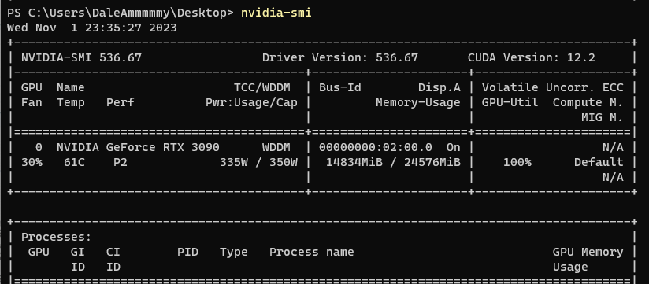
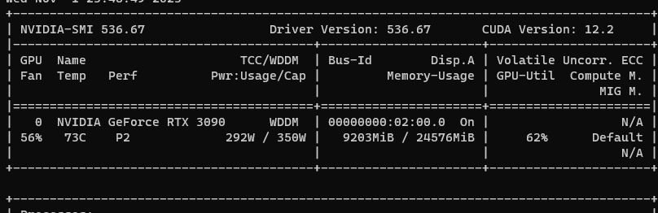
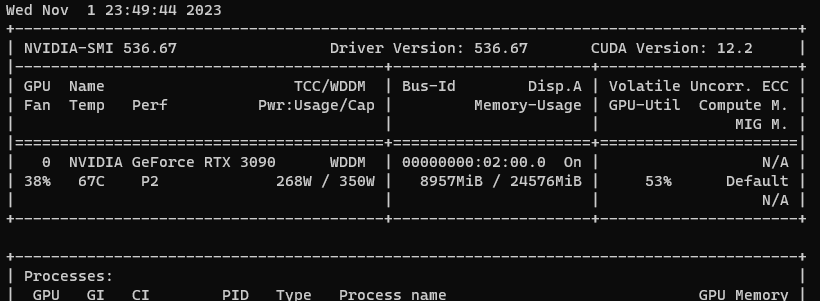
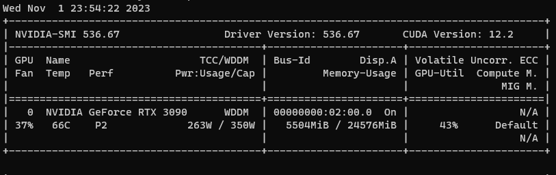
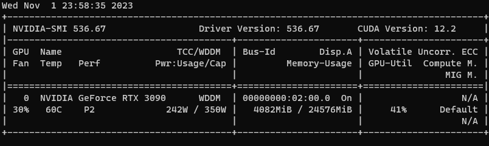
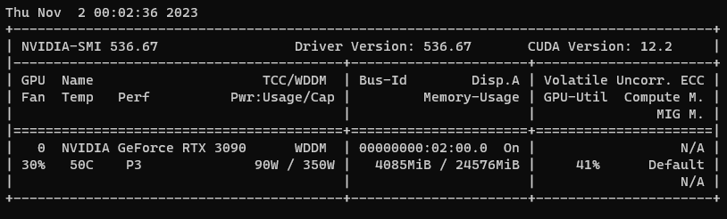

Transformer与其说是一个工具包，不如说是一个任务训练框架。

## Transformers框架

它由Pipeline, Tokenizer, Model, Datasets, Evaluate, Trainer六大模块组成。

- Pipeline：流水线，包括数据处理、模型预测和后处理
- Tokenizer：数据处理，包括token2id，id2label，attention_mask等
- Model：模型，对基于torch的模型进行了更好的封装，方便使用
- Datasets：数据集，对torch的DataLoader进行了进一步封装
- Evaluate & Trainer：评估函数和训练，相较于torch里手写反向传播和梯度计算，它只需要用很少的代码就可以完成模型的训练和评估

在[BERT文本分类](nlp/bert_cls/)最后用这六个主逻辑重写了传统的训练代码。这里简单再过一次。

首先用datasets的load_dataset载入数据：
```python
dataset = load_dataset('csv', data_files='ChnSentiCorp_htl_all.csv', split='train')
dataset = dataset.filter(lambda x: x['review'] is not None)
```

然后用datasets里的train_test_split拆分数据集为验证和训练集：
```python
datasets = dataset.train_test_split(test_size=0.1)
```

接下来加载tokenizer把文本数据转化成编码，这个tokenizer可以在hugging face里自由选择：
```python
tokenizer = AutoTokenizer.from_pretrained('hfl/rbt3')

def process_function(examples):
    tokenized_example = tokenizer(examples['review'], max_length=128, truncation=True)
    tokenized_example['labels'] = examples['label']
    return tokenized_example

tokenized_dataset = datasets.map(process_function, batched=True, remove_columns=dataset.column_names)
```

然后用Model模块导入模型：
```python
model = AutoModelForSequenceClassification.from_pretrained('hfl/rbt3')
```

接下来用evaluate创建评估函数，trainer创建训练流程。

评估函数同样在hugging face的tasks处可以看到具体任务可以选用的评估函数。

trainer则需要首先写一个TrainingArguments控制训练参数，包括学习率，批大小，日志打印情况，模型保存等。然后把模型，评估函数和训练参数导入Trainer即可一键启动训练。
```python
acc_metrics = evaluate.load('accuracy')
f1_metrics = evaluate.load('f1')

def eval_metric(eval_predict):
    predictions, labels = eval_predict
    predictions = predictions.argmax(axis=-1)
    acc = acc_metrics.compute(predictions=predictions, references=labels)
    f1  = f1_metrics.compute(predictions=predictions, references=labels)
    acc.update(f1)
    return acc

train_args = TrainingArguments(output_dir='./checkpoints',        # 日志文件夹
                               per_device_train_batch_size=64,    # 训练时batch_size
                               per_device_eval_batch_size =128,   # 验证时batch_size
                               logging_steps=50,                  # 每50步打印一次日志
                               evaluation_strategy='epoch',       # 每一步验证
                               save_strategy='epoch',             # 每一步都保存模型
                               save_total_limit=3,                # 设置最大保存数
                               learning_rate=2e-5,                # 学习率
                               weight_decay=0.01,                 # weight_decay
                               metric_for_best_model='f1',        # 以f1得分评价模型
                               load_best_model_at_end=True       # 训练完成后加载最优模型
                              )

trainer = Trainer(model=model,
                  args=train_args,
                  train_dataset=tokenized_dataset['train'],
                  eval_dataset = tokenized_dataset['test'],
                  data_collator = DataCollatorWithPadding(tokenizer=tokenizer),
                  compute_metrics=eval_metric)

trainer.train()
```

这样几十行代码即完成了一整个NLP任务的训练。

再总结一下，使用这样的框架，几乎可以处理所有的NLP任务。

| 步骤              | Transformers API      |
|-----------------|-----------------------|
| Step1 导入相关包     | General               |
| Step2 加载数据集     | Datasets              |
| Step3 数据集划分     | Datasets              |
| Step4 数据集预处理    | Datasets+Tokenizer    |
| Step5 创建模型      | Model                 |
| Step6 设置评估函数    | Evaluate              |
| Step7 配置训练参数    | TrainingArguments     |
| Step8 创建训练器     | Trainer+Data Collator |
| Step9 训练模型、评估、预测 | Trainer               |
| Step10 模型推理     | Pipeline              |


## Transformers显存优化

显存占用分析：

- 模型权重：4Bytes * 模型参数量
- 优化器：AdamW，8Bytes * 模型参数量
- 梯度：4Bytes * 模型参数量
- 前向激活值：取决于数据，根据经验，全连接层的参数量一般较大
- 其他：临时缓冲区等

在训练大模型的时候，如何用有限的显存做训练优化呢？实际上现在有很多比较成熟的方案，如Lora，cpu offload，flash attention等。这部分内容在后面会逐一讲解。这里我们对阵下药，找到显存开销大的给它改小。用windows的环境跑一下代码（理论上Linux最为稳定，但实在懒得重启电脑了），和上面的流程一样，我们把模型换城'hfl/chinese-macbert-large'占用更多显存。

（这里用ModelScope下载模型会更快一点）

训练的超参数做如下修改：
```python
train_args = TrainingArguments(output_dir='./checkpoints',        # 日志文件夹
                               per_device_train_batch_size=32,    # 训练时batch_size
                               per_device_eval_batch_size =32,    # 验证时batch_size
                               num_train_epochs=1,                # 训练轮次1
                               logging_steps=10,                  # 每10步打印一次日志
                               evaluation_strategy='epoch',       # 每一步验证
                               save_strategy='epoch',             # 每一步都保存模型
                               save_total_limit=3,                # 设置最大保存数
                               learning_rate=2e-5,                # 学习率
                               weight_decay=0.01,                 # weight_decay
                               metric_for_best_model='f1',        # 以f1得分评价模型
                               load_best_model_at_end=True       # 训练完成后加载最优模型
                              )
```

在这个参数下，模型训练显存占用14.8Gb



这里我们用一个表格保存显存占用：

| 策略                              | 优化目标 | 显存占用   | 训练耗时 |
|---------------------------------|------|--------|------|
| macbert-large-bs32-maxlength128 | -    | 14.8Gb | 132s |

> 优化目标：前向激活

我们把BatchSize设置为1，这样每次只计算1条数据，此外，我们累积32次计算的值再统一反向传播（gradient accumultion，梯度累加）

```python
train_args = TrainingArguments(output_dir='./checkpoints',        # 日志文件夹
                               per_device_train_batch_size=1,    # 训练时batch_size
                               per_device_eval_batch_size =1,    # 验证时batch_size
                               gradient_accumulation_steps=32,   # 梯度累加32
                               num_train_epochs=1,                # 训练轮次1
                               logging_steps=10,                  # 每10步打印一次日志
                               evaluation_strategy='epoch',       # 每一步验证
                               save_strategy='epoch',             # 每一步都保存模型
                               save_total_limit=3,                # 设置最大保存数
                               learning_rate=2e-5,                # 学习率
                               weight_decay=0.01,                 # weight_decay
                               metric_for_best_model='f1',        # 以f1得分评价模型
                               load_best_model_at_end=True       # 训练完成后加载最优模型
                              )
```



| 策略                              | 优化目标 | 显存占用   | 训练耗时 |
|---------------------------------|------|--------|------|
| macbert-large-bs32-maxlength128 | -    | 14.8Gb | 132s |
| + bs1-gradient accumultion32    | 前向激活    | 9.2Gb  | 450s |

这种方案显存消耗直接下降了5个Gb，但是相应的耗时增加了3倍多。

> 优化目标：前向激活

前向激活过程中，其实很多中间数值是没有必要储存的，对于没有储存的可以在反向传播重新计算一次即可。

```python
train_args = TrainingArguments(output_dir='./checkpoints',        # 日志文件夹
                               per_device_train_batch_size=1,    # 训练时batch_size
                               per_device_eval_batch_size =1,    # 验证时batch_size
                               gradient_accumulation_steps=32,   # 梯度累加32
                               gradient_checkpointing=True,      # 删除前向传播无需记录的值
                               num_train_epochs=1,                # 训练轮次1
                               logging_steps=10,                  # 每10步打印一次日志
                               evaluation_strategy='epoch',       # 每一步验证
                               save_strategy='epoch',             # 每一步都保存模型
                               save_total_limit=3,                # 设置最大保存数
                               learning_rate=2e-5,                # 学习率
                               weight_decay=0.01,                 # weight_decay
                               metric_for_best_model='f1',        # 以f1得分评价模型
                               load_best_model_at_end=True       # 训练完成后加载最优模型
                              )
```



这个下降并不明显，但是训练耗时进一步增加不少。

| 策略                               | 优化目标 | 显存占用   | 训练耗时 |
|----------------------------------|------|--------|------|
| macbert-large-bs32-maxlength128  | -    | 14.8Gb | 132s |
| + gradient accumultion(bs1,ga32) | 前向激活    | 9.2Gb  | 450s |
| + gradient checkpoint(bs1,ga32)  | 前向激活    | 8.9Gb  | 690s |

> 优化目标：优化器

AdamW对显存的占用较高，实际上可以选择显存占用较少的优化器Ada。

```python
train_args = TrainingArguments(output_dir='./checkpoints',        # 日志文件夹
                               per_device_train_batch_size=1,    # 训练时batch_size
                               per_device_eval_batch_size =1,    # 验证时batch_size
                               gradient_accumulation_steps=32,   # 梯度累加32
                               gradient_checkpointing=True,      # 删除前向传播无需记录的值
                               optim = 'adafactor',               # 用ada优化器
                               num_train_epochs=1,                # 训练轮次1
                               logging_steps=10,                  # 每10步打印一次日志
                               evaluation_strategy='epoch',       # 每一步验证
                               save_strategy='epoch',             # 每一步都保存模型
                               save_total_limit=3,                # 设置最大保存数
                               learning_rate=2e-5,                # 学习率
                               weight_decay=0.01,                 # weight_decay
                               metric_for_best_model='f1',        # 以f1得分评价模型
                               load_best_model_at_end=True       # 训练完成后加载最优模型
                              )
```



| 策略                               | 优化目标 | 显存占用   | 训练耗时  |
|----------------------------------|------|--------|-------|
| macbert-large-bs32-maxlength128  | -    | 14.8Gb | 132s  |
| + gradient accumultion(bs1,ga32) | 前向激活 | 9.2Gb  | 450s  |
| + gradient checkpoint(bs1,ga32)  | 前向激活 | 8.9Gb  | 690s  |
| + adafactor optimizer(bs1, ga32) | 优化器  | 5.5Gb  | 1400s |

> 梯度

训练模型时可以冻结一些参数，避免整体反向传播更新梯度，增加显存开销。在这里，我们的模型是bert+mlp组成，实际上可以把bert的参数全部冻住，只训练mlp参数。

```python
for name, param in model.bert.named_parameters():
    param.requires_grad = False

trainer = Trainer(model=model,
                  args=train_args,
                  train_dataset=tokenized_dataset['train'],
                  eval_dataset = tokenized_dataset['test'],
                  data_collator = DataCollatorWithPadding(tokenizer=tokenizer),
                  compute_metrics=eval_metric)
```



| 策略                               | 优化目标 | 显存占用   | 训练耗时  |
|----------------------------------|------|--------|-------|
| macbert-large-bs32-maxlength128  | -    | 14.8Gb | 132s  |
| + gradient accumultion(bs1,ga32) | 前向激活 | 9.2Gb  | 450s  |
| + gradient checkpoint(bs1,ga32)  | 前向激活 | 8.9Gb  | 690s  |
| + adafactor optimizer(bs1, ga32) | 优化器  | 5.5Gb  | 1400s |
| + freeze model(bs1, ga32)        | 梯度   | 4Gb  | 223s   | 

但是这种降低开销的方式是伴随着不训练部分模型为代价的，这会导致模型整体效果变差。

> 前向激活值

当文本的嵌入向量的映射维度是一致的时候（如768维），此时每个文本输入的最大长度会影响显存开销。通过调整maxlength可以缓解。

```python
def process_function(examples):
    tokenized_example = tokenizer(examples['review'], max_length=32, padding='max_length',truncation=True)
    tokenized_example['labels'] = examples['label']
    return tokenized_example
```



| 策略                                    | 优化目标 | 显存占用   | 训练耗时  |
|---------------------------------------|------|--------|-------|
| macbert-large-bs32-maxlength128       | -    | 14.8Gb | 132s  |
| + gradient accumultion(bs1,ga32)      | 前向激活 | 9.2Gb  | 450s  |
| + gradient checkpoint(bs1,ga32)       | 前向激活 | 8.9Gb  | 690s  |
| + adafactor optimizer(bs1, ga32)      | 优化器  | 5.5Gb  | 1400s |
| + freeze model(bs1, ga32)             | 梯度   | 4Gb   | 223s  |
| + data length(bs1, ga32, maxlength32) | 前向激活    | 4Gb | 202s  |


这样，我们就一步一步的把14.8Gb显存开销的模型下降到4Gb，让你在一个非常常见的消费级显卡上就能使用。

此外，这里使用的是macbert-large，这只是为了让初始GPU开销大一点，更有效的办法是换base模型甚至更小的模型，同样也会付出损失一定模型效果的代价。

当然，还有更高级的办法，就像前面说的，如Lora，cpu offload，flash attention（不是所有显卡都支持）等，在后面llm部分会讲解。

