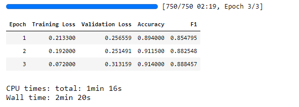
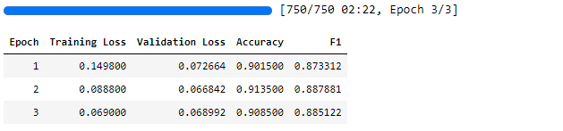
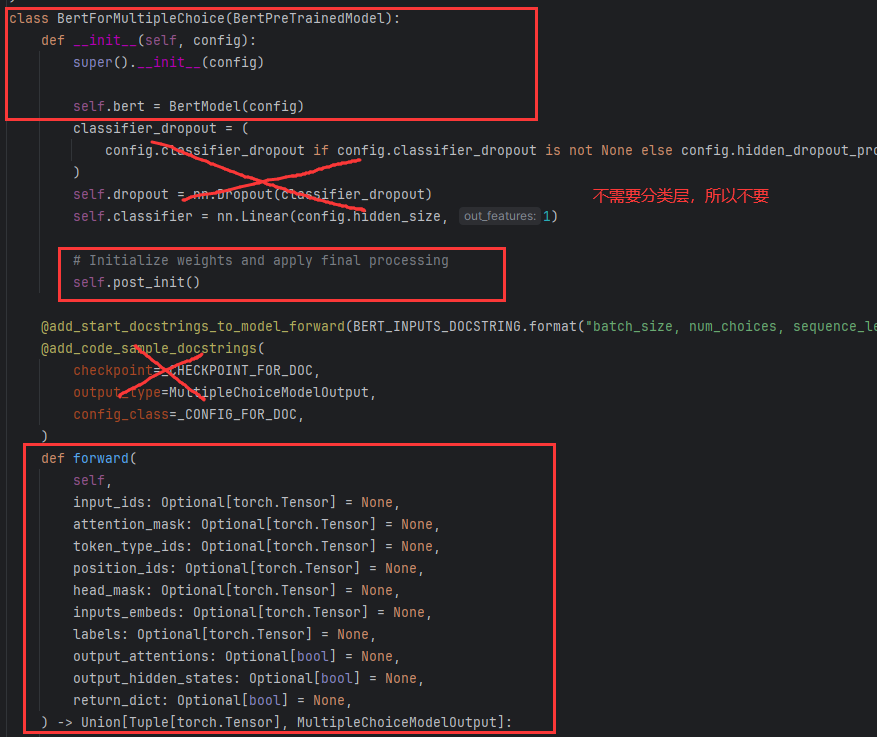
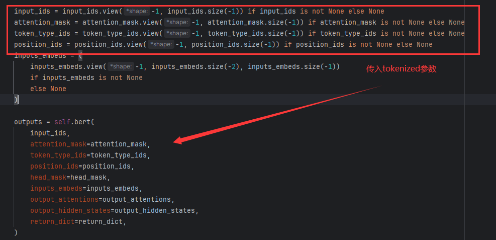
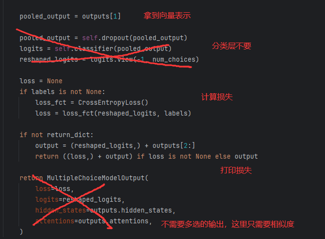
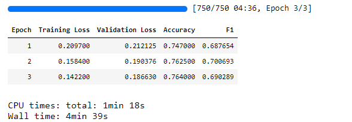
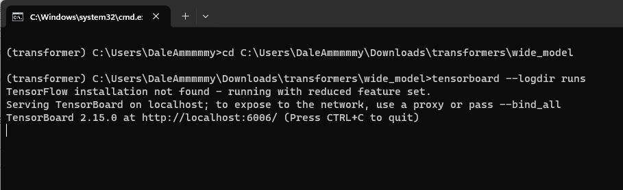
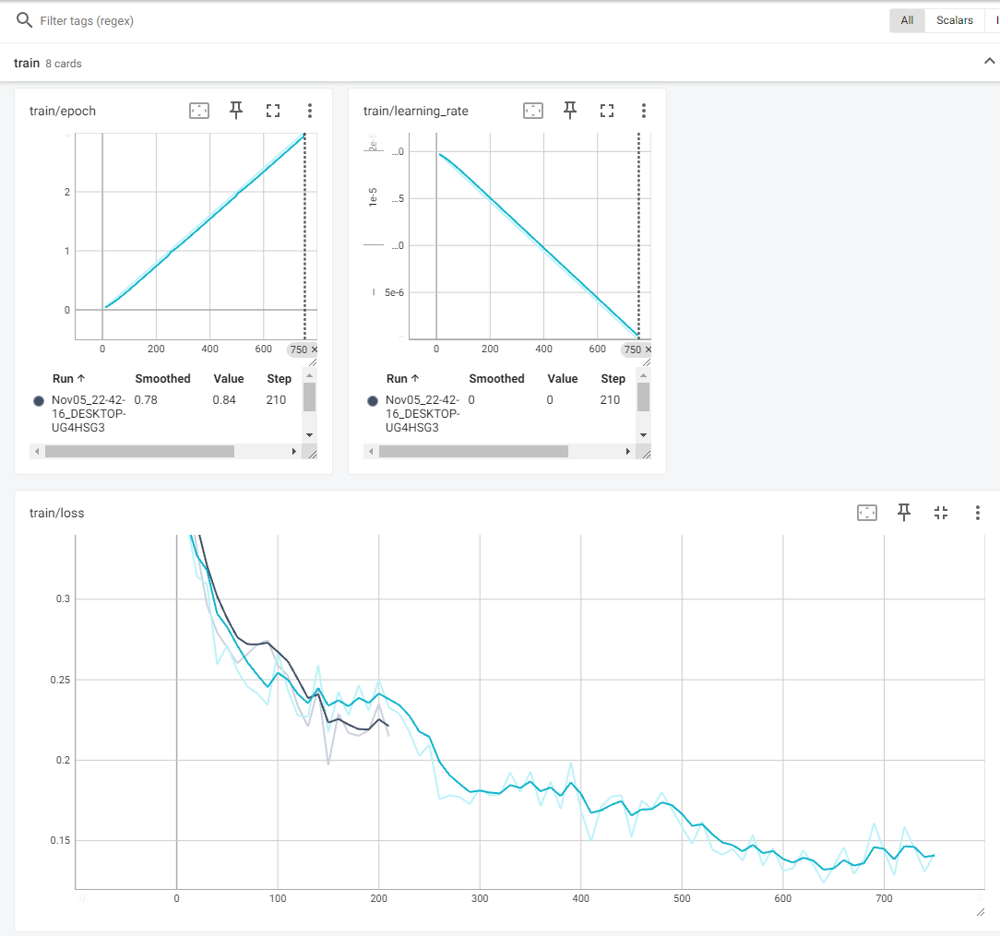

## 文本相似度匹配任务简介

文本匹配(Text Match)包括文本相似度计算，问答匹配，对话匹配等等。在上一个多项选择任务中，实际上也是选项和文本-问题的匹配。

在这个部分，主要实现的是两段文本是否表达了相似的语义。

传统的做法就是计算两段文本的词向量，然后用余弦或其他距离相似度的计算方式计算文本的相似得分。这种做法非常依赖向量空间的设计，并且对长文本和短文本的匹配很不准确。在这里我们把他看作一个二分类任务，输入文本1和文本2，导入深度学习模型，输出0或者1表示相似或不相似即可。

## Transformers解决方案

最直观的解决方案：[cls]-context1-[sep]-context2-[sep] -> Model -> argmax(softmax()) -> Similarity(0/1)

目前看来这个任务应该非常简单，依然只需要根据数据集写清楚数据处理拼接的代码然后喂到模型就行。并且[BERT文本分类](nlp/bert_cls/)的代码几乎可以完全复用。

> 数据集：已放同目录下，可直接下载

### （单塔模型）直观简单的解决方案

由于整体实现设计流程就是把数据拼接成标准格式，然后用文本分类的方式处理。因此只需要手写数据处理代码，其他的几乎可以完全照抄BERT文本分类代码。

#### Step1 导入相关包

```python
from transformers import AutoTokenizer, AutoModelForSequenceClassification, DataCollatorWithPadding, Trainer, TrainingArguments, pipeline
from datasets import load_dataset
import evaluate
```

#### Step2 加载数据
```python
datasets = load_dataset('json', data_files='train_pair_1w.json', split='train')
datasets
```

    Dataset({
    features: ['sentence1', 'sentence2', 'label'],
    num_rows: 10000
    })

```python
datasets = datasets.train_test_split(test_size=0.2)
```

    DatasetDict({
        train: Dataset({
            features: ['sentence1', 'sentence2', 'label'],
            num_rows: 8000
        })
        test: Dataset({
            features: ['sentence1', 'sentence2', 'label'],
            num_rows: 2000
        })
    })

打印一组数据看看格式方便后面写数据处理：

```python
datasets['train'][0]
```

    {'sentence1': '她是跟杜尼雅一块儿等他的。', 'sentence2': '她跟杜尼碰一同等着他。', 'label': '1'}

#### Step3 数据预处理

这里只需要注意两点：

- 对两个sentence都编码
- label要从str格式转化为int，（0，1二分类）

```python
tokenizer = AutoTokenizer.from_pretrained('hfl/chinese-macbert-base')

def process_function(examples):
    tokenized_example = tokenizer(examples['sentence1'], examples['sentence2'],max_length=128, padding='max_length',truncation=True)
    tokenized_example['labels'] = [int(label) for label in examples['label']]
    return tokenized_example

tokenized_dataset = datasets.map(process_function, batched=True, remove_columns=datasets['train'].column_names)
```

#### Step4 创建模型

```python
model = AutoModelForSequenceClassification.from_pretrained('hfl/chinese-macbert-base')
```

#### Step5 创建评估函数

```python
acc_metrics = evaluate.load('accuracy')
f1_metrics = evaluate.load('f1')

def eval_metric(eval_predict):
    predictions, labels = eval_predict
    predictions = predictions.argmax(axis=-1)
    acc = acc_metrics.compute(predictions=predictions, references=labels)
    f1  = f1_metrics.compute(predictions=predictions, references=labels)
    acc.update(f1)
    return acc
```

#### Step6 创建TrainingArguments

```python
train_args = TrainingArguments(output_dir="./simi_model",      # 输出文件夹
                               per_device_train_batch_size=32,  # 训练时的batch_size
                               per_device_eval_batch_size=32,  # 验证时的batch_size
                               logging_steps=10,                # log 打印的频率
                               evaluation_strategy="epoch",     # 评估策略
                               save_strategy="epoch",           # 保存策略
                               save_total_limit=3,              # 最大保存数
                               learning_rate=2e-5,              # 学习率
                               weight_decay=0.01,               # weight_decay
                               metric_for_best_model="f1",      # 设定评估指标
                               load_best_model_at_end=True)     # 训练完成后加载最优模型
```

#### Step7 创建Trainer

```python
trainer = Trainer(model=model,
                  args=train_args,
                  train_dataset=tokenized_dataset['train'],
                  eval_dataset = tokenized_dataset['test'],
                  data_collator = DataCollatorWithPadding(tokenizer=tokenizer),
                  compute_metrics=eval_metric)
```

#### Step8 模型训练

```python
%%time
trainer.train()
```



#### Step9 模型评估

```python
trainer.evaluate(tokenized_dataset["test"])
```

    {'eval_loss': 0.31315863132476807,
     'eval_accuracy': 0.914,
     'eval_f1': 0.8884565499351492,
     'eval_runtime': 3.8457,
     'eval_samples_per_second': 520.067,
     'eval_steps_per_second': 16.382,
     'epoch': 3.0}

#### Step10 推理

```python
model.config.id2label = {0: "不相似", 1: "相似"}
pipe = pipeline("text-classification", model=model, tokenizer=tokenizer, device=0)
pipe({"text": "去吃饭吗", "text_pair": "国足进世界杯了吗"})
```

    {'label': '不相似', 'score': 0.9961543679237366}

至于，一份几乎照抄就能实现的代码就完整呈现在了诸位面前。如果这么简单肯定没必要再写一次，也不会叫baseline，所以现在反思一下这个方案存在的问题。

- 现在要做一个吹风机的相似推荐（实际上文本相似度匹配和推荐系统的相似度匹配如出一辙），你选择了戴森吹风机，但是根戴森匹配的品牌可不止一两个，可能成百上千个，那么如何对这几千个类目排序给用户推荐最匹配的呢？

你肯定会说，上面不是有一个score吗，按这个score排序不就好了。实际上，这个score只是针对单个文本，并且非0即1，并不能体现空间上连续的整体性，这么说有点绕，换个通俗的表达，就是很相似和可能相似和也许相似，在二分类都会被归类为0或者1。

因此最好有一个统一的评价标准，来对所有文本进行打分。这个操作模式在机器学习里非常常见，就是分类问题离散化为回归问题。把（0，1）二分类转化为（0，1）之间的得分，如果大于0.5是postive，反之negative。

在多项选择里，其实也是同样的思想，输入一组数据，每一对数据都输出一个score，然后对这一组数据的多对score做softmax，取一个最优结果。

换到这里来，我们只需要找到一个数值（回归结果），用这个数值来表示二分类结果，在这种情况下，交叉熵损失肯定不行，而是使用回归任务的MSE（均方误差）。

### 分类问题离散化量化相似度

> baseline预测模式

文本 -> Model -> 0 or 1 (二分类)

> 回归预测模式

文本 -> Model -> score (回归)

假设这里有两个相似的句子，要在里面找到最相似的句子，那么就应该是

1. 文本1 -> Model -> score1

2. 文本2 -> Model -> score2

3. argmax(softmax(score1, score2))

#### Step1 导入相关包

```python
from transformers import AutoTokenizer, AutoModelForSequenceClassification, DataCollatorWithPadding, Trainer, TrainingArguments, pipeline
from datasets import load_dataset
import evaluate
```

#### Step2 加载数据

```python
datasets = load_dataset('json', data_files='train_pair_1w.json', split='train')
datasets = datasets.train_test_split(test_size=0.2)
```

#### Step3 数据预处理

由于想使用均方误差，所以这里的label要定义成float格式

```python
tokenizer = AutoTokenizer.from_pretrained('hfl/chinese-macbert-base')

def process_function(examples):
    tokenized_example = tokenizer(examples['sentence1'], examples['sentence2'],max_length=128, padding='max_length',truncation=True)
    # 使用均方误差 int -> float
    tokenized_example['labels'] = [float(label) for label in examples['label']]
    return tokenized_example

tokenized_dataset = datasets.map(process_function, batched=True, remove_columns=datasets['train'].column_names)
```

#### Step4 创建模型

这里只需要设置`num_labels = 1`，就会认为是一个回归任务，就会用MSELoss计算损失

```python
model = AutoModelForSequenceClassification.from_pretrained('hfl/chinese-macbert-base', num_labels=1)
```

#### Step5 创建评估函数

如何判断是相似还是不相似呢？就像前面说的，把（0，1）二分类转化为（0，1）之间的得分，如果大于0.5是postive，反之negative。

```python
acc_metrics = evaluate.load('accuracy')
f1_metrics = evaluate.load('f1')

def eval_metric(eval_predict):
    predictions, labels = eval_predict
    predictions = [int(p > 0.5) for p in predictions]
    labels = [int(l) for l in labels]
    acc = acc_metrics.compute(predictions=predictions, references=labels)
    f1  = f1_metrics.compute(predictions=predictions, references=labels)
    acc.update(f1)
    return acc
```

#### Step6 创建TrainingArguments

```python
train_args = TrainingArguments(output_dir="./cross_model",      # 输出文件夹
                               per_device_train_batch_size=32,  # 训练时的batch_size
                               per_device_eval_batch_size=32,  # 验证时的batch_size
                               logging_steps=10,                # log 打印的频率
                               evaluation_strategy="epoch",     # 评估策略
                               save_strategy="epoch",           # 保存策略
                               save_total_limit=3,              # 最大保存数
                               learning_rate=2e-5,              # 学习率
                               weight_decay=0.01,               # weight_decay
                               metric_for_best_model="f1",      # 设定评估指标
                               load_best_model_at_end=True)     # 训练完成后加载最优模型
```

#### Step7 创建Trainer

```python
trainer = Trainer(model=model,
                  args=train_args,
                  train_dataset=tokenized_dataset['train'],
                  eval_dataset = tokenized_dataset['test'],
                  data_collator = DataCollatorWithPadding(tokenizer=tokenizer),
                  compute_metrics=eval_metric)
```

#### Step8 模型训练

```python
trainer.train()
```



#### Step9 模型评估

```python
trainer.evaluate(tokenized_dataset["test"])
```

    {'eval_loss': 0.0668417364358902,
     'eval_accuracy': 0.9135,
     'eval_f1': 0.8878807517822424,
     'eval_runtime': 3.7848,
     'eval_samples_per_second': 528.427,
     'eval_steps_per_second': 16.645,
     'epoch': 3.0}

#### Step10 推理

```python
model.config.id2label = {0: "不相似", 1: "相似"}
pipe = pipeline("text-classification", model=model, tokenizer=tokenizer, device=0)
```

```python
pipe({"text": "去吃饭吗", "text_pair": "国足进世界杯了吗"})
pipe({"text": "去吃饭吗", "text_pair": "去吃饭吗"})
```

    {'label': '不相似', 'score': 1.0}
    {'label': '不相似', 'score': 1.0}

我们会发现，这里无论不相似还是相似（第二个例子两个句子一模一样肯定是相似的），都输出的score1，不相似，这是因为这里仍然是用的分类结果，用到model id2label编码，我们要做一个转换

想要实现转换只需要设置一个超参数`function_to_apply="none"`

```python
pipe({"text": "去吃饭吗", "text_pair": "国足进世界杯了吗"}, function_to_apply="none")
pipe({"text": "去吃饭吗", "text_pair": "去吃饭吗"}, function_to_apply="none")
```

    {'label': '不相似', 'score': 0.07945547997951508}
    {'label': '不相似', 'score': 0.9071294069290161}

此时，score虽然不是0，1，但是仍然输出的label都是不相似，所以还需要手动调整一下：

```python
result = pipe({"text": "去吃饭吗", "text_pair": "国足进世界杯了吗"}, function_to_apply="none")
result["label"] = "相似" if result["score"] > 0.5 else "不相似"
result
```

    {'label': '不相似', 'score': 0.07945547997951508}

```python
result = pipe({"text": "去吃饭吗", "text_pair": "国足进世界杯了吗"}, function_to_apply="none")
result["label"] = "相似" if result["score"] > 0.5 else "不相似"
result
```

    {'label': '相似', 'score': 0.9071294069290161}

这样就实现了相似度的量化，但是，这种方法就没有问题了吗？

依然用电商数据举例，假设我们推理一次需要10毫秒，一个商品类目的相似类目有100万条（这个数据规模很常见），抛开推荐、浏览器渲染等过程，只是定位TOP100的商品，就需要1,000,000*0.01=10,000秒=166分钟=3小时。因此，为了迎合大数据时代需求，工业界更常使用双塔模型。

### 双塔模型解决方案

其实商品的特征在很长一段时间是不会改变的，因此可以离线训练一个模型对所有类目的商品完成编码工作，这个时候我们只需要对用户的输入进行推理编码，然后在向量空间找到和用户商品相似的top k向量即可。虽然总的推理次数也是全类目的推理，但由于是离线进行，因此在进行特征匹配的时候，只需要对用户的信息推理编码一次，就可以直接找到对应目标，这样就能极快的找到目标。

换到文本匹配上来，假设此时仍然有contex1和context2，将进行如下操作：

1. context1 -- bert model --> token embeddings (sentence length, embedding dim) -- pooling --> vec1 (1 x embedding dim)
2. context2 -- bert model --> token embeddings (sentence length, embedding dim) -- pooling --> vec2 (1 x embedding dim)
3. cosine_similarity(vec1, vec2)

送入模型的数据显然不能是单条的，因为只有一对文本才能判断相似与否，才有正负样本。如果是送入一对句子：

[cls] context1 [sep]

[cls] context2 [sep]

此时的数据格式就非常像多项选择的数据处理格式，只不过多项选择的数据格式是4个选项和他们拼接，这里是2个句子。在这里，token编码后的维度就是(batch size, 2, max_length)，这个时候只需要取第二维的第一个，就是context1的所有encode结果，取第二维的第二个，就是context2的所有encode结果。然后送入bert计算即可。

训练而言，目标就是要让两个相似的文本相似度得分尽可能接近1。这里的损失函数就用余弦损失函数：
$$
CosineEmbeddingLoss = \left\{ 
    \begin{aligned}
    &1 - cos(x_1,x_2) & & if \ y=1 \cr 
    &max(0, cos(x_1,x_2)-margin) & & if \ y=-1 
    \end{aligned}
\right.
$$

对于正样本（两个数据是相似的），直接计算一减去两个向量的余弦值作为loss，对于负样本（两个数据是不相似的），如果相似度小于margin，则loss都默认为-1。

#### Step1 导入相关包


```python
from transformers import AutoTokenizer, AutoModelForSequenceClassification, DataCollatorWithPadding, Trainer, TrainingArguments, pipeline
from datasets import load_dataset
import evaluate
```

#### Step2 加载数据

```python
datasets = load_dataset('json', data_files='train_pair_1w.json', split='train')
datasets = datasets.train_test_split(test_size=0.2)
```

#### Step3 数据预处理

按照预先设计好的数据输入格式，我们把两个文本成对送入模型。则需要用一个`list.append(sentence1), .append(sentence2)`就能形成[sentence1, sentence2]的数据格式。

因为tokenized结果有三个内容，而我们只需要input_ids，因此需要设计一个跳过的循环抽样，保证每次只保留input_ids：`{k :[v[i: i+2] for i in range(0, len(v), 2)] for k, v in tokenized_examples.items()}`

```python
tokenizer = AutoTokenizer.from_pretrained('hfl/chinese-macbert-base')

def process_function(examples):
    sentences, labels= [], []
    for sen1, sen2, label in zip(examples['sentence1'], examples['sentence2'], examples['label']):
        sentences.append(sen1)
        sentences.append(sen2)
        # CosineEmbeddingLoss
        labels.append(1 if int(label) ==1 else -1)
    # input_ids, attention_mask, token_type_ids
    tokenized_examples = tokenizer(sentences, max_length=128, padding='max_length', truncation=True)
    tokenized_examples = {k :[v[i: i+2] for i in range(0, len(v), 2)] for k, v in tokenized_examples.items()}
    tokenized_examples['labels'] = labels
    return tokenized_examples

tokenized_dataset = datasets.map(process_function, batched=True, remove_columns=datasets['train'].column_names)
```

    Map: 100%|██████████| 8000/8000 [00:01<00:00, 6516.47 examples/s]
    Map: 100%|██████████| 2000/2000 [00:00<00:00, 5581.19 examples/s]
    


```python
print(tokenized_dataset['train'][0])
```

    {'input_ids': [[101, 2582, 720, 4509, 6435, 7359, 7359, 6572, 1384, 8043, 102, 0, 0, 0, 0, 0, 0, 0, 0, 0, 0, 0, 0, 0, 0, 0, 0, 0, 0, 0, 0, 0, 0, 0, 0, 0, 0, 0, 0, 0, 0, 0, 0, 0, 0, 0, 0, 0, 0, 0, 0, 0, 0, 0, 0, 0, 0, 0, 0, 0, 0, 0, 0, 0, 0, 0, 0, 0, 0, 0, 0, 0, 0, 0, 0, 0, 0, 0, 0, 0, 0, 0, 0, 0, 0, 0, 0, 0, 0, 0, 0, 0, 0, 0, 0, 0, 0, 0, 0, 0, 0, 0, 0, 0, 0, 0, 0, 0, 0, 0, 0, 0, 0, 0, 0, 0, 0, 0, 0, 0, 0, 0, 0, 0, 0, 0, 0, 0], [101, 4636, 2428, 6572, 1384, 6158, 2196, 8024, 1963, 862, 6237, 2196, 102, 0, 0, 0, 0, 0, 0, 0, 0, 0, 0, 0, 0, 0, 0, 0, 0, 0, 0, 0, 0, 0, 0, 0, 0, 0, 0, 0, 0, 0, 0, 0, 0, 0, 0, 0, 0, 0, 0, 0, 0, 0, 0, 0, 0, 0, 0, 0, 0, 0, 0, 0, 0, 0, 0, 0, 0, 0, 0, 0, 0, 0, 0, 0, 0, 0, 0, 0, 0, 0, 0, 0, 0, 0, 0, 0, 0, 0, 0, 0, 0, 0, 0, 0, 0, 0, 0, 0, 0, 0, 0, 0, 0, 0, 0, 0, 0, 0, 0, 0, 0, 0, 0, 0, 0, 0, 0, 0, 0, 0, 0, 0, 0, 0, 0, 0]], 'token_type_ids': [[0, 0, 0, 0, 0, 0, 0, 0, 0, 0, 0, 0, 0, 0, 0, 0, 0, 0, 0, 0, 0, 0, 0, 0, 0, 0, 0, 0, 0, 0, 0, 0, 0, 0, 0, 0, 0, 0, 0, 0, 0, 0, 0, 0, 0, 0, 0, 0, 0, 0, 0, 0, 0, 0, 0, 0, 0, 0, 0, 0, 0, 0, 0, 0, 0, 0, 0, 0, 0, 0, 0, 0, 0, 0, 0, 0, 0, 0, 0, 0, 0, 0, 0, 0, 0, 0, 0, 0, 0, 0, 0, 0, 0, 0, 0, 0, 0, 0, 0, 0, 0, 0, 0, 0, 0, 0, 0, 0, 0, 0, 0, 0, 0, 0, 0, 0, 0, 0, 0, 0, 0, 0, 0, 0, 0, 0, 0, 0], [0, 0, 0, 0, 0, 0, 0, 0, 0, 0, 0, 0, 0, 0, 0, 0, 0, 0, 0, 0, 0, 0, 0, 0, 0, 0, 0, 0, 0, 0, 0, 0, 0, 0, 0, 0, 0, 0, 0, 0, 0, 0, 0, 0, 0, 0, 0, 0, 0, 0, 0, 0, 0, 0, 0, 0, 0, 0, 0, 0, 0, 0, 0, 0, 0, 0, 0, 0, 0, 0, 0, 0, 0, 0, 0, 0, 0, 0, 0, 0, 0, 0, 0, 0, 0, 0, 0, 0, 0, 0, 0, 0, 0, 0, 0, 0, 0, 0, 0, 0, 0, 0, 0, 0, 0, 0, 0, 0, 0, 0, 0, 0, 0, 0, 0, 0, 0, 0, 0, 0, 0, 0, 0, 0, 0, 0, 0, 0]], 'attention_mask': [[1, 1, 1, 1, 1, 1, 1, 1, 1, 1, 1, 0, 0, 0, 0, 0, 0, 0, 0, 0, 0, 0, 0, 0, 0, 0, 0, 0, 0, 0, 0, 0, 0, 0, 0, 0, 0, 0, 0, 0, 0, 0, 0, 0, 0, 0, 0, 0, 0, 0, 0, 0, 0, 0, 0, 0, 0, 0, 0, 0, 0, 0, 0, 0, 0, 0, 0, 0, 0, 0, 0, 0, 0, 0, 0, 0, 0, 0, 0, 0, 0, 0, 0, 0, 0, 0, 0, 0, 0, 0, 0, 0, 0, 0, 0, 0, 0, 0, 0, 0, 0, 0, 0, 0, 0, 0, 0, 0, 0, 0, 0, 0, 0, 0, 0, 0, 0, 0, 0, 0, 0, 0, 0, 0, 0, 0, 0, 0], [1, 1, 1, 1, 1, 1, 1, 1, 1, 1, 1, 1, 1, 0, 0, 0, 0, 0, 0, 0, 0, 0, 0, 0, 0, 0, 0, 0, 0, 0, 0, 0, 0, 0, 0, 0, 0, 0, 0, 0, 0, 0, 0, 0, 0, 0, 0, 0, 0, 0, 0, 0, 0, 0, 0, 0, 0, 0, 0, 0, 0, 0, 0, 0, 0, 0, 0, 0, 0, 0, 0, 0, 0, 0, 0, 0, 0, 0, 0, 0, 0, 0, 0, 0, 0, 0, 0, 0, 0, 0, 0, 0, 0, 0, 0, 0, 0, 0, 0, 0, 0, 0, 0, 0, 0, 0, 0, 0, 0, 0, 0, 0, 0, 0, 0, 0, 0, 0, 0, 0, 0, 0, 0, 0, 0, 0, 0, 0]], 'labels': -1}
    

#### Step4 魔改源码，创建模型

这里是第一次需要手动写模型的时候，学会这个，你几乎可以基于Transformers去魔改任何模型。

首先，我们从导入什么工具包开始说起。因为这个任务的输入实际上和多项选择是一样的（多选是4条一起输入，这里是2条），并且我们需要输入的是文本向量，而不是分类结果，因此我们打开`BertForMultipleChoice`源码。



所以我们需要导入BertPretrainedModel，以及我们后面复制代码需要的BertModel

源码的config，实际上继承自`from .configuration_bert import BertConfig`，然后我们进一步溯源，`from ...configuration_utils import PretrainedConfig`，这里的...其实就是transformers。

源码的Optinal，同样溯源找到：`from typing import Any, Dict, List, Optional, Tuple, Union`，因此需要从`typing`导入。

然后，把这段代码复制进去即可：

```python
from transformers import BertPreTrainedModel, BertModel
from transformers.configuration_utils import PretrainedConfig
from typing import Optional

class widerecModel(BertPreTrainedModel):
    
    def __init__(self, config: PretrainedConfig, *inputs, **kwargs):
        super().__init__(config, *inputs, **kwargs)
        self.bert = BertModel(config)
        self.post_init()
        
    def forward(
        self,
        input_ids: Optional[torch.Tensor] = None,
        attention_mask: Optional[torch.Tensor] = None,
        token_type_ids: Optional[torch.Tensor] = None,
        position_ids: Optional[torch.Tensor] = None,
        head_mask: Optional[torch.Tensor] = None,
        inputs_embeds: Optional[torch.Tensor] = None,
        labels: Optional[torch.Tensor] = None,
        output_attentions: Optional[bool] = None,
        output_hidden_states: Optional[bool] = None,
        return_dict: Optional[bool] = None,
    ):
        return_dict = return_dict if return_dict is not None else self.config.use_return_dict
```

这段代码就是去掉了分类层的源码，然后继续往下看：



下面一步是把tokenized的参数传到self.bert中计算，那么我们也把我们的参数传进去，这里我们是两个句子，可以分开写：

```python
# 分别获取sentence1和sentence2的输入
        senA_input_ids, senB_input_ids = input_ids[:,0], input_ids[:,1]
        senA_attn_mask, senB_attn_mask = attention_mask[:,0], attention_mask[:,1]
        senA_token_type_ids, senB_token_type_ids = token_type_ids[:,0], token_type_ids[:,1]
        
        # 获取sentence1和sentence2的向量表示
        senA_outputs = self.bert(
            senA_input_ids,
            attention_mask=senA_attn_mask,
            token_type_ids=senA_token_type_ids,
            position_ids=position_ids,
            head_mask=head_mask,
            inputs_embeds=inputs_embeds,
            output_attentions=output_attentions,
            output_hidden_states=output_hidden_states,
            return_dict=return_dict,
        )
        
        senB_outputs = self.bert(
            senB_input_ids,
            attention_mask=senB_attn_mask,
            token_type_ids=senB_token_type_ids,
            position_ids=position_ids,
            head_mask=head_mask,
            inputs_embeds=inputs_embeds,
            output_attentions=output_attentions,
            output_hidden_states=output_hidden_states,
            return_dict=return_dict,
        )

        senA_pooled_output = senA_outputs[1] # [bs, 768]
        senB_pooled_output = senB_outputs[1] # [bs, 768]
```

现在，我们已经拿到了两段文本的向量表示，相似度就可以计算出来：

```python
from torch.nn import CosineSimilarity
# 计算相似度cos
cos = CosineSimilarity()(senA_pooled_output, senB_pooled_output) # [bs]
```



接下来是计算损失，和前面的公式一样，我们需要传入两个句子的向量和标签，然后，返回`((loss,)+output)`元组。

```python
from torch.nn import CosineEmbeddingLoss
# 计算loss
loss = None
if labels is not None:
    loss_fct = CosineEmbeddingLoss(margin=0.3)
    loss = loss_fct(senA_pooled_output, senB_pooled_output, labels)

output = (cos,)

print(((loss,) + output) if loss is not None else output)
```

最终重写的类如下：

```python
from transformers import BertPreTrainedModel, BertModel
from transformers.configuration_utils import PretrainedConfig
from typing import Optional
import torch
from torch.nn import CosineSimilarity, CosineEmbeddingLoss

class widerecModel(BertPreTrainedModel):
    
    def __init__(self, config: PretrainedConfig, *inputs, **kwargs):
        super().__init__(config, *inputs, **kwargs)
        self.bert = BertModel(config)
        self.post_init()
        
    def forward(
        self,
        input_ids: Optional[torch.Tensor] = None,
        attention_mask: Optional[torch.Tensor] = None,
        token_type_ids: Optional[torch.Tensor] = None,
        position_ids: Optional[torch.Tensor] = None,
        head_mask: Optional[torch.Tensor] = None,
        inputs_embeds: Optional[torch.Tensor] = None,
        labels: Optional[torch.Tensor] = None,
        output_attentions: Optional[bool] = None,
        output_hidden_states: Optional[bool] = None,
        return_dict: Optional[bool] = None,
    ):
        return_dict = return_dict if return_dict is not None else self.config.use_return_dict
        
        # 分别获取sentence1和sentence2的输入
        senA_input_ids, senB_input_ids = input_ids[:,0], input_ids[:,1]
        senA_attn_mask, senB_attn_mask = attention_mask[:,0], attention_mask[:,1]
        senA_token_type_ids, senB_token_type_ids = token_type_ids[:,0], token_type_ids[:,1]
        
        # 获取sentence1和sentence2的向量表示
        senA_outputs = self.bert(
            senA_input_ids,
            attention_mask=senA_attn_mask,
            token_type_ids=senA_token_type_ids,
            position_ids=position_ids,
            head_mask=head_mask,
            inputs_embeds=inputs_embeds,
            output_attentions=output_attentions,
            output_hidden_states=output_hidden_states,
            return_dict=return_dict,
        )
        
        senB_outputs = self.bert(
            senB_input_ids,
            attention_mask=senB_attn_mask,
            token_type_ids=senB_token_type_ids,
            position_ids=position_ids,
            head_mask=head_mask,
            inputs_embeds=inputs_embeds,
            output_attentions=output_attentions,
            output_hidden_states=output_hidden_states,
            return_dict=return_dict,
        )

        senA_pooled_output = senA_outputs[1] # [bs, 768]
        senB_pooled_output = senB_outputs[1] # [bs, 768]
        
        # 计算相似度cos
        cos = CosineSimilarity()(senA_pooled_output, senB_pooled_output) # [bs]
        
        # 计算loss
        loss = None
        if labels is not None:
            loss_fct = CosineEmbeddingLoss(margin=0.3)
            loss = loss_fct(senA_pooled_output, senB_pooled_output, labels)
        
        output = (cos,)
        
        return ((loss,) + output) if loss is not None else output
    
model = widerecModel.from_pretrained('hfl/chinese-macbert-base')
```

#### Step5 创建评估函数

这里增加了一个confidence_score作为cos判断结果的阈值。0.8表示当余弦相似度大于0.8时才会被认为是正样本，否则就是负样本。

由于之前的label是1和-1，因此这里用一个判断，如果大于0则是1，否则是0。

```python
acc_metrics = evaluate.load('accuracy')
f1_metrics = evaluate.load('f1')

def eval_metric(eval_predict, confidence_score=0.8):
    predictions, labels = eval_predict
    predictions = [int(p > confidence_score) for p in predictions]
    labels = [int(l > 0) for l in labels]
    acc = acc_metrics.compute(predictions=predictions, references=labels)
    f1  = f1_metrics.compute(predictions=predictions, references=labels)
    acc.update(f1)
    return acc
```

#### Step6 创建TrainingArguments

后面都直接照抄之前的，没必要改。

```python
train_args = TrainingArguments(output_dir="./wide_model",      # 输出文件夹
                               per_device_train_batch_size=32,  # 训练时的batch_size
                               per_device_eval_batch_size=32,  # 验证时的batch_size
                               logging_steps=10,                # log 打印的频率
                               evaluation_strategy="epoch",     # 评估策略
                               save_strategy="epoch",           # 保存策略
                               save_total_limit=3,              # 最大保存数
                               learning_rate=2e-5,              # 学习率
                               weight_decay=0.01,               # weight_decay
                               metric_for_best_model="f1",      # 设定评估指标
                               load_best_model_at_end=True)     # 训练完成后加载最优模型
```

#### Step7 创建Trainer


```python
trainer = Trainer(model=model,
                  args=train_args,
                  train_dataset=tokenized_dataset['train'],
                  eval_dataset = tokenized_dataset['test'],
                  data_collator = DataCollatorWithPadding(tokenizer=tokenizer),
                  compute_metrics=eval_metric)
```

#### Step8 模型训练


```python
%%time
trainer.train()
```



当然这里训练的acc和f1会比前面的方法低，也许训练更多轮次会更好，

可以用tensorboard看看训练效果：





训练的损失也是慢慢下降的。至少从训练的角度看，是没问题的。

### Step9 模型评估


```python
trainer.evaluate(tokenized_dataset["test"])
```

    {'eval_loss': 0.19037635624408722,
     'eval_accuracy': 0.7625,
     'eval_f1': 0.7006931316950221,
     'eval_runtime': 7.8022,
     'eval_samples_per_second': 256.338,
     'eval_steps_per_second': 8.075,
     'epoch': 3.0}


### Step10 推理

推理部分同样需要重写pipeline，复制之前的过来改就行。

首先pipeline的结构是：

```python
class sentenceSimilarityPipeline():
    
    def __init__(self, model, tokenizer):
        self.model = model.bert
        self.tokenizer = tokenizer
        self.device = model.device

    def preprocess(self, senA, senB):
        return None

    def predict(self, inputs):
        return None

    def postprocess(self, logits):
        return None

    def __call__(self, senA, senB, return_vec = False):
        inputs = self.preprocess(senA, senB)
        logits = self.predict(inputs)
        result = self.postprocess(logits)
        return result
```

我们只需要写preprocess（预处理函数），predict（预测函数），postprocess（后处理函数）

这些可以直接把前面我们写的抄过来，预处理输入的sentence是senA和senB的list，即[senA, senB]，因此：
```python
def preprocess(self, senA, senB):
    return self.tokenizer([senA, senB], max_length=128, truncation=True, return_tensors="pt", padding=True)
```

模型的输出维度是[2, 768]，表示2个句子，每个句子的768维向量，所以预测部分只需要分别把模型输出的第二个维度拿出来（768维向量）：
```python
def predict(self, inputs):
    inputs = {k: v.to(self.device) for k, v in inputs.items()}
    return self.model(**inputs)[1]
```

后处理部分就是计算这两个向量的余弦相似度：
```python
def postprocess(self, logits):
        return CosineSimilarity()(logits[None, 0, :], logits[None,1, :]).squeeze().cpu().item()
```

所以最终的结果如下：

```python
class sentenceSimilarityPipeline():
    
    def __init__(self, model, tokenizer):
        self.model = model.bert
        self.tokenizer = tokenizer
        self.device = model.device

    def preprocess(self, senA, senB):
        return self.tokenizer([senA, senB], max_length=128, truncation=True, return_tensors="pt", padding=True)

    def predict(self, inputs):
        inputs = {k: v.to(self.device) for k, v in inputs.items()}
        return self.model(**inputs)[1]  # [2, 768]

    def postprocess(self, logits):
        return CosineSimilarity()(logits[None, 0, :], logits[None,1, :]).squeeze().cpu().item()

    def __call__(self, senA, senB, return_vec = False):
        inputs = self.preprocess(senA, senB)
        logits = self.predict(inputs)
        result = self.postprocess(logits)
        if return_vec:
            return result, logits
        else:
            return result
```

然后实例化，写个例子看看效果：

```python
pipe = sentenceSimilarityPipeline(model=model, tokenizer=tokenizer)
```


```python
pipe("去吃饭吗", "国足进世界杯了吗", return_vec=True)
```


    (0.273540198802948,
     tensor([[-0.9673, -0.9580, -0.1019,  ...,  0.9753,  0.5270, -0.9587],
             [-0.9994, -0.9994, -0.9999,  ...,  0.9788,  0.8753, -0.4730]],
            device='cuda:0', grad_fn=<TanhBackward0>))


## 总结

- 最直观的解决方案是把两个文本拼接起来送到模型做一个二分类。这也被称作单塔模型，因为两段文本只经历了一次模型计算。
- 二分类问题会存在诸多问题，最显著的问题之一，就是无法确定top k相似文本，因此把分类问题弥散处理变成回归问题，预测相似度得分（0-1之间），通过这个得分来实现所有句子公平统一的相似度排序（一统度量衡的意味）。
- 单塔模型虽然可以实现相似度的所有计算要求，但无法匹配大数据时代需求，主要原因在于对上百万级数据的推理非常耗时，并且每次都要重新推理。因此双塔模型会更加有效。双塔模型能够提速的核心（在本案例中其实并没有完全体现）在于计算相似度的方式用的传统的余弦相似度，
因此可以把每一个需要计算的内容都事先储存起来，那么只需要计算两个句子的向量余弦相似度即可，做query可比inference快的多。
- 双塔模型意味着两端文本都分别要计算一次bert，并且我们只需要bert模型输出结果即可，不需要后面的分类任务。因此根据源码，我们继承`BertPreTrainedModel`参数，根据源码的书写规则，去掉分类层，然后把数据改成我们这里tokenized的数据即可。
- 损失函数使用`CosineEmbeddingLoss`，参考源码，需要返回`((loss,)+output)`元组。
- 推理部分需要手写管道，只需要把前面的过程做一个梳理，把预处理，模型预测和后处理写出来，重写__call__方法，按照顺序调用即可。
- 双塔模型的预测精度低于单塔模型，但具有更高效率，因为把在线推理过程变成绝大部分的离线服务。
- **【卖个关子】** 双塔模型虽然使用匹配可以加速，但在这里并没有具体案例，并且在推荐系统中，往往是单塔模型和双塔模型一起使用，甚至更加复杂，一起使用的这种形式，也被称作召回排序过程。匹配的案例请看[文本召回排序](nlp/huggingface/search/)


> 实际上，如果你看了NLP基础，你会发现fasttext就能直接输出向量，是的，这也是解决方案:)