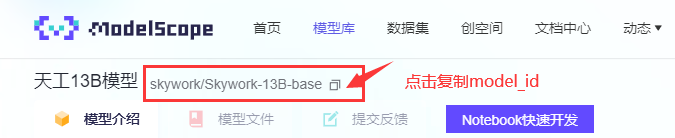

因为众所周知的原因，hugging face国内ip登录往往处处受限，用一些办法下载小模型还凑活，一旦遇到大模型，下载经常报错443。

但是，如果想要下载国内公司开源的一些大中文模型到本地，ModelScope（模搭社区）下载会是一个非常好的渠道。

首先，hugging face正常下载模型的流程是这样的，以清华的chatglm3-6b为例：


在终端输入这串指令，然后就可以下载到本地。

当然也可以用代码：

```python
from transformers import AutoModel
model = AutoModel.from_pretrained('THUDM/chatglm3-6b')
```

如果你只想下载某一个，可以在files and versions里面找到文件点击右边下载箭头选择性下载。


但是无论是那种方法，下载都会极其不稳定。

此时，我们打开[ModelScope](https://modelscope.cn/models)，找到chatglm-6b


进去后有安装指引，跟着一步一步操作即可。同样可选git clone和代码安装。


如果想知道下载到本地的模型在哪，可以打印下载模型的接收参数model_dir。

```python
model_dir
```

当然，还可以直接调用模型下载：

```python
from modelscope.models import Model
model_id = 'dienstag/chinese-macbert-large'
model = Model.from_pretrained(model_id)
```

这里模型下载的位置在`C:\Users\DaleAmmmmmy\.cache`内(每个人电脑用户名不一样)。


在modelscope里面即可找到模型


一般来说我们用torch，只需要这一个.bin文件作为参数配置文件即可，加载模型时直接输入本地路径即可。例如放在同一个文件夹内，可以直接调用：

```python
model = AutoModelForSequenceClassification.from_pretrained('chinese-macbert-large')
```

也可以使用如下模板：

```python
from modelscope.hub.snapshot_download import snapshot_download
snapshot_download(model_id='xxx', cache_dir='xxx', ignore_file_pattern='.bin')
```

这里的model_id可以复制



cache_dir是本地储存路径，默认路径在`C:\Users\用户名\.cache\modelscope`

`ignore_file_pattern='.bin'`表示所有的.bin文件都不下载。在下载llama2模型的时候，会有.safetensors后缀的模型文件，这类文件占用空间更小（1TB硬盘存储现在看来确实丐版），下载这类文件即可，不需要下载.bin。