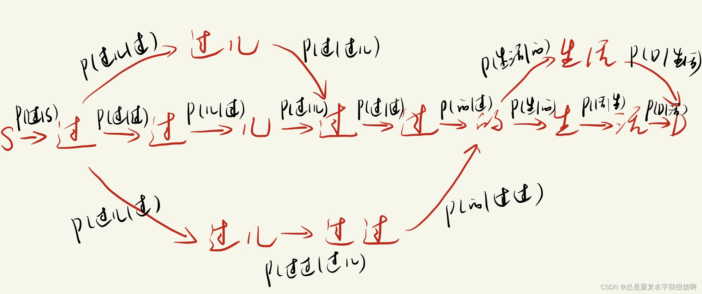
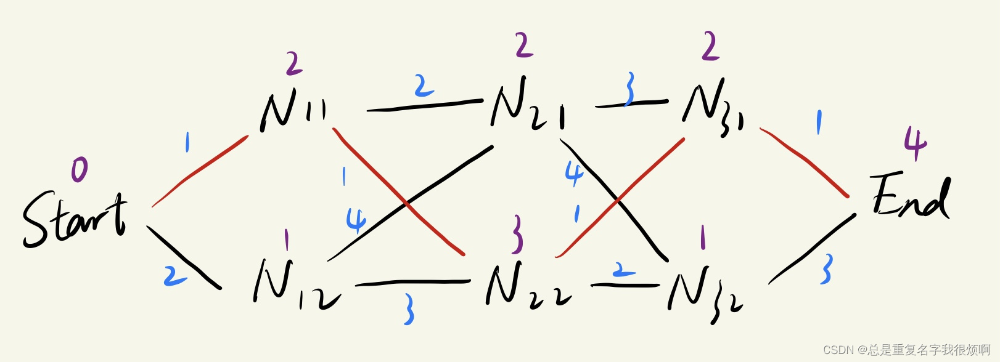

## 中文分词
人类语言不管是中文、英文还是其他文字，他都是符号，而计算机只能识别数字信息，所以，要把自然语言输入到计算机，第一步就是把字符转化为数字。但这一步之前，还需要把字符分离出来，比如['Welcome to China!']就需要分成['Welcome', 'to', 'China', '!']。中文就更加复杂，例如['我爱北京天安门']则需要分成['我','爱','北京','天安门']。

下面直接介绍工具：


```python
pip install jieba
```
```python
import jieba
text = '我爱北京天安门'
# 精准模式适用于文本分析
jieba.lcut(text, cut_all=False)
>>> ['我','爱','北京','天安门']
# 搜索引擎模式适用于搜索引擎分词
jieba.lcut_for_search(content)
# 自定义词典分词
jieba.load_userdict('词典路径')
```
词性标注一般使用jieba.posseg
```python
import jieba.posseg as pseg
text = '我爱北京天安门'
pseg.lcut(text)
>>> [pair('我', 'r'), pair('爱', 'v'), pair('北京', ''ns), pair('天安门', 'ns')]
```
英文分词简单的可以直接.split()进行切分，若要标注词性，精准分词等，可使用hanlp工具包：[hanlp文档](https://hanlp.hankcs.com/docs/api/hanlp/index.html)

除了hanlp以外，nltk也是非常好用的工具包。

```python
import nltk
from nltk.tokenize import word_tokenize, sent_tokenize
nltk.download('punkt')
text = "This is a sample text."
tokens = word_tokenize(text)
print(tokens)
```

    ['This', 'is', 'a', 'sample', 'text', '.']

```python
import nltk
from nltk.tokenize import sent_tokenize
nltk.download('punkt')
text = "This is a sample text. It contains multiple sentences. Each sentence is separated by a period."
sentences = sent_tokenize(text)
print(sentences)
```

    ['This is a sample text.', 'It contains multiple sentences.', 'Each sentence is separated by a period.']

在NLP领域，分词可以说是非常基础并且重要的工具，但是中文分词不像英文那么简单，英文可以按照空格直接分词，当然bert中把playing也分成了play ##ing两个，这是google团队采用word piece分词（这都是题外话啦）。中文分词难在词和字都有含义，例如，“从小吃到大”，你可以理解“从小 吃 到 大”，也可以理解“从 小吃 到 大”。

### 机械分词和隐马尔可夫链（HMM）
基于词典的机械切分可以理解为在一个已经载入好的海量数据库中去寻找和当前词语匹配的词，并进行切分。例如数据库中有“小吃”这个词，那么“从小吃到大”就可以被切分称“从 小吃 到 大”。如果数据库没有这个“新冠肺炎”，则很可能被切分成“新 冠 肺炎”。所以这个切分的弊端是非常明显的：1、存在歧义；2、依赖词典决定效果。

那有什么办法可以解决这个问题吗？传统的语言模型给了我们答案。

给出一个联合概率公式：若句子s由W1，W2...Wn个词组成，那么句子的概率
$$P(s) = P(W_1, W_2, W_3, W_4...)=P(W_1)P(W_2|W_1)...P(W_n|W_1W_2...W_{n-1})$$
$$P(W_i|W_{i-1})=\frac{P(W_{i-1},W_i)}{P(W_{i-1})}$$

举个例子就好理解了：“他说我爱她不是因为他爱它”
$$P(它｜爱)=\frac {P(爱,它)}{P(爱)}=\frac {count(爱,它)}{count(爱)}=\frac {1}{2}$$

这意味着，如果是爱，那有50%的概率是爱它。

但其实这样的模型有一个巨大的问题，计算两三个词还好，万一这个语料库有1000个词，那这个概率计算量是非常惊人的，而且就算你取到了一个比较大的值，他真的可以表示所有的词吗？并不一定。再或者，如果$P(W_{i-1},W_i)$中万一有一个数为0，或者为1，我们是不是就可以认为这个词语出现的概率就是0或者1呢？

所以，马尔科夫就假设，不需要看那么多词，我们就看下一个词。即：
$$P(s) = P(W_1, W_2, W_3, W_4...)=P(W_1)P(W_2|W_1)...P(W_n|W_{n-1})=\prod_{i=1}^{n}P(W_i|W_{i-1})$$

最后，我们用一个图示案例“过过儿过过的生活”来表示一下这个马尔科夫机械切分是怎么做的？

接下来我们看看HMM做了什么优化。

### 基于序列标注的分词

假设我们对每一个词都进行一个标注，表示他的位置。


S：单个字；B：词语的开头；M：词语的中间；E：词语的结束。

那么在进行分词的时候，我们只需要让计算机正确把S、BM***ME（B开头E结束）进行切分就行。例如我在湖边钓鱼，不小心睡着了，他的序列编码就是SSBEBESBMEBME（如下图）。切分出来就是“我 在 湖边 钓鱼 ， 不小心 睡着了”。这样看似乎科学了很多。那么如何让机器自动学会这个东西呢？并且这种序列标注还有一定的技巧，例如B和M之后一定不是B，E之后肯定不是E。我们可以给他一定的规则让分词效果更好。
### 最好用的传统分词：CRF（训练阶段）

我们把“我在湖边钓鱼，不小心睡着了”作为观测序列x（分别是{x1,x2,…,xn}），把SSBEBESBMEBME作为状态序列（分别是{y1,y2,…,yn}）。

每一个状态，都可以由整个观测序列x决定，即y3与{x1,x2,…,xn}都相关

，仅于相邻状态相关，即y2仅与y1和y3相关。
$$P(y|x)=\frac {1}{Z}exp(\sum\lambda_jt_j(y_{i-1},y_i,x,i)+\sum\mu_ks_k(y_i,x,i))$$

t和s分别是状态转移函数和状态特征函数。

例如：
$t_j(y_{i-1},y_i,x,i)=I(y_{i-1}="B"且y_i="E")$
$s_k(y_i,x,i)=I(x_{i-1}="钓"且x_i="鱼"且x_{i+1}=","且y_i="E")$

I(·)是一个权重函数，表示I(条件)时权重是多少，也就是对应的lambda和u的值。这样，我们就知道了每一个词和他附近的一些词（可能是相邻的1个词，也可能是3 5个词等等）的条件概率，接下来我们要寻求一条最优的路径去拼接出最可能的编码情况。
### 维特比Viterbi解码（预测阶段）
老规矩，先上公式再解释。虽然已经极力写的通俗易懂，但是一些公式问题上还是不能省。维特比的dp矩阵：
$$dp_{ij}=min(dp_{i-1,1}+dist(N_{i-1,1},N_{i,j})+dp_{i-1,2}+dist(N_{i-1,2},N_{i,j}))$$

画个图来形象理解一下：

图中蓝色数字表示转移的开销，紫色数字表示状态的开销，例如Start到N11，需要花费1+2=3点开销。我们要计算从start到end到最佳路径，我们需要计算N31和N32到end的最小开销路径，这个时候显然是N31（2+1 < 1 + 3），然后我们需要计算N21和N22到N31的最小开销路径，2+3>3+1，所以是N22到N31，接着计算N11和N12到N22点最优化路径，显然是N11。现在，最优路径已经计算出来：Start -> N11 -> N22 -> N31 -> End。这种倒过来递归求解最优路径的过程，被称作维特比解码过程。

在CRF解码过程中，我们需要t函数就是蓝色数字，s函数就是紫色数字，我们通过求解CRF后得到这样的篱笆网络，就能计算得到最优路径。\

## 编码

编码的方式有很多，因为现在主流的编码都是基于预训练模型来做，所以以前的编码我们就做一个简单介绍：
1、one-hot：有n个字符，则创建一个长度为n的稀疏矩阵，把对应字符编码的位置设置为1。举个例子
```python
from keras.preprocessing.text import Tokenizer
text = {'我', '爱', '你'}
t = Tokenizer(num_words=None, char_level=False)
t.fit_on_texts(text)
for token in vocab:
    zero_list = [0]*len(text)
    token_index = t.texts_to_sequences([token])[0][0] - 1 # texts_to_sequences以1开始
    zero_list[token_index] = 1
    print(token, 'one-hot编码:',zero_list)
>>>
我 one-hot编码：[1,0,0]
爱 one-hot编码：[0,1,0]
你 one-hot编码：[0,0,1]
```
但这种编码方式短一点的文本还行，设想一下，如果要用这个方法去编码射雕英雄传这本小说，内存将无法承受如此大的稀疏矩阵存储。

2、word2vec：包含CBOW和skipgram两种模式。

CBOW是用左右两侧的上下文对中间词进行预测，假定有一句话Hope can set you free，windows=3，因此模型第一个训练出来的样本来自Hope can set,CBOW模式下将Hope set作为输入，can作为输出，在模型训练时，Hope can set都使用的one-hot编码，Hope:[1,0,0,0,0]，can:[0,1,0,0,0], set:0,0,1,0,0。用变换矩阵35相乘得到31的【表示矩阵】。这里的3是最后得到的词向量维度。【表示矩阵】再和【变换矩阵】shape(5 * 3)相乘得到5 * 1的目标矩阵，在这里我们希望他是[0,1,0,0,0]。然后窗口按序向后移动重新更新参数，直到所有的语料被遍历完成，得到最终的【变换矩阵】。

skipgram是用中间的词预测两侧上下文。假定有一句话Hope can set you free，windows=3，因此模型第一个训练出来的样本来自Hope can set。skipgram模式下将can作为输入，Hope set作为输出。输入can[0,1,0,0,0]reshape(5,1)和变换矩阵3 * 5相乘得到3 * 1的表示矩阵，这个表示矩阵和许多不同的5 * 3的变换矩阵相乘得到5 * 1目标矩阵。

[Github：fasttxt](https://github.com/facebookresearch/fastText)
```python
# fasttext需要去github下载完整版，pip安装的是阉割版有些功能不能使用，链接在上方。
import fasttext
# 这里选择了一个维基百科数据集
model = fasttext.train_unsupervised('./data/enwik9/enwik9.txt')
model.get_word_vector('the')
>>>
array([ 0.31554842, -0.00567535,  0.02542016,  0.01240454, -0.27713037,
        0.09596794, -0.42942137, -0.13186786, -0.2389577 , -0.02847404,
        0.12398094,  0.2940258 , -0.16931549,  0.02517833,  0.10820759,
       -0.11116117,  0.07980197,  0.17255728,  0.05923959,  0.05312477,
        0.25332063,  0.12383557,  0.26340196, -0.06877434,  0.01602176,
        0.0572529 ,  0.175312  ,  0.04499907, -0.03429295,  0.26550826,
        0.05361822, -0.08058389,  0.35940173,  0.18476954,  0.11618206,
        0.01335344,  0.02825387, -0.02110594, -0.03370227, -0.03843364,
        0.03603617,  0.04085227,  0.37722406, -0.08784803, -0.10871147,
       -0.3422877 , -0.17854837, -0.12285236, -0.01105188, -0.22011152,
        0.16862307, -0.0683898 ,  0.24339588, -0.32868978, -0.1517483 ,
       -0.15977417,  0.10827688, -0.32918802,  0.01938748,  0.20195097,
       -0.1241372 ,  0.2528724 , -0.01422824,  0.07056748,  0.09309146,
        0.20510688,  0.00314162,  0.01717972, -0.1129839 ,  0.12191518,
       -0.16137297,  0.00360382,  0.1382029 , -0.10296268, -0.03633826,
        0.051523  , -0.26057386, -0.19538148,  0.18406765, -0.07116103,
        0.04601068, -0.04241964, -0.05157055,  0.03981249,  0.25914833,
       -0.12596582, -0.00762906, -0.2766355 , -0.40362012,  0.09305142,
       -0.01467515,  0.4663454 ,  0.01874566,  0.03209095, -0.02476245,
       -0.12284862, -0.21247824, -0.2051559 ,  0.24576288, -0.23159373],
      dtype=float32)
```

```python
# 超参数设定
# 训练词向量过程中，我们可以设定很多常用超参数来调节我们的模型效果无监督训练模式：'skipgram'或者'cbow'，默认为'skipgram'，在实践中，skipgram模式在利用子词方面比cbow好
# 词嵌入维度dim：默认100，但随着语料库的增大，词嵌入的维度往往也要更大
# 数据循环次数epoch：默认为5，但当你的数据集足够大，可能不需要那么多次
# 学习率lr：默认0.05，根据京表演选择[0.01,1]
# 使用的线程数thread：默认12个线程，一般和cpu核数相同
model = fasttext.train_unsupervised('.//data//enwik9//enwik9.txt','cbow',dim=50, epoch=1, lr=0.01, thread=8)
```

如何判断这个模型训练的好坏呢？最简单的办法就是我们看一看这个词向量的相邻词向量。

```python
# 检查单词向量质量的一种简单方法就是查看其临近单词，通过我们主观来判断这些邻近单词与目标单词相关性来粗略评价模型好坏
# 查找运动相关的单词
print(model.get_nearest_neighbors('sports'))
>>>
[(0.8615252375602722, 'sport'), (0.8453112840652466, 'sporting'), (0.8213860392570496, 'sportsnet'), (0.8085111975669861, 'sportsground'), (0.7918924689292908, 'sportscars'), (0.7911261916160583, 'motorsports'), (0.7884459495544434, 'sportsplex'), (0.7826608419418335, 'sportscar'), (0.7793251872062683, 'athletics'), (0.7720682621002197, 'sportswomen')]
```

## 数据增强
如果数据集不够多，或者噪声多，我们可以尝试用数据增强的方式来增加数据。CV中数据增强可以通过图片的翻转，mask等等方式，但NLP我们不能把句子颠倒影响语义，所以可以尝试回译的方法。例如把中文翻译成韩文再把翻译的韩文翻译回中文。

```python
from google_trans_new import google_translator
translator = google_translator() # 实例化
text = ['今天天气不错', '一会儿去哪玩']
ko_res = translator.translate(text, lang_src='zh-cn', lang_tgt='ko')
print(ko_res)
cn_res = translator.translate(ko_res, lang_src='ko', lang_tgt='zh-cn')
print(cn_res)
>>>
[ '오늘의 날씨가 좋다 ",'어디에서 놀 수 있니? ' ]
['今天的天气很好，“我在哪里可以玩？” ]
```