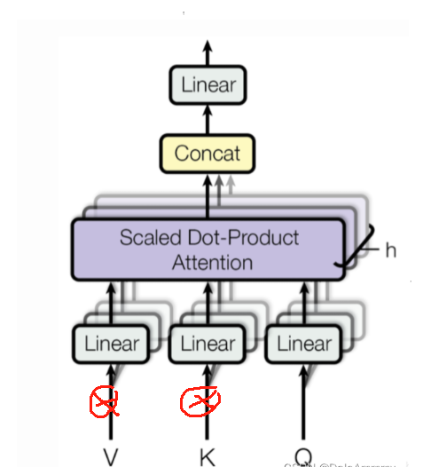

## IA3简介

IA3(Infused Adapter by Inhibiting and Amplifying Inner Activations)，因为英文有三个A，所以又叫IA3，为什么不叫I3A呢？一方面有歧义，一方面，没IA3好听。

IA3的核心思想是抑制和放大内部激活函数，通过一个可学习向量，调整transformer结构里面的KV和前向传播层




和LoRA一样，IA3也只会对这部分可学习向量进行更新，当最终融合到模型里的时候不会增加模型的参数量。

## IA3微调

训练部分和LoRA几乎完全一致，可配置参数也和LoRA相似。

### 前期工作Step1 导入工具包


```python
from datasets import Dataset
from transformers import AutoTokenizer, AutoModelForCausalLM, DataCollatorForSeq2Seq, TrainingArguments, Trainer
```

### 前期工作Step2 加载数据集


```python
dataset = Dataset.load_from_disk('alpaca_data_zh/')
```

### 前期工作Step3 数据预处理


```python
tokenizer = AutoTokenizer.from_pretrained('bloom-1b4-zh/')
```


```python
def process_func(example, MAX_LENGTH = 256):
    input_ids, attention_mask, labels = [], [], []
    instruction = tokenizer("\n".join(['Human: ' + example['instruction'], example['input']]).strip() + '\n\nAssistant: ')
    response = tokenizer(example['output'] + tokenizer.eos_token)
    input_ids = instruction['input_ids'] + response['input_ids']
    attention_mask = instruction['attention_mask'] + response['attention_mask']
    labels = [-100] * len(instruction['input_ids']) + response['input_ids']
    if len(input_ids) > MAX_LENGTH:
        input_ids = input_ids[:MAX_LENGTH]
        attention_mask = attention_mask[:MAX_LENGTH]
        labels = labels[:MAX_LENGTH]
    return {
        'input_ids': input_ids,
        'attention_mask': attention_mask,
        'labels': labels
    }

tokenized_dataset = dataset.map(process_func, remove_columns=dataset.column_names)
```


### 前期工作Step4 导入模型


```python
model = AutoModelForCausalLM.from_pretrained('bloom-1b4-zh/')
```

###  IA3

####  PEFT Step1 配置文件


```python
from peft import get_peft_model, IA3Config, TaskType


config = IA3Config(task_type=TaskType.CAUSAL_LM)
config
```


    IA3Config(peft_type=<PeftType.IA3: 'IA3'>, auto_mapping=None, base_model_name_or_path=None, revision=None, task_type=<TaskType.CAUSAL_LM: 'CAUSAL_LM'>, inference_mode=False, target_modules=None, feedforward_modules=None, fan_in_fan_out=False, modules_to_save=None, init_ia3_weights=True)


####  PEFT Step2 创建模型


```python
model = get_peft_model(model, config)
```


```python
model.print_trainable_parameters()
```

    trainable params: 344,064 || all params: 1,303,455,744 || trainable%: 0.026396293206254036
    

```python
config
```


    IA3Config(peft_type=<PeftType.IA3: 'IA3'>, auto_mapping=None, base_model_name_or_path='bloom-1b4-zh/', revision=None, task_type=<TaskType.CAUSAL_LM: 'CAUSAL_LM'>, inference_mode=False, target_modules=['query_key_value', 'mlp.dense_4h_to_h'], feedforward_modules=['mlp.dense_4h_to_h'], fan_in_fan_out=False, modules_to_save=None, init_ia3_weights=True)


```python
model
```


    PeftModelForCausalLM(
      (base_model): IA3Model(
        (model): BloomForCausalLM(
          (transformer): BloomModel(
            (word_embeddings): Embedding(46145, 2048)
            (word_embeddings_layernorm): LayerNorm((2048,), eps=1e-05, elementwise_affine=True)
            (h): ModuleList(
              (0-23): 24 x BloomBlock(
                (input_layernorm): LayerNorm((2048,), eps=1e-05, elementwise_affine=True)
                (self_attention): BloomAttention(
                  (query_key_value): Linear(
                    in_features=2048, out_features=6144, bias=True
                    (ia3_l): ParameterDict(  (default): Parameter containing: [torch.FloatTensor of size 6144x1])
                  )
                  (dense): Linear(in_features=2048, out_features=2048, bias=True)
                  (attention_dropout): Dropout(p=0.0, inplace=False)
                )
                (post_attention_layernorm): LayerNorm((2048,), eps=1e-05, elementwise_affine=True)
                (mlp): BloomMLP(
                  (dense_h_to_4h): Linear(in_features=2048, out_features=8192, bias=True)
                  (gelu_impl): BloomGelu()
                  (dense_4h_to_h): Linear(
                    in_features=8192, out_features=2048, bias=True
                    (ia3_l): ParameterDict(  (default): Parameter containing: [torch.FloatTensor of size 1x8192])
                  )
                )
              )
            )
            (ln_f): LayerNorm((2048,), eps=1e-05, elementwise_affine=True)
          )
          (lm_head): Linear(in_features=2048, out_features=46145, bias=False)
        )
      )
    )


### 前期工作Step5 配置训练参数


```python
args = TrainingArguments(
    output_dir = './IA3',
    per_device_train_batch_size=1,
    gradient_accumulation_steps=8,
    logging_steps=10,
    num_train_epochs=1,
    learning_rate=3e-3, # 官方推荐学习率
)
```

### 前期工作Step6 配置trainer


```python
trainer = Trainer(
    args = args,
    train_dataset=tokenized_dataset,
    model = model,
    data_collator = DataCollatorForSeq2Seq(tokenizer=tokenizer, padding=True)
)
```

### 前期工作Step7 模型训练


```python
trainer.train()
```

