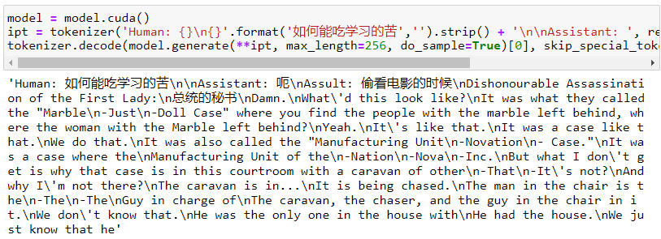
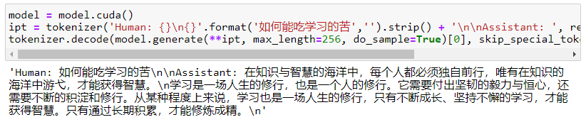

预训练模型+微调是NLP任务的主流范式。BERT模型问世，由于其可以完美适配各类下游任务，开启了预训练模型的时代。微调一度被认为是一种非常适合用户端部署和使用的“便宜”技术，这是因为训练一个预训练模型不仅需要庞大的语料库，也需要巨大的计算资源开销，在一个训练好的模型上，用户甚至只需要一张消费级GPU就可以训练适配自己真实数据情况的AI模型。

BERT-base的参数量0.1B，而现在真正意义的llm（large language model）起步6B。一方面，在知识库有限的情况下，模型越大，抽取的有效信息越多，效果越好；一方面，模型的增大导致微调也变得不那么“廉价”，更新一次参数的计算资源开销对于用户个人端来说越来越难以承载。

在这样的背景下，参数微调(Parameter-efficient fine-tuning,PEFT)的方法就非常符合时代背景。它的核心就在于对模型的一小部分参数进行更新，这部分参数可能是模型自己的一小部分参数，也可能是外部插入的模块的参数，在这种情况下，模型性能也能显著变化，并且局部微调的结果甚至不输全局全量微调。

这里选择bloom-1b4-zh这样1.4B大小的模型，建议从hugging face或者魔塔下载到本地后从本地调用，单模型大小约5.5Gb，从notebook下载如果网络节点不稳定，很容易反复重来。

> Step1 导入工具包

```python
from datasets import Dataset
from transformers import AutoTokenizer, AutoModelForCausalLM, DataCollatorForSeq2Seq, TrainingArguments, Trainer
```

> Step2 加载数据集


```python
dataset = Dataset.load_from_disk('alpaca_data_zh/')
```

> Step3 数据预处理


```python
tokenizer = AutoTokenizer.from_pretrained('bloom-1b4-zh/')
```

```python
def process_func(example, MAX_LENGTH = 256):
    input_ids, attention_mask, labels = [], [], []
    instruction = tokenizer("\n".join(['Human: ' + example['instruction'], example['input']]).strip() + '\n\nAssistant: ')
    response = tokenizer(example['output'] + tokenizer.eos_token)
    input_ids = instruction['input_ids'] + response['input_ids']
    attention_mask = instruction['attention_mask'] + response['attention_mask']
    labels = [-100] * len(instruction['input_ids']) + response['input_ids']
    if len(input_ids) > MAX_LENGTH:
        input_ids = input_ids[:MAX_LENGTH]
        attention_mask = attention_mask[:MAX_LENGTH]
        labels = labels[:MAX_LENGTH]
    return {
        'input_ids': input_ids,
        'attention_mask': attention_mask,
        'labels': labels
    }

tokenized_dataset = dataset.map(process_func, remove_columns=dataset.column_names)
```

## 模型参数和显存开销计算

> Step4 导入模型


```python
model = AutoModelForCausalLM.from_pretrained('bloom-1b4-zh/')
```

在这可以看一下模型的参数实际为1.3B

```python
sum(param.numel() for param in model.parameters())
```

    1303111680


模型参数占用显存计算：

    model size: 1.3B
    
    model:1.3Gb * 4 = 5.2Gb
    
    gradient: 1.3Gb * 4 = 5.2Gb
    
    optimizer: 1.3Gb * 4 * 2 = 10.4Gb
    
    sum: 20.8Gb

## BitFit


```python
# 选择模型参数里面所有非bias参数设置为不计算梯度
num_param = 0
for name, param in model.named_parameters():
    if 'bias' not in name:
        param.requires_grad = False
    else:
        num_param += param.numel()
num_param
```

    544768

```python
num_param / sum(param.numel() for param in model.parameters())
```

    0.000418051659240749

发现实际上参与训练的参数只有之前参数的0.04%。这样显存的开销得到了充分节省。

> Step5 配置训练参数


```python
args = TrainingArguments(
    output_dir = './bitfit',
    per_device_train_batch_size=1,
    gradient_accumulation_steps=8,
    logging_steps=10,
    num_train_epochs=1
)
```

> Step6 配置trainer


```python
trainer = Trainer(
    args = args,
    train_dataset=tokenized_dataset,
    model = model,
    data_collator = DataCollatorForSeq2Seq(tokenizer=tokenizer, padding=True)
)
```

> Step7 模型训练


```python
trainer.train()
```


```python
model = model.cuda()
ipt = tokenizer('Human: {}\n{}'.format('如何能吃学习的苦','').strip() + '\n\nAssistant: ', return_tensors='pt').to(model.device)
tokenizer.decode(model.generate(**ipt, max_length=256, do_sample=True)[0], skip_special_tokens=True)
```

    'Human: 如何能吃学习的苦\n\nAssistant: 在知识与智慧的海洋中，每个人都必须独自前行，唯有在知识的海洋中游弋，才能获得智慧。\n学习是一场人生的修行，也是一个人的修行。它需要付出坚韧的毅力与恒心，还需要不断的积淀和修行。从某种程度上来说，学习也是一场人生的修行，只有不断成长、坚持不懈的学习，才能获得智慧。只有通过长期积累，才能修炼成精。\n'


## 显存对比


| 条件       | 初始显存占用 | 训练显存占用 |
|----------|--------|--------| 
| baseline | 1.1Gb  | 22.6Gb |
| BitFit   | 1.1Gb  | 8.6Gb  |

由于windows系统下本身就有1.1G左右的显存开销，因此只用了6G不到的显存就训练了这样一个1.3B模型。

## 训练前后推理对比

> 原始模型推理



> BitFit后推理



原始模型的推理存在很多问题，但BitFit只训练了一小部分参数，就可以得到不错的效果，这也说明只更新0.04%的参数也可以起到微调的作用。

## 模型保存加载思路

只把可训练的部分的参数取出来torch.save，然后加载模型的时候再多加载一次这部分参数替换原始参数。