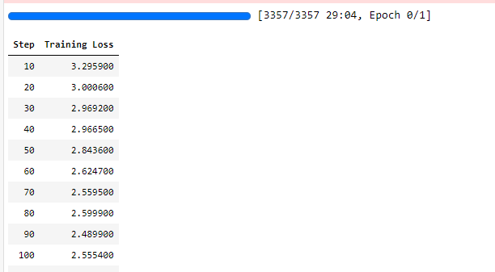

## LoRA简介

LoRA认为，预训练模型中存在一个极小的内在维度，这个内在维度是发挥核心作用的地方。在继续训练的过程中，权重的更新也满足这样的特点，存在一个内在低秩维度。

传统权重更新：$W = W + \delta W$

LoRA提出，通过矩阵分解可以把原本要更新的大的矩阵变为两个小的矩阵。即：$W = W + \delta W = W + BA$，其中$BA$是两个低秩矩阵。

基于该思想，在进行预训练的时候，一方面使用预训练权重进行计算，一方面使用LoRa的这两个低秩矩阵进行计算，然后这两部分的结果相加求和得到这一层的计算结果，注意，每一层都可以有LoRA矩阵进行更新。在优化的过程中，不会动预训练模型的参数，只会对LoRA矩阵进行更新。

相较于prompt系列，训练完成后的BA矩阵可以直接合并到原来的权重参数中去，这样合并后模型的参数和之前一模一样，这样就不需要增加重参数层增加模型的总参数和计算量。

## LoRA微调

### 前期工作Step1 导入工具包


```python
from datasets import Dataset
from transformers import AutoTokenizer, AutoModelForCausalLM, DataCollatorForSeq2Seq, TrainingArguments, Trainer
```

### 前期工作Step2 加载数据集


```python
dataset = Dataset.load_from_disk('alpaca_data_zh/')
```

### 前期工作Step3 数据预处理


```python
tokenizer = AutoTokenizer.from_pretrained('bloom-1b4-zh/')
```


```python
def process_func(example, MAX_LENGTH = 256):
    input_ids, attention_mask, labels = [], [], []
    instruction = tokenizer("\n".join(['Human: ' + example['instruction'], example['input']]).strip() + '\n\nAssistant: ')
    response = tokenizer(example['output'] + tokenizer.eos_token)
    input_ids = instruction['input_ids'] + response['input_ids']
    attention_mask = instruction['attention_mask'] + response['attention_mask']
    labels = [-100] * len(instruction['input_ids']) + response['input_ids']
    if len(input_ids) > MAX_LENGTH:
        input_ids = input_ids[:MAX_LENGTH]
        attention_mask = attention_mask[:MAX_LENGTH]
        labels = labels[:MAX_LENGTH]
    return {
        'input_ids': input_ids,
        'attention_mask': attention_mask,
        'labels': labels
    }

tokenized_dataset = dataset.map(process_func, remove_columns=dataset.column_names)
```

### 前期工作Step4 导入模型


```python
model = AutoModelForCausalLM.from_pretrained('bloom-1b4-zh/')
```

###  LoRA

####  PEFT Step1 配置文件


```python
from peft import get_peft_model, LoraConfig, TaskType

# r 秩
# target_modules 加lora的层
# lora_alpha 矩阵缩放系数，scale=lora_alpha/r
config = LoraConfig(task_type=TaskType.CAUSAL_LM,
                    r = 8,
                    lora_alpha = 8,
                    # target_modules = ['.*\.1.*query_key_value'], # 只对.1.的query_key_value更新
                    # target_modules= ['query_key_value', 'dense_h_to_4h', 'dense_4h_to_h'],
                   
                    )
config
```


    LoraConfig(peft_type=<PeftType.LORA: 'LORA'>, auto_mapping=None, base_model_name_or_path=None, revision=None, task_type=<TaskType.CAUSAL_LM: 'CAUSAL_LM'>, inference_mode=False, r=8, target_modules=None, lora_alpha=8, lora_dropout=0.0, fan_in_fan_out=False, bias='none', modules_to_save=None, init_lora_weights=True, layers_to_transform=None, layers_pattern=None)

默认是对query_key_value进行更新，这里targe_modules可以打印看看能够设置哪些层：

```python
for name, parameter in model.named_parameters():
    print(name)
```

    base_model.model.transformer.word_embeddings.weight
    base_model.model.transformer.word_embeddings_layernorm.weight
    base_model.model.transformer.word_embeddings_layernorm.bias
    base_model.model.transformer.h.0.input_layernorm.weight
    base_model.model.transformer.h.0.input_layernorm.bias
    base_model.model.transformer.h.0.self_attention.query_key_value.weight
    base_model.model.transformer.h.0.self_attention.query_key_value.bias
    base_model.model.transformer.h.0.self_attention.query_key_value.lora_A.default.weight
    base_model.model.transformer.h.0.self_attention.query_key_value.lora_B.default.weight
    base_model.model.transformer.h.0.self_attention.dense.weight
    base_model.model.transformer.h.0.self_attention.dense.bias
    base_model.model.transformer.h.0.post_attention_layernorm.weight
    base_model.model.transformer.h.0.post_attention_layernorm.bias
    base_model.model.transformer.h.0.mlp.dense_h_to_4h.weight
    base_model.model.transformer.h.0.mlp.dense_h_to_4h.bias
    base_model.model.transformer.h.0.mlp.dense_4h_to_h.weight
    base_model.model.transformer.h.0.mlp.dense_4h_to_h.bias
    base_model.model.transformer.h.1.input_layernorm.weight
    base_model.model.transformer.h.1.input_layernorm.bias
    base_model.model.transformer.h.1.self_attention.query_key_value.weight
    base_model.model.transformer.h.1.self_attention.query_key_value.bias
    base_model.model.transformer.h.1.self_attention.query_key_value.lora_A.default.weight
    base_model.model.transformer.h.1.self_attention.query_key_value.lora_B.default.weight
    base_model.model.transformer.h.1.self_attention.dense.weight
    base_model.model.transformer.h.1.self_attention.dense.bias
    base_model.model.transformer.h.1.post_attention_layernorm.weight
    base_model.model.transformer.h.1.post_attention_layernorm.bias
    base_model.model.transformer.h.1.mlp.dense_h_to_4h.weight
    base_model.model.transformer.h.1.mlp.dense_h_to_4h.bias
    base_model.model.transformer.h.1.mlp.dense_4h_to_h.weight
    base_model.model.transformer.h.1.mlp.dense_4h_to_h.bias
    base_model.model.transformer.h.2.input_layernorm.weight
    base_model.model.transformer.h.2.input_layernorm.bias
    base_model.model.transformer.h.2.self_attention.query_key_value.weight
    base_model.model.transformer.h.2.self_attention.query_key_value.bias
    base_model.model.transformer.h.2.self_attention.query_key_value.lora_A.default.weight
    base_model.model.transformer.h.2.self_attention.query_key_value.lora_B.default.weight
    base_model.model.transformer.h.2.self_attention.dense.weight
    base_model.model.transformer.h.2.self_attention.dense.bias
    base_model.model.transformer.h.2.post_attention_layernorm.weight
    base_model.model.transformer.h.2.post_attention_layernorm.bias
    base_model.model.transformer.h.2.mlp.dense_h_to_4h.weight
    base_model.model.transformer.h.2.mlp.dense_h_to_4h.bias
    base_model.model.transformer.h.2.mlp.dense_4h_to_h.weight
    base_model.model.transformer.h.2.mlp.dense_4h_to_h.bias
    base_model.model.transformer.h.3.input_layernorm.weight
    base_model.model.transformer.h.3.input_layernorm.bias
    base_model.model.transformer.h.3.self_attention.query_key_value.weight
    base_model.model.transformer.h.3.self_attention.query_key_value.bias
    base_model.model.transformer.h.3.self_attention.query_key_value.lora_A.default.weight
    base_model.model.transformer.h.3.self_attention.query_key_value.lora_B.default.weight
    base_model.model.transformer.h.3.self_attention.dense.weight
    base_model.model.transformer.h.3.self_attention.dense.bias
    base_model.model.transformer.h.3.post_attention_layernorm.weight
    base_model.model.transformer.h.3.post_attention_layernorm.bias
    base_model.model.transformer.h.3.mlp.dense_h_to_4h.weight
    base_model.model.transformer.h.3.mlp.dense_h_to_4h.bias
    base_model.model.transformer.h.3.mlp.dense_4h_to_h.weight
    base_model.model.transformer.h.3.mlp.dense_4h_to_h.bias
    base_model.model.transformer.h.4.input_layernorm.weight
    base_model.model.transformer.h.4.input_layernorm.bias
    base_model.model.transformer.h.4.self_attention.query_key_value.weight
    base_model.model.transformer.h.4.self_attention.query_key_value.bias
    base_model.model.transformer.h.4.self_attention.query_key_value.lora_A.default.weight
    base_model.model.transformer.h.4.self_attention.query_key_value.lora_B.default.weight
    base_model.model.transformer.h.4.self_attention.dense.weight
    base_model.model.transformer.h.4.self_attention.dense.bias
    base_model.model.transformer.h.4.post_attention_layernorm.weight
    base_model.model.transformer.h.4.post_attention_layernorm.bias
    base_model.model.transformer.h.4.mlp.dense_h_to_4h.weight
    base_model.model.transformer.h.4.mlp.dense_h_to_4h.bias
    base_model.model.transformer.h.4.mlp.dense_4h_to_h.weight
    base_model.model.transformer.h.4.mlp.dense_4h_to_h.bias
    base_model.model.transformer.h.5.input_layernorm.weight
    base_model.model.transformer.h.5.input_layernorm.bias
    base_model.model.transformer.h.5.self_attention.query_key_value.weight
    base_model.model.transformer.h.5.self_attention.query_key_value.bias
    base_model.model.transformer.h.5.self_attention.query_key_value.lora_A.default.weight
    base_model.model.transformer.h.5.self_attention.query_key_value.lora_B.default.weight
    base_model.model.transformer.h.5.self_attention.dense.weight
    base_model.model.transformer.h.5.self_attention.dense.bias
    base_model.model.transformer.h.5.post_attention_layernorm.weight
    base_model.model.transformer.h.5.post_attention_layernorm.bias
    base_model.model.transformer.h.5.mlp.dense_h_to_4h.weight
    base_model.model.transformer.h.5.mlp.dense_h_to_4h.bias
    base_model.model.transformer.h.5.mlp.dense_4h_to_h.weight
    base_model.model.transformer.h.5.mlp.dense_4h_to_h.bias
    base_model.model.transformer.h.6.input_layernorm.weight
    base_model.model.transformer.h.6.input_layernorm.bias
    base_model.model.transformer.h.6.self_attention.query_key_value.weight
    base_model.model.transformer.h.6.self_attention.query_key_value.bias
    base_model.model.transformer.h.6.self_attention.query_key_value.lora_A.default.weight
    base_model.model.transformer.h.6.self_attention.query_key_value.lora_B.default.weight
    base_model.model.transformer.h.6.self_attention.dense.weight
    base_model.model.transformer.h.6.self_attention.dense.bias
    base_model.model.transformer.h.6.post_attention_layernorm.weight
    base_model.model.transformer.h.6.post_attention_layernorm.bias
    base_model.model.transformer.h.6.mlp.dense_h_to_4h.weight
    base_model.model.transformer.h.6.mlp.dense_h_to_4h.bias
    base_model.model.transformer.h.6.mlp.dense_4h_to_h.weight
    base_model.model.transformer.h.6.mlp.dense_4h_to_h.bias
    base_model.model.transformer.h.7.input_layernorm.weight
    base_model.model.transformer.h.7.input_layernorm.bias
    base_model.model.transformer.h.7.self_attention.query_key_value.weight
    base_model.model.transformer.h.7.self_attention.query_key_value.bias
    base_model.model.transformer.h.7.self_attention.query_key_value.lora_A.default.weight
    base_model.model.transformer.h.7.self_attention.query_key_value.lora_B.default.weight
    base_model.model.transformer.h.7.self_attention.dense.weight
    base_model.model.transformer.h.7.self_attention.dense.bias
    base_model.model.transformer.h.7.post_attention_layernorm.weight
    base_model.model.transformer.h.7.post_attention_layernorm.bias
    base_model.model.transformer.h.7.mlp.dense_h_to_4h.weight
    base_model.model.transformer.h.7.mlp.dense_h_to_4h.bias
    base_model.model.transformer.h.7.mlp.dense_4h_to_h.weight
    base_model.model.transformer.h.7.mlp.dense_4h_to_h.bias
    base_model.model.transformer.h.8.input_layernorm.weight
    base_model.model.transformer.h.8.input_layernorm.bias
    base_model.model.transformer.h.8.self_attention.query_key_value.weight
    base_model.model.transformer.h.8.self_attention.query_key_value.bias
    base_model.model.transformer.h.8.self_attention.query_key_value.lora_A.default.weight
    base_model.model.transformer.h.8.self_attention.query_key_value.lora_B.default.weight
    base_model.model.transformer.h.8.self_attention.dense.weight
    base_model.model.transformer.h.8.self_attention.dense.bias
    base_model.model.transformer.h.8.post_attention_layernorm.weight
    base_model.model.transformer.h.8.post_attention_layernorm.bias
    base_model.model.transformer.h.8.mlp.dense_h_to_4h.weight
    base_model.model.transformer.h.8.mlp.dense_h_to_4h.bias
    base_model.model.transformer.h.8.mlp.dense_4h_to_h.weight
    base_model.model.transformer.h.8.mlp.dense_4h_to_h.bias
    base_model.model.transformer.h.9.input_layernorm.weight
    base_model.model.transformer.h.9.input_layernorm.bias
    base_model.model.transformer.h.9.self_attention.query_key_value.weight
    base_model.model.transformer.h.9.self_attention.query_key_value.bias
    base_model.model.transformer.h.9.self_attention.query_key_value.lora_A.default.weight
    base_model.model.transformer.h.9.self_attention.query_key_value.lora_B.default.weight
    base_model.model.transformer.h.9.self_attention.dense.weight
    base_model.model.transformer.h.9.self_attention.dense.bias
    base_model.model.transformer.h.9.post_attention_layernorm.weight
    base_model.model.transformer.h.9.post_attention_layernorm.bias
    base_model.model.transformer.h.9.mlp.dense_h_to_4h.weight
    base_model.model.transformer.h.9.mlp.dense_h_to_4h.bias
    base_model.model.transformer.h.9.mlp.dense_4h_to_h.weight
    base_model.model.transformer.h.9.mlp.dense_4h_to_h.bias
    base_model.model.transformer.h.10.input_layernorm.weight
    base_model.model.transformer.h.10.input_layernorm.bias
    base_model.model.transformer.h.10.self_attention.query_key_value.weight
    base_model.model.transformer.h.10.self_attention.query_key_value.bias
    base_model.model.transformer.h.10.self_attention.query_key_value.lora_A.default.weight
    base_model.model.transformer.h.10.self_attention.query_key_value.lora_B.default.weight
    base_model.model.transformer.h.10.self_attention.dense.weight
    base_model.model.transformer.h.10.self_attention.dense.bias
    base_model.model.transformer.h.10.post_attention_layernorm.weight
    base_model.model.transformer.h.10.post_attention_layernorm.bias
    base_model.model.transformer.h.10.mlp.dense_h_to_4h.weight
    base_model.model.transformer.h.10.mlp.dense_h_to_4h.bias
    base_model.model.transformer.h.10.mlp.dense_4h_to_h.weight
    base_model.model.transformer.h.10.mlp.dense_4h_to_h.bias
    base_model.model.transformer.h.11.input_layernorm.weight
    base_model.model.transformer.h.11.input_layernorm.bias
    base_model.model.transformer.h.11.self_attention.query_key_value.weight
    base_model.model.transformer.h.11.self_attention.query_key_value.bias
    base_model.model.transformer.h.11.self_attention.query_key_value.lora_A.default.weight
    base_model.model.transformer.h.11.self_attention.query_key_value.lora_B.default.weight
    base_model.model.transformer.h.11.self_attention.dense.weight
    base_model.model.transformer.h.11.self_attention.dense.bias
    base_model.model.transformer.h.11.post_attention_layernorm.weight
    base_model.model.transformer.h.11.post_attention_layernorm.bias
    base_model.model.transformer.h.11.mlp.dense_h_to_4h.weight
    base_model.model.transformer.h.11.mlp.dense_h_to_4h.bias
    base_model.model.transformer.h.11.mlp.dense_4h_to_h.weight
    base_model.model.transformer.h.11.mlp.dense_4h_to_h.bias
    base_model.model.transformer.h.12.input_layernorm.weight
    base_model.model.transformer.h.12.input_layernorm.bias
    base_model.model.transformer.h.12.self_attention.query_key_value.weight
    base_model.model.transformer.h.12.self_attention.query_key_value.bias
    base_model.model.transformer.h.12.self_attention.query_key_value.lora_A.default.weight
    base_model.model.transformer.h.12.self_attention.query_key_value.lora_B.default.weight
    base_model.model.transformer.h.12.self_attention.dense.weight
    base_model.model.transformer.h.12.self_attention.dense.bias
    base_model.model.transformer.h.12.post_attention_layernorm.weight
    base_model.model.transformer.h.12.post_attention_layernorm.bias
    base_model.model.transformer.h.12.mlp.dense_h_to_4h.weight
    base_model.model.transformer.h.12.mlp.dense_h_to_4h.bias
    base_model.model.transformer.h.12.mlp.dense_4h_to_h.weight
    base_model.model.transformer.h.12.mlp.dense_4h_to_h.bias
    base_model.model.transformer.h.13.input_layernorm.weight
    base_model.model.transformer.h.13.input_layernorm.bias
    base_model.model.transformer.h.13.self_attention.query_key_value.weight
    base_model.model.transformer.h.13.self_attention.query_key_value.bias
    base_model.model.transformer.h.13.self_attention.query_key_value.lora_A.default.weight
    base_model.model.transformer.h.13.self_attention.query_key_value.lora_B.default.weight
    base_model.model.transformer.h.13.self_attention.dense.weight
    base_model.model.transformer.h.13.self_attention.dense.bias
    base_model.model.transformer.h.13.post_attention_layernorm.weight
    base_model.model.transformer.h.13.post_attention_layernorm.bias
    base_model.model.transformer.h.13.mlp.dense_h_to_4h.weight
    base_model.model.transformer.h.13.mlp.dense_h_to_4h.bias
    base_model.model.transformer.h.13.mlp.dense_4h_to_h.weight
    base_model.model.transformer.h.13.mlp.dense_4h_to_h.bias
    base_model.model.transformer.h.14.input_layernorm.weight
    base_model.model.transformer.h.14.input_layernorm.bias
    base_model.model.transformer.h.14.self_attention.query_key_value.weight
    base_model.model.transformer.h.14.self_attention.query_key_value.bias
    base_model.model.transformer.h.14.self_attention.query_key_value.lora_A.default.weight
    base_model.model.transformer.h.14.self_attention.query_key_value.lora_B.default.weight
    base_model.model.transformer.h.14.self_attention.dense.weight
    base_model.model.transformer.h.14.self_attention.dense.bias
    base_model.model.transformer.h.14.post_attention_layernorm.weight
    base_model.model.transformer.h.14.post_attention_layernorm.bias
    base_model.model.transformer.h.14.mlp.dense_h_to_4h.weight
    base_model.model.transformer.h.14.mlp.dense_h_to_4h.bias
    base_model.model.transformer.h.14.mlp.dense_4h_to_h.weight
    base_model.model.transformer.h.14.mlp.dense_4h_to_h.bias
    base_model.model.transformer.h.15.input_layernorm.weight
    base_model.model.transformer.h.15.input_layernorm.bias
    base_model.model.transformer.h.15.self_attention.query_key_value.weight
    base_model.model.transformer.h.15.self_attention.query_key_value.bias
    base_model.model.transformer.h.15.self_attention.query_key_value.lora_A.default.weight
    base_model.model.transformer.h.15.self_attention.query_key_value.lora_B.default.weight
    base_model.model.transformer.h.15.self_attention.dense.weight
    base_model.model.transformer.h.15.self_attention.dense.bias
    base_model.model.transformer.h.15.post_attention_layernorm.weight
    base_model.model.transformer.h.15.post_attention_layernorm.bias
    base_model.model.transformer.h.15.mlp.dense_h_to_4h.weight
    base_model.model.transformer.h.15.mlp.dense_h_to_4h.bias
    base_model.model.transformer.h.15.mlp.dense_4h_to_h.weight
    base_model.model.transformer.h.15.mlp.dense_4h_to_h.bias
    base_model.model.transformer.h.16.input_layernorm.weight
    base_model.model.transformer.h.16.input_layernorm.bias
    base_model.model.transformer.h.16.self_attention.query_key_value.weight
    base_model.model.transformer.h.16.self_attention.query_key_value.bias
    base_model.model.transformer.h.16.self_attention.query_key_value.lora_A.default.weight
    base_model.model.transformer.h.16.self_attention.query_key_value.lora_B.default.weight
    base_model.model.transformer.h.16.self_attention.dense.weight
    base_model.model.transformer.h.16.self_attention.dense.bias
    base_model.model.transformer.h.16.post_attention_layernorm.weight
    base_model.model.transformer.h.16.post_attention_layernorm.bias
    base_model.model.transformer.h.16.mlp.dense_h_to_4h.weight
    base_model.model.transformer.h.16.mlp.dense_h_to_4h.bias
    base_model.model.transformer.h.16.mlp.dense_4h_to_h.weight
    base_model.model.transformer.h.16.mlp.dense_4h_to_h.bias
    base_model.model.transformer.h.17.input_layernorm.weight
    base_model.model.transformer.h.17.input_layernorm.bias
    base_model.model.transformer.h.17.self_attention.query_key_value.weight
    base_model.model.transformer.h.17.self_attention.query_key_value.bias
    base_model.model.transformer.h.17.self_attention.query_key_value.lora_A.default.weight
    base_model.model.transformer.h.17.self_attention.query_key_value.lora_B.default.weight
    base_model.model.transformer.h.17.self_attention.dense.weight
    base_model.model.transformer.h.17.self_attention.dense.bias
    base_model.model.transformer.h.17.post_attention_layernorm.weight
    base_model.model.transformer.h.17.post_attention_layernorm.bias
    base_model.model.transformer.h.17.mlp.dense_h_to_4h.weight
    base_model.model.transformer.h.17.mlp.dense_h_to_4h.bias
    base_model.model.transformer.h.17.mlp.dense_4h_to_h.weight
    base_model.model.transformer.h.17.mlp.dense_4h_to_h.bias
    base_model.model.transformer.h.18.input_layernorm.weight
    base_model.model.transformer.h.18.input_layernorm.bias
    base_model.model.transformer.h.18.self_attention.query_key_value.weight
    base_model.model.transformer.h.18.self_attention.query_key_value.bias
    base_model.model.transformer.h.18.self_attention.query_key_value.lora_A.default.weight
    base_model.model.transformer.h.18.self_attention.query_key_value.lora_B.default.weight
    base_model.model.transformer.h.18.self_attention.dense.weight
    base_model.model.transformer.h.18.self_attention.dense.bias
    base_model.model.transformer.h.18.post_attention_layernorm.weight
    base_model.model.transformer.h.18.post_attention_layernorm.bias
    base_model.model.transformer.h.18.mlp.dense_h_to_4h.weight
    base_model.model.transformer.h.18.mlp.dense_h_to_4h.bias
    base_model.model.transformer.h.18.mlp.dense_4h_to_h.weight
    base_model.model.transformer.h.18.mlp.dense_4h_to_h.bias
    base_model.model.transformer.h.19.input_layernorm.weight
    base_model.model.transformer.h.19.input_layernorm.bias
    base_model.model.transformer.h.19.self_attention.query_key_value.weight
    base_model.model.transformer.h.19.self_attention.query_key_value.bias
    base_model.model.transformer.h.19.self_attention.query_key_value.lora_A.default.weight
    base_model.model.transformer.h.19.self_attention.query_key_value.lora_B.default.weight
    base_model.model.transformer.h.19.self_attention.dense.weight
    base_model.model.transformer.h.19.self_attention.dense.bias
    base_model.model.transformer.h.19.post_attention_layernorm.weight
    base_model.model.transformer.h.19.post_attention_layernorm.bias
    base_model.model.transformer.h.19.mlp.dense_h_to_4h.weight
    base_model.model.transformer.h.19.mlp.dense_h_to_4h.bias
    base_model.model.transformer.h.19.mlp.dense_4h_to_h.weight
    base_model.model.transformer.h.19.mlp.dense_4h_to_h.bias
    base_model.model.transformer.h.20.input_layernorm.weight
    base_model.model.transformer.h.20.input_layernorm.bias
    base_model.model.transformer.h.20.self_attention.query_key_value.weight
    base_model.model.transformer.h.20.self_attention.query_key_value.bias
    base_model.model.transformer.h.20.self_attention.query_key_value.lora_A.default.weight
    base_model.model.transformer.h.20.self_attention.query_key_value.lora_B.default.weight
    base_model.model.transformer.h.20.self_attention.dense.weight
    base_model.model.transformer.h.20.self_attention.dense.bias
    base_model.model.transformer.h.20.post_attention_layernorm.weight
    base_model.model.transformer.h.20.post_attention_layernorm.bias
    base_model.model.transformer.h.20.mlp.dense_h_to_4h.weight
    base_model.model.transformer.h.20.mlp.dense_h_to_4h.bias
    base_model.model.transformer.h.20.mlp.dense_4h_to_h.weight
    base_model.model.transformer.h.20.mlp.dense_4h_to_h.bias
    base_model.model.transformer.h.21.input_layernorm.weight
    base_model.model.transformer.h.21.input_layernorm.bias
    base_model.model.transformer.h.21.self_attention.query_key_value.weight
    base_model.model.transformer.h.21.self_attention.query_key_value.bias
    base_model.model.transformer.h.21.self_attention.query_key_value.lora_A.default.weight
    base_model.model.transformer.h.21.self_attention.query_key_value.lora_B.default.weight
    base_model.model.transformer.h.21.self_attention.dense.weight
    base_model.model.transformer.h.21.self_attention.dense.bias
    base_model.model.transformer.h.21.post_attention_layernorm.weight
    base_model.model.transformer.h.21.post_attention_layernorm.bias
    base_model.model.transformer.h.21.mlp.dense_h_to_4h.weight
    base_model.model.transformer.h.21.mlp.dense_h_to_4h.bias
    base_model.model.transformer.h.21.mlp.dense_4h_to_h.weight
    base_model.model.transformer.h.21.mlp.dense_4h_to_h.bias
    base_model.model.transformer.h.22.input_layernorm.weight
    base_model.model.transformer.h.22.input_layernorm.bias
    base_model.model.transformer.h.22.self_attention.query_key_value.weight
    base_model.model.transformer.h.22.self_attention.query_key_value.bias
    base_model.model.transformer.h.22.self_attention.query_key_value.lora_A.default.weight
    base_model.model.transformer.h.22.self_attention.query_key_value.lora_B.default.weight
    base_model.model.transformer.h.22.self_attention.dense.weight
    base_model.model.transformer.h.22.self_attention.dense.bias
    base_model.model.transformer.h.22.post_attention_layernorm.weight
    base_model.model.transformer.h.22.post_attention_layernorm.bias
    base_model.model.transformer.h.22.mlp.dense_h_to_4h.weight
    base_model.model.transformer.h.22.mlp.dense_h_to_4h.bias
    base_model.model.transformer.h.22.mlp.dense_4h_to_h.weight
    base_model.model.transformer.h.22.mlp.dense_4h_to_h.bias
    base_model.model.transformer.h.23.input_layernorm.weight
    base_model.model.transformer.h.23.input_layernorm.bias
    base_model.model.transformer.h.23.self_attention.query_key_value.weight
    base_model.model.transformer.h.23.self_attention.query_key_value.bias
    base_model.model.transformer.h.23.self_attention.query_key_value.lora_A.default.weight
    base_model.model.transformer.h.23.self_attention.query_key_value.lora_B.default.weight
    base_model.model.transformer.h.23.self_attention.dense.weight
    base_model.model.transformer.h.23.self_attention.dense.bias
    base_model.model.transformer.h.23.post_attention_layernorm.weight
    base_model.model.transformer.h.23.post_attention_layernorm.bias
    base_model.model.transformer.h.23.mlp.dense_h_to_4h.weight
    base_model.model.transformer.h.23.mlp.dense_h_to_4h.bias
    base_model.model.transformer.h.23.mlp.dense_4h_to_h.weight
    base_model.model.transformer.h.23.mlp.dense_4h_to_h.bias
    base_model.model.transformer.ln_f.weight
    base_model.model.transformer.ln_f.bias

####  PEFT Step2 创建模型


```python
model = get_peft_model(model, config)
```

打印模型    

```python
model
```

发现这里的lora_A是一个(2048, 8)的全连接层，lora_B是一个(8, 6144)的全连接层，AB的结果就是一个(2048,6144)的权重矩阵，这个和lora要更新的query_key_value层size是一致的。


    PeftModelForCausalLM(
      (base_model): LoraModel(
        (model): BloomForCausalLM(
          (transformer): BloomModel(
            (word_embeddings): Embedding(46145, 2048)
            (word_embeddings_layernorm): LayerNorm((2048,), eps=1e-05, elementwise_affine=True)
            (h): ModuleList(
              (0-23): 24 x BloomBlock(
                (input_layernorm): LayerNorm((2048,), eps=1e-05, elementwise_affine=True)
                (self_attention): BloomAttention(
                  (query_key_value): Linear(
                    in_features=2048, out_features=6144, bias=True
                    (lora_dropout): ModuleDict(
                      (default): Identity()
                    )
                    (lora_A): ModuleDict(
                      (default): Linear(in_features=2048, out_features=8, bias=False)
                    )
                    (lora_B): ModuleDict(
                      (default): Linear(in_features=8, out_features=6144, bias=False)
                    )
                    (lora_embedding_A): ParameterDict()
                    (lora_embedding_B): ParameterDict()
                  )
                  (dense): Linear(in_features=2048, out_features=2048, bias=True)
                  (attention_dropout): Dropout(p=0.0, inplace=False)
                )
                (post_attention_layernorm): LayerNorm((2048,), eps=1e-05, elementwise_affine=True)
                (mlp): BloomMLP(
                  (dense_h_to_4h): Linear(in_features=2048, out_features=8192, bias=True)
                  (gelu_impl): BloomGelu()
                  (dense_4h_to_h): Linear(in_features=8192, out_features=2048, bias=True)
                )
              )
            )
            (ln_f): LayerNorm((2048,), eps=1e-05, elementwise_affine=True)
          )
          (lm_head): Linear(in_features=2048, out_features=46145, bias=False)
        )
      )
    )


### 前期工作Step5 配置训练参数


```python
args = TrainingArguments(
    output_dir = './lora',
    per_device_train_batch_size=1,
    gradient_accumulation_steps=8,
    logging_steps=10,
    num_train_epochs=1
)
```

### 前期工作Step6 配置trainer


```python
trainer = Trainer(
    args = args,
    train_dataset=tokenized_dataset,
    model = model,
    data_collator = DataCollatorForSeq2Seq(tokenizer=tokenizer, padding=True)
)
```

### 前期工作Step7 模型训练

```python
trainer.train()
```
这里的loss可以正常收敛。



并且可以发现，储存的PEFT文件非常小


如果换全量训练，储存一个模型就是5.6Gb，5个就是接近30Gb。

## 推理和加载模型

```python
from transformers import AutoModelForCausalLM, AutoTokenizer
from peft import PeftModel
```

### 加载基础模型

```python
model = AutoModelForCausalLM.from_pretrained("bloom-1b4-zh")
tokenizer = AutoTokenizer.from_pretrained("bloom-1b4-zh")
```

### 加载Lora模型

```python
p_model = PeftModel.from_pretrained(model, model_id="./lora/checkpoint-3000/")
p_model
```

发现之前lora训练的model还是PeftModel。

    PeftModelForCausalLM(
      (base_model): LoraModel(
        (model): BloomForCausalLM(
          (transformer): BloomModel(
            (word_embeddings): Embedding(46145, 2048)
            (word_embeddings_layernorm): LayerNorm((2048,), eps=1e-05, elementwise_affine=True)
            (h): ModuleList(
              (0-23): 24 x BloomBlock(
                (input_layernorm): LayerNorm((2048,), eps=1e-05, elementwise_affine=True)
                (self_attention): BloomAttention(
                  (query_key_value): Linear(
                    in_features=2048, out_features=6144, bias=True
                    (lora_dropout): ModuleDict(
                      (default): Identity()
                    )
                    (lora_A): ModuleDict(
                      (default): Linear(in_features=2048, out_features=8, bias=False)
                    )
                    (lora_B): ModuleDict(
                      (default): Linear(in_features=8, out_features=6144, bias=False)
                    )
                    (lora_embedding_A): ParameterDict()
                    (lora_embedding_B): ParameterDict()
                  )
                  (dense): Linear(in_features=2048, out_features=2048, bias=True)
                  (attention_dropout): Dropout(p=0.0, inplace=False)
                )
                (post_attention_layernorm): LayerNorm((2048,), eps=1e-05, elementwise_affine=True)
                (mlp): BloomMLP(
                  (dense_h_to_4h): Linear(in_features=2048, out_features=8192, bias=True)
                  (gelu_impl): BloomGelu()
                  (dense_4h_to_h): Linear(in_features=8192, out_features=2048, bias=True)
                )
              )
            )
            (ln_f): LayerNorm((2048,), eps=1e-05, elementwise_affine=True)
          )
          (lm_head): Linear(in_features=2048, out_features=46145, bias=False)
        )
      )
    )


```python
ipt = tokenizer("Human: {}\n{}".format("数据分析师面试怎么准备？", "").strip() + "\n\nAssistant: ", return_tensors="pt")
tokenizer.decode(p_model.generate(**ipt, max_length=64, do_sample=False)[0], skip_special_tokens=True)
```

    'Human: 数据分析师面试怎么准备？\n\nAssistant: 数据分析师面试通常需要准备以下内容：\n1. 个人简历：包括个人信息、教育背景、工作经历、技能和经验等。\n2. 专业知识：包括数据分析、统计学、计算机科学、数学'

### 模型合并


```python
merge_model = p_model.merge_and_unload()
merge_model
```
这里模型变成了BloomForCausalLM，不再是PEFT的model。

    BloomForCausalLM(
      (transformer): BloomModel(
        (word_embeddings): Embedding(46145, 2048)
        (word_embeddings_layernorm): LayerNorm((2048,), eps=1e-05, elementwise_affine=True)
        (h): ModuleList(
          (0-23): 24 x BloomBlock(
            (input_layernorm): LayerNorm((2048,), eps=1e-05, elementwise_affine=True)
            (self_attention): BloomAttention(
              (query_key_value): Linear(in_features=2048, out_features=6144, bias=True)
              (dense): Linear(in_features=2048, out_features=2048, bias=True)
              (attention_dropout): Dropout(p=0.0, inplace=False)
            )
            (post_attention_layernorm): LayerNorm((2048,), eps=1e-05, elementwise_affine=True)
            (mlp): BloomMLP(
              (dense_h_to_4h): Linear(in_features=2048, out_features=8192, bias=True)
              (gelu_impl): BloomGelu()
              (dense_4h_to_h): Linear(in_features=8192, out_features=2048, bias=True)
            )
          )
        )
        (ln_f): LayerNorm((2048,), eps=1e-05, elementwise_affine=True)
      )
      (lm_head): Linear(in_features=2048, out_features=46145, bias=False)
    )


```python
ipt = tokenizer("Human: {}\n{}".format("数据分析师面试怎么准备？", "").strip() + "\n\nAssistant: ", return_tensors="pt")
tokenizer.decode(merge_model.generate(**ipt, max_length=64, do_sample=False)[0], skip_special_tokens=True)
```


    'Human: 数据分析师面试怎么准备？\n\nAssistant: 数据分析师面试通常需要准备以下内容：\n1. 个人简历：包括个人信息、教育背景、工作经历、技能和经验等。\n2. 专业知识：包括数据分析、统计学、计算机科学、数学'

完整模型和PEFT模型的推理结果完全一致，说明模型是一样的。

### 模型完整保存

```python
merge_model.save_pretrained("./lora/merge_model")
```

这里储存的模型就是完整的模型，可以从`AutoModelForCausalLM.from_pretrained`直接调用啦。