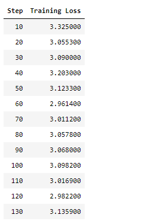
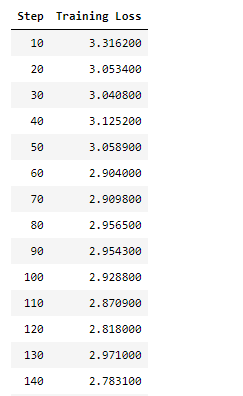

## Prompt Tuning起源

Prompt-Tuning起源于GPT-3，认为超大规模的模型只要配合好合适的模板就可以极大化地发挥其推理和理解能力。

不过以GPT-3为首的这类方法有一个明显的缺陷是，其建立在超大规模的预训练语言模型上 ，此时的模型参数数量通常超过100亿， 在真实场景中很难应用 ，因此众多研究者开始探索GPT-3的这套思路在小规模的语言模型（BERT）上还是否适用？

因此，大名鼎鼎的PET模型问世，PET详细地设计了Prompt-Tuning的重要组件Pattern-Verbalizer-Pair（PVP），基于这套框架，目前的研究开始关注如何选择或构建合适的Pattern和Verbalizer。

这里的Pattern是一种数据增强的方式，一个句子衍生出多个句子，例如：

原始input：我很喜欢北京天安门。

Patterns集成后：我喜欢[MASK]，我喜欢北京[MASK]

Verbalizer是在Patterns集成后，给定多个labels去分类，例如A- A A+，而不是单纯的正负样本。

PVP集成：一个句子生成多个句子，对应多个labels。

如何找到最佳的设计模板呢？人为设计总会有不足，那么不需要显式地指定这些模板中各个token具体是什么，而只需要在语义空间中表示一个向量即可。这样，不同的任务、数据可以自适应地在语义空间中寻找若干合适的向量，来代表模板中的每一个词，相较于显式的token，这类token称为伪标记（Pseudo Token） 。

Prompt Tuning率先提出了伪标记和连续提示的概念，通过算法设计，在训练过程中，每个伪标记以及对应的MLP参数都可以得到训练，对于不同的输入句子 ，这些伪标记对应的embedding也各不相同，达到了预期的目的。

上面的看不懂？没关系，我们进入大白话时间。

从训练的角度看，Prompt Tuning冻结全部参数，在训练前加入一小段Prompt，只训练这个Prompt的向量。在这里设计了两种Prompt的存在形式，一种是hard prompt，一种是soft prompt。

> hard prompt:人为输入的一些约束，例如T5里的在文本处理前加一个“摘要生成”

> soft prompt:不输入约束，让模型自己学

## PEFT简介

PEFT是transformers的得力助手，借助这个工具包可以用非常少的代码实现大模型调优。

截至2023年11月，目前PEFT支持的模型和调优策略如下：

> Causal Language Modeling

| Model        | LoRA | Prefix Tuning  | P-Tuning | Prompt Tuning  | IA3 |
|--------------| ---- | ---- | ---- | ----  | ----  |
| GPT-2        | ✅  | ✅  | ✅  | ✅  | ✅  |
| Bloom        | ✅  | ✅  | ✅  | ✅  | ✅  |
| OPT          | ✅  | ✅  | ✅  | ✅  | ✅  |
| GPT-Neo      | ✅  | ✅  | ✅  | ✅  | ✅  |
| GPT-J        | ✅  | ✅  | ✅  | ✅  | ✅  |
| GPT-NeoX-20B | ✅  | ✅  | ✅  | ✅  | ✅  |
| LLaMA        | ✅  | ✅  | ✅  | ✅  | ✅  |
| ChatGLM      | ✅  | ✅  | ✅  | ✅  | ✅  |

> Conditional Generation

|   Model         | LoRA | Prefix Tuning  | P-Tuning | Prompt Tuning  | IA3 |
| --------- | ---- | ---- | ---- | ---- | ---- |
| T5        | ✅   | ✅   | ✅   | ✅   | ✅   |
| BART      | ✅   | ✅   | ✅   | ✅   | ✅   |

> Sequence Classification

|   Model         | LoRA | Prefix Tuning  | P-Tuning | Prompt Tuning  | IA3 |
| --------- | ---- | ---- | ---- | ----  | ----  |
| BERT           | ✅  | ✅  | ✅  | ✅  |  ✅  |  
| RoBERTa        | ✅  | ✅  | ✅  | ✅  | ✅  |
| GPT-2          | ✅  | ✅  | ✅  | ✅  |   |
| Bloom          | ✅  | ✅  | ✅  | ✅  |   |
| OPT            | ✅  | ✅  | ✅  | ✅  |   |
| GPT-Neo        | ✅  | ✅  | ✅  | ✅  |   |
| GPT-J          | ✅  | ✅  | ✅  | ✅  |   |
| Deberta        | ✅  |     | ✅  | ✅  |   | 
| Deberta-v2     | ✅  |     | ✅  | ✅  |   |

> Token Classification

|   Model         | LoRA | Prefix Tuning  | P-Tuning | Prompt Tuning  | IA3 |
| --------- | ---- | ---- | ---- | ----  | ----  |
| BERT           | ✅  | ✅  |   |   |   |  
| RoBERTa        | ✅  | ✅  |   |   |   |
| GPT-2          | ✅  | ✅  |   |   |   |
| Bloom          | ✅  | ✅  |   |   |   |
| OPT            | ✅  | ✅  |   |   |   |
| GPT-Neo        | ✅  | ✅  |   |   |   |
| GPT-J          | ✅  | ✅  |   |   |   |
| Deberta        | ✅  |     |   |   |   |
| Deberta-v2     | ✅  |     |   |   |   |

> Text-to-Image Generation

|   Model         | LoRA | LoHa | LoKr | Prefix Tuning  | P-Tuning | Prompt Tuning  | IA3 |
| --------- | ---- | ---- | ---- | ---- | ---- | ----  | ----  |
| Stable Diffusion           | ✅  | ✅  | ✅  |  |   |   |

> Image Classification

|   Model         | LoRA | Prefix Tuning  | P-Tuning | Prompt Tuning  | IA3 |
| --------- | ---- | ---- | ---- | ----  | ----  |
| ViT           | ✅  |   |   |   |    | 
| Swin           | ✅  |   |   |   |   |  

> Image to text (Multi-modal models)

|   Model         | LoRA | Prefix Tuning  | P-Tuning | Prompt Tuning  | IA3
| --------- | ---- | ---- | ---- | ----  | ----  |
| Blip-2           | ✅  |   |   |   |   |


> Semantic Segmentation

|   Model         | LoRA | Prefix Tuning  | P-Tuning | Prompt Tuning  | IA3 |
| --------- | ---- | ---- | ---- | ----  | ----  |
| SegFormer           | ✅  |   |   |   |   | 

可以看到，LoRA的支持是最广的，Prompt Tuning，P-Tuning支持差不多。

## Prompt Tuning微调(soft  prompt)

### 前期工作Step1 导入工具包

```python
from datasets import Dataset
from transformers import AutoTokenizer, AutoModelForCausalLM, DataCollatorForSeq2Seq, TrainingArguments, Trainer
```

### 前期工作Step2 加载数据集


```python
dataset = Dataset.load_from_disk('alpaca_data_zh/')
```

### 前期工作Step3 数据预处理


```python
tokenizer = AutoTokenizer.from_pretrained('bloom-1b4-zh/')
```


```python
def process_func(example, MAX_LENGTH = 256):
    input_ids, attention_mask, labels = [], [], []
    instruction = tokenizer("\n".join(['Human: ' + example['instruction'], example['input']]).strip() + '\n\nAssistant: ')
    response = tokenizer(example['output'] + tokenizer.eos_token)
    input_ids = instruction['input_ids'] + response['input_ids']
    attention_mask = instruction['attention_mask'] + response['attention_mask']
    labels = [-100] * len(instruction['input_ids']) + response['input_ids']
    if len(input_ids) > MAX_LENGTH:
        input_ids = input_ids[:MAX_LENGTH]
        attention_mask = attention_mask[:MAX_LENGTH]
        labels = labels[:MAX_LENGTH]
    return {
        'input_ids': input_ids,
        'attention_mask': attention_mask,
        'labels': labels
    }

tokenized_dataset = dataset.map(process_func, remove_columns=dataset.column_names)
```

### 前期工作Step4 导入模型


```python
model = AutoModelForCausalLM.from_pretrained('bloom-1b4-zh/')
```

###  Prompt Tuning

####  PEFT Step1 配置文件


```python
from peft import PromptTuningConfig, get_peft_model, TaskType, PromptTuningInit

# soft prompt
config = PromptTuningConfig(task_type=TaskType.CAUSAL_LM, num_virtual_tokens=10)
```

####  PEFT Step2 创建模型


```python
model = get_peft_model(model, config)
```


```python
model.print_trainable_parameters()
```

    trainable params: 20,480 || all params: 1,303,132,160 || trainable%: 0.0015715980795071467
    
这里模型训练的参数比BitFit更少，仅仅只有总参数量的0.0015%。

### 前期工作Step5 配置训练参数


```python
args = TrainingArguments(
    output_dir = './prompt tuning',
    per_device_train_batch_size=1,
    gradient_accumulation_steps=8,
    logging_steps=10,
    num_train_epochs=1
)
```

### 前期工作Step6 配置trainer


```python
trainer = Trainer(
    args = args,
    train_dataset=tokenized_dataset,
    model = model,
    data_collator = DataCollatorForSeq2Seq(tokenizer=tokenizer, padding=True)
)
```

### 前期工作Step7 模型训练


```python
trainer.train()
```



我们会发现采用soft prompt模型训练的loss下降非常慢，实际上这个训练loss也会收敛，就是需要多训练几个epoch。

## Prompt Tuning微调(hard  prompt)

前期工作都不变，主要更新PEFT步骤：

###  Prompt Tuning

####  PEFT Step1 配置文件

```python
from peft import PromptTuningConfig, get_peft_model, TaskType, PromptTuningInit

# hard prompt
config = PromptTuningConfig(task_type=TaskType.CAUSAL_LM, 
                            prompt_tuning_init=PromptTuningInit.TEXT,
                            prompt_tuning_init_text='我是一个非常勤奋的人。',
                            num_virtual_tokens=len(tokenizer('我是一个非常勤奋的人。')['input_ids']),
                            tokenizer_name_or_path='bloom-1b4-zh/'
                           )
config
```

    PromptTuningConfig(peft_type=<PeftType.PROMPT_TUNING: 'PROMPT_TUNING'>, auto_mapping=None, base_model_name_or_path=None, revision=None, task_type=<TaskType.CAUSAL_LM: 'CAUSAL_LM'>, inference_mode=False, num_virtual_tokens=7, token_dim=None, num_transformer_submodules=None, num_attention_heads=None, num_layers=None, prompt_tuning_init=<PromptTuningInit.TEXT: 'TEXT'>, prompt_tuning_init_text='我是一个非常勤奋的人。', tokenizer_name_or_path='bloom-1b4-zh/')

####  PEFT Step2 创建模型

```python
model = get_peft_model(model, config)
model.print_trainable_parameters()
```

    trainable params: 14,336 || all params: 1,303,126,016 || trainable%: 0.001100123842512557

这里的模型参数更少了，占比只有0.001%。

在训练时，可以明显看到loss下降：




## 训练前后显存变化

| 条件         | 模型参数   | 可训练参数  | 初始显存占用 | 训练显存占用 |
|-------------|--------|--------| -----| -----| 
| baseline    | 1,303,132,160 | 1,303,132,160 | 1.1Gb  | 23.4Gb |
| soft prompt | 1,303,132,160 | 20,480 | 1.1Gb  | 8.4Gb  |
| hard prompt | 1,303,132,160 | 14,336 | 1.1Gb  | 8.2Gb  |


## 加载PEFT微调训练后的模型推理

> 加载

```python
from peft import PeftModel

peft_model = PeftModel.from_pretrained(model=model, model_id='./prompt tuning/checkpoint-750/')
```

> 推理

```python
peft_model = peft_model.cuda()
quesion = '数据分析面试怎么准备'
print('Qustion:', quesion)
ipt = tokenizer('Human: {}\n{}'.format(quesion,'').strip() + '\n\nAssistant: ', return_tensors='pt').to(model.device)
print('AI机器人:', tokenizer.decode(model.generate(**ipt, max_length=256, do_sample=True)[0], skip_special_tokens=True).split('\n\nAssistant: ')[1])
```

