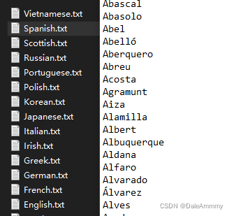
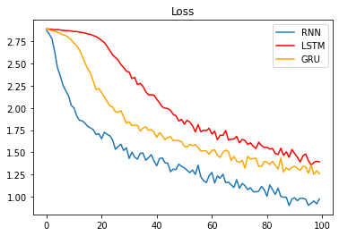
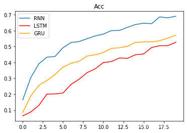
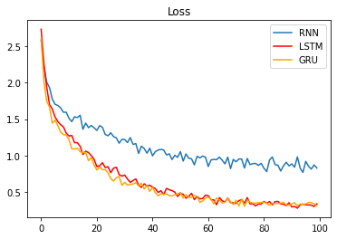
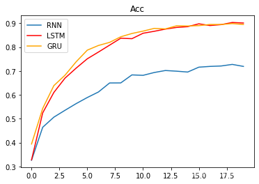

> 项目介绍



这里一共有18个国家的.txt文件，每个文件内包含这个国家的人名。我们要做的就是根据用户的名字来判断他最可能属于哪个国家。比如用户在注册的时候，有时候需要选择国籍，或者推荐手机号国家识别编码，那么准确识别用户国籍可以优化用户体验。

> 函数功能查询表

|  函数名字|功能  |
|--|--|
| unicodeToAscii | 把字符转化为ascii编码 |
|readLines|读取.txt文件内容|
|lineToTensor|人名one-hot编码|
|categoryFromOutput|返回最大概率国家和索引|
|randomTrainingExample|随机生成训练数据|
|trainRNN|RNN训练函数|
|trainLSTM|LSTM训练函数|
|trainGRU|GRU训练函数|
|train|输入模型名词名词进行训练|
|evaluateRNN|RNN预测函数|
|evaluateLSTM|LSTM预测函数|
|evaluateGRU|GRU预测函数|
|predict|输入模型类型进行预测结果输出|

> 导入必备工具包

```python
# io中导入文件打开方法
from io import open
# 帮助使用正则表达式进行子目录查询
import glob
import os
# 用于常见字母及字符规范化
import string
import unicodedata
# 导入随机工具
import random
# 导入时间和数学工具包
import time 
import math
# 导入torch工具
import torch
import torch.nn as nn
# 导入可视化工具
import matplotlib.pyplot as plt
# 进度工具
from tqdm import tqdm
```

> 数据处理

> 文本信息规范化

我们发现，有些国家的人名他不是标准的英文字母，会有上标。所以我们要做的第一件事就是规范化名字。
标准的英文字母可以在ascii码中找到。

```python
# 规定cuda
device = 'cuda' if torch.cuda.is_available() else 'cpu'
# 规定数据路径
data_path = './/data//names//'
# 找到标准ascii码
all_letters = string.ascii_letters + " .,;'"
print(all_letters)
>>>
abcdefghijklmnopqrstuvwxyzABCDEFGHIJKLMNOPQRSTUVWXYZ .,;'
```
然后我们需要定义一个函数把名字里面的所有重音符号去掉，转化为ascii码字符

```python
def unicodeToAscii(s):
    return ''.join(
        c for c in unicodedata.normalize('NFD', s) if unicodedata.category(c) != 'Mn' and c in all_letters
    ) # Mn表示有附加符
```

```python
# 测试
s = 'Baumgärtner'
a = unicodeToAscii(s)
print(a)
>>>
'Baumgartner'
```

然后我们需要定义一个函数，读取所有.txt文件里面的名字，并且转化为标准英文，并且创建一个字典储存不同国家的名字。

```python
def readLines(filename):
    # 读取文件，用strip去除两侧空白符，以换行符进行切分
    lines = open(filename, encoding='utf8').read().strip().split('\n')
    return [unicodeToAscii(line) for line in lines]
```

```python
# 测试
filename = data_path + 'Chinese.txt'
result = readLines(filename)
result[:10]
>>>
['Ang', 'AuYong', 'Bai', 'Ban', 'Bao', 'Bei', 'Bian', 'Bui', 'Cai', 'Cao']
```

```python
category_lines = {}
all_categories = []
for filename in glob.glob(data_path + '*.txt'):
    # Chinese.txt切割成['Chinese','.txt']，取第一个即label
    # os.path.basename(filename)可以得到文件最后的名字例如Chinese.txt，而不是data//names//chinese.txt
    category = os.path.splitext(os.path.basename(filename))[0]
    all_categories.append(category)
    lines = readLines(filename)
    category_lines[category] = lines
```
```python
# 测试
n_categories = len(all_categories)
print(n_categories)
print(category_lines['Chinese'][:10])
>>>
18
['Ang', 'AuYong', 'Bai', 'Ban', 'Bao', 'Bei', 'Bian', 'Bui', 'Cai', 'Cao']
```

> 编码

这里采用one-hot编码。因为所有人名无非是之前定义好的ascii码排列组合，所以维度不会过大，可以采用这种简单编码方式。

```python
def lineToTensor(line):
    # 初始化一个全0张量，形状(len(line), 1, n_letters)
    # torch.zeros(个数，每个的行数，每个的列数)
    tensor = torch.zeros(len(line), 1, n_letters)
    for idx, letter in enumerate(line):
        tensor[idx][0][all_letters.find(letter)] = 1
    return tensor
```

```python
# 测试
line = 'Bai'
line_tensor = lineToTensor(line)
line_tensor
>>>
tensor([[[0., 0., 0., 0., 0., 0., 0., 0., 0., 0., 0., 0., 0., 0., 0., 0., 0.,
          0., 0., 0., 0., 0., 0., 0., 0., 0., 0., 1., 0., 0., 0., 0., 0., 0.,
          0., 0., 0., 0., 0., 0., 0., 0., 0., 0., 0., 0., 0., 0., 0., 0., 0.,
          0., 0., 0., 0., 0., 0.]],

        [[1., 0., 0., 0., 0., 0., 0., 0., 0., 0., 0., 0., 0., 0., 0., 0., 0.,
          0., 0., 0., 0., 0., 0., 0., 0., 0., 0., 0., 0., 0., 0., 0., 0., 0.,
          0., 0., 0., 0., 0., 0., 0., 0., 0., 0., 0., 0., 0., 0., 0., 0., 0.,
          0., 0., 0., 0., 0., 0.]],

        [[0., 0., 0., 0., 0., 0., 0., 0., 1., 0., 0., 0., 0., 0., 0., 0., 0.,
          0., 0., 0., 0., 0., 0., 0., 0., 0., 0., 0., 0., 0., 0., 0., 0., 0.,
          0., 0., 0., 0., 0., 0., 0., 0., 0., 0., 0., 0., 0., 0., 0., 0., 0.,
          0., 0., 0., 0., 0., 0.]]])
```

> 构建RNN系列网络

> RNN网络

```python
 class RNN(nn.Module):
        # rnn (input_size, hidden_size, num_layers), input_size是输入张量的最后一个维度， hidden_size是隐藏层最后一个维度，num_layers代表rnn层数
        # input (1, n_letters) --> (sequence_length输入序列长度(句子长度)，batch_size批次样本数，input_size)
        # h0 （num_layers, batch_zize批次样本数, hidden_size）
        def __init__(self, input_size, hidden_size, output_size, num_layers=1):
            super(RNN, self).__init__()
            self.input_size = input_size
            self.hidden_size = hidden_size
            self.output_size = output_size
            self.num_layers = num_layers
            
            #实例化RNN
            self.rnn = nn.RNN(self.input_size, self.hidden_size, self.num_layers)
            self.linear = nn.Linear(self.hidden_size, self.output_size)
            self.softmax = nn.LogSoftmax(dim = -1)
            
        def forward(self, input1, hidden):
            # input shape: 1 * n_letters --> 1 * 1 * n_letters
            input1 = input1.unsqueeze(0)
            rr, hn = self.rnn(input1, hidden)
            return self.softmax(self.linear(rr)), hn
        
        def initHidden(self):
            # 给h0赋值
            hidden = torch.zeros(self.num_layers, 1, self.hidden_size)
            return hidden
```
> LSTM网络

```python
class LSTM(nn.Module):
    # LSTM (input_size, hidden_size, num_layers), input_size是输入张量的最后一个维度， hidden_size是隐藏层最后一个维度，num_layers代表lstm层数
    # input (sequence_length输入序列长度(句子长度)，batch_size批次样本数，input_size)
    # h0（num_layers, batch_zize批次样本数, hidden_size）
    # c0（num_layers, batch_zize批次样本数, hidden_size）
        def __init__(self, input_size, hidden_size, output_size, num_layers=1):
            super(LSTM, self).__init__()
            self.input_size = input_size
            self.hidden_size = hidden_size
            self.output_size = output_size
            self.num_layers = num_layers
            
            # 实例化LSTM
            self.lstm = nn.LSTM(self.input_size, self.hidden_size, self.num_layers)
            self.linear = nn.Linear(self.hidden_size, self.output_size)
            self.softmax = nn.LogSoftmax(dim = -1)
        
        def forward(self, input1, hidden, c):
            input1 = input1.unsqueeze(0)
            rr, (hn, cn) = self.lstm(input1, (hidden, c))
            return self.softmax(self.linear(rr)), hn, cn
    
        def initHiddenAndC(self):
        # 对LSTM来说要同时初始化hidden和细胞状态c，hidden和c形状保持一致
            c = hidden = torch.zeros(self.num_layers, 1, self.hidden_size)
            return c, hidden
```

> GRU网络

```python
class GRU(nn.Module):
    def __init__(self, input_size, hidden_size, output_size, num_layers=1):
        super(GRU, self).__init__()
        self.input_size = input_size
        self.hidden_size = hidden_size
        self.output_size = output_size
        self.num_layers = num_layers
        
        # 实例化GRU
        self.gru = nn.GRU(input_size, hidden_size, num_layers)
        self.linear = nn.Linear(hidden_size, output_size)
        self.softmax = nn.LogSoftmax(dim = -1)
        
    def forward(self, x, hidden):
        x = x.unsqueeze(0)
        x, hidden = self.gru(x, hidden)
        x = self.softmax(self.linear(x))
        return x, hidden
    
    def initHidden(self):
        # 给h0赋值
        hidden = torch.zeros(self.num_layers, 1, self.hidden_size)
        return hidden
```

> 构建模型训练

RNN模型出来是一个(1, 18)列表，表示这个名字对应18个国家的概率，所以要选择概率最大的一个

```python
# 从Softmax函数中选择最大的值
def categoryFromOutput(output):
    top_n, top_i = output.topk(1) # top_n返回最大值, top_i返回最大值索引
    category_i = top_i[0].item()
    return all_categories[category_i], category_i
```
为了训练效果更好，随机生成训练数据
```python
def randomTrainingExample():
    # 使用random.choice从all_categories随机选择一个类别
    category = random.choice(all_categories)
    # 然后再通过category_lines字典取category类别对应名字列表，再随机选一个名字
    line = random.choice(category_lines[category])
    category_tensor = torch.tensor([all_categories.index(category)], dtype =torch.long)
    # 将随机取到的名字通过函数lineToTensor转化为onthot张量表示
    line_tensor = lineToTensor(line)
    return category, line, category_tensor, line_tensor
```

> RNN训练函数

```python
# RNN最后一层是nn.LogSoftmax与nn.NLLLoss损失函数相匹配
# RNN最后一层是nn.LogSoftmax与nn.NLLLoss损失函数相匹配
criterion = nn.NLLLoss()
learning_rate = 0.005
def trainRNN(category_tensor, line_tensor):
    # 初始化隐藏层张量
    hidden = rnn.initHidden().to(device)
    # 梯度归零
    rnn.zero_grad()
    line_tensor = line_tensor.to(device)
    category_tensor = category_tensor.to(device)
    # 将训练数据line_tensor逐个传入rnn中，hidden迭代更新，得到最终结果
    for i in range(line_tensor.size()[0]):
        output, hidden = rnn(line_tensor[i], hidden)
    # 最终输出output为三维张量，为了满足要求需要squeeze(0)
    loss = criterion(output.squeeze(0), category_tensor)
    # 反向传播
    loss.backward()
    for p in rnn.parameters():
        # 将参数的张量表示与参数的梯度进行乘法运算并乘以学习率，结果家到参数上并进行覆盖更新(下划线add_)
        p.data.add_(p.grad.data, alpha=-learning_rate)
    return output, loss.item()
```
> LSTM训练函数

```python
def trainLSTM(category_tensor, line_tensor):
    hidden, c = lstm.initHiddenAndC()
    hidden = hidden.to(device)
    c = c.to(device)
    lstm.zero_grad()
    line_tensor = line_tensor.to(device)
    category_tensor = category_tensor.to(device)
    for i in range(line_tensor.size()[0]):
        output, hidden, c = lstm(line_tensor[i], hidden, c)
    loss = criterion(output.squeeze(0), category_tensor)
    loss.backward()
    for p in lstm.parameters():
        p.data.add_(p.grad.data, alpha=-learning_rate)
    return output, loss.item()
```

> GRU训练函数

```python
def trainGRU(category_tensor, line_tensor):
    hidden = gru.initHidden()
    hidden = hidden.to(device)
    gru.zero_grad()
    line_tensor = line_tensor.to(device)
    category_tensor = category_tensor.to(device)
    for i in range(line_tensor.size()[0]):
        output, hidden = gru(line_tensor[i], hidden)
    loss = criterion(output.squeeze(0), category_tensor)
    loss.backward()
    for p in gru.parameters():
        p.data.add_(p.grad.data, alpha=-learning_rate)
    return output, loss.item()
```

> 训练模型

```python
# 设置训练迭代次数
n_iters = 100000
# 设置结果打印时间间隔
print_every = 5000
# 设置绘制损失曲线上的制图间隔
plot_every = 1000
def train(train_type_fn):
    all_losses = []
    all_acc = []
    start = time.time()
    current_loss = 0
    current_acc = 0
    for iter in tqdm(range(1, n_iters + 1)):
        category, line, category_tensor, line_tensor = randomTrainingExample()
        output, loss = train_type_fn(category_tensor, line_tensor)
        current_loss += loss
        guess, guess_i = categoryFromOutput(output)
        current_acc += 1 if guess == category else 0
        
        if iter % print_every == 0:
            all_acc.append(current_acc / print_every)
            current_acc = 0
            
        if iter % plot_every == 0:
            all_losses.append(current_loss / plot_every)
            current_loss = 0
                
    return all_losses, all_acc, int(time.time() - start)
```

```python
# 调用train函数，分别进行RNN, LSTM, GRU模型的训练, 并返回各自的全部损失，以及训练耗时用于制图
print('**'*20, 'RNN','**'*20)
all_losses1, acc1, period1 = train(trainRNN)
print('**'*20, 'LSTM','**'*20)
all_losses2, acc2, period2 = train(trainLSTM)
print('**'*20, 'GRU','**'*20)
all_losses3, acc3, period3 = train(trainGRU)

plt.figure(0)
plt.plot(all_losses1, label='RNN')
plt.plot(all_losses2, color='red', label='LSTM')
plt.plot(all_losses3, color='orange', label='GRU')
plt.legend(loc='best')

plt.figure(1)
x_data = ['RNN', 'LSTM', 'GRU']
y_data = [period1, period2, period3]
plt.bar(range(len(x_data)), y_data, tick_label=x_data)

plt.figure(2)
plt.plot(acc1, label='RNN')
plt.plot(acc2, color='red', label='LSTM')
plt.plot(acc3, color='orange', label='GRU')
plt.legend(loc='best')
```

> 结果分析

> 训练效果可视化分析





模型损失降低快慢代表模型收敛程度。在这个demo中RNN>GRU>LSTM。并且训练时间RNN<GRU<LSTM。这是因为当前数据是人名，他们的长度有限，且长距离字母基本无特定关联，因此无法发挥改进模型LSTM和GRU的长距离捕捉语义关联的优势。所以在以后的模型选用时，要通过对任务的分析以及实验对比，选择最适合的模型，而**不是越先进越复杂的模型表现越好**。

> 构建RNN评估函数

```python
def evaluateRNN(line_tensor):
    # 评估函数和训练函数逻辑相同，参数是line_tensor代表名字的张量
    hidden = rnn.initHidden()
    hidden = hidden.to(device)
    line_tensor = line_tensor.to(device)
    for i in range(line_tensor.size()[0]):
        output, hidden = rnn(line_tensor[i], hidden)
    return output.squeeze(0)
```
> 构建LSTM评估函数

```python
def evaluateLSTM(line_tensor):
    hidden, c = lstm.initHiddenAndC()
    hidden = hidden.to(device)
    c = c.to(device)
    line_tensor = line_tensor.to(device)
    for i in range(line_tensor.size()[0]):
        output, hidden, c = lstm(line_tensor[i], hidden, c)
    return output.squeeze(0)
```

> 构建GRU评估函数

```python
def evaluateGRU(line_tensor):
    hidden = gru.initHidden()
    hidden = hidden.to(device)
    line_tensor = line_tensor.to(device)
    for i in range(line_tensor.size()[0]):
        output, hidden = gru(line_tensor[i], hidden)
    return output.squeeze(0)
```

> 预测函数
最终的预测就非常简单了，把编码后的名字输入到模型中，模型通过训练好的参数进训练，通过topk找到softmax输出概率最大的那个。
```python
def predict(input_line, evaluate_fn, n_predictions = 3): # 输出最有可能的三个国家，可以更改参数为概率最大的1个国家、k个国家
    print('\n %s' % input_line)
    
    # 不更新模型参数
    with torch.no_grad():
        output = evaluate_fn(lineToTensor(input_line))
        
        # 从预测的输出中取前3个最大值及索引
        topv, topi = output.topk(n_predictions)
        predictions = []
        for i in range(n_predictions):
            value = topv[0][i].item()
            category_index = topi[0][i].item()
            print('(%2.f) %s' % (value, all_categories[category_index]))
            predictions.append([value, all_categories[category_index]])
```

```python
for evaluate_fn in  [evaluateRNN, evaluateLSTM, evaluateGRU]:
    print('-'*20, evaluate_fn, '-'*20)
    predict('Dovesky', evaluate_fn)
    predict('Jackson', evaluate_fn)
    predict('Satoshi', evaluate_fn)
>>>
-------------------- <function evaluateRNN at 0x000002355030D310> --------------------

 Dovesky
(-0) Russian
(-2) Czech
(-4) Polish

 Jackson
(-0) Scottish
(-2) Polish
(-3) Greek

 Satoshi
(-0) Japanese
(-3) Polish
(-3) Italian
-------------------- <function evaluateLSTM at 0x000002355030D280> --------------------

 Dovesky
(-1) Russian
(-2) Czech
(-2) English

 Jackson
(-0) Scottish
(-2) English
(-3) Russian

 Satoshi
(-0) Japanese
(-1) Arabic
(-3) Italian
-------------------- <function evaluateGRU at 0x00000235502C7CA0> --------------------

 Dovesky
(-0) Russian
(-2) Czech
(-3) Polish

 Jackson
(-1) Scottish
(-2) Russian
(-2) English

 Satoshi
(-0) Japanese
(-2) Arabic
(-2) Polish
```
> 总结、调优思路、实现方法及效果分析

本项目把RNN系列所有的模型都在分类的下游任务进行了一次实践。由于人名只是短序列，而且并没有强语义关联，所以RNN表现力压LSTM，GRU这种后起之秀。10万轮次训练准确率在70%，但是这并不是不可以优化。
优化的方向有：

- 这里梯度下降我们选择的是最原始的办法，实际上Adam和SGD优化器会更好，我们以Adam训练10万轮次为例：





这个时候GRU和LSTM表现出来的优势已经远远大于RNN，准确率达到了90%。

- 学习率衰减。可以使用余弦退火的策略，[知乎：pytorch实现余弦退火](https://zhuanlan.zhihu.com/p/261134624)，简单一点可以直接设置每10000轮学习率衰减为90%。
- 提前停止。设置一个阈值，如果效果提高低于阈值，则自动停止训练，这样可以避免过拟合。
- 数据增强。我们并没有对数据的分布做更细致的分析，如果我们去做一个长度分析，可以知道某些国家的名字通常长度会更长，这可以做一个规则去约束，这种思想在后面介绍的实体命名识别NER任务中会再次提到。