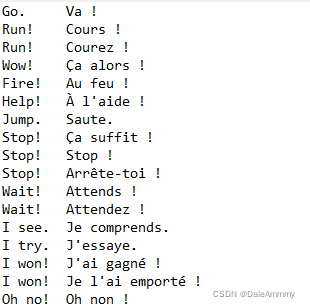
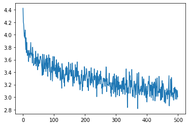
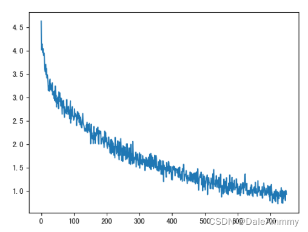

> 项目介绍

这里有一份英译法的数据集，我们要做的就是学习这个数据集，生成一个英译法的翻译器。为了简化，我们就训练一个很简单的主语+be动词结构的句子翻译。



在开始写代码前，需要对seq2seq任务做一个分析。本质上seq2seq有两部分，第一部分是输入文字的编码过程(encode)，第二部分是编码向量的解码过程(decode)。例如我们输入一个句子，“我爱你”，经过编码器的编码，到解码器端，第一个解码单词“I”，然后会把I作为输入，送入下一个单元解码，解码出来是“love”，然后继续把编码向量和“love”解码隐层一起送入下一个单元解码得到“you”。注意，这个时候重复上述过程，会解码得到“EOS”，我们把EOS作为一个截至符，一旦解码出现EOS则默认这个句子已经被翻译完成（新的序列生成完成）。在整个过程中，如果不解码得到EOS就会一直重复这个过程。回到解码出来的答案上，其本质也是一个分类任务，因为我们总是会选择概率最大的单词作为解码出来的单词。好了，流程梳理完成，开始代码实现。

> 函数功能查阅表

|函数|功能  |
|--|--|
|unicodeToAscii  | 把英文字母转化为规范的ascii编码字母 |
|normalizeString  | 所有字母都转化为小写，把不识别的字符都转化为空格 |
|readLangs  | 读取数据，返回英文、法文和组合 |
|filterPair  | 语言对过滤函数 |
|filterPairs  | 多个语言对过滤函数 |
|prepareData  | 完成对自然语言的word2index映射 |
|tensorFromSentence  | 将文本句子转换为张量 |
|tensorsFromPair  | 将语言对转换为张量对 |
|train  | 训练函数 |
|trainIters  | 迭代训练函数 |

> 导入必备工具包

```python
# 从io工具包导入open方法
from io import open
# 用于字符规范化
import unicodedata
# 用于正则表达式
import re
# 用于随机生成数据
import random
# 用于构建网络结构和函数的torch工具包
import torch
import torch.nn as nn
import torch.nn.functional as F
from torch import optim
from tqdm import tqdm
import matplotlib.pyploy as plt
device = torch.device("cuda" if torch.cuda.is_available() else "cpu")
# 起始标志
SOS_token = 0
# 结束标志
EOS_token = 1
# 数据路径
data_path = './data/eng-fra.txt'
```

> 数据处理

数据处理思路一：字符串-->数值-->稠密矩阵(word2vec, word embedding)-->模型

数据处理思路二：字符串-->ont-hot编码-->模型

这里如果使用one-hot编码，那么随着句子复杂度提高，矩阵的储存会越来越麻烦，所以不应选择稀疏矩阵，转而选择稠密矩阵。

> 字符规范化


```python
def unicodeToAscii(s):
    return ''.join(
        c for c in unicodedata.normalize('NFD', s)
        if unicodedata.category(c) != 'Mn'
    )
    
def normalizeString(s):
    """字符串规范化函数, 参数s代表传入的字符串"""
    # 使字符变为小写并去除两侧空白符, z再使用unicodeToAscii去掉重音标记
    s = unicodeToAscii(s.lower().strip())
    # 在.!?前加一个空格
    s = re.sub(r"([.!?])", r" \1", s)
    # 使用正则表达式将字符串中不是大小写字母和正常标点的都替换成空格
    s = re.sub(r"[^a-zA-Z.!?]+", r" ", s)
    return s
```

```python
# 测试
s = "Are you kidding me?"
# 调用验证
nsr = normalizeString(s)
print(nsr)
>>>
are you kidding me ?
```

> 读取数据

```python
# 源文件格式：每行：英文\t法文。l.split('\t')可以把一行分词英文和法文两部分。
def readLangs(lang1, lang2): # lang1是源语言名字，lang2是目标语言名字
    lines = open(data_path, encoding = 'utf8').read().strip().split('\n')
    pairs = [[normalizeString(s) for s in l.split('\t')] for l in lines]
    input_lang = Lang(lang1)
    output_lang = Lang(lang2)
    return input_lang, output_lang, pairs
```

> 筛选我们需要的主语+be动词简单句

```python
# 设置组成句子中单词或标点的最多个数
MAX_LENGTH = 10

# 选择带有指定前缀的语言特征数据作为训练数据
eng_prefixes = (
    "i am ", "i m ",
    "he is", "he s ",
    "she is", "she s ",
    "you are", "you re ",
    "we are", "we re ",
    "they are", "they re "
)

def filterPair(p):
    """语言对过滤函数, 参数p代表输入的语言对, 如['she is afraid.', 'elle malade.']"""
    # p[0]代表英语句子，对它进行划分，它的长度应小于最大长度MAX_LENGTH并且要以指定的前缀开头
    # p[1]代表法文句子, 对它进行划分，它的长度应小于最大长度MAX_LENGTH
    return len(p[0].split(' ')) < MAX_LENGTH and p[0].startswith(eng_prefixes) and len(p[1].split(' ')) < MAX_LENGTH 

def filterPairs(pairs):
    """对多个语言对列表进行过滤, 参数pairs代表语言对组成的列表, 简称语言对列表"""
    # 函数中直接遍历列表中的每个语言对并调用filterPair即可
    return [pair for pair in pairs if filterPair(pair)]
```

```python
input_lang, output_lang, pairs = prepareData('eng', 'fra')
fpairs = filterPairs(pairs)
print("过滤后的pairs前五个:", fpairs[:5])
>>>
过滤后的pairs前五个: [['i m .', 'j ai ans .'], ['i m ok .', 'je vais bien .'], ['i m ok .', 'ca va .'], ['i m fat .', 'je suis gras .'], ['i m fat .', 'je suis gros .']]
```

> 编码

```python
class Lang:
    def __init__(self, name):
        self.name = name
        self.word2index = {}
        self.index2word = {0:'SOS', 1:'EOS'}
        self.n_words = 2 # 0和1已经被开始和结束占用了
        
    def addSentence(self, sentence):
        for word in sentence.split(' '):
            self.addWord(word)
            
    def addWord(self, word):
        # 首先判断word是否已经在self.word2index字典的key中
        if word not in self.word2index:
            # 如果不在，则将这个词加入其中，并为他对应一个数值，即self.n_words
            self.word2index[word] = self.n_words
            # 同时也将他的反转形式加入到self.index2word中
            self.index2word[self.n_words] = word
            # 更新self.n_words
            self.n_words += 1
```

```python
def prepareData(lang1, lang2):
    """数据准备函数, 完成将所有字符串数据向数值型数据的映射以及过滤语言对
       参数lang1, lang2分别代表源语言和目标语言的名字"""
    # 首先通过readLangs函数获得input_lang, output_lang对象，以及字符串类型的语言对列表
    input_lang, output_lang, pairs = readLangs(lang1, lang2)
    # 对字符串类型的语言对列表进行过滤操作
    pairs = filterPairs(pairs)
    # 对过滤后的语言对列表进行遍历
    for pair in pairs:
        # 并使用input_lang和output_lang的addSentence方法对其进行数值映射
        input_lang.addSentence(pair[0])
        output_lang.addSentence(pair[1])
    # 返回数值映射后的对象, 和过滤后语言对
    return input_lang, output_lang, pairs
```

```python
# 调用验证
input_lang, output_lang, pairs = prepareData('eng', 'fra')
print("input_n_words:", input_lang.n_words)
print("output_n_words:", output_lang.n_words)
print(random.choice(pairs))
>>>
input_n_words: 2803
output_n_words: 4345
['i m disappointed .', 'je suis decu .']
```
现在已经把所有的字符都储存在了word2index字典中，接下来我们就读取这个编码，把所有自然语言转化为张量。

```python
def tensorFromSentence(lang, sentence):
    """将文本句子转换为张量, 参数lang代表传入的Lang的实例化对象, sentence是预转换的句子"""
    # 对句子进行分割并遍历每一个词汇, 然后使用lang的word2index方法找到它对应的索引
    # 这样就得到了该句子对应的数值列表
    indexes = [lang.word2index[word] for word in sentence.split(' ')]
    # 然后加入句子结束标志
    indexes.append(EOS_token)
    # 将其使用torch.tensor封装成张量, 并改变它的形状为nx1, 以方便后续计算
    return torch.tensor(indexes, dtype=torch.long, device=device).view(-1, 1)

def tensorsFromPair(pair):
    """将语言对转换为张量对, 参数pair为一个语言对"""
    # 调用tensorFromSentence分别将源语言和目标语言分别处理，获得对应的张量表示
    input_tensor = tensorFromSentence(input_lang, pair[0])
    target_tensor = tensorFromSentence(output_lang, pair[1])
    # 最后返回它们组成的元组
    return (input_tensor, target_tensor)
```
此时，我们只需要通过tensorsFromPair函数就能把英-法语言对编码成对应机器识别的数字语言。

> 撰写GRU encoder

在人名分类识别任务中，我们用one-hot编码，所以每一个输入的字符编码维度都是一致的；这里我们直接映射的话每一个单词其实就只有一维。所以这里使用nn.embedding的映射方式，统一词向量维度。

```python
class EncoderRNN(nn.Module):
    def __init__(self, input_size, hidden_size):
        super().__init__()
        self.hidden_size = hidden_size
        self.embedding = nn.Embedding(input_size, hidden_size)
        self.gru = nn.GRU(hidden_size, hidden_size)
    
    def forward(self, x, h):
        x = self.embedding(x).view(1,1,-1)
        x, h = self.gru(x, h)
        return x, h
    
    def initHidden(self):
        """初始化隐层张量函数"""
        # 将隐层张量初始化成为1x1xself.hidden_size大小的0张量
        return torch.zeros(1, 1, self.hidden_size, device=device)
```
我们把每一个单词输入到编码器中，经过embedding和view操作变成[1,1,embedding_dim]的形状，这主要是因为gru要求输入三维张量。然后把词嵌入后的x放到gru网络中即可。当然这里的input_size应该是英文文本的词总数。

```python
# 实例化参数并输入
hidden_size = 256
input_size = input_lang.n_words
pair_tensor = tensorsFromPair(pairs[0])
# pair_tensor[0]代表源语言即英文的句子，pair_tensor[0][0]代表句子中的第一个词
input1 = pair_tensor[0][0]
# 初始化第一个隐层张量，1x1xhidden_size的0张量
hidden = torch.zeros(1, 1, hidden_size).to(device)
encoder = EncoderRNN(input_size, hidden_size).to(device)
encoder_output, hidden = encoder(input1, hidden)
print(encoder_output.shape)
>>>
torch.Size([1, 1, 256])
```
也就是说，现在经过我们的解码器，每一个词向量都被解码成了[1,1,hidden_size]的形状。这将作为我们解码器的输入形状。

> 撰写GRU decoder

在撰写框架前，我们要再次强调这个decoder过程。首先解码器输入向量是编码器的输出向量，维度是[1,1,hidden_size]。解码器的输出维度应该是[1,1,output_size]，这里的output_size应该等于法语词典总次数，因为本质上这是一个分类任务，我们只需要在所有单词中找到概率最大的那个单词即可。

```python
class DecoderRNN(nn.Module):
    def __init__(self, hidden_size, output_size):
        super().__init__()
        self.hidden_size = hidden_size
        self.output_size = output_size
        self.embedding = nn.Embedding(output_size, hidden_size)
        self.gru = nn.GRU(hidden_size, hidden_size)
        self.fc = nn.Linear(hidden_size, output_size)
        self.softmax = nn.LogSoftmax(dim=1)
    
    def forward(self, x,h):
        x = self.embedding(x).view(1,1,-1)
        x = F.relu(x)
        x, h = self.gru(x, h)
        x = self.softmax(self.fc(x[0]))
        return x,h
    
    def initHidden(self):
        """初始化隐层张量函数"""
        # 将隐层张量初始化成为1x1xself.hidden_size大小的0张量
        return torch.zeros(1, 1, self.hidden_size, device=device)
```

```python
# 测试
hidden_size = 256
output_size = 20
input1 = pair_tensor[1][0]
hidden = torch.zeros(1,1,hidden_size).to(device)
decoder = DecoderRNN(hidden_size,output_size).to(device)
output, hidden = decoder(input1, hidden)
print(output.shape)
>>>
torch.Size([1, 20])
```
至此，我们已经完成了GRU解码器的撰写。

> 训练模型

这里我们要引入一个teacher forcing的技巧。因为在最开始训练，我们的准确率肯定很低，但是seq2seq任务有一个非常显著的特点，就是他会一步错步步错。所以在训练过程中我们需要在一些关键的时候给他强制拉回正确的轨道。这个过程就是teacher forcing过程。实现起来也非常简单，设置一个阈值，再设置一个随机数，如果超过这个阈值，不管预测出来是什么答案，都给他强行矫正为正确答案。

```python
# 设置teacher_forcing比率为0.5
teacher_forcing_ratio = 0.5

def train(input_tensor, target_tensor, encoder, decoder, encoder_optimizer, decoder_optimizer, criterion, max_length=MAX_LENGTH):
    """训练函数, 输入参数有8个, 分别代表input_tensor：源语言输入张量，target_tensor：目标语言输入张量，encoder, decoder：编码器和解码器实例化对象
       encoder_optimizer, decoder_optimizer：编码器和解码器优化方法，criterion：损失函数计算方法，max_length：句子的最大长度"""
    # 初始化隐层张量
    encoder_hidden = encoder.initHidden()
    # 初始化解码器的隐层张量即编码器的隐层输出
    decoder_hidden = encoder_hidden

    # 编码器和解码器优化器梯度归0
    encoder_optimizer.zero_grad()
    decoder_optimizer.zero_grad()
    
    # 根据源文本和目标文本张量获得对应的长度
    input_length = input_tensor.size(0)
    target_length = target_tensor.size(0)
    
    # 初始化编码器输出张量，形状是(max_length, encoder.hidden_size)的0张量
    encoder_outputs = torch.zeros(max_length, encoder.hidden_size, device=device)
    
    # 初始设置损失为0
    loss = 0

    # 循环遍历输入张量索引
    for ei in range(input_length):
        # print('ei------', ei)
        # 根据索引从input_tensor取出对应的单词的张量表示，和初始化隐层张量一同传入encoder对象中
        encoder_output, encoder_hidden = encoder(input_tensor[ei], encoder_hidden)
        
        # 输出形状为[1, 1, hidden_size], 所以下面直接来[0, 0]进行提取
        # 将每次获得的输出encoder_output(三维张量), 使用[0, 0]降两维变成向量依次存入到encoder_outputs
        # 这样encoder_outputs每一行存的都是对应的句子中每个单词通过编码器的输出结果
        encoder_outputs[ei] = encoder_output[0, 0]
        
    # 初始化解码器的第一个输入，即起始符
    decoder_input = torch.tensor([[SOS_token]], device=device)
        
    # 根据随机数与teacher_forcing_ratio对比判断是否使用teacher_forcing
    use_teacher_forcing = True if random.random() < teacher_forcing_ratio else False
        
        # 如果使用teacher_forcing
    if use_teacher_forcing:
        # 循环遍历目标张量索引
        for di in range(target_length):
            # 将decoder_input, decoder_hidden, encoder_outputs即attention中的QKV, 
            # 传入解码器对象, 获得decoder_output, decoder_hidden, decoder_attention
            decoder_output, decoder_hidden = decoder(decoder_input, decoder_hidden)
            # 因为使用了teacher_forcing, 无论解码器输出的decoder_output是什么, 我们都只
            # 使用‘正确的答案’，即target_tensor[di]来计算损失
            loss += criterion(decoder_output, target_tensor[di])
            # 并强制将下一次的解码器输入设置为‘正确的答案’
            decoder_input = target_tensor[di]  

    else:
        # 如果不使用teacher_forcing
        # 仍然遍历目标张量索引
        for di in range(target_length):
            # 将decoder_input, decoder_hidden, encoder_outputs传入解码器对象
            # 获得decoder_output, decoder_hidden, decoder_attention
            decoder_output, decoder_hidden = decoder(decoder_input, decoder_hidden)
            # 只不过这里我们将从decoder_output取出答案
            topv, topi = decoder_output.topk(1)
            # 损失计算仍然使用decoder_output和target_tensor[di]
            loss += criterion(decoder_output, target_tensor[di])
            # 最后如果输出值是终止符，则循环停止
            if topi.squeeze().item() == EOS_token:
                break
            # 否则，并对topi降维并分离赋值给decoder_input以便进行下次运算
            # 这里的detach的分离作用使得这个decoder_input与模型构建的张量图无关，相当于全新的外界输入
            decoder_input = topi.squeeze().detach()


    # 误差进行反向传播
    loss.backward()
    # 编码器和解码器进行优化即参数更新
    encoder_optimizer.step()
    decoder_optimizer.step()

    # 最后返回平均损失
    return loss.item() / target_length
```

```python
def trainIters(encoder, decoder, n_iters, print_every=1000, plot_every=100, learning_rate=0.01):
    """训练迭代函数, 输入参数有6个，分别是encoder, decoder: 编码器和解码器对象，
       n_iters: 总迭代步数, print_every:打印日志间隔, plot_every:绘制损失曲线间隔, learning_rate学习率"""
    # 每个损失间隔的平均损失保存列表，用于绘制损失曲线
    plot_losses = []

    # 每个打印日志间隔的总损失，初始为0
    print_loss_total = 0  
    # 每个绘制损失间隔的总损失，初始为0
    plot_loss_total = 0  

    # 使用预定义的SGD作为优化器，将参数和学习率传入其中
    encoder_optimizer = optim.Adam(encoder.parameters(), lr=learning_rate)
    decoder_optimizer = optim.Adam(decoder.parameters(), lr=learning_rate)

    # 选择损失函数
    criterion = nn.NLLLoss()

    # 根据设置迭代步进行循环
    for iter in tqdm(range(1, n_iters + 1)):
        # 每次从语言对列表中随机取出一条作为训练语句
        training_pair = tensorsFromPair(random.choice(pairs))
        # 分别从training_pair中取出输入张量和目标张量
        input_tensor = training_pair[0]
        target_tensor = training_pair[1]

        # 通过train函数获得模型运行的损失
        loss = train(input_tensor, target_tensor, encoder, decoder, encoder_optimizer, decoder_optimizer, criterion)
        # 将损失进行累和
        print_loss_total += loss
        plot_loss_total += loss

        # 当迭代步达到日志打印间隔时
        if iter % print_every == 0:
            # 通过总损失除以间隔得到平均损失
            print_loss_avg = print_loss_total / print_every
            # 将总损失归0
            print_loss_total = 0

        # 当迭代步达到损失绘制间隔时
        if iter % plot_every == 0:
            # 通过总损失除以间隔得到平均损失
            plot_loss_avg = plot_loss_total / plot_every
            # 将平均损失装进plot_losses列表
            plot_losses.append(plot_loss_avg)
            # 总损失归0
            plot_loss_total = 0

    # 绘制损失曲线
    plt.figure()  
    plt.plot(plot_losses)
    # 保存到指定路径
    plt.savefig("./s2s_loss.png")
```

> 效果分析



经过5万轮次训练，模型损失在3.0，仍然是比较高的。这是因为1、文本比较简单；2、GRU模型本身的能力有限。所以，接下来我们要进行调优。

> 调优

> 引入Attention机制做解码器

Attention机制的原理会在[这个文档](https://blog.csdn.net/D_Ddd0701/article/details/122506622?spm=1001.2014.3001.5501)中讲解。简单来说，attention机制就是可以更加强的捕捉到一个句子的语义关联。这里我们把解码器做一个修改，使用以下方式的注意力机制。
$$Attention(Q,K,V) = softmax(\frac{QK^T}{\sqrt {d_t}})V$$

```python
class AttnDecoderRNN(nn.Module):
    def __init__(self, hidden_size, output_size, dropout_p=0.1, max_length=MAX_LENGTH):
        """初始化函数中的参数有4个, hidden_size代表解码器中GRU的输入尺寸，也是它的隐层节点数
           output_size代表整个解码器的输出尺寸, 也是我们希望得到的指定尺寸即目标语言的词表大小
           dropout_p代表我们使用dropout层时的置零比率，默认0.1, max_length代表句子的最大长度"""
        super(AttnDecoderRNN, self).__init__()
        # 将以下参数传入类中
        self.hidden_size = hidden_size
        self.output_size = output_size
        self.dropout_p = dropout_p
        self.max_length = max_length

        # 实例化一个Embedding层, 输入参数是self.output_size和self.hidden_size
        self.embedding = nn.Embedding(self.output_size, self.hidden_size)
        self.attn = nn.Linear(self.hidden_size * 2, self.max_length)
        self.attn_combine = nn.Linear(self.hidden_size * 2, self.hidden_size)
        # 实例化一个nn.Dropout层，并传入self.dropout_p
        self.dropout = nn.Dropout(self.dropout_p)
        # 实例化nn.GRU, 它的输入和隐层尺寸都是self.hidden_size
        self.gru = nn.GRU(self.hidden_size, self.hidden_size)
        # 实例化gru后面的线性层，也就是我们的解码器输出层.
        self.out = nn.Linear(self.hidden_size, self.output_size)


    def forward(self, input, hidden, encoder_outputs):
        """forward函数的输入参数有三个, 分别是源数据输入张量, 初始的隐层张量, 以及解码器的输出张量"""

        embedded = self.embedding(input).view(1, 1, -1)
        # 使用dropout进行随机丢弃，防止过拟合
        embedded = self.dropout(embedded)
        
        # 将Q，K进行纵轴拼接, 做一次线性变化, 最后使用softmax处理获得结果
        attn_weights = F.softmax(self.attn(torch.cat((embedded[0], hidden[0]), 1)), dim=1)

        # 第一步的后半部分, 将得到的权重矩阵与V做矩阵乘法计算, 当二者都是三维张量且第一维代表为batch条数时, 则做bmm运算
        attn_applied = torch.bmm(attn_weights.unsqueeze(0),encoder_outputs.unsqueeze(0))

        # 第二步, 通过取[0]是用来降维, 根据第一步采用的计算方法, 需要将Q与第一步的计算结果再进行拼接
        output = torch.cat((embedded[0], attn_applied[0]), 1)

        # 第三步, 使用线性层作用在第三步的结果上做一个线性变换并扩展维度，得到输出
        output = self.attn_combine(output).unsqueeze(0)

        # attention结构的结果使用relu激活
        output = F.relu(output)

        # 将激活后的结果作为gru的输入和hidden一起传入其中
        output, hidden = self.gru(output, hidden)

        # 最后将结果降维并使用softmax处理得到最终的结果
        output = F.log_softmax(self.out(output[0]), dim=1)
        # 返回解码器结果，最后的隐层张量以及注意力权重张量
        return output, hidden, attn_weights

    def initHidden(self):
        """初始化隐层张量函数"""
        # 将隐层张量初始化成为1x1xself.hidden_size大小的0张量
        return torch.zeros(1, 1, self.hidden_size, device=device)
```
同样训练函数也需要做一定修改

```python
# 设置teacher_forcing比率为0.5
teacher_forcing_ratio = 0.5


def train(input_tensor, target_tensor, encoder, decoder, encoder_optimizer, decoder_optimizer, criterion, max_length=MAX_LENGTH):
    """训练函数, 输入参数有8个, 分别代表input_tensor：源语言输入张量，target_tensor：目标语言输入张量，encoder, decoder：编码器和解码器实例化对象
       encoder_optimizer, decoder_optimizer：编码器和解码器优化方法，criterion：损失函数计算方法，max_length：句子的最大长度"""

    # 初始化隐层张量
    encoder_hidden = encoder.initHidden()
    decoder_hidden = encoder_hidden

    # 编码器和解码器优化器梯度归0
    encoder_optimizer.zero_grad()
    decoder_optimizer.zero_grad()

    input_length = input_tensor.size(0)
    target_length = target_tensor.size(0)
     

    # 初始化编码器输出张量，形状是max_lengthxencoder.hidden_size的0张量
    encoder_outputs = torch.zeros(max_length, encoder.hidden_size, device=device)

    # 初始设置损失为0
    loss = 0

    # 循环遍历输入张量索引
    for ei in range(input_length):
        # print('ei------', ei)
        # 根据索引从input_tensor取出对应的单词的张量表示，和初始化隐层张量一同传入encoder对象中
        encoder_output, encoder_hidden = encoder(
            input_tensor[ei], encoder_hidden)
        encoder_outputs[ei] = encoder_output[0, 0]

    decoder_input = torch.tensor([[SOS_token]], device=device)
    use_teacher_forcing = True if random.random() < teacher_forcing_ratio else False

    if use_teacher_forcing:
        for di in range(target_length):
            # 将decoder_input, decoder_hidden, encoder_outputs即attention中的QKV
            decoder_output, decoder_hidden, decoder_attention = decoder(decoder_input, decoder_hidden, encoder_outputs)
            loss += criterion(decoder_output, target_tensor[di])
            decoder_input = target_tensor[di]  

    else:
        for di in range(target_length):
            decoder_output, decoder_hidden, decoder_attention = decoder(decoder_input, decoder_hidden, encoder_outputs)
            topv, topi = decoder_output.topk(1)
            loss += criterion(decoder_output, target_tensor[di])
            if topi.squeeze().item() == EOS_token:
                break
            decoder_input = topi.squeeze().detach()
    loss.backward()
    encoder_optimizer.step()
    decoder_optimizer.step()
    
    return loss.item() / target_length
```

```python
def trainIters(encoder, decoder, n_iters, print_every=1000, plot_every=100, learning_rate=0.01):
    """训练迭代函数, 输入参数有6个，分别是encoder, decoder: 编码器和解码器对象，
       n_iters: 总迭代步数, print_every:打印日志间隔, plot_every:绘制损失曲线间隔, learning_rate学习率"""
    # 获得训练开始时间戳
    plot_losses = []
    # 每个打印日志间隔的总损失，初始为0
    print_loss_total = 0  
    # 每个绘制损失间隔的总损失，初始为0
    plot_loss_total = 0  

    encoder_optimizer = optim.Adam(encoder.parameters(), lr=learning_rate)
    decoder_optimizer = optim.Adam(decoder.parameters(), lr=learning_rate)

    # 选择损失函数
    criterion = nn.NLLLoss()

    # 根据设置迭代步进行循环
    for iter in tqdm(range(1, n_iters + 1)):
        # 每次从语言对列表中随机取出一条作为训练语句
        training_pair = tensorsFromPair(random.choice(pairs))
        # 分别从training_pair中取出输入张量和目标张量
        input_tensor = training_pair[0]
        target_tensor = training_pair[1]

        # 通过train函数获得模型运行的损失
        loss = train(input_tensor, target_tensor, encoder,decoder, encoder_optimizer, decoder_optimizer, criterion)
        # 将损失进行累和
        print_loss_total += loss
        plot_loss_total += loss

        # 当迭代步达到日志打印间隔时
        if iter % print_every == 0:
            # 通过总损失除以间隔得到平均损失
            print_loss_avg = print_loss_total / print_every
            # 将总损失归0
            print_loss_total = 0

        # 当迭代步达到损失绘制间隔时
        if iter % plot_every == 0:
            # 通过总损失除以间隔得到平均损失
            plot_loss_avg = plot_loss_total / plot_every
            # 将平均损失装进plot_losses列表
            plot_losses.append(plot_loss_avg)
            # 总损失归0
            plot_loss_total = 0

    # 绘制损失曲线
    plt.figure()  
    plt.plot(plot_losses)
    # 保存到指定路径
    plt.savefig("./s2s_loss.png")
```

```python
# 设置隐层大小为256 ，也是词嵌入维度      
hidden_size = 256
# 通过input_lang.n_words获取输入词汇总数，与hidden_size一同传入EncoderRNN类中
# 得到编码器对象encoder1
encoder2 = EncoderRNN(input_lang.n_words, hidden_size).to(device)

# 通过output_lang.n_words获取目标词汇总数，与hidden_size和dropout_p一同传入AttnDecoderRNN类中
# 得到解码器对象attn_decoder1
decoder2 = AttnDecoderRNN(hidden_size, output_lang.n_words, dropout_p=0.1).to(device)

# 设置迭代步数 
n_iters = 75000
# 设置日志打印间隔
print_every = 5000 

trainIters(encoder2, decoder2, n_iters, print_every=print_every)
```
> Attention-GRU decoder效果分析



经过75000轮次训练，损失已经下降到了1.0，在5万轮的时候，损失大概在1.3左右，和单纯的GRU解码相比，性能提高了56.7%。这是非常可观的提升。

> BERT预编码

当然我们可以在编码器继续优化。关于BERT会在后文详细聊。下面放出bert预编码的代码，用以替代encoder端：

```python
path = r"C:\Users\DaleAmmmmmy\.cache\torch\hub\transformers-master"
model_name = 'bert-base-cased'
tokenizer = torch.hub.load(path, 'tokenizer', model_name, source = 'local')
model = torch.hub.load(path, 'model', model_name, source = 'local')
def get_bert_encode_for_single(text, max_length=128):
    indexed_tokens = tokenizer.encode(text)[1:-1]
    if len(indexed_tokens) > max_length:
        indexed_tokens = indexed_tokens[:max_length]
    if len(indexed_tokens) < max_length:
        indexed_tokens = indexed_tokens + (max_length - len(indexed_tokens)) * [0]
    tokens_tensor = torch.tensor([indexed_tokens])
    with torch.no_grad():
        encoded_layers = model(tokens_tensor)
    return encoded_layers[0]
```
这里编码输出的维度是[1, max_length, 768]，我们只需要经过一个微调，调整输出维度，即可。下表是模型优化对比：

> baseline到bert模型效果对比

|baseline | 5万轮次训练时间 |5万轮次损失|
|--|--|--|
| GRU-Encoder + GRU-Decoder  | 5min | 3.0 |
| GRU-Encoder + Attention-GRU-Decoder  | 9min53s |1.3  |
| BERT微调-Encoder + Attention-GRU-Decoder  | 3min18s |1.1 |

> 其他办法

当然我们还可以增加数据集，或者去除掉数据集一些噪声项。例如一种英文可能对应几种翻译结果，我们可以选择保留其中一个。