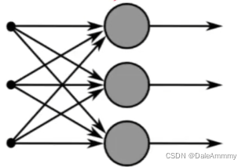
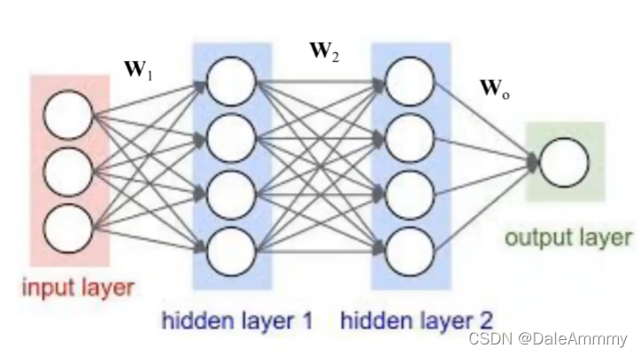
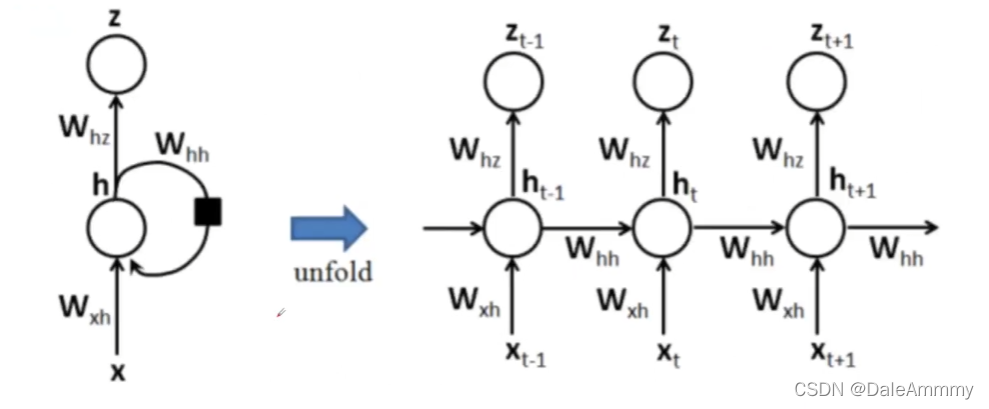
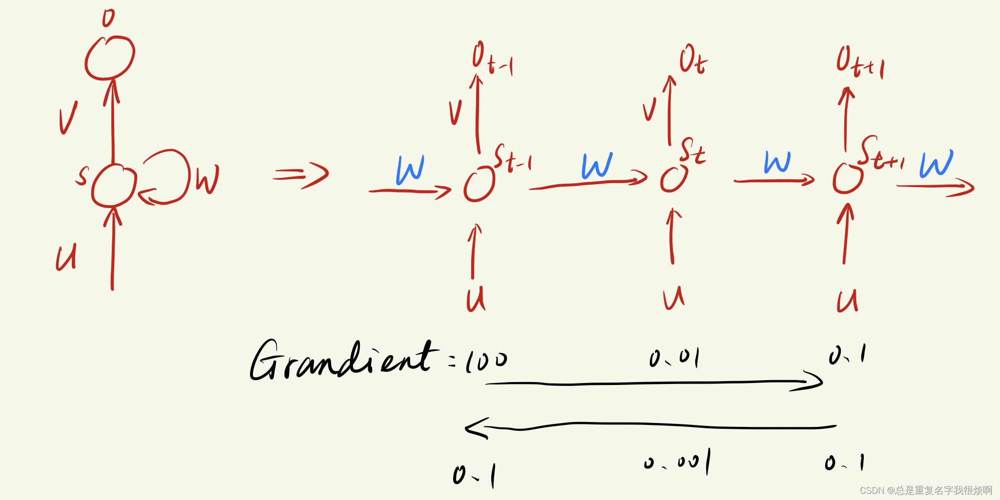

## 为什么要语义捕捉
捕捉语义关联是NLP非常重要的一步。为什么要捕捉语义呢？举一个简单的例子。

一个补全内容的写作题：**今天天气很好，我去打球，不小心把手机摔坏了，所以我下午要去____。**

如果是让人来填，大概率都会填修手机把，因为你看到了前面的内容，把手机摔坏了，那为什么不是看到打球，填喝水、吃饭呢？因为这个空明显是关联手机摔坏的了的内容。人类理解起来很简单，但是你让机器去理解这句话，就很费劲了。为了让机器理解意思，在RNN之前，大家会选择N-Gram的方式，大概就是把前N个字一起连起来理解，[知乎：N-Gram详解](https://zhuanlan.zhihu.com/p/98233633)，但这有一个最大的问题，就是不同的句子他的N不一样，比如这句话，你至少需要N=12，13，而N每增加1计算量都是指数级增长，别说12了，5都算起来很费劲，所以NGram无法在长距离语义理解上取得突破，这个时候，RNN的横空出世打破了这一僵局。
## 从感知机到神经网络的矩阵表示

因为RNN不像卷积神经网络那样可以用一个gif图表示，RNN从头到尾其实都是矩阵运算，要了解RNN就必须先了解神经网络矩阵表示。

首先介绍最经典的单层感知器。

一层有n个感知器，每个感知器都会给出$x_iw_i+b$的一个加权结果
$$\sum\limits_{i=1}^{n} (w_ix_i + b)$$
$$(w_1,w_2,\cdots,w_n,b)\cdot(x_1,x_2,\cdots,x_n,1)^T=(y_1)$$

那么对于一般的神经网络来说，我们就多增加几个感知器，也就形成了一个隐层。我们用三个神经元来举例：

$$\begin{pmatrix}    w_1^{(1)} & w_2^{(1)} & \cdots &w_n ^{(1)} & b^{(1)} \\\\
    w_1^{(2)} & w_2^{(2)} & \cdots &w_n ^{(2)} & b^{(2)} \\\\
    w_1^{(3)} & w_2^{(3)} & \cdots &w_n ^{(3)} & b^{(3)} \\\\
\end{pmatrix} \cdot(x_1,x_2,\cdots,x_n,1)^T = (y^{(1)},y^{(2)} ,y^{(3)} )^{T}$$
即：$$\bf WX^T=Y^T$$
接下来继续拓展到多层神经网络：

hidden layer1的输入为$f_1(\bf W_1X^T)$，hidden layer2的输入为$f_2({\bf W_2}{f_1}(\bf W_1X^T))$，最后output layer的结果是$$output = f_0({\bf W_0}f_2({\bf W_2}{f_1}(\bf W_1X^T)))$$
## RNN
RNN是为了处理序列数据而建立的一套网络。简单理解什么叫序列数据：
$$[x_0, x_1, x_2, \cdots, x_n]$$

这个序列可以表示n天内股票价格数据，n天内天气数据等等，即这个序列是一个随着时间连续变换的数据组成的，或者说，当前数据是在前一个数据基础上变化而来。那么既然所有数据都和之前样本存在关联，所以通过神经网络在时序上的展开，我们能够找到样本之间的关联。

我们单独引入了一个隐层变量：
$$[h_0, h_1, h_2, \cdots, h_n]$$

他就表示$x_i$在$t_i$时刻对应的一个状态量。

那么如何计算这个t时刻的状态量呢？
$$h_t = \sigma (\bf W_{ih}x_t + W_{hh}h_{t-1}+b_h)$$

这个公式表示当前时刻的隐藏变量由当前时刻数据$x_t$和前一时刻隐藏状态量$h_{t-1}$共同计算。

这样做有一个最大的好处就是，实际上$h_{t-1}$时刻的状态量是由$x_{t-1}$数据和$h_{t-2}$共同决定，最后无线套娃循环，就能保证当前时刻的状态是由前面所有时刻共同参与决定的。

最后整个循环完成之后，用一个sigmoid函数进行激活（sigmoid其实最主要的作用是分类，后面会讲），即：
$$\bf Z_t = softmax(W_{hz}h_t + b_z)$$
最后放上这个网络图：

下面附上调包代码：

```python
import torch
import torch.nn as nn
rnn = nn.RNN(5, 6, 3) # nn.RNN(input_size, hidden_size, num_layers * num_direction)
input1 = torch.randn(2, 3, 5) # (sequence_length输入序列长度(句子长度)，batch_size批次样本数，input_size)
h0 = torch.randn(3, 3, 6) # （num_layers * num_direction层数*网络方向数, batch_zize批次样本数, hidden_size）
output, hn = rnn(input1, h0) # 输入张量放入RNN得到输出结果包含output，h0
print(output, hn)
>>>
```
### 关于RNN你必须要知道的两件事其一.RNN梯度消失并不影响训练
看了网上很多对RNN梯度消失的解读，个人感觉并不完整，数学公式的推导会造成一定的阅读障碍和阅读门槛，所以我们不如拆分这个问题，尝试着讲清楚。首先RNN的序列记忆是因为，更新当前输入状态矩阵是之前的隐层状态矩阵*当前输入状态矩阵，这个每一层都在传递的W矩阵是不变的，所以在传递过程中，梯度是不会消失的！换言之，假如$W*S_{t-1}$的梯度消失了，很多参数变成0了，但是当更新到$W*S_{t}$时，他不一定会很多参数都是0，所以中间的短暂消失并不会影响到模型的训练。

我认为大家提到的RNN梯度消失，更可能是在说他的长期记忆消失。如图所示，假如t-1时刻的梯度是100，s时刻是0.01，t+1时刻是0.1，那么此时t-1时刻显然是非常重要的，但如果反向传播回来，t-1时刻的权重只有0.1，甚至和t+1时刻是一样的，这样就会导致模型投入更多的关注在t+1时刻，而对t-1时刻的关注少了，出现“记忆消失”。

### 关于RNN你必须要知道的两件事其二.RNN重置隐层状态而不是W矩阵
首先，RNN之所以对序列数据处理得心应手，最重要的原因是在于它可以实现句子一定间隔的语义捕捉。但当输入下一个句子的时候，我们默认这一句话和前一句话其实是两个事。因此需要重置隐层状态h，然后重新进行RNN迭代计算。也就是说，在处理一个句子的时候，我们需要更新隐藏态来保存之前的语义信息，而在处理多个句子的时候，后面的句子不大可能会和前面的句子保持密切联系，所以我们需要reset隐层矩阵，重新捕捉新句子/新文本的语意联系。
## LSTM
RNN的确捕捉到了之前的语义信息，而且极大拓展了ngram的计算局限性（从前3个到了前面所有）。但是依然会存在一个问题，我们还是用之前的例子：**今天天气很好，我去打球，不小心把手机摔坏了，所以我下午要去____。**其实我们只需要看到前面10多个字就知道填什么了，天气很好，我去打球这类都是干扰信息，我们并不需要关注这么靠前的文字。而且RNN还存在一个非常重要的问题，就是如果序列过长，他一系列权重系数相乘，可能会出现梯度爆炸或者消失。梯度消失，梯度太小，权重无法被更新导致训练失败；梯度爆炸，梯度太大导致结果溢出NaN，或者训练失败。所以，LSTM为了解决长文本处理问题，就加入了一系列控制措施，控制门遗忘门细胞变量等，来抑制RNN的问题。具体的数学原理就不过多讨论，因为这个模型实在是太经典了，直接附上代码：

```python
# 和RNN相比，LSTM就是在输入和输出的时候多了细胞状态c0，cn
import torch
import torch.nn as nn
lstm = nn.LSTM(5, 6, 2) # nn.LSTM(input_size, hidden_size, num_layers * num_direction)
input1 = torch.randn(1, 3, 5) # (sequence_length输入序列长度(句子长度)，batch_size批次样本数，input_size)
h0 = torch.randn(2, 3, 6) # （num_layers * num_direction层数*网络方向数, batch_zize批次样本数, hidden_size）
c0 = torch.randn(2, 3, 6) # （num_layers * num_direction层数*网络方向数, batch_zize批次样本数, hidden_size）
output, (hn, cn) = lstm(input1, (h0, c0)) # 输入张量放入RNN得到输出结果包含output，h0
```
pytorch框架：
```python
class net(nn.Module):
	def __init__(self, input_dim, hidden_dim, layer_dim, output_dim):
		super().__init__()
		self.hidden_dim = hidden_dim
		self.layer_dim = layer_dim
		self.output_dim = output_dim
		self.lstm = nn.LSTM(input_dim, hidden_dim, layer_dim, batch_first=True)
		self.fc = nn.Linear(hidden_dim, output_dim)
		self.dropout = nn.Dropout(p=0.2)
	def forward(self, x):
		h0 = torch.zeros(self.layer_dim, x.size(0), self.hidden_dim).requires_grad_().to(device)
		c0 = torch.zeros(self.layer_dim, x.size(0), self.hidden_dim).requires_grad_().to(device)
		output, (hn, cn) = self.lstm(x, (h0.detach(), c0.detach()))
		output = self.dropout(self.fc(output[:,-1,:]))
		return output
```
## GRU
简易版LSTM。和RNN的代码写法几乎一模一样。

```python
import torch
import torch.nn as nn
gru = nn.GRU(5, 6, 2)
input1 = torch.randn(1, 3, 5)
h0 = torch.randn(2, 3, 6)
out, hn = gru(input1, h0)
```
pytorch框架：
```python
import torch
import torch.nn as nn
device = 'cuda' if torch.cuda.is_available() else 'cpu'
class net(nn.Module):
    def __init__(self, input_dim, hidden_dim, layer_dim, output_dim):
        super().__init__()
        self.hidden_dim = hidden_dim
        self.layer_dim = layer_dim
        self.output_dim = output_dim
        self.gru = nn.GRU(input_dim, hidden_dim, layer_dim, batch_first=True)
        self.fc = nn.Linear(hidden_dim, output_dim)
        self.dropout = nn.Dropout(p=0.2)
        
    def forward(self, x):
        h0 = torch.zeros(self.layer_dim, x.size(0), self.hidden_dim).requires_grad_().to(device)
        output, (hn, cn) = self.gru(x, h0.detach())
        output = self.dropout(self.fc(output[:,-1,:]))
        return output
gru = net(5, 6, 2, 2).to(device)
input1 = torch.randn(2,3, 5).to(device)
print(gru(input1))
```
## Stacking RNN
三大传统RNN已经讲完，但是实际上后面很多模型都是通过RNN的堆叠完成的，例如大名鼎鼎的ElMo模型。所以在这里需要提前说一下这个思路。代码实现也非常简单，就是在代码的num_layers参数设置为2，3……