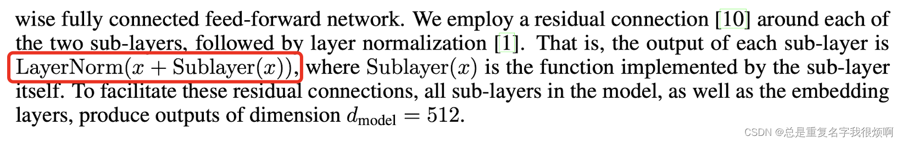

网上对于Transformer的解读已经非常多了，我在这里就不重复别人的话了，可以参考一些解读的文章：

[十分钟理解transformer](https://zhuanlan.zhihu.com/p/82312421)

[transformer模型详解](https://zhuanlan.zhihu.com/p/105080984)

现在，假设你已经大概知道了transformer是什么东西，在这个基础上，我对transformer一些比较重要的点再通俗的讲一下。为了更加硬核一点，我们手撕原论文，从论文去发现问题，解决问题（放心，没有阅读理解，只会饱含例子）。

## Transformer你一定要知道的背景

在RNN系列中，我们知道当前信息可以由之前信息传递而来，也就是隐藏状态和当前状态共同决定。这会导致两个问题：
1 、过长的信息会出现梯度消失和爆炸。


- 梯度爆炸。出现这个问题主要是因为RNN反向传播的过程中，会对tanh求导乘以矩阵W，若是这个初始矩阵非常大，那么乘出来的结果也会非常大，对于长序列又是累乘debuff，那么梯度就会非常夸张。

- 梯度消失。和爆炸就是完全相反的情况，tanh求导后在[0,1]之间，更新参数乘以状态矩阵，万一W非常小，那么一个小于1的数乘一个小数，则会更小，加上累乘，梯度就会消失。

- 无论是爆炸还是消失，要么对一个参数的权重依赖特别大，要么完全无视一个参数，都不利于对特征的抽取。

2、当前状态的计算依赖上一个状态信息的传递，无法并行运算。

在GBDT这种残差树的学习中，我们知道GBDT除了降低偏差忽视方差外，最主要的问题就是他不能并行运算。在RNN中亦是如此，当前的计算需要等上一步计算结束。并且因为它是一步一步传递信息，如果想保存前面很多的信息需要大量的内存开销（这种情况是存在的，例如“今天我把手机摔坏了，我跟我的妈妈说xxxxx，我妈妈批评了我，说我xxxxx，这个时候我爸突然回来听到这个消息，打断了妈妈，说xxxxx，但已经于事无补，我还是得出去修手机。”这个修手机其实就和第一句话有关系，中间都是非绝对相关信息）。

这个时候，1dcnn网络的提出，可以解决并行问题，也可以扩大视野，但是只是缓解了问题，没有从根本上解决问题。扩大了视野并不等于上帝视野。**1DCNN的因果卷积会单独用一章来讲，这里可以先通俗理解一下，就是卷积网络在NLP领域的不错尝试**

此时，Transformer横空出世，表示：我要用上帝视野来并行抽取特征。人皆哗然，称出现了CNN和RNN的终结者。
## Transformer编码和解码的理解

论文中说，编码器会输入一个(x1...xn)的序列，每一个xi会被映射成(z1...zn)的词向量。参考上文word embedding。然后解码器会拿到编码器的输出，生成一个长为m的序列(y1...ym)。

和编码器不一样的是，解码器的词是一个一个生成的。这就是自回归模型。当然，这里的预测阶段和训练阶段是有点区别的，我们举个例子：

在训练阶段，每个时间步输入是上一个时间步的输入加上真实标签序列向后移一位，假设序列是How are you

time step=1  input: SOS *    *   *    *

time step=2  input: SOS How  *   *    *

time step=3  input: SOS How are  *    * 

time step=4  input: SOS How are you   *

time step=5  input: SOS How are you EOS

在预测阶段：


time step=1  input: 'SOS'，预测值"How"

time step=2  input: 'SOS How'，预测值"are"

time step=3  input: 'SOS How are'，预测值"you"

time step=4  input: 'SOS How are you'，预测值"EOS"
## LayerNorm的理解
之所以需要把这个LayerNorm单拎出来讲是因为我看了别人的解读，大家似乎都更乐意的把他说成是一个归一化的手段使得数值回归到平缓的区间，方便反向传播梯度更新。往复杂了说是改变了损失函数的利普希茨常数：[各种Norm的解读](https://blog.csdn.net/qq_43258953/article/details/105306793)。往简单了说就是训练更快更好了。但是个人拙见，应该把LayerNorm在长文本序列中的应用和BatchNorm做一个对比，就可以非常容易明白为什么是用LayerNorm。

在上一部分知道了输入的维度，是[Sequence length(一句话多少个单词n), batch(一次喂给模型多少句话), embedding dimension(每个词映射的维度m)]，所以我们可以把矩阵空间画出来，就像这样一个正方形。我们知道，Norm的方法就是对矩阵内的元素进行均值和方差的归一化。此时，如果我们使用batch norm会出现如图的情况，如果这一batch全是长文本还好，一旦出现一些短文本，那他们的矩阵是非常稀疏的，二维矩阵空间内的有效值并不多，如果你每一批的文本长度变化都很大，那么你每一次做BN时它的方差和均值都会明显抖动；除此之外，在做预测时需要记录全局的均值和方差，万一你的预测样本是一个长度突破天际，比如训练集都是100-200个单词的，预测样本是一个400单词的，那么这个全局的均值和方差对它来说可能不是那么的适用。反过来看LN，他是对每个样本（句子）做方差和均值的计算，句子如果很长或者很短，均值和方差并不敏感，因为句子短他的矩阵就小，句子长矩阵就大嘛，就可以很好的规避这个问题。

在调用pytorch封装好的transformer的时候，和论文其实是有一些改良的。我们来看：

```python
论文的计算逻辑应该是对sublayer，也就是样本通过mlp后加残差做dropout后再归一化：
return self.norm(self.dropout(x + sublayer(x)))
实际上pytorch封装的逻辑是先对样本空间做归一化后再通过mlp和dropout层，再加残差：
return x + self.dropout(sublayer(self.norm(x)))
```
## 自注意力公式的理解
$$Attention(Q,K,V)=softmax(\frac {QK^T}{\sqrt{d_k}})V$$

对于这个公式，有两点需要做额外注解。

> self-attention中的归一化

在训练时，随着词嵌入维度dk增大，Q*K点积后的结果也会增大，在训练时会让softmax函数进入梯度非常小的区域，可能出现梯度消失造成模型收敛困难。

从数学的意义上说，假设QK的统计变量满足标准正态分的独立随机变量。意味着QK满足均值为0，方差为1.那么QK点乘结果就是均值为0，方差为dk，为了抵消这种方差被放大dk倍的影响，在计算中主动把点积缩放$\frac {1}{\sqrt{}{d_k}}$，就可以使得点积后的结果均值为0，防方差为1。

> softmax如何影响输出结果

softmax函数将输入向量x做了一个归一化映射，首先通过自然底数e将元素之间的差距拉大，然后再归一化为一个新的分布。在这个过程中假设某个输入x中最大元素的下标是k，如果输入的数量级变大，就是x中每个分量绝对值都很大，那么数学上会造成$y_k$的值非常接近1。举个例子：

$$x=[a,a,2a]$$


a=1时，$y_3=[0.576]$

a=10时，$y_3=[0.999]$

a=100时，$y_3=[1]$

表面上$y_3$只和$y_1$$y_2$差了2倍，但是softmax后若是a足够大，即使是10，$y_3$都已经远远超过$y_1$$y_2$，所以在输入元素数量级较大的时候，softmax几乎把全部的概率分布都分配给了最大标签。
## 详解Encoder部分的并行化


首先需要理解Encoder流程。假设输入的序列是How are you。那么这三个单词通过embedding模块变成x1,x2,x3是可以并行进行的。并且这一层的处理是不需要构建依赖关系。

进入self-attention层后，对于任意一个单词例如x1要计算x1对于其他所有token的注意力分布，得到z1，这个过程是有依赖性的，必须等序列中所有单词都完成embedding彩壳进行。因此这一步是不能并行运算的。但我们真实计算注意力分布的时候采用的都是矩阵计算，也就是可以一次性的计算出所有token的注意力张量，我们通常把矩阵计算看作并行计算。但这里的并行和词嵌入部分的并行并不是一个概念。

进入前馈全连接层对不同的张量z1,z2,z3是不构成依赖关系的，所以这一层也可以实现并行运算。


## 详解Decoder部分的并行化

注意，Decoder模块也有并行化处理的思路。在谈论Decoder部分时，一定要分开谈论训练阶段和预测阶段。

在训练阶段Decoder是采用了并行处理的的。self-attention和encoder-decoder attention两个并行化处理也是体现在矩阵乘法，和encoder在注意力层的并行化理解是一致的，在进行embedding和feed forward时，因为各个向量不存在依赖关系，因此也是完全并行化运行，这也encoder在相同部分的并行化理解也是一样的。

但是decoder在预测阶段并不认为采用了并行化处理。因为第一个time step的输入只是一个SOS，后续每个time step的输入是依次添加之前所有预测得到的token。举个例子，若这句话有100个token输入，在训练阶段，则是把这100个token的encoder端输出一次性给到decoder端，具体通过mask的方法进行训练，但也体现了一些子层的并行处理。但是在预测阶段，则需要重复处理100次循环操作，每次输入添加一个token，输出序列比上一次多一个，这不是并行化。
## Transformer解决seq2seq两大缺陷

seq2seq序列生成模型也是一个encoder到decoder的编码解码模型。但是存在两大缺陷：

- seq2seq架构的第一大缺陷是将encoder端的所有信息通过RNN压缩成一个固定长度的语义向量中，用这个固定的向量来代表编码端的全部信息，这样既会造成信息的损耗，也无法让解码端在解码时把注意力聚焦在重要信息上。

- seq2seq架构的第二大缺陷是无法并行运算，本质上他就是RNN到RNN的模型。

而Transformer同时解决了这两大缺陷，用Multi-head attention机制来解决encoder固定编码的问题，又让decoder在解码的时候每一步可以通过注意力去关注重要部分。
## Transformer的一些思考

在transformer架构中，我们看到了其他模型的影子。例如feed forward中看到了resnet的残差设计防止梯度消失；在多头注意力模块中看到了经典cnn的卷积层多kernel设计；在位置编码模块中看到了RNN序列信息传递的设计。因此，通过对比，我们可更加容易理解各个模块的意义。那么大家还在transformer中看到了什么经典网络的影子呢？