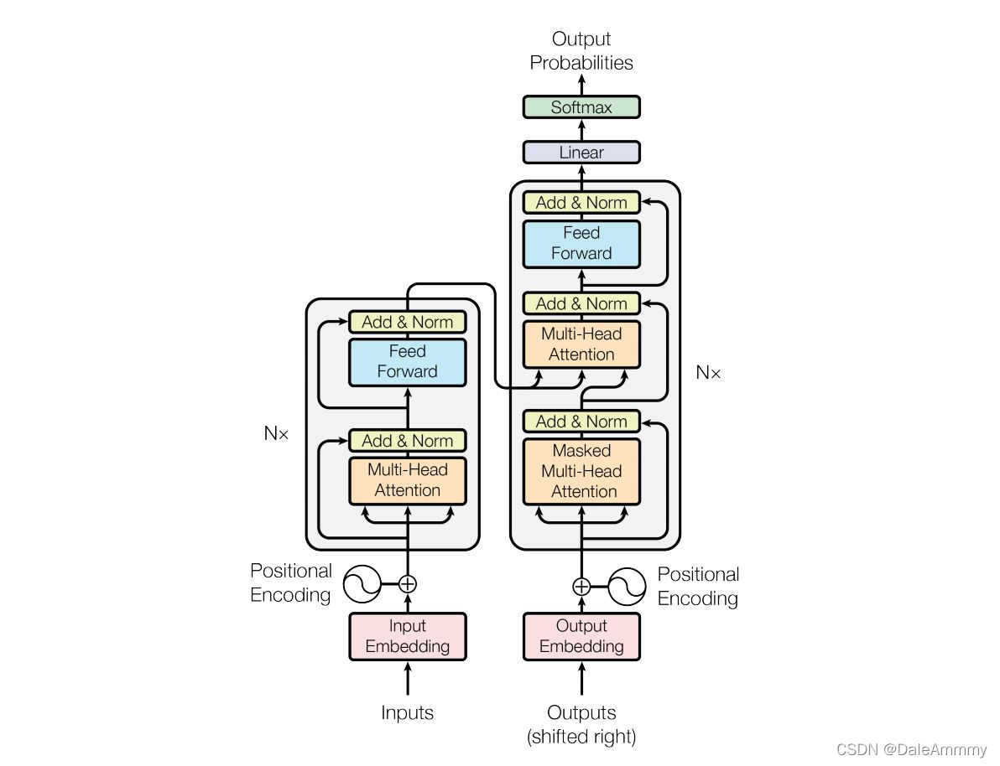
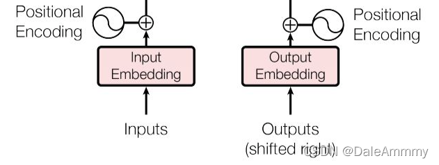
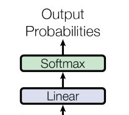
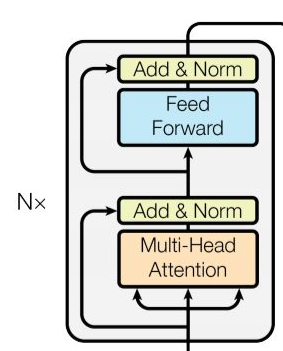
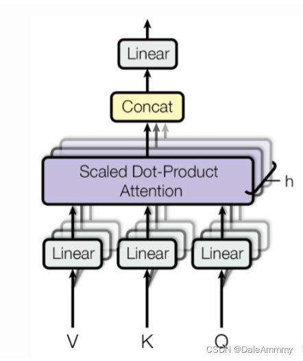
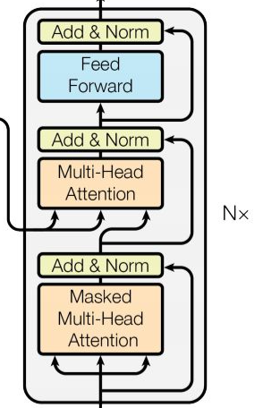

## 整体分析



## 输入部分



包括源文本和目标文本的词嵌入层和位置编码器。

### 词嵌入层nn.Embedding

在之前的项目中已经用过了，这里做一个简单的演示。
```python
import torch
sentence = 'How are you'
input_size = len(sentence)
output_size = 10
# input_size表示源文本的总词数，output_size表示词映射的维度
embedding = nn.Embedding(input_size, output_size)
# 我们假设How are you分别对应字符映射编码是[1,2,3]，那么经过embedding之后这三个字符都会被映射成[1,1,10]的shape
x = embedding(torch.tensor([[1,2,3]]))
print(x)
print(x.shape)
>>>
tensor([[[-0.1730, -0.2589, -0.4128,  1.1708, -0.5708, -1.5719, -0.5521,
           0.7226,  1.7971, -1.1838],
         [-2.4243, -1.0639, -1.1274, -0.2122,  0.5868, -1.8033, -1.0478,
          -0.0812, -0.1956, -1.3679],
         [-1.9887,  0.2366, -1.5908, -1.8331, -1.7438,  0.2815,  0.6011,
           1.6243, -1.7086, -1.0831]]], grad_fn=<EmbeddingBackward>)
torch.Size([1, 3, 10])
```
封装成类

```python
class Embeddings(nn.Module):
    def __init__(self, vocab, d_model):
        # d_model：词嵌入维度
        # vocab：词表大小
        super(Embeddings, self).__init__()
        self.d_model = d_model
        self.vocab = vocab
        self.lut = nn.Embedding(vocab, d_model)
        
    def forward(self, x):
        # x：输入进模型的文本通过词汇映射后的数字张量
        return self.lut(x) * math.sqrt(self.d_model)
vocab = 1000
d_model = 512
x = Variable(torch.LongTensor([[100, 2, 421, 508],[491, 998, 1, 221]]))
emb = Embeddings(vocab, d_model)
embr = emb(x)
print(embr)
print(embr.shape)
>>>
tensor([[[-38.0086, -28.3689,  11.5360,  ..., -17.3576, -13.9426,  12.3066],
         [ 18.3994, -25.3799, -10.7227,  ...,  -5.3271,   8.5594, -47.6293],
         [ -9.8023,  13.2265,   0.6361,  ...,  22.1892,  32.0531,   0.2602],
         [ 26.9539,  21.3255, -19.0987,  ..., -22.8677,   1.2920,  15.5454]],

        [[-14.5776,  22.1955, -39.4145,  ..., -28.2664,  41.6184,  -5.1912],
         [ -9.5976,  13.2798,  12.4504,  ...,  33.1238, -29.1298,  39.2560],
         [ -9.4381,  -7.8411,  37.6495,  ...,  34.4752, -13.9440,  -3.5493],
         [ 12.4780, -13.1469,  -1.5811,  ...,  17.1686, -24.5159, -31.4329]]],
       grad_fn=<MulBackward0>)
torch.Size([2, 4, 512])
```
### 位置编码positional encoding
因为在Transformer的编码器结构中，并没有针对词汇位置信息的处理，因此需要在Embedding层后加入位置编码器，将词汇位置不同可能产生不同语义的信息加入到词嵌入张量中，以弥补位置信息的缺失。（例如a在b前面，和b在a前面对语义的影响）。因为想要增加位置信息，所以我们在embedding层的输出结果基础上，加上他的位置信息即可。transformer中使用的是三角函数位置编码。因为三角函数可以完美控制增加的位置编码信息在[-1, 1]之间，不会造成长距离下数值过大或过小的问题。

```python
class PositionalEncoding(nn.Module):
    def __init__(self, d_model, dropout, max_len=5000):
        # d_model：词嵌入维度
        # dropout：失活比例
        # max_len：每个句子最大长度
        super(PositionalEncoding, self).__init__()
        self.d_model = d_model
        self.dropout = nn.Dropout(p = dropout)
        self.max_len = max_len
        # 初始化一个位置矩阵max_len * d_model
        pe = torch.zeros(max_len, d_model)
        # 初始化一个绝对位置矩阵，在这里，词汇的绝对位置就是用他的索引表示
        # 所以首先使用arange方法获得一个连续的自然数向量，然后再使用unsqueeze方法扩展维度
        # 又因为参数传的是1，代表矩阵拓展位置，会使向量变成一个max_len * 1的矩阵
        position = torch.arange(0, max_len).unsqueeze(1)
        # 绝对位置初始化后，接下来考虑如何将这些位置信息加入到位置编码中
        # 最简单的思路就是先将max_len * 1的绝对位置矩阵变换成max_len * d_model形状，然后覆盖初始矩阵
        # 要做这总矩阵变换，需要一个1 * d_model的变换矩阵div_term
        # 我们还希望这个变换矩阵可以把自然数的绝对位置编码缩放成足够小的数字有助于梯度下降过程中更快的收敛

        div_term = torch.exp(torch.arange(0, d_model, 2) * -(math.log(10000.0) / d_model))
        pe[:, 0: :2] = torch.sin(position * div_term)
        pe[:, 1: :2] = torch.cos(position * div_term)

        # 这样就得到了位置编码矩阵pe，pe还只是一个二维矩阵，要和embedding的输出保持一直，需要拓展一个位置
        pe = pe.unsqueeze(0)

        # 最后把pe位置编码矩阵注册成模型buffer——我们把认为对模型效果有帮助，却不是模型结构中超参数或者参数，不需要随着优化步骤进行更新增益的对象
        # 注册之后我们就可以在模型保存后重加载时和模型结构与参数一同被加载
        self.register_buffer('pe', pe)
    
    def forward(self, x):
        # 在相加之前对pe做适配工作，将这个三维张量的第二维也就是句子最大长度那一维切开
        # 因为max_len默认5000一般实在太大了，很难有一条句子包含5000个词汇，所以要进行切片
        # 最后使用Variable封装，使其和x形式相同，并且不需要梯度求解
        x = x + Variable(self.pe[:, :x.size(1)], requires_grad=False)
        return self.dropout(x)
d_model = 10
dropout = 0.1
max_len = 60
x = embr
pe = PositionalEncoding(d_model, dropout, max_len)
pe_result = pe(x)
print(pe_result)
print(pe_result.shape)
>>>
tensor([[[-42.2318, -30.4098,  12.8177,  ..., -18.1752, -15.4918,  14.7851],
         [ 21.3788, -27.5995, -11.0009,  ...,  -4.8079,   9.5106,  -0.0000],
         [ -9.8811,  14.2337,   0.0000,  ...,  25.7657,  35.6148,   1.4002],
         [ 30.1056,  22.5950, -20.9485,  ..., -24.2974,   1.4359,  18.3838]],

        [[-16.1973,  25.7728, -43.7939,  ..., -30.2960,  46.2427,  -4.6569],
         [ -9.7290,  15.3556,  14.7470,  ...,   0.0000, -32.3663,  44.7289],
         [ -9.4765,  -9.1747,  42.8732,  ...,  39.4169, -15.4931,  -2.8326],
         [ 14.0212, -15.7077,  -1.4844,  ...,  20.1873, -27.2396,  -0.0000]]],
       grad_fn=<MulBackward0>)
torch.Size([2, 4, 512])
```
## 输出部分


线性层后接softmax分类

```python
class Generator(nn.Module):
    def __init__(self, d_model, vocab_size):
        super(Generator, self).__init__()
        self.project = nn.Linear(d_model, vocab_size)
        
    def forward(self, x):
        return F.log_softmax(self.project(x), dim=-1)
```

## 编码器部分


N个编码器层堆叠而成（原论文中N=6），每个编码器由两个子层结构组成，分别是多头自注意力子层和规范化，残差连接层；前馈全连接子层和规范化，残差连接层

### Attention机制
从循环神经网络中我们知道，如果把之前时间步的信息反复迭代传递到当前状态，那么当前状态的输出是可以在一定程度上体现出和之前的语义关联。但是单层的RNN一般效果并不好，所以我们会使用stacking的方式堆叠很多层RNN，这样一旦数据集复杂之后，不管是卷积神经网络还是循环神经网络，计算都会非常耗时。我们需要寻找一个线性的方式来解决这个问题。
当我们一张图片，之所以知道这是一个猫还是狗并不需要看一整张图片，而只需要看这个图片的局部，也就是我们把注意力放在特征上，不需要放在全局，也可以抽取到最关键的信息。在之前的加入attention机制的解码器中，我们用到了QKV三个矩阵。为了形象的解释这三个矩阵的意义，举一个例子：
现在我们有一篇文章，使用一些关键词对他进行描述。为了大家答案方向统一，给出了一些关键词作为提示。这些提示就是K。整个文章的信息就是Q，你看完文章给出的答案就是V。假设大家并不聪明，看完文章就只知道Q和K，我们能给出的答案也就只有K，也就是K=V，但随着我们反复阅读，深入理解，慢慢V就发生了变化，我们把这一个发生变化的过程成为注意力机制过程。然而还有一种特殊情况，就是这篇文章非常简单，他的QK和我们理解的V相同，这种情况被叫做自注意力机制，一般的注意力机制是用不同于K的词去表示他，而自注意力机制是用文本自身去表示他，也就是说是从文本中抽取关键词来表述，这就是对自身特征的一次提取。
例如：
常规注意力机制：Q-我爱美丽富饶的中国；K-我爱中国；V-我爱中国
自注意力机制：Q-我爱中国；K-我爱中国；V-我爱中国
### 残差层
如果不加残差层，输入到下一单元的值为：
$$\bf y = F(\bf x,\{W_i\})$$
如果层数非常多，经历了多次乘以一个小于1的数，反向求导之后：
$$\frac {\partial \bf y} {\partial x_i} =  \frac {\partial F(\bf x,\{W_i\})} {\partial x_i}=0$$
这非常不利于梯度更新，如果加上一个残差层：
$$\bf y = F(x,\{W_i\}) + \bf x$$
$$\frac {\partial \bf y} {\partial x_i} =  \frac {\partial F(\bf x,\{W_i\}) + \bf x} {\partial x_i}=1$$
这样就可以堆叠很多层，只需要经历一个简单的线性加和就能保证每一个模块每次梯度更新都是1。在ResNet网络中通过残差层甚至堆叠到了1000层。
### 掩码张量
掩码张量在transformer中开始崭露头角，在bert真正大放异彩。所谓掩码就是遮住一些信息，不让机器看到。为什么要这么做呢？我们阅读的顺序是从前向后，例如有这么一句话，“今天天气很好，我去打球，但把手机摔了，所以我晚上去修手机。”如果只阅读到了天气很好，是不是不知道后面会发生什么事，但如果阅读到的信息是，今天天气很好，我去打球，晚上去修手机。是不是就知道了中间我把手机摔了。但作为一个训练模型，我们是不希望机器通过后面的信息来解释前面的东西，我们希望机器能够尽可能利用已知条件去学习这种语言。所以当我们只阅读到天气好，去打球，那机器通过学习要分析出可能是晚上吃好吃，打球赢了，突然下雨了，等等。虽然可能和后文不对应，但希望机器能够尽可能挖掘到已有信息的深层含义。所以掩码的作用就是覆盖掉当前时间步之后的信息。
### 多头自注意力层


根据注意力机制的定义，QKV都从不同角度表达了语义，那么如何更好的抽取这些语义就是多头要干的事。掩码保证了我们只能看到当前信息，多头即是把当前信息拆分成h个，送到h个全连接层中，这里的全连接层是一个方阵，也就是输入进去的维度和输出维度保持一致，他唯一的作用就是把一个信息拆分成多段，分别理解，实现更好的语义抽取效果。
## 解码器部分


N个解码器层堆叠而成，每个解码器层有三个子层组成，分别是多头自注意力子层和规范化，残差连接层；多头注意力子层和规范化，残差连接层；前馈全连接子层和规范化，残差连接层。